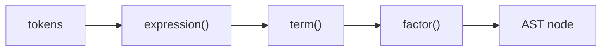

# Compilers 101 (3/10): 파싱과 AST

이 글은 Compilers 101 시리즈의 세 번째 글입니다. `1 + 2 * 3`이 왜 `((1 + 2) * 3)`이 아니라 `(1 + (2 * 3))`로 읽히는지 이해하면, 파서가 단순히 토큰을 읽는 도구가 아니라 의미 구조를 결정하는 장치라는 점이 분명해집니다.

## 먼저 던지는 질문

- AST는 무엇이며, 왜 꼭 트리여야 할까요?
- 재귀 하강 파서의 기본 형태는 어떻게 생겼을까요?
- 우선순위와 결합성은 코드 안에서 어떻게 표현할까요?

## 큰 그림


*Compilers 101 3장 흐름 개요*

이 그림에서는 파싱과 AST를 운영 흐름 안에서 어디에 배치해야 하는지 봅니다. 핵심은 개념을 따로 외우는 것이 아니라 입력, 처리, 검증, 운영 신호가 어떤 경계로 이어지는지 확인하는 데 있습니다.

> 파싱과 AST의 핵심은 기능 이름이 아니라, 어떤 경계에서 무엇을 검증하고 어떤 신호를 남길지 정하는 데 있습니다.

## 왜 중요한가

렉서가 “단어”를 만들었다면 파서는 “문장 구조”를 만듭니다. AST가 깔끔하면 그 위의 의미 분석, 최적화, 코드 생성이 모두 단순해집니다. 반대로 AST가 흐릿하면 이후 단계가 모두 그 흐릿함을 보정하느라 복잡해집니다.

> 컴파일러 버그의 상당수는 결국 “AST가 잘못 만들어졌다”로 귀결됩니다.

## 핵심 개념 한눈에 보기



문법 단계는 함수 단계로 거의 그대로 매핑됩니다. 우선순위가 높은 연산자는 더 안쪽 함수에서 처리합니다.

## 핵심 용어

- **AST**: 프로그램 구조를 표현하는 트리입니다. 괄호 같은 표면 문법은 사라지고 의미 구조만 남습니다.
- **재귀 하강**: 문법 규칙 하나를 함수 하나로 대응시키는 파서 스타일입니다.
- **우선순위**: 어떤 연산자가 더 강하게 묶이는지 나타냅니다. 예를 들어 `*`는 `+`보다 강합니다.
- 결합성: 같은 우선순위 안에서 어느 쪽으로 묶이는지 나타냅니다. 예를 들어 `-`는 좌결합입니다.
- **lookahead**: 현재 위치에서 한 개 이상 토큰을 미리 보는 동작입니다.

## Before / After

**Before — 평평한 토큰 리스트**

```python
tokens = [("NUM",1),("OP","+"),("NUM",2),("OP","*"),("NUM",3)]
# this data structure makes meaning hard to read
```

**After — 의미가 드러나는 트리**

```python
ast = Bin("+", Num(1), Bin("*", Num(2), Num(3)))
# precedence is engraved into the tree shape
```

트리 모양 자체가 곧 우선순위입니다. 평가기와 코드 생성기는 이 트리를 순회하면 됩니다.

## 실습: 작은 표현식 파서 만들기

### 1단계 — AST 노드 정의

```python
# 1_ast_nodes.py
from dataclasses import dataclass

@dataclass
class Num:    value: int
@dataclass
class Bin:
    op: str
    left: object
    right: object

print(Bin("+", Num(1), Bin("*", Num(2), Num(3))))
```

표현식 AST는 dataclass 두 개만으로도 충분히 표현할 수 있습니다. 어떤 노드 종류가 있는지가 곧 언어의 표현력입니다.

### 2단계 — 토큰 스트림과 커서

```python
# 2_cursor.py
class Cursor:
    def __init__(self, tokens):
        self.tokens, self.i = tokens, 0
    def peek(self):
        return self.tokens[self.i] if self.i < len(self.tokens) else ("EOF","")
    def advance(self):
        t = self.peek(); self.i += 1; return t
    def expect(self, kind):
        t = self.advance()
        if t[0] != kind:
            raise SyntaxError(f"expected {kind}, got {t}")
        return t
```

`peek / advance / expect` 세 동작이 재귀 하강 파서의 기본 어휘라고 생각하면 됩니다.

### 3단계 — 재귀 하강 파서 작성하기

```python
# 3_recursive_descent.py
from dataclasses import dataclass
@dataclass
class Num: value: int
@dataclass
class Bin:
    op: str; left: object; right: object

# expr   := term  (("+"|"-") term)*
# term   := factor (("*"|"/") factor)*
# factor := NUM | "(" expr ")"

def parse(tokens):
    i = [0]
    def peek(): return tokens[i[0]] if i[0] < len(tokens) else ("EOF","")
    def eat(): t = peek(); i[0] += 1; return t
    def expr():
        node = term()
        while peek()[0] == "OP" and peek()[1] in "+-":
            op = eat()[1]; node = Bin(op, node, term())
        return node
    def term():
        node = factor()
        while peek()[0] == "OP" and peek()[1] in "*/":
            op = eat()[1]; node = Bin(op, node, factor())
        return node
    def factor():
        t = eat()
        if t[0] == "NUM": return Num(t[1])
        if t == ("LP","("):
            node = expr()
            assert eat() == ("RP",")")
            return node
        raise SyntaxError(f"unexpected {t}")
    return expr()

toks = [("NUM",1),("OP","+"),("NUM",2),("OP","*"),("NUM",3)]
print(parse(toks))
```

`expr → term → factor`라는 순서가 그대로 **낮은 우선순위 → 높은 우선순위**를 뜻합니다. `*`가 `term()` 안에서 처리되기 때문에 항상 더 깊게 묶입니다.

### 4단계 — AST 예쁘게 출력하기

```python
# 4_pretty.py
def show(n, depth=0):
    pad = "  " * depth
    if hasattr(n, "value"):
        print(f"{pad}Num({n.value})")
    else:
        print(f"{pad}Bin({n.op})")
        show(n.left, depth+1); show(n.right, depth+1)
```

트리를 그대로 출력하면 우선순위가 한눈에 보입니다. AST 시각화 도구 하나만 있어도 파서 디버깅의 상당 부분이 해결됩니다.

### 5단계 — 평가기로 파서 검증하기

```python
# 5_eval.py
def evaluate(n):
    if hasattr(n, "value"): return n.value
    l, r = evaluate(n.left), evaluate(n.right)
    return {"+": l+r, "-": l-r, "*": l*r, "/": l//r}[n.op]
```

AST가 올바르면 평가 결과도 우리가 아는 산술 규칙과 일치합니다. 그래서 파서를 검증하는 가장 빠른 도구는 종종 작은 평가기입니다.

## 이 코드에서 먼저 봐야 할 점

- 문법 규칙 하나가 함수 하나와 대응됩니다.
- 우선순위는 함수 호출 깊이로 표현됩니다.
- 결합성은 `while` 루프가 누적되는 방향으로 결정됩니다.
- 명시적인 토큰 커서를 두면 불필요한 백트래킹을 피할 수 있습니다.

## 자주 하는 실수 다섯 가지

1. **우선순위를 한 줄짜리 SPEC에 우겨 넣으려는 것**입니다. 우선순위는 함수 분리로 표현해야 합니다.
2. **결합성을 빼먹어 우결합 버그를 만드는 것**입니다. 예를 들어 `1 - 2 - 3`이 `1 - (2 - 3)`으로 읽히는 오류입니다.
3. **`expect`가 낸 `SyntaxError`를 잡고 무시하는 것**입니다. 잘못된 AST를 계속 만들게 됩니다.
4. **토큰의 위치 정보를 버리는 것**입니다. 1단계에서 모은 line/col을 끝까지 유지해야 합니다.
5. **괄호 같은 표면 문법을 AST에 그대로 남겨 두는 것**입니다. 괄호는 우선순위를 결정한 뒤 사라져야 합니다.

## 실무에서는 이렇게 나타납니다

손으로 쓴 많은 컴파일러는 재귀 하강 파서를 사용합니다. rustc, clang, CPython 같은 도구도 이 계열 사고방식을 강하게 갖고 있습니다. yacc, bison, lark 같은 생성기 도구를 써도 결국 비슷한 트리를 만듭니다. 대부분의 비모호 문법에서는 읽기 쉽고 디버깅하기 쉬운 선택이 재귀 하강입니다.

## 숙련된 엔지니어는 이렇게 봅니다

- 새 문법을 보면 먼저 어느 함수에 들어갈 규칙인지 결정합니다.
- AST 노드 종류를 가능한 한 작고 읽기 쉽게 유지합니다.
- 파서가 만든 AST를 그림처럼 보여 주는 디버그 도구를 항상 둡니다.
- “왜 이 식이 이렇게 묶였는가?”라는 질문에 호출 깊이로 답합니다.
- 모호한 문법은 파서 우회 코드가 아니라 문법 자체를 고쳐 해결합니다.

## 체크리스트

- [ ] AST가 왜 트리여야 하는지 설명할 수 있습니까?
- [ ] 재귀 하강 파서의 기본 구조를 한 화면에 그릴 수 있습니까?
- [ ] 우선순위와 결합성의 차이를 한 문장으로 설명할 수 있습니까?
- [ ] AST 시각화 도구를 직접 만들어 본 적이 있습니까?
- [ ] 파서 오류 메시지의 형태를 미리 정의해 두었습니까?

## 연습 문제

1. 위 파서에 unary minus(`-1`, `-(1+2)`)를 추가해 보세요. 어느 함수에 넣는 것이 자연스러운지 생각해 보세요.
2. `**` 연산자를 추가하고 우결합으로 동작하게 만들어 보세요.
3. 잘못된 입력 `1 + * 2`에 대해 어떤 오류 메시지를 보여 줄지 설계해 보세요.

## 정리 및 다음 글

파서는 평평한 토큰 스트림을 의미 있는 트리로 바꾸는 단계입니다. 다음 글에서는 그 트리를 읽어 “이 변수는 어디서 선언됐는가?”, “이 타입은 맞는가?”를 판단하는 semantic analysis를 다룹니다.

## 처음 질문으로 돌아가기

- **AST는 무엇이며, 왜 꼭 트리여야 할까요?**
  - 본문의 기준은 파싱과 AST를 한 덩어리 개념으로 보지 않고 입력, 처리, 검증, 운영 신호가 만나는 경계로 나누어 확인하는 것입니다.
- **재귀 하강 파서의 기본 형태는 어떻게 생겼을까요?**
  - 예제와 그림에서는 어떤 값이 들어오고, 어느 단계에서 바뀌며, 어떤 기준으로 통과 또는 실패하는지를 먼저 확인해야 합니다.
- **우선순위와 결합성은 코드 안에서 어떻게 표현할까요?**
  - 운영에서는 이 판단을 체크리스트, 로그, 테스트로 남겨 다음 변경에서도 같은 실패가 반복되지 않게 막아야 합니다.

<!-- toc:begin -->
## 시리즈 목차

- [Compilers 101 (1/10): 컴파일러란 무엇인가?](./01-what-is-a-compiler.md)
- [Compilers 101 (2/10): 렉시컬 분석](./02-lexical-analysis.md)
- **파싱과 AST (현재 글)**
- 시맨틱 분석 (예정)
- 심볼 테이블과 스코프 (예정)
- 중간 표현 (예정)
- 최적화 기초 (예정)
- 코드 생성 (예정)
- JIT vs AOT (예정)
- 작은 인터프리터 만들기 (예정)

<!-- toc:end -->

## 참고 자료

- [Crafting Interpreters — Parsing Expressions](https://craftinginterpreters.com/parsing-expressions.html)
- [Recursive descent parser (Wikipedia)](https://en.wikipedia.org/wiki/Recursive_descent_parser)
- [Operator-precedence parser (Wikipedia)](https://en.wikipedia.org/wiki/Operator-precedence_parser)
- [Python ast module](https://docs.python.org/3/library/ast.html)

Tags: Computer Science, Compilers, Parser, AST, RecursiveDescent, Precedence
