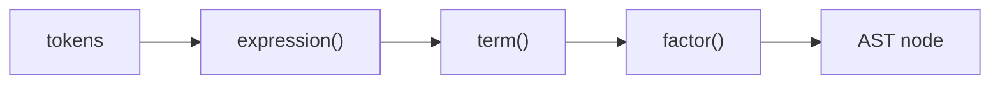

# parsing과 AST

> Compilers 101 시리즈 (3/10)


## 이 글에서 다룰 문제

Lexer가 "단어"를 만들었다면, parser는 "문장의 구조"를 만듭니다. AST가 깔끔하면 그 위의 모든 단계 — semantic analysis, optimization, code generation — 가 깔끔합니다. 반대로 AST가 엉성하면 모든 단계가 그 엉성함을 보정하느라 힘듭니다.

> 컴파일러의 거의 모든 버그는 결국 "AST가 이상해서"로 귀결됩니다.

## 전체 흐름


문법의 단계가 함수의 단계로 그대로 매핑됩니다. 우선순위가 높은 연산자일수록 더 안쪽 함수에서 처리됩니다.

## Before/After

**Before — 평탄한 토큰 리스트**

```python
tokens = [("NUM",1),("OP","+"),("NUM",2),("OP","*"),("NUM",3)]
# 이 자료구조로 의미를 알기 어렵다
```

**After — 의미가 드러나는 트리**

```python
ast = Bin("+", Num(1), Bin("*", Num(2), Num(3)))
# 우선순위가 트리 모양에 새겨진다
```

트리 모양 자체가 우선순위입니다. 평가기와 코드 생성기는 트리 모양만 따라가면 됩니다.

## 작은 표현식 파서

### 1단계 — AST 노드 정의

```python
# 예제 파일: 1_ast_nodes.py
from dataclasses import dataclass

@dataclass
class Num:    value: int
@dataclass
class Bin:
    op: str
    left: object
    right: object

print(Bin("+", Num(1), Bin("*", Num(2), Num(3))))
```

dataclass 두 개로 표현식 AST를 표현할 수 있습니다. 노드 종류가 곧 언어의 표현력입니다.

### 2단계 — 토큰 스트림과 cursor

```python
# 예제 파일: 2_cursor.py
class Cursor:
    def __init__(self, tokens):
        self.tokens, self.i = tokens, 0
    def peek(self):
        return self.tokens[self.i] if self.i < len(self.tokens) else ("EOF","")
    def advance(self):
        t = self.peek(); self.i += 1; return t
    def expect(self, kind):
        t = self.advance()
        if t[0] != kind:
            raise SyntaxError(f"expected {kind}, got {t}")
        return t
```

`peek/advance/expect` 세 가지면 재귀 하강 파서의 모든 흐름을 설명할 수 있습니다.

### 3단계 — 재귀 하강 (precedence climbing)

```python
# 예제 파일: 3_recursive_descent.py
from dataclasses import dataclass
@dataclass
class Num: value: int
@dataclass
class Bin:
    op: str; left: object; right: object

# 문법: expr   := term  (("+"|"-") term)*
# 문법: term   := factor (("*"|"/") factor)*
# 문법: factor := NUM | "(" expr ")"

def parse(tokens):
    i = [0]
    def peek(): return tokens[i[0]] if i[0] < len(tokens) else ("EOF","")
    def eat(): t = peek(); i[0] += 1; return t
    def expr():
        node = term()
        while peek()[0] == "OP" and peek()[1] in "+-":
            op = eat()[1]; node = Bin(op, node, term())
        return node
    def term():
        node = factor()
        while peek()[0] == "OP" and peek()[1] in "*/":
            op = eat()[1]; node = Bin(op, node, factor())
        return node
    def factor():
        t = eat()
        if t[0] == "NUM": return Num(t[1])
        if t == ("LP","("):
            node = expr()
            assert eat() == ("RP",")")
            return node
        raise SyntaxError(f"unexpected {t}")
    return expr()

toks = [("NUM",1),("OP","+"),("NUM",2),("OP","*"),("NUM",3)]
print(parse(toks))
```

`expr → term → factor` 순서가 곧 "낮은 우선순위 → 높은 우선순위"입니다. `*`는 `term`이 잡으므로 항상 더 안쪽에 묶입니다.

### 4단계 — AST 보기 좋게 출력

```python
# 예제 파일: 4_pretty.py
def show(n, depth=0):
    pad = "  " * depth
    if hasattr(n, "value"):
        print(f"{pad}Num({n.value})")
    else:
        print(f"{pad}Bin({n.op})")
        show(n.left, depth+1); show(n.right, depth+1)
```

트리를 그대로 출력해 보면 우선순위가 한눈에 보입니다. AST visualizer는 디버깅의 80%를 해결합니다.

### 5단계 — 평가기로 검증

```python
# 예제 파일: 5_eval.py
def evaluate(n):
    if hasattr(n, "value"): return n.value
    l, r = evaluate(n.left), evaluate(n.right)
    return {"+": l+r, "-": l-r, "*": l*r, "/": l//r}[n.op]
```

AST가 맞으면 평가 결과가 산수와 일치합니다. parser를 테스트하는 가장 빠른 방법은 평가기입니다.

## 이 코드에서 주목할 점

- 문법 규칙 한 개 = 함수 한 개입니다.
- 우선순위는 호출 깊이로 표현됩니다.
- 결합성은 while loop 방향으로 결정됩니다 (좌결합이면 while로 누적).
- 토큰 cursor를 명시적으로 들고 다니면 backtracking을 안 해도 됩니다.

## 자주 하는 실수 5가지

1. **우선순위를 SPEC 한 줄로 끝내려고 한다.** 우선순위는 함수 분리로 표현해야 합니다.
2. **결합성을 잊어 우결합으로 만든다.** `1 - 2 - 3`이 `1 - (2 - 3) = 2`가 되는 버그.
3. **`expect`로 던진 SyntaxError를 잡아서 무시한다.** 그러면 잘못된 AST가 만들어집니다.
4. **에러 위치를 토큰에서 안 가져온다.** 1단계에서 챙긴 line/col을 던져 버리지 마세요.
5. **AST에 표면적 구문(괄호)을 남긴다.** 괄호는 우선순위를 정한 뒤 사라져야 합니다.

## 실무에서는 이렇게 쓰입니다

대부분의 손으로 짠 컴파일러(rustc, clang, CPython)는 재귀 하강 파서를 씁니다. 자동 생성 도구(yacc/bison/lark)도 결국 비슷한 트리를 만듭니다. 문법이 모호하지 않은 대부분의 경우 재귀 하강이 가장 읽기 쉽고 디버깅하기 쉬운 선택입니다.

## 체크리스트

- [ ] AST가 왜 트리여야 하는지 답할 수 있는가?
- [ ] 재귀 하강 파서를 한 화면 안에 그려 낼 수 있는가?
- [ ] 우선순위와 결합성의 차이를 한 줄로 설명할 수 있는가?
- [ ] AST visualizer를 만들어 본 적 있는가?
- [ ] parser 오류가 사용자에게 어떤 메시지로 나가야 하는지 정의해 본 적 있는가?

## 정리 및 다음 단계

Parser는 평탄한 토큰 스트림을 의미 있는 트리로 바꿉니다. 다음 글에서는 그 트리를 보고 "이 변수는 어디에 선언됐지? 이 타입은 맞는가?"를 답하는 단계 — semantic analysis — 를 살펴봅니다.

<!-- toc:begin -->
- [컴파일러란 무엇인가?](./01-what-is-a-compiler.md)
- [lexical analysis](./02-lexical-analysis.md)
- **parsing과 AST (현재 글)**
- semantic analysis (예정)
- symbol table과 scope (예정)
- intermediate representation (예정)
- optimization 기초 (예정)
- code generation (예정)
- JIT vs AOT (예정)
- 작은 인터프리터 만들어 보기 (예정)
<!-- toc:end -->

## 참고 자료

- [Crafting Interpreters — Parsing Expressions](https://craftinginterpreters.com/parsing-expressions.html)
- [Recursive descent parser (Wikipedia)](https://en.wikipedia.org/wiki/Recursive_descent_parser)
- [Operator-precedence parser (Wikipedia)](https://en.wikipedia.org/wiki/Operator-precedence_parser)
- [Python ast module](https://docs.python.org/3/library/ast.html)

Tags: Computer Science, Compilers, Parser, AST, RecursiveDescent, Precedence
