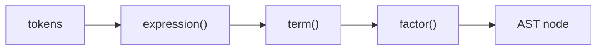

# Compilers 101 (3/10): 파싱과 AST

이 글은 Compilers 101 시리즈의 세 번째 글입니다.

`1 + 2 * 3`이 왜 `((1 + 2) * 3)`이 아니라 `(1 + (2 * 3))`로 읽히는지 이해하면, 파서가 단순히 토큰을 읽는 도구가 아니라 의미 구조를 결정하는 장치라는 점이 분명해집니다.


*Compilers 101 3장 흐름 개요*

## 먼저 던지는 질문

- AST는 무엇이며, 왜 꼭 트리여야 할까요?
- 재귀 하강 파서의 기본 형태는 어떻게 생겼을까요?
- 우선순위와 결합성은 코드 안에서 어떻게 표현할까요?

## 왜 중요한가

렉서가 “단어”를 만들었다면 파서는 “문장 구조”를 만듭니다. AST가 깔끔하면 그 위의 의미 분석, 최적화, 코드 생성이 모두 단순해집니다. 반대로 AST가 흐릿하면 이후 단계가 모두 그 흐릿함을 보정하느라 복잡해집니다.

> 컴파일러 버그의 상당수는 결국 “AST가 잘못 만들어졌다”로 귀결됩니다.

## 핵심 개념 한눈에 보기



문법 단계는 함수 단계로 거의 그대로 매핑됩니다. 우선순위가 높은 연산자는 더 안쪽 함수에서 처리합니다.

## 핵심 용어

- **AST**: 프로그램 구조를 표현하는 트리입니다. 괄호 같은 표면 문법은 사라지고 의미 구조만 남습니다.
- **재귀 하강**: 문법 규칙 하나를 함수 하나로 대응시키는 파서 스타일입니다.
- **우선순위**: 어떤 연산자가 더 강하게 묶이는지 나타냅니다. 예를 들어 `*`는 `+`보다 강합니다.
- 결합성: 같은 우선순위 안에서 어느 쪽으로 묶이는지 나타냅니다. 예를 들어 `-`는 좌결합입니다.
- **lookahead**: 현재 위치에서 한 개 이상 토큰을 미리 보는 동작입니다.

## 변경 전후

**Before — 평평한 토큰 리스트**

```python
tokens = [("NUM",1),("OP","+"),("NUM",2),("OP","*"),("NUM",3)]
# this data structure makes meaning hard to read
```

**After — 의미가 드러나는 트리**

```python
ast = Bin("+", Num(1), Bin("*", Num(2), Num(3)))
# precedence is engraved into the tree shape
```

트리 모양 자체가 곧 우선순위입니다. 평가기와 코드 생성기는 이 트리를 순회하면 됩니다.

## 실습: 작은 표현식 파서 만들기

### 1단계 — AST 노드 정의

```python
# 1_ast_nodes.py
from dataclasses import dataclass

@dataclass
class Num:    value: int
@dataclass
class Bin:
    op: str
    left: object
    right: object

print(Bin("+", Num(1), Bin("*", Num(2), Num(3))))
```

표현식 AST는 dataclass 두 개만으로도 충분히 표현할 수 있습니다. 어떤 노드 종류가 있는지가 곧 언어의 표현력입니다.

### 2단계 — 토큰 스트림과 커서

```python
# 2_cursor.py
class Cursor:
    def __init__(self, tokens):
        self.tokens, self.i = tokens, 0
    def peek(self):
        return self.tokens[self.i] if self.i < len(self.tokens) else ("EOF","")
    def advance(self):
        t = self.peek(); self.i += 1; return t
    def expect(self, kind):
        t = self.advance()
        if t[0] != kind:
            raise SyntaxError(f"expected {kind}, got {t}")
        return t
```

`peek / advance / expect` 세 동작이 재귀 하강 파서의 기본 어휘라고 생각하면 됩니다.

### 3단계 — 재귀 하강 파서 작성하기

```python
# 3_recursive_descent.py
from dataclasses import dataclass
@dataclass
class Num: value: int
@dataclass
class Bin:
    op: str; left: object; right: object

# expr   := term  (("+"|"-") term)*
# term   := factor (("*"|"/") factor)*
# factor := NUM | "(" expr ")"

def parse(tokens):
    i = [0]
    def peek(): return tokens[i[0]] if i[0] < len(tokens) else ("EOF","")
    def eat(): t = peek(); i[0] += 1; return t
    def expr():
        node = term()
        while peek()[0] == "OP" and peek()[1] in "+-":
            op = eat()[1]; node = Bin(op, node, term())
        return node
    def term():
        node = factor()
        while peek()[0] == "OP" and peek()[1] in "*/":
            op = eat()[1]; node = Bin(op, node, factor())
        return node
    def factor():
        t = eat()
        if t[0] == "NUM": return Num(t[1])
        if t == ("LP","("):
            node = expr()
            assert eat() == ("RP",")")
            return node
        raise SyntaxError(f"unexpected {t}")
    return expr()

toks = [("NUM",1),("OP","+"),("NUM",2),("OP","*"),("NUM",3)]
print(parse(toks))
```

`expr → term → factor`라는 순서가 그대로 **낮은 우선순위 → 높은 우선순위**를 뜻합니다. `*`가 `term()` 안에서 처리되기 때문에 항상 더 깊게 묶입니다.

### 4단계 — AST 예쁘게 출력하기

```python
# 4_pretty.py
def show(n, depth=0):
    pad = "  " * depth
    if hasattr(n, "value"):
        print(f"{pad}Num({n.value})")
    else:
        print(f"{pad}Bin({n.op})")
        show(n.left, depth+1); show(n.right, depth+1)
```

트리를 그대로 출력하면 우선순위가 한눈에 보입니다. AST 시각화 도구 하나만 있어도 파서 디버깅의 상당 부분이 해결됩니다.

### 5단계 — 평가기로 파서 검증하기

```python
# 5_eval.py
def evaluate(n):
    if hasattr(n, "value"): return n.value
    l, r = evaluate(n.left), evaluate(n.right)
    return {"+": l+r, "-": l-r, "*": l*r, "/": l//r}[n.op]
```

AST가 올바르면 평가 결과도 우리가 아는 산술 규칙과 일치합니다. 그래서 파서를 검증하는 가장 빠른 도구는 종종 작은 평가기입니다.

## 이 코드에서 먼저 봐야 할 점

- 문법 규칙 하나가 함수 하나와 대응됩니다.
- 우선순위는 함수 호출 깊이로 표현됩니다.
- 결합성은 `while` 루프가 누적되는 방향으로 결정됩니다.
- 명시적인 토큰 커서를 두면 불필요한 백트래킹을 피할 수 있습니다.

## 자주 하는 실수 다섯 가지

1. **우선순위를 한 줄짜리 SPEC에 우겨 넣으려는 것**입니다. 우선순위는 함수 분리로 표현해야 합니다.
2. **결합성을 빼먹어 우결합 버그를 만드는 것**입니다. 예를 들어 `1 - 2 - 3`이 `1 - (2 - 3)`으로 읽히는 오류입니다.
3. **`expect`가 낸 `SyntaxError`를 잡고 무시하는 것**입니다. 잘못된 AST를 계속 만들게 됩니다.
4. **토큰의 위치 정보를 버리는 것**입니다. 1단계에서 모은 line/col을 끝까지 유지해야 합니다.
5. **괄호 같은 표면 문법을 AST에 그대로 남겨 두는 것**입니다. 괄호는 우선순위를 결정한 뒤 사라져야 합니다.

## 실무에서는 이렇게 나타납니다

손으로 쓴 많은 컴파일러는 재귀 하강 파서를 사용합니다. rustc, clang, CPython 같은 도구도 이 계열 사고방식을 강하게 갖고 있습니다. yacc, bison, lark 같은 생성기 도구를 써도 결국 비슷한 트리를 만듭니다. 대부분의 비모호 문법에서는 읽기 쉽고 디버깅하기 쉬운 선택이 재귀 하강입니다.

## 숙련된 엔지니어는 이렇게 봅니다

- 새 문법을 보면 먼저 어느 함수에 들어갈 규칙인지 결정합니다.
- AST 노드 종류를 가능한 한 작고 읽기 쉽게 유지합니다.
- 파서가 만든 AST를 그림처럼 보여 주는 디버그 도구를 항상 둡니다.
- “왜 이 식이 이렇게 묶였는가?”라는 질문에 호출 깊이로 답합니다.
- 모호한 문법은 파서 우회 코드가 아니라 문법 자체를 고쳐 해결합니다.

## 체크리스트

- [ ] AST가 왜 트리여야 하는지 설명할 수 있습니까?
- [ ] 재귀 하강 파서의 기본 구조를 한 화면에 그릴 수 있습니까?
- [ ] 우선순위와 결합성의 차이를 한 문장으로 설명할 수 있습니까?
- [ ] AST 시각화 도구를 직접 만들어 본 적이 있습니까?
- [ ] 파서 오류 메시지의 형태를 미리 정의해 두었습니까?

## 연습 문제

1. 위 파서에 unary minus(`-1`, `-(1+2)`)를 추가해 보세요. 어느 함수에 넣는 것이 자연스러운지 생각해 보세요.
2. `**` 연산자를 추가하고 우결합으로 동작하게 만들어 보세요.
3. 잘못된 입력 `1 + * 2`에 대해 어떤 오류 메시지를 보여 줄지 설계해 보세요.

## 정리와 다음 글

파서는 평평한 토큰 스트림을 의미 있는 트리로 바꾸는 단계입니다. 다음 글에서는 그 트리를 읽어 “이 변수는 어디서 선언됐는가?”, “이 타입은 맞는가?”를 판단하는 semantic analysis를 다룹니다.

## 확장 실습: 프런트엔드부터 LLVM IR 직전까지 한 번에 검증하기

이 시점부터는 단계별 조각 실습을 넘어, 한 입력이 토큰, AST, 타입 정보, IR, 최적화 결과, 코드 생성 결과로 어떻게 이어지는지 한 번에 추적하는 연습이 필요합니다. 핵심은 코드 길이가 아니라 **변환 경계가 보이는 출력**을 남기는 것입니다. 아래 예시는 시리즈 전체를 관통하는 최소 골격입니다.

### 문법 고정: BNF 표기 먼저 확정하기

문법이 흔들리면 파서와 의미 분석 경계도 함께 흔들립니다. 구현 전에 BNF를 먼저 잠그면 우선순위, 결합성, 허용 구문을 팀 단위로 공유할 수 있습니다.

```bnf
<program> ::= <stmt_list>
<stmt_list> ::= <stmt> | <stmt> <stmt_list>
<stmt> ::= "let" <ident> "=" <expr> ";" | "print" <expr> ";"
<expr> ::= <term> | <expr> "+" <term> | <expr> "-" <term>
<term> ::= <factor> | <term> "*" <factor> | <term> "/" <factor>
<factor> ::= <number> | <ident> | "(" <expr> ")"
```

### 렉서 출력 고정: 토큰과 위치 정보를 함께 기록하기

```python
from dataclasses import dataclass
import re

@dataclass
class Token:
    kind: str
    text: str
    line: int
    col: int

SPEC = [
    ("KW", r"\b(let|print)\b"),
    ("IDENT", r"[A-Za-z_][A-Za-z0-9_]*"),
    ("NUMBER", r"\d+"),
    ("OP", r"[+\-*/=]"),
    ("LPAREN", r"\("),
    ("RPAREN", r"\)"),
    ("SEMI", r";"),
    ("WS", r"[ \t\n]+"),
]

def lex(src: str) -> list[Token]:
    out: list[Token] = []
    i, line, col = 0, 1, 1
    while i < len(src):
        for kind, pat in SPEC:
            m = re.match(pat, src[i:])
            if not m:
                continue
            text = m.group(0)
            if kind != "WS":
                out.append(Token(kind, text, line, col))
            for ch in text:
                if ch == "
":
                    line += 1
                    col = 1
                else:
                    col += 1
            i += len(text)
            break
        else:
            raise SyntaxError(f"unexpected character {src[i]!r} at {line}:{col}")
    return out
```

이 출력은 이후 단계에서 오류 메시지 기준 좌표가 됩니다. line/col 정보가 없으면 파서와 의미 분석 품질을 끝까지 올리기 어렵습니다.

### AST 노드 정의: 구조를 명시적으로 분리하기

```python
from dataclasses import dataclass

@dataclass
class Number:
    value: int

@dataclass
class Identifier:
    name: str

@dataclass
class Binary:
    op: str
    left: object
    right: object

@dataclass
class LetStmt:
    name: str
    expr: object

@dataclass
class PrintStmt:
    expr: object
```

여기서 중요한 점은 문법 요소와 실행 요소를 섞지 않는 것입니다. AST는 실행기가 아니라 구조 표현이어야 하며, 해석/타입/코드 생성은 별도 단계로 분리하는 편이 장기적으로 안정적입니다.

### 의미 분석 골격: 선언, 참조, 타입을 한 번에 점검하기

```python
class Scope:
    def __init__(self, parent=None):
        self.parent = parent
        self.table: dict[str, str] = {}

    def define(self, name: str, ty: str):
        if name in self.table:
            raise TypeError(f"redeclared variable: {name}")
        self.table[name] = ty

    def resolve(self, name: str) -> str:
        if name in self.table:
            return self.table[name]
        if self.parent:
            return self.parent.resolve(name)
        raise NameError(f"undefined variable: {name}")

def type_of_expr(node, scope: Scope) -> str:
    if isinstance(node, Number):
        return "int"
    if isinstance(node, Identifier):
        return scope.resolve(node.name)
    if isinstance(node, Binary):
        lt = type_of_expr(node.left, scope)
        rt = type_of_expr(node.right, scope)
        if lt != "int" or rt != "int":
            raise TypeError(f"binary op expects int/int, got {lt}/{rt}")
        return "int"
    raise TypeError(f"unknown node: {node}")
```

시맨틱 단계에서 타입과 이름 해석을 확정하면, 뒤 단계(IR/최적화/코드 생성)는 오류 복구 부담을 크게 줄일 수 있습니다.

### IR 생성과 최적화 패스: 변환 파이프라인 분리하기

```python
def lower_expr(node, out, new_temp):
    if isinstance(node, Number):
        t = new_temp()
        out.append(("const", t, node.value))
        return t
    if isinstance(node, Identifier):
        t = new_temp()
        out.append(("load", t, node.name))
        return t
    if isinstance(node, Binary):
        l = lower_expr(node.left, out, new_temp)
        r = lower_expr(node.right, out, new_temp)
        t = new_temp()
        out.append((node.op, t, l, r))
        return t
    raise RuntimeError("unsupported node")

def constant_folding(ir):
    const = {}
    out = []
    for inst in ir:
        if inst[0] == "const":
            const[inst[1]] = inst[2]
            out.append(inst)
            continue
        if inst[0] in {"+", "-", "*", "/"} and inst[2] in const and inst[3] in const:
            a, b = const[inst[2]], const[inst[3]]
            v = {"+": a+b, "-": a-b, "*": a*b, "/": a//b}[inst[0]]
            const[inst[1]] = v
            out.append(("const", inst[1], v))
        else:
            out.append(inst)
    return out
```

`IR -> 최적화 패스 -> IR` 형태를 유지하면 패스를 안전하게 합성할 수 있고, 결과 비교 테스트도 단순해집니다.

### 코드 생성 스니펫: 단순 스택 머신 또는 어셈블리로 내리기

```python
def emit_stack_vm(ir):
    out = []
    for inst in ir:
        op = inst[0]
        if op == "const":
            out.append(f"PUSH {inst[2]}")
        elif op == "load":
            out.append(f"LOAD {inst[2]}")
        elif op == "+":
            out.append("ADD")
        elif op == "-":
            out.append("SUB")
        elif op == "*":
            out.append("MUL")
        elif op == "/":
            out.append("DIV")
    out.append("HALT")
    return out
```

이 수준의 생성기만 있어도 파서/의미 분석/최적화의 결과가 실제 실행 지시어로 어떻게 바뀌는지 빠르게 검증할 수 있습니다.

### LLVM IR 샘플 읽기: SSA 감각 익히기

```llvm
; 입력 소스의 개념: let x = 2 * 3; print x + 1;
define i32 @main() {
entry:
  %x = mul i32 2, 3
  %y = add i32 %x, 1
  ret i32 %y
}
```

SSA에서 `%x`, `%y`처럼 버전이 분리되면 데이터 흐름 분석과 레지스터 할당 전 단계가 단순해집니다. 시리즈 후반 주제(최적화, 코드 생성, JIT/AOT)를 이해할 때 이 표현이 공통 언어가 됩니다.

### 검증 기준: 단계별 스냅샷을 항상 남기기

실전에서는 정답 코드보다 검증 루틴이 먼저입니다. 최소한 다음 다섯 가지를 파일로 남기면 회귀를 추적하기 쉽습니다.

1. 토큰 덤프 (`tokens.json`)
2. AST 덤프 (`ast.json`)
3. 시맨틱 결과 (`symbols.json`, 타입 오류 목록)
4. 최적화 전후 IR (`ir_before.txt`, `ir_after.txt`)
5. 최종 코드 생성 결과 (`out.asm` 또는 `out.vm`)

이렇게 하면 “어디서 깨졌는지”가 즉시 분리되고, 팀 협업에서도 디버깅 비용이 크게 줄어듭니다.


### 단계별 실패 시나리오와 복구 전략

실제 프로젝트에서는 정답 입력보다 실패 입력이 더 많이 들어옵니다. 따라서 각 단계가 실패했을 때 **다음 단계로 무엇을 전달할지**를 먼저 정해야 합니다. 다음 표는 최소 운영 기준입니다.

| 단계 | 실패 예시 | 즉시 조치 | 다음 단계 전달 |
| --- | --- | --- | --- |
| 렉서 | 알 수 없는 문자 | 위치 포함 오류 생성 | 복구 가능한 토큰만 전달 |
| 파서 | 괄호 누락, 세미콜론 누락 | 동기화 토큰 기준으로 재시작 | 부분 AST와 오류 목록 전달 |
| 시맨틱 | 미선언 변수, 타입 불일치 | 심볼/타입 오류 축적 | 오류 수가 기준치 이하면 IR 생성 계속 |
| IR 생성 | 미지원 구문 | 노드 단위 경고와 스킵 | 분석 가능한 블록만 전달 |
| 최적화 | 패스 전제 위반 | 패스 비활성화 후 원본 IR 유지 | 코드 생성은 계속 |
| 코드 생성 | 레지스터 부족 | spill 강제, 속도 저하 허용 | 실행 가능한 바이너리 우선 |

이 기준은 "완벽한 컴파일"보다 "재현 가능한 컴파일"에 가깝습니다. 품질이 높은 컴파일러는 한 번에 많은 오류를 보여 주되, 어디까지 복구했는지 명확히 보고합니다.

### 테스트 입력 세트: 경계 조건을 먼저 고정하기

아래 입력 세트는 단계별 회귀를 빠르게 잡는 최소 묶음입니다.

```text
# 정상
let x = 2 + 3 * 4;
print x;

# 문법 오류
let x = (2 + 3;

# 의미 오류
print y;

# 최적화 검증
let z = 1 + 2 + 3 + 4;
print z;
```

각 입력에 대해 토큰, AST, 시맨틱 결과, IR, 최종 코드를 별도 파일로 남기면 변경 전후 차이를 기계적으로 비교할 수 있습니다.

### 간단한 골든 출력 비교 스크립트

```python
import json
from pathlib import Path

def save_snapshot(name: str, payload):
    out_dir = Path("artifacts")
    out_dir.mkdir(exist_ok=True)
    p = out_dir / f"{name}.json"
    p.write_text(json.dumps(payload, ensure_ascii=False, indent=2))

# 예시 사용
save_snapshot("tokens_case1", [{"kind": "NUMBER", "text": "2", "line": 1, "col": 1}])
save_snapshot("ast_case1", {"kind": "Binary", "op": "+"})
```

스냅샷 파일을 Git에 남기면 리팩터링 이후에도 파이프라인의 의미가 바뀌었는지 즉시 검출할 수 있습니다.

### 최적화 패스 예시: 상수 전파와 불필요 대입 제거

```python
def constant_propagation(ir):
    env = {}
    out = []
    for inst in ir:
        op = inst[0]
        if op == "const":
            env[inst[1]] = inst[2]
            out.append(inst)
        elif op in {"+", "-", "*", "/"}:
            a = env.get(inst[2], inst[2])
            b = env.get(inst[3], inst[3])
            if isinstance(a, int) and isinstance(b, int):
                v = {"+": a+b, "-": a-b, "*": a*b, "/": a//b}[op]
                env[inst[1]] = v
                out.append(("const", inst[1], v))
            else:
                out.append((op, inst[1], a, b))
        else:
            out.append(inst)
    return out

def remove_trivial_moves(ir):
    return [inst for inst in ir if not (inst[0] == "mov" and inst[1] == inst[2])]
```

최적화는 큰 패스 하나보다 작은 패스 여러 개가 유지보수에 유리합니다. 실패하면 해당 패스만 끄고 원본 IR로 복구할 수 있기 때문입니다.

### 코드 생성 검증: 간단한 레지스터 할당 로그 남기기

```python
REGS = ["r1", "r2", "r3"]

def assign_registers(temporaries):
    mapping = {}
    spill = []
    for t in temporaries:
        if len(mapping) < len(REGS):
            mapping[t] = REGS[len(mapping)]
        else:
            spill.append(t)
    return mapping, spill

m, s = assign_registers(["t1", "t2", "t3", "t4", "t5"])
print("reg-map", m)
print("spill ", s)
```

이 정도 로그만 있어도 특정 입력에서 왜 성능이 급락했는지 원인을 좁히기 쉽습니다. 특히 spill 급증은 코드 생성 병목의 대표 신호입니다.

### LLVM IR 비교 기준: 변경 전후를 줄 단위로 확인하기

```llvm
; before optimization
%t1 = mul i32 3, 4
%t2 = add i32 2, %t1
ret i32 %t2

; after optimization
ret i32 14
```

최적화가 의미를 보존하는지 검증할 때는 사람이 읽는 설명보다 IR diff가 더 신뢰할 수 있습니다. 동일 입력에서 `ret i32 14`로 바뀌면 folding이 실제로 적용되었음을 바로 확인할 수 있습니다.

### 팀 운영 체크포인트

1. 파서 변경 PR에는 반드시 BNF 변경 diff를 포함합니다.
2. 시맨틱 규칙 변경 PR에는 실패 사례 3개 이상을 테스트에 추가합니다.
3. 최적화 패스 추가 PR에는 비활성화 플래그를 함께 제공합니다.
4. 코드 생성 변경 PR에는 최소 두 아키텍처 이상의 스냅샷을 첨부합니다.
5. 릴리스 전에는 동일 입력에 대해 인터프리터 결과와 컴파일 결과를 교차 검증합니다.

이 체크포인트를 유지하면 기능 추가 속도보다 품질 일관성을 더 안정적으로 가져갈 수 있습니다.


### 마무리 점검: 단계 경계를 말로 설명해 보기

마지막으로, 구현을 잠시 멈추고 다음 질문에 답해 보기를 권합니다. 이 질문은 코드량이 아니라 이해도를 검증합니다.

- 렉서가 실패했을 때 파서가 받는 입력은 무엇입니까?
- 파서가 복구한 부분 AST를 시맨틱 단계에서 어디까지 신뢰합니까?
- 시맨틱 오류가 있어도 IR 생성을 계속할 조건은 무엇입니까?
- 최적화 패스를 껐을 때도 결과의 의미가 유지되는지 어떻게 확인합니까?
- 코드 생성 이후 실행 결과를 어떤 기준값과 비교합니까?

이 다섯 질문에 팀이 같은 답을 할 수 있으면, 파이프라인 확장 시 품질이 급격히 흔들릴 가능성이 크게 줄어듭니다. 반대로 답이 제각각이면, 새로운 문법이나 최적화 패스를 추가할 때 같은 종류의 회귀가 반복됩니다.

실무에서는 기능 추가보다 경계 합의가 먼저입니다. 경계를 합의한 다음 기능을 추가하면, 동일한 투자로 더 안정적인 컴파일러를 만들 수 있습니다.

## 처음 질문으로 돌아가기

- **AST는 무엇이며, 왜 꼭 트리여야 할까요?**
  - 본문의 기준은 파싱과 AST를 한 덩어리 개념으로 보지 않고 입력, 처리, 검증, 운영 신호가 만나는 경계로 나누어 확인하는 것입니다.
- **재귀 하강 파서의 기본 형태는 어떻게 생겼을까요?**
  - 예제와 그림에서는 어떤 값이 들어오고, 어느 단계에서 바뀌며, 어떤 기준으로 통과 또는 실패하는지를 먼저 확인해야 합니다.
- **우선순위와 결합성은 코드 안에서 어떻게 표현할까요?**
  - 운영에서는 이 판단을 체크리스트, 로그, 테스트로 남겨 다음 변경에서도 같은 실패가 반복되지 않게 막아야 합니다.

<!-- toc:begin -->
## 시리즈 목차

- [Compilers 101 (1/10): 컴파일러란 무엇인가?](./01-what-is-a-compiler.md)
- [Compilers 101 (2/10): 렉시컬 분석](./02-lexical-analysis.md)
- **파싱과 AST (현재 글)**
- 시맨틱 분석 (예정)
- 심볼 테이블과 스코프 (예정)
- 중간 표현 (예정)
- 최적화 기초 (예정)
- 코드 생성 (예정)
- JIT vs AOT (예정)
- 작은 인터프리터 만들기 (예정)

<!-- toc:end -->

## 참고 자료

- [Crafting Interpreters — Parsing Expressions](https://craftinginterpreters.com/parsing-expressions.html)
- [Recursive descent parser (Wikipedia)](https://en.wikipedia.org/wiki/Recursive_descent_parser)
- [Operator-precedence parser (Wikipedia)](https://en.wikipedia.org/wiki/Operator-precedence_parser)
- [Python ast module](https://docs.python.org/3/library/ast.html)

- [이 시리즈 예제 코드 (book-examples)](https://github.com/yeongseon-books/book-examples/tree/main/compilers-101/ko)

Tags: Computer Science, Compilers, Parser, AST, RecursiveDescent, Precedence
