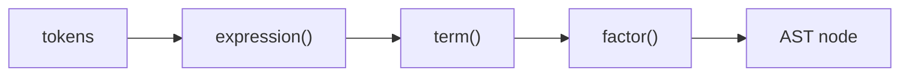

# Compilers 101 (3/10): 파싱과 AST

문법 규칙 하나가 함수 하나와 대응됩니다. 우선순위는 함수 호출 깊이로 표현됩니다. 이 대응 관계가 재귀 하강 파서의 핵심입니다.

이 글은 Compilers 101 시리즈의 세 번째 글입니다.

`1 + 2 * 3`이 왜 `((1 + 2) * 3)`이 아니라 `(1 + (2 * 3))`로 읽히는지 이해하면, 파서가 단순히 토큰을 읽는 도구가 아니라 의미 구조를 결정하는 장치라는 점이 분명해집니다.


*Compilers 101 3장 흐름 개요*

## 이 글에서 다룰 문제

- AST는 무엇이며, 왜 꼭 트리여야 할까요?
- 재귀 하강 파서의 기본 형태는 어떻게 생겼을까요?
- 우선순위와 결합성은 코드 안에서 어떻게 표현할까요?
- 이 단계에서 발생하는 가장 흔한 오류는 어떤 형태일까요?
- 이 개념을 실무에서 잘못 적용하면 어떤 문제가 생길까요?

렉서가 "단어"를 만들었다면 파서는 "문장 구조"를 만듭니다. AST가 깔끔하면 그 위의 의미 분석, 최적화, 코드 생성이 모두 단순해집니다. 반대로 AST가 흐릿하면 이후 단계가 모두 그 흐릿함을 보정하느라 복잡해집니다.

> 컴파일러 버그의 상당수는 결국 "AST가 잘못 만들어졌다"로 귀결됩니다.


```mermaid
flowchart LR
    A["tokens"] --> B["expression()"]
    B --> C["term()"]
    C --> D["factor()"]
    D --> E["AST node"]
```

문법 단계는 함수 단계로 거의 그대로 매핑됩니다. 우선순위가 높은 연산자는 더 안쪽 함수에서 처리합니다.

## 핵심 용어

- **AST(Abstract Syntax Tree)**: 프로그램 구조를 표현하는 트리입니다. 괄호 같은 표면 문법은 사라지고 의미 구조만 남습니다.
- **재귀 하강(Recursive Descent)**: 문법 규칙 하나를 함수 하나로 대응시키는 파서 스타일입니다. 읽기 쉽고 디버깅하기 좋습니다.
- **우선순위(Precedence)**: 어떤 연산자가 더 강하게 묶이는지 나타냅니다. `*`는 `+`보다 강합니다.
- **결합성(Associativity)**: 같은 우선순위 안에서 어느 쪽으로 묶이는지 나타냅니다. `-`는 좌결합(`1-2-3 = (1-2)-3`), `**`는 우결합(`2**3**4 = 2**(3**4)`)입니다.
- **lookahead**: 현재 위치에서 한 개 이상 토큰을 미리 보는 동작입니다. 재귀 하강에서 다음 분기를 결정할 때 씁니다.

## 변경 전후

**Before — 평평한 토큰 리스트**

```python
tokens = [("NUM", 1), ("OP", "+"), ("NUM", 2), ("OP", "*"), ("NUM", 3)]
# 이 구조만 봐서는 + 와 * 중 어느 것이 먼저 계산되어야 하는지 알 수 없습니다.
```

**After — 의미가 드러나는 트리**

```python
ast = BinOp("+", Num(1), BinOp("*", Num(2), Num(3)))
# * 가 + 의 자식이므로 * 가 더 먼저 계산됩니다. 우선순위가 구조에 새겨집니다.
```

트리 모양 자체가 곧 우선순위입니다. 평가기와 코드 생성기는 이 트리를 순회하면 됩니다.

## 실습: 작은 표현식 파서 만들기

### 1단계 — AST 노드 정의

```python
# 1_ast_nodes.py
from dataclasses import dataclass, field
from typing import Optional

@dataclass
class Num:
    value: int
    line: int = 0
    col: int = 0

    def __repr__(self):
        return f"Num({self.value})"

@dataclass
class BinOp:
    op: str
    left: object
    right: object
    line: int = 0
    col: int = 0

    def __repr__(self):
        return f"BinOp({self.op!r}, {self.left!r}, {self.right!r})"

@dataclass
class UnaryOp:
    op: str
    operand: object
    line: int = 0

    def __repr__(self):
        return f"UnaryOp({self.op!r}, {self.operand!r})"

# 예시
tree = BinOp("+", Num(1), BinOp("*", Num(2), Num(3)))
print(tree)
# BinOp('+', Num(1), BinOp('*', Num(2), Num(3)))
```

표현식 AST는 dataclass 두세 개만으로도 충분히 표현할 수 있습니다. 어떤 노드 종류가 있는지가 곧 언어의 표현력입니다. 위치 정보(`line`, `col`)를 처음부터 포함하면 나중에 오류 메시지를 만들기 쉽습니다.

### 2단계 — 토큰 스트림과 커서

```python
# 2_cursor.py
from dataclasses import dataclass

@dataclass
class Token:
    kind: str
    text: str
    line: int = 1
    col: int = 1

class TokenStream:
    """토큰 목록 위를 걷는 커서입니다."""

    def __init__(self, tokens: list[Token]):
        self.tokens = tokens
        self.pos = 0

    def peek(self) -> Token:
        """현재 위치의 토큰을 소비하지 않고 봅니다."""
        if self.pos < len(self.tokens):
            return self.tokens[self.pos]
        return Token("EOF", "", 0, 0)

    def advance(self) -> Token:
        """현재 토큰을 소비하고 반환합니다."""
        t = self.peek()
        self.pos += 1
        return t

    def expect(self, kind: str) -> Token:
        """지정한 종류의 토큰을 소비합니다. 종류가 다르면 SyntaxError를 냅니다."""
        t = self.advance()
        if t.kind != kind:
            raise SyntaxError(
                f"line {t.line}:{t.col} — expected {kind!r}, got {t.kind!r} ({t.text!r})"
            )
        return t

    def check(self, *kinds: str) -> bool:
        """다음 토큰이 주어진 종류 중 하나인지 확인합니다(소비하지 않음)."""
        return self.peek().kind in kinds

    def match(self, *kinds: str) -> Optional[Token]:
        """다음 토큰이 주어진 종류이면 소비하고 반환합니다. 아니면 None을 반환합니다."""
        if self.peek().kind in kinds:
            return self.advance()
        return None
```

`peek / advance / expect` 세 동작이 재귀 하강 파서의 기본 어휘입니다. `match`는 선택적 토큰을 처리할 때 코드가 훨씬 깔끔해집니다.

### 3단계 — 재귀 하강 파서 작성하기

```python
# 3_recursive_descent.py
from dataclasses import dataclass
import re

# --- 토큰과 AST 노드 ---
@dataclass
class Token:
    kind: str; text: str

@dataclass
class Num: value: int
@dataclass
class BinOp: op: str; left: object; right: object
@dataclass
class UnaryOp: op: str; operand: object

# --- 간단한 렉서 ---
def tokenize(src: str) -> list[Token]:
    pattern = re.compile(r"\s*(?:(\d+)|(.))")
    tokens = []
    for num, ch in pattern.findall(src):
        if num:
            tokens.append(Token("NUM", num))
        elif ch:
            tokens.append(Token(ch, ch))
    tokens.append(Token("EOF", ""))
    return tokens

# --- 문법 (BNF) ---
# expr   := term  (("+"|"-") term)*
# term   := factor (("*"|"/") factor)*
# factor := ("+" | "-") factor      <- 단항 연산자
#         | NUM
#         | "(" expr ")"

class Parser:
    def __init__(self, tokens: list[Token]):
        self.tokens = tokens
        self.pos = 0

    def peek(self) -> Token:
        return self.tokens[self.pos] if self.pos < len(self.tokens) else Token("EOF", "")

    def eat(self, expected: str = None) -> Token:
        t = self.peek()
        if expected and t.kind != expected:
            raise SyntaxError(f"expected {expected!r}, got {t.kind!r} ({t.text!r})")
        self.pos += 1
        return t

    def expr(self) -> object:
        """덧셈/뺄셈: 가장 낮은 우선순위"""
        node = self.term()
        while self.peek().kind in ("+", "-"):
            op = self.eat().text
            node = BinOp(op, node, self.term())
        return node

    def term(self) -> object:
        """곱셈/나눗셈: 중간 우선순위"""
        node = self.factor()
        while self.peek().kind in ("*", "/"):
            op = self.eat().text
            node = BinOp(op, node, self.factor())
        return node

    def factor(self) -> object:
        """단항 연산자, 숫자, 괄호: 가장 높은 우선순위"""
        tok = self.peek()
        # 단항 연산자
        if tok.kind in ("+", "-"):
            op = self.eat().text
            return UnaryOp(op, self.factor())  # 우결합으로 재귀 호출
        # 숫자
        if tok.kind == "NUM":
            self.eat("NUM")
            return Num(int(tok.text))
        # 괄호 그룹
        if tok.kind == "(":
            self.eat("(")
            node = self.expr()    # 괄호 안은 expr부터 다시 시작합니다
            self.eat(")")
            return node
        raise SyntaxError(f"unexpected token: {tok.kind!r} ({tok.text!r})")

    def parse(self) -> object:
        node = self.expr()
        if self.peek().kind != "EOF":
            tok = self.peek()
            raise SyntaxError(f"unexpected extra token: {tok.kind!r}")
        return node

# 테스트
tests = [
    ("1 + 2 * 3",     "BinOp('+', Num(1), BinOp('*', Num(2), Num(3)))"),
    ("(1 + 2) * 3",   "BinOp('*', BinOp('+', Num(1), Num(2)), Num(3))"),
    ("-1",            "UnaryOp('-', Num(1))"),
    ("-(1 + 2)",      "UnaryOp('-', BinOp('+', Num(1), Num(2)))"),
]

for src, expected in tests:
    ast = Parser(tokenize(src)).parse()
    print(f"{src:20s} -> {ast}")
```

`expr → term → factor`라는 순서가 그대로 **낮은 우선순위 → 높은 우선순위**를 뜻합니다. `*`가 `term()` 안에서 처리되기 때문에 항상 더 깊게 묶입니다.

### 4단계 — AST 예쁘게 출력하기

```python
# 4_pretty.py
def pretty(node, depth: int = 0) -> str:
    """AST를 들여쓰기 트리로 출력합니다."""
    pad = "  " * depth
    if isinstance(node, Num):
        return f"{pad}Num({node.value})"
    if isinstance(node, UnaryOp):
        child = pretty(node.operand, depth + 1)
        return f"{pad}UnaryOp({node.op!r})\n{child}"
    if isinstance(node, BinOp):
        left  = pretty(node.left,  depth + 1)
        right = pretty(node.right, depth + 1)
        return f"{pad}BinOp({node.op!r})\n{left}\n{right}"
    return f"{pad}???"

src = "1 + 2 * 3"
ast = Parser(tokenize(src)).parse()
print(f"Source: {src}")
print(pretty(ast))
# BinOp('+')
#   Num(1)
#   BinOp('*')
#     Num(2)
#     Num(3)
```

트리를 그대로 출력하면 우선순위가 한눈에 보입니다. AST 시각화 도구 하나만 있어도 파서 디버깅의 상당 부분이 해결됩니다.

### 5단계 — 평가기로 파서 검증하기

```python
# 5_eval.py
def evaluate(node) -> float:
    """AST를 순회하며 계산합니다. 파서 검증용으로도 씁니다."""
    if isinstance(node, Num):
        return float(node.value)
    if isinstance(node, UnaryOp):
        v = evaluate(node.operand)
        return -v if node.op == "-" else v
    if isinstance(node, BinOp):
        l = evaluate(node.left)
        r = evaluate(node.right)
        ops = {"+": l + r, "-": l - r, "*": l * r}
        if node.op == "/":
            if r == 0:
                raise ZeroDivisionError(f"division by zero")
            return l / r
        if node.op in ops:
            return ops[node.op]
        raise RuntimeError(f"unknown op: {node.op!r}")
    raise RuntimeError(f"unknown node: {type(node)}")

# 파서 검증: 계산 결과가 기대값과 일치하면 파서가 올바릅니다
test_cases = [
    ("1 + 2 * 3",   7),    # 곱셈 먼저 = 1 + 6 = 7
    ("(1 + 2) * 3", 9),    # 괄호 먼저 = 3 * 3 = 9
    ("-2 + 3",      1),    # 단항 연산자 = -2 + 3 = 1
    ("10 / 2 / 5",  1),    # 좌결합 = (10/2)/5 = 1
]

for src, expected in test_cases:
    result = evaluate(Parser(tokenize(src)).parse())
    status = "OK" if abs(result - expected) < 1e-9 else "FAIL"
    print(f"[{status}] {src} = {result} (expected {expected})")
```

AST가 올바르면 평가 결과도 우리가 아는 산술 규칙과 일치합니다. 그래서 파서를 검증하는 가장 빠른 도구는 종종 작은 평가기입니다.

## 핵심 정리

- 문법 규칙 하나가 함수 하나와 대응됩니다.
- 우선순위는 함수 호출 깊이로 표현됩니다.
- 결합성은 `while` 루프가 누적되는 방향으로 결정됩니다.
- 명시적인 토큰 커서를 두면 불필요한 백트래킹을 피할 수 있습니다.
- 평가기는 파서 정확성을 검증하는 가장 빠른 도구입니다.

## 자주 하는 실수

1. **우선순위를 한 줄짜리 SPEC에 우겨 넣으려는 것**입니다. 우선순위는 함수 분리로 표현해야 합니다. `expr/term/factor` 구분이 없으면 `1 + 2 * 3`이 `(1 + 2) * 3`으로 잘못 파싱됩니다.
2. **결합성을 빼먹어 우결합 버그를 만드는 것**입니다. `while` 루프를 쓰면 자동으로 좌결합이 됩니다. `**` 같은 우결합 연산자는 `factor()` 안에서 재귀 호출로 처리해야 합니다.
3. **`expect`가 낸 `SyntaxError`를 잡고 무시하는 것**입니다. 잘못된 AST를 계속 만들게 됩니다. 오류는 즉시 전파하거나 상위 수준에서 일괄 처리해야 합니다.
4. **토큰의 위치 정보를 버리는 것**입니다. 1단계에서 모은 line/col을 끝까지 유지해야 합니다. 위치가 없으면 "어디서 오류가 났는지"를 알 수 없습니다.
5. **괄호 같은 표면 문법을 AST에 그대로 남겨 두는 것**입니다. 괄호는 우선순위를 결정한 뒤 AST 구조에 흡수되어 사라져야 합니다. AST에 `Paren` 노드를 만들지 마세요.

## 실무에서는 이렇게 나타납니다

손으로 쓴 많은 컴파일러는 재귀 하강 파서를 사용합니다. rustc, clang, CPython 같은 도구도 이 계열 사고방식을 강하게 갖고 있습니다. yacc, bison, lark 같은 생성기 도구를 써도 결국 비슷한 트리를 만듭니다. 대부분의 비모호 문법에서는 읽기 쉽고 디버깅하기 쉬운 선택이 재귀 하강입니다.

Python `ast` 모듈로 실제 AST를 살펴보면 파서가 어떤 구조를 만드는지 바로 확인할 수 있습니다.

```python
import ast
tree = ast.parse("1 + 2 * 3")
print(ast.dump(tree, indent=2))
# Module(body=[Expr(value=BinOp(
#     left=Constant(value=1),
#     op=Add(),
#     right=BinOp(
#         left=Constant(value=2),
#         op=Mult(),
#         right=Constant(value=3)
#     )
# ))])
```

## 숙련된 엔지니어는 이렇게 봅니다

- 새 문법을 보면 먼저 어느 함수에 들어갈 규칙인지 결정합니다.
- AST 노드 종류를 가능한 한 작고 읽기 쉽게 유지합니다.
- 파서가 만든 AST를 그림처럼 보여 주는 디버그 도구를 항상 둡니다.
- "왜 이 식이 이렇게 묶였는가?"라는 질문에 호출 깊이로 답합니다.
- 모호한 문법은 파서 우회 코드가 아니라 문법 자체를 고쳐 해결합니다.

## 운영 체크리스트

- [ ] AST가 왜 트리여야 하는지 설명할 수 있습니까?
- [ ] 재귀 하강 파서의 기본 구조를 한 화면에 그릴 수 있습니까?
- [ ] 우선순위와 결합성의 차이를 한 문장으로 설명할 수 있습니까?
- [ ] AST 시각화 도구를 직접 만들어 본 적이 있습니까?
- [ ] 파서 오류 메시지의 형태를 미리 정의해 두었습니까?

## 연습 문제

1. 위 파서에 unary minus(`-1`, `-(1+2)`)를 추가해 보세요. 어느 함수에 넣는 것이 자연스러운지 생각해 보세요.
2. `**` 연산자를 추가하고 우결합으로 동작하게 만들어 보세요.
3. 잘못된 입력 `1 + * 2`에 대해 어떤 오류 메시지를 보여 줄지 설계해 보세요.

## 처음 질문으로 돌아가기

- **AST는 무엇이며, 왜 꼭 트리여야 할까요?**
  - AST는 프로그램의 의미 구조를 트리로 표현한 것입니다. 표현식은 본질적으로 재귀 구조(`(a + b) * c`처럼 식 안에 식이 중첩)를 가지므로 트리가 가장 자연스럽습니다. 선형 자료구조(목록)로는 중첩과 우선순위를 표현하기 어렵습니다.
- **재귀 하강 파서의 기본 형태는 어떻게 생겼을까요?**
  - 문법 규칙 하나가 함수 하나에 대응되는 구조입니다. `expr()`, `term()`, `factor()` 같은 함수가 서로 재귀 호출하며 토큰을 소비합니다. `peek()`로 다음을 보고, `eat()`으로 소비하며, `expect()`로 강제 소비합니다.
- **우선순위와 결합성은 코드 안에서 어떻게 표현할까요?**
  - 우선순위는 함수 호출 깊이로 표현됩니다. `term()` 안에서 `*`를 처리하면 `*`가 `+`보다 더 깊이 묶입니다. 결합성은 `while` 루프 방향으로 표현됩니다. 좌결합은 `while`로, 우결합은 재귀 호출(`self.factor()` 재호출)로 구현합니다.

## 정리와 다음 글

파서는 평평한 토큰 스트림을 의미 있는 트리로 바꾸는 단계입니다. 다음 글에서는 그 트리를 읽어 "이 변수는 어디서 선언됐는가?", "이 타입은 맞는가?"를 판단하는 semantic analysis를 다룹니다.

<!-- toc:begin -->
## 시리즈 목차

- [Compilers 101 (1/10): 컴파일러란 무엇인가?](./01-what-is-a-compiler.md)
- [Compilers 101 (2/10): 렉시컬 분석](./02-lexical-analysis.md)
- **Compilers 101 (3/10): 파싱과 AST (현재 글)**
- [Compilers 101 (4/10): 시맨틱 분석](./04-semantic-analysis.md)
- [Compilers 101 (5/10): 심볼 테이블과 스코프](./05-symbol-table-and-scope.md)
- [Compilers 101 (6/10): 중간 표현](./06-intermediate-representation.md)
- [Compilers 101 (7/10): 최적화 기초](./07-optimization-basics.md)
- [Compilers 101 (8/10): 코드 생성](./08-code-generation.md)
- [Compilers 101 (9/10): JIT vs AOT](./09-jit-vs-aot.md)
- [작은 인터프리터 만들기](./10-building-a-tiny-interpreter.md)

<!-- toc:end -->

## 참고 자료

- [Crafting Interpreters — Parsing Expressions](https://craftinginterpreters.com/parsing-expressions.html)
- [Recursive descent parser (Wikipedia)](https://en.wikipedia.org/wiki/Recursive_descent_parser)
- [Operator-precedence parser (Wikipedia)](https://en.wikipedia.org/wiki/Operator-precedence_parser)
- [Python ast module](https://docs.python.org/3/library/ast.html)

- [이 시리즈 예제 코드 (book-examples)](https://github.com/yeongseon-books/book-examples/tree/main/compilers-101/ko)

Tags: Computer Science, Compilers, Parser, AST, RecursiveDescent, Precedence
