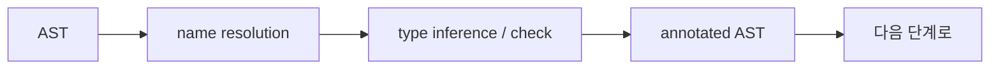

# semantic analysis

> Compilers 101 시리즈 (4/10)


## 이 글에서 다룰 문제

Parser는 "괄호가 맞나?"까지밖에 못 봅니다. `x = y + 1`의 `y`가 선언된 적이 없거나, `y`가 문자열인데 `1`을 더하려는 상황은 의미 단계에서 잡힙니다. 이 단계가 약하면 컴파일이 통과한 코드가 런타임에 죽습니다.

> 컴파일러가 신뢰받는 이유는 syntax가 아니라 semantics 때문입니다.

## 개념 한눈에 보기



원래의 AST에 "이 이름은 여기 선언, 이 식의 타입은 int" 같은 메타데이터가 붙은 형태가 결과입니다.

## Before/After

**Before — parser만 끝낸 AST**

```python
ast = Bin("+", Var("x"), Str("hello"))
# x가 무엇인지, 두 쪽 타입이 맞는지 아무도 모른다
```

**After — semantic이 붙은 AST**

```python
# x: int (declared at line 3)
# Bin.+ requires int + int, got int + str → TypeError
```

뒤 단계가 신뢰할 수 있는 형태가 됐습니다.

## 실습: 작은 의미 분석기

### 1단계 — 단순 타입 환경

```python
# 1_env.py
class Env:
    def __init__(self, parent=None):
        self.parent, self.table = parent, {}
    def declare(self, name, ty):
        if name in self.table:
            raise SyntaxError(f"redeclared: {name}")
        self.table[name] = ty
    def lookup(self, name):
        if name in self.table: return self.table[name]
        if self.parent: return self.parent.lookup(name)
        raise NameError(f"undeclared: {name}")
```

이름 해석은 결국 dictionary lookup입니다. parent를 두면 nested scope를 자연스럽게 표현할 수 있습니다.

### 2단계 — name resolution

```python
# 2_resolve.py
from dataclasses import dataclass
@dataclass
class Var: name: str
@dataclass
class Decl:
    name: str; ty: str

env = {"int_globals": "int"}
def resolve(node):
    if isinstance(node, Var):
        if node.name not in env:
            raise NameError(f"'{node.name}' is not defined")
    if isinstance(node, Decl):
        env[node.name] = node.ty
```

선언과 사용을 같은 자료구조로 다루는 것이 핵심입니다. AST를 한 번 순회하면서 환경을 갱신하고 조회합니다.

### 3단계 — 단순 타입 검사

```python
# 3_typecheck.py
def type_of(node, env):
    kind = node[0]
    if kind == "NUM": return "int"
    if kind == "STR": return "str"
    if kind == "VAR": return env[node[1]]
    if kind == "BIN":
        op, l, r = node[1], type_of(node[2], env), type_of(node[3], env)
        if l != r:
            raise TypeError(f"{op}: {l} vs {r}")
        return l

env = {"x": "int"}
print(type_of(("BIN","+",("VAR","x"),("NUM",1)), env))  # int
```

타입은 트리를 따라 위로 올라옵니다. 두 자식의 타입이 맞지 않으면 그 자리에서 오류를 냅니다.

### 4단계 — annotated AST

```python
# 4_annotate.py
def annotate(node, env):
    kind = node[0]
    if kind == "NUM": return ("NUM", node[1], "int")
    if kind == "VAR": return ("VAR", node[1], env[node[1]])
    if kind == "BIN":
        l = annotate(node[2], env); r = annotate(node[3], env)
        if l[-1] != r[-1]:
            raise TypeError(f"{node[1]}: {l[-1]} vs {r[-1]}")
        return ("BIN", node[1], l, r, l[-1])
```

원래 AST에 마지막 슬롯으로 타입을 붙여 둡니다. 다음 단계는 트리 한 번 더 보면서 타입에 맞는 코드를 낼 수 있습니다.

### 5단계 — 좋은 오류 메시지

```python
# 5_error.py
def report(token, expected, got):
    print(f"  File \"<src>\", line {token['line']}")
    print(f"    {token['text']}")
    print(f"  TypeError: expected {expected}, got {got}")

report({"line": 12, "text": 'x + "hello"'}, "int", "str")
```

의미 오류는 위치 + 무엇이 기대됐는가 + 무엇이 왔는가 세 줄로 충분합니다.

## 이 코드에서 주목할 점

- 환경(Env)은 chained dictionary로 자연스럽게 nested scope를 표현합니다.
- 타입은 AST의 추가 정보로 다루지, 별도 자료구조가 아닙니다.
- 오류는 가능한 한 가까운 위치에서 보고합니다.
- 한 번의 순회로 끝낼 수도, 여러 패스로 나눌 수도 있습니다.

## 자주 하는 실수 5가지

1. **Name과 Symbol을 같은 것으로 본다.** Name은 텍스트, Symbol은 declaration entry입니다.
2. **타입 오류를 모아서 한 번에 보고하지 않는다.** 첫 오류 한 번에 멈추면 사용자 경험이 나쁩니다.
3. **`==` 비교만으로 타입 호환성을 판단한다.** subtype, generics, coercion이 있으면 깨집니다.
4. **선언/사용을 별도 자료구조로 만들어 환경이 둘이 된다.** 진리의 출처는 하나여야 합니다.
5. **scope 진입/탈출을 부모로의 포인터 없이 구현한다.** 변수 가림(shadowing)이 깨집니다.

## 실무에서는 이렇게 쓰입니다

언어 서버(LSP)의 핵심이 여기 있습니다. "go to definition"은 name resolution, "type hint"는 type inference, "rename symbol"은 symbol table 갱신입니다. 컴파일러의 의미 단계가 곧 IDE의 핵심 기능입니다.

## 체크리스트

- [ ] syntactic vs semantic의 차이를 한 줄로 설명할 수 있는가?
- [ ] name resolution이 dictionary lookup이라는 사실을 받아들였는가?
- [ ] AST에 타입을 붙이는 패턴을 한 번이라도 짠 적 있는가?
- [ ] 의미 오류 메시지의 표준 형태를 정의해 본 적 있는가?
- [ ] LSP의 기능이 의미 단계와 어떻게 연결되는지 답할 수 있는가?

## 정리 및 다음 단계

Semantic analysis는 syntax가 답해 주지 못하는 "이게 의미상 맞는가?"를 답합니다. 다음 글에서는 그 핵심 도구인 symbol table과 scope를 더 자세히 살펴봅니다.

<!-- toc:begin -->
- [컴파일러란 무엇인가?](./01-what-is-a-compiler.md)
- [lexical analysis](./02-lexical-analysis.md)
- [parsing과 AST](./03-parsing-and-ast.md)
- **semantic analysis (현재 글)**
- symbol table과 scope (예정)
- intermediate representation (예정)
- optimization 기초 (예정)
- code generation (예정)
- JIT vs AOT (예정)
- 작은 인터프리터 만들어 보기 (예정)
<!-- toc:end -->

## 참고 자료

- [Crafting Interpreters — Resolving and Binding](https://craftinginterpreters.com/resolving-and-binding.html)
- [Type system (Wikipedia)](https://en.wikipedia.org/wiki/Type_system)
- [Name resolution (Wikipedia)](https://en.wikipedia.org/wiki/Name_resolution_(programming_languages))
- [Language Server Protocol](https://microsoft.github.io/language-server-protocol/)

Tags: Computer Science, Compilers, SemanticAnalysis, TypeChecking, NameResolution
