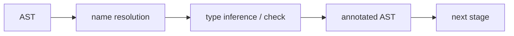

# 시맨틱 분석

이 글은 Compilers 101 시리즈의 네 번째 글입니다. 문법은 맞지만 의미가 틀린 코드가 왜 거부되는지 이해하는 순간, 컴파일러가 단순한 문장 검사기가 아니라 프로그램 의미를 판정하는 도구라는 점이 분명해집니다.

## 이 글에서 다룰 문제

- 문법적으로 맞다는 것과 의미적으로 맞다는 것은 어떻게 다를까요?
- 이름 해석은 무엇이며, 식별자는 어디를 가리킬까요?
- 타입 검사는 어떤 규칙으로 동작할까요?
- AST를 한 번 순회하며 의미를 붙이는 패턴은 어떻게 생겼을까요?
- 시맨틱 단계의 좋은 오류 메시지는 어떤 모양일까요?

> 시맨틱 분석은 문법 검사를 통과한 AST를 대상으로 “이 코드가 정말 말이 되는가?”를 묻는 단계입니다.

## 왜 중요한가

파서는 괄호가 맞는지, 문장 구조가 규칙에 맞는지까지만 판단할 수 있습니다. 하지만 `x = y + 1`에서 `y`가 선언된 적이 없는지, 혹은 `y`가 문자열인데 `1`을 더하려는지 같은 문제는 시맨틱 단계에서만 잡을 수 있습니다. 이 단계가 약하면 컴파일은 통과했는데 런타임에서 터지는 코드가 늘어납니다.

> 컴파일러가 신뢰를 얻는 이유는 문법보다 시맨틱에 있습니다.

## 핵심 개념 한눈에 보기



결과는 원래의 AST에 “이 이름은 이 선언을 가리킨다”, “이 식의 타입은 int다” 같은 메타데이터가 붙은 형태입니다.

## 핵심 용어

- **이름 해석**: 식별자가 어떤 선언을 가리키는지 결정하는 과정입니다.
- **타입 검사**: 식이 놓인 문맥에서 허용된 타입인지 확인하는 과정입니다.
- **타입 추론**: 코드에 명시되지 않은 타입을 추론해 내는 과정입니다.
- **annotated AST**: 시맨틱 정보가 붙은 AST입니다.
- **강제 변환(coercion)**: `int → float`처럼 호환 가능한 타입 사이의 암묵 변환입니다.

## Before / After

**Before — 파서가 남긴 AST**

```python
ast = Bin("+", Var("x"), Str("hello"))
# nobody knows what x is, or whether the two sides match
```

**After — 의미 정보가 붙은 AST**

```python
# x: int (declared at line 3)
# Bin.+ requires int + int, got int + str → TypeError
```

이제 뒤 단계는 이 AST를 신뢰하고 다음 작업을 진행할 수 있습니다.

## 실습: 작은 시맨틱 분석기 만들기

### 1단계 — 단순한 타입 환경

```python
# 1_env.py
class Env:
    def __init__(self, parent=None):
        self.parent, self.table = parent, {}
    def declare(self, name, ty):
        if name in self.table:
            raise SyntaxError(f"redeclared: {name}")
        self.table[name] = ty
    def lookup(self, name):
        if name in self.table: return self.table[name]
        if self.parent: return self.parent.lookup(name)
        raise NameError(f"undeclared: {name}")
```

이름 해석은 결국 딕셔너리 조회입니다. 부모 포인터 하나만 있으면 중첩 스코프도 자연스럽게 표현됩니다.

### 2단계 — 이름 해석

```python
# 2_resolve.py
from dataclasses import dataclass
@dataclass
class Var: name: str
@dataclass
class Decl:
    name: str; ty: str

env = {"int_globals": "int"}
def resolve(node):
    if isinstance(node, Var):
        if node.name not in env:
            raise NameError(f"'{node.name}' is not defined")
    if isinstance(node, Decl):
        env[node.name] = node.ty
```

선언과 사용을 같은 환경 자료구조로 다뤄야 합니다. AST를 순회하면서 환경을 갱신하고 동시에 조회하는 패턴이 기본입니다.

### 3단계 — 단순 타입 검사

```python
# 3_typecheck.py
def type_of(node, env):
    kind = node[0]
    if kind == "NUM": return "int"
    if kind == "STR": return "str"
    if kind == "VAR": return env[node[1]]
    if kind == "BIN":
        op, l, r = node[1], type_of(node[2], env), type_of(node[3], env)
        if l != r:
            raise TypeError(f"{op}: {l} vs {r}")
        return l

env = {"x": "int"}
print(type_of(("BIN","+",("VAR","x"),("NUM",1)), env))  # int
```

타입은 트리를 따라 아래에서 위로 올라옵니다. 자식 둘이 맞지 않으면 바로 그 지점에서 오류를 냅니다.

### 4단계 — annotated AST 만들기

```python
# 4_annotate.py
def annotate(node, env):
    kind = node[0]
    if kind == "NUM": return ("NUM", node[1], "int")
    if kind == "VAR": return ("VAR", node[1], env[node[1]])
    if kind == "BIN":
        l = annotate(node[2], env); r = annotate(node[3], env)
        if l[-1] != r[-1]:
            raise TypeError(f"{node[1]}: {l[-1]} vs {r[-1]}")
        return ("BIN", node[1], l, r, l[-1])
```

원래 AST 끝에 타입 정보를 붙여 annotated AST를 만듭니다. 다음 단계는 이 트리를 다시 한 번 걷기만 하면 됩니다.

### 5단계 — 좋은 오류 메시지 만들기

```python
# 5_error.py
def report(token, expected, got):
    print(f"  File \"<src>\", line {token['line']}")
    print(f"    {token['text']}")
    print(f"  TypeError: expected {expected}, got {got}")

report({"line": 12, "text": 'x + "hello"'}, "int", "str")
```

시맨틱 오류 메시지는 보통 세 줄이면 충분합니다. 위치, 기대한 것, 실제로 들어온 것입니다.

## 이 코드에서 먼저 봐야 할 점

- 환경(Env)은 부모 포인터를 가진 연결 딕셔너리로 자연스럽게 중첩 스코프를 표현합니다.
- 타입은 별도 자료구조가 아니라 AST에 붙는 추가 정보입니다.
- 오류는 가능한 한 그 위치에 가깝게 보고해야 합니다.
- 한 번의 순회로도 가능하지만, 필요하면 여러 패스로 쪼갤 수 있습니다.

## 자주 하는 실수 다섯 가지

1. **이름(Name)과 심볼(Symbol)을 같은 것으로 보는 것**입니다. 이름은 텍스트이고, 심볼은 선언 엔트리입니다.
2. **첫 번째 타입 오류에서 바로 멈추는 것**입니다. 사용자 경험은 여러 오류를 한 번에 보여 줄 때 좋아집니다.
3. **타입 호환성을 `==`로만 판단하는 것**입니다. 하위 타입, 제네릭, coercion이 들어오면 무너집니다.
4. **선언용 환경과 사용용 환경을 따로 만드는 것**입니다. 진실의 원천은 하나여야 합니다.
5. **스코프 진입/탈출을 부모 포인터 없이 처리하려는 것**입니다. 변수 가리기(shadowing)가 깨집니다.

## 실무에서는 이렇게 나타납니다

언어 서버(LSP)의 핵심 기능 상당수가 여기서 나옵니다. “정의로 이동”은 이름 해석이고, “타입 힌트”는 타입 추론이며, “심볼 이름 바꾸기”는 시맨틱 정보와 심볼 테이블 갱신입니다. 즉, 시맨틱 단계는 IDE 핵심 기능의 기반이기도 합니다.

## 숙련된 엔지니어는 이렇게 봅니다

- 사용자가 가장 많이 읽는 문장은 시맨틱 오류 메시지라는 사실을 압니다.
- 단일 환경을 진실의 원천으로 강하게 유지합니다.
- 시맨틱 정보를 옆으로 흘리지 않고 AST에 직접 붙입니다.
- 한 패스에서 여러 오류를 보고할 수 있게 복구 전략을 설계합니다.
- 확장을 위해 타입 시스템을 lattice처럼 추상화해 생각합니다.

## 체크리스트

- [ ] 문법 오류와 시맨틱 오류의 차이를 한 문장으로 설명할 수 있습니까?
- [ ] 이름 해석이 결국 딕셔너리 조회라는 점을 받아들였습니까?
- [ ] AST에 타입을 붙이는 패턴을 직접 작성해 본 적이 있습니까?
- [ ] 시맨틱 오류 메시지의 표준 형태를 정의해 두었습니까?
- [ ] LSP 기능이 시맨틱 단계와 어떻게 연결되는지 설명할 수 있습니까?

## 연습 문제

1. 위 환경에 함수 진입/탈출을 추가해 중첩 스코프를 처리해 보세요.
2. `int + float`를 `float`로 승격하는 coercion 규칙을 추가해 보세요.
3. 파일 전체의 시맨틱 오류를 모아 마지막에 한 번에 출력하는 구조를 설계해 보세요.

## 정리 및 다음 글

시맨틱 분석은 문법만으로는 답할 수 없는 “이 코드가 정말 의미가 맞는가?”라는 질문에 답하는 단계입니다. 다음 글에서는 이 단계의 핵심 도구인 symbol table과 scope를 더 집중해서 살펴봅니다.

<!-- toc:begin -->
- [컴파일러란 무엇인가?](./01-what-is-a-compiler.md)
- [렉시컬 분석](./02-lexical-analysis.md)
- [파싱과 AST](./03-parsing-and-ast.md)
- **시맨틱 분석 (현재 글)**
- 심볼 테이블과 스코프 (예정)
- 중간 표현 (예정)
- 최적화 기초 (예정)
- 코드 생성 (예정)
- JIT vs AOT (예정)
- 작은 인터프리터 만들기 (예정)
<!-- toc:end -->

## 참고 자료

- [Crafting Interpreters — Resolving and Binding](https://craftinginterpreters.com/resolving-and-binding.html)
- [Type system (Wikipedia)](https://en.wikipedia.org/wiki/Type_system)
- [Name resolution (Wikipedia)](https://en.wikipedia.org/wiki/Name_resolution_(programming_languages))
- [Language Server Protocol](https://microsoft.github.io/language-server-protocol/)

Tags: Computer Science, Compilers, SemanticAnalysis, TypeChecking, NameResolution
