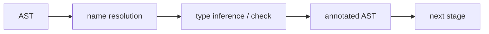

# Compilers 101 (4/10): 시맨틱 분석

문법은 맞지만 의미가 틀린 코드가 왜 거부되는지 이해하는 순간, 컴파일러가 단순한 문장 검사기가 아니라 프로그램 의미를 판정하는 도구라는 점이 분명해집니다.

이 글은 Compilers 101 시리즈의 4번째 글입니다.

`x = y + 1`에서 `y`가 선언된 적이 없거나 `y`가 문자열인데 `1`을 더하려는 경우, 파서는 이 코드를 오류 없이 통과시킵니다. 시맨틱 단계가 없으면 이런 오류는 런타임에서야 터집니다.


*Compilers 101 4장 흐름 개요*

## 이 글에서 다룰 문제

- 문법적으로 맞다는 것과 의미적으로 맞다는 것은 어떻게 다를까요?
- 이름 해석은 무엇이며, 식별자는 어디를 가리킬까요?
- 타입 검사는 어떤 규칙으로 동작할까요?
- 이 단계에서 발생하는 가장 흔한 오류는 어떤 형태일까요?
- 이 개념을 실무에서 잘못 적용하면 어떤 문제가 생길까요?

파서는 괄호가 맞는지, 문장 구조가 규칙에 맞는지까지만 판단할 수 있습니다. 하지만 변수가 선언됐는지, 타입이 맞는지, 함수 인자 개수가 맞는지 같은 문제는 시맨틱 단계에서만 잡을 수 있습니다. 이 단계가 약하면 컴파일은 통과했는데 런타임에서 터지는 코드가 늘어납니다.

> 컴파일러가 신뢰를 얻는 이유는 문법보다 시맨틱에 있습니다.


```mermaid
flowchart LR
    A["AST"] --> B["name resolution"]
    B --> C["type inference / check"]
    C --> D["annotated AST"]
    D --> E["next stage"]
```

결과는 원래의 AST에 "이 이름은 이 선언을 가리킨다", "이 식의 타입은 int다" 같은 메타데이터가 붙은 형태입니다.

## 핵심 용어

- **이름 해석(Name Resolution)**: 식별자가 어떤 선언을 가리키는지 결정하는 과정입니다. `x`가 지역 변수인지, 전역인지, 외부 모듈인지 확인합니다.
- **타입 검사(Type Checking)**: 식이 놓인 문맥에서 허용된 타입인지 확인하는 과정입니다. `int + str`처럼 맞지 않는 조합을 거부합니다.
- **타입 추론(Type Inference)**: 코드에 명시되지 않은 타입을 추론해 내는 과정입니다. ML, Haskell, Rust에서 두드러집니다.
- **annotated AST**: 시맨틱 정보(타입, 심볼 참조)가 붙은 AST입니다. 이후 단계는 이 정보를 신뢰하고 처리합니다.
- **강제 변환(Coercion)**: `int → float`처럼 호환 가능한 타입 사이의 암묵 변환입니다.

## 변경 전후

**Before — 파서가 남긴 AST**

```python
# 파서 출력: 이름과 타입 정보가 없습니다
ast = BinOp("+", Var("x"), Str("hello"))
# x가 무엇인지도, 양쪽 타입이 맞는지도 알 수 없습니다.
```

**After — 의미 정보가 붙은 annotated AST**

```python
# 시맨틱 분석 후: 타입 오류가 명확히 드러납니다
# TypeError: operator '+' requires matching types
#   left:  Var('x') -> int (declared at line 3)
#   right: Str('hello') -> str
```

이제 뒤 단계는 이 AST를 신뢰하고 다음 작업을 진행할 수 있습니다.

## 실습: 작은 시맨틱 분석기 만들기

### 1단계 — 타입 환경 구현

```python
# 1_env.py
class TypeEnv:
    """변수 이름과 타입을 매핑하는 환경입니다. 중첩 스코프를 부모 포인터로 표현합니다."""

    def __init__(self, parent: "TypeEnv" = None):
        self.parent = parent
        self.table: dict[str, str] = {}

    def declare(self, name: str, ty: str, line: int = 0) -> None:
        """현재 스코프에 새 변수를 선언합니다."""
        if name in self.table:
            raise SyntaxError(
                f"line {line}: '{name}' is already declared in this scope"
            )
        self.table[name] = ty

    def lookup(self, name: str, line: int = 0) -> str:
        """이름을 안쪽 스코프에서 바깥쪽으로 찾습니다."""
        if name in self.table:
            return self.table[name]
        if self.parent is not None:
            return self.parent.lookup(name, line)
        raise NameError(f"line {line}: '{name}' is not defined")

    def assign(self, name: str, ty: str, line: int = 0) -> None:
        """이미 선언된 변수의 타입을 갱신합니다. 없으면 NameError."""
        if name in self.table:
            self.table[name] = ty
            return
        if self.parent is not None:
            self.parent.assign(name, ty, line)
            return
        raise NameError(f"line {line}: '{name}' is not defined")

# 사용 예시
global_env = TypeEnv()
global_env.declare("x", "int")
global_env.declare("name", "str")

local_env = TypeEnv(parent=global_env)
local_env.declare("y", "float")

print(local_env.lookup("x"))     # "int" — 부모에서 찾습니다
print(local_env.lookup("y"))     # "float" — 현재 스코프에서 찾습니다
print(global_env.lookup("y"))    # NameError: 'y' is not defined
```

이름 해석은 결국 딕셔너리 조회입니다. 부모 포인터 하나만 있으면 중첩 스코프도 자연스럽게 표현됩니다.

### 2단계 — 이름 해석 (AST 순회)

```python
# 2_resolve.py
from dataclasses import dataclass

@dataclass
class Num:   value: int
@dataclass
class Str:   value: str
@dataclass
class Var:   name: str;  line: int = 0
@dataclass
class Decl:  name: str;  ty: str; value: object = None; line: int = 0
@dataclass
class BinOp: op: str;   left: object; right: object

def resolve(node: object, env: TypeEnv) -> None:
    """AST를 순회하며 모든 이름이 선언됐는지 확인합니다."""
    if isinstance(node, Num) or isinstance(node, Str):
        return  # 리터럴은 이름이 없습니다
    if isinstance(node, Var):
        env.lookup(node.name, node.line)  # 없으면 NameError
        return
    if isinstance(node, Decl):
        if node.value:
            resolve(node.value, env)
        env.declare(node.name, node.ty, node.line)
        return
    if isinstance(node, BinOp):
        resolve(node.left, env)
        resolve(node.right, env)
        return
    raise RuntimeError(f"unknown node: {type(node)}")

# 예시
env = TypeEnv()
program = [
    Decl("x", "int", Num(1), line=1),   # x: int = 1
    BinOp("+", Var("x", line=2), Num(2)),  # x + 2
]
for stmt in program:
    resolve(stmt, env)
print("resolve OK")

# 오류 케이스
try:
    resolve(Var("y", line=3), env)
except NameError as e:
    print(e)  # line 3: 'y' is not defined
```

선언과 사용을 같은 환경 자료구조로 다뤄야 합니다. AST를 순회하면서 환경을 갱신하고 동시에 조회하는 패턴이 기본입니다.

### 3단계 — 단순 타입 검사기

```python
# 3_typecheck.py
# 타입 규칙 테이블: (op, left_ty, right_ty) -> result_ty
TYPE_RULES = {
    ("+", "int",   "int"):   "int",
    ("+", "float", "float"): "float",
    ("+", "int",   "float"): "float",   # 암묵 변환
    ("+", "float", "int"):   "float",
    ("+", "str",   "str"):   "str",     # 문자열 연결
    ("-", "int",   "int"):   "int",
    ("-", "float", "float"): "float",
    ("*", "int",   "int"):   "int",
    ("*", "float", "float"): "float",
    ("*", "str",   "int"):   "str",     # "ha" * 3 = "hahaha"
    ("/", "int",   "int"):   "float",   # 파이썬 스타일
    ("/", "float", "float"): "float",
    ("==", "int",  "int"):   "bool",
    ("==", "str",  "str"):   "bool",
    ("<",  "int",  "int"):   "bool",
}

def type_of(node: object, env: TypeEnv) -> str:
    """AST 노드의 타입을 반환합니다. 오류가 있으면 TypeError를 냅니다."""
    if isinstance(node, Num):
        return "int"
    if isinstance(node, Str):
        return "str"
    if isinstance(node, Var):
        return env.lookup(node.name, getattr(node, "line", 0))
    if isinstance(node, BinOp):
        lt = type_of(node.left, env)
        rt = type_of(node.right, env)
        key = (node.op, lt, rt)
        if key not in TYPE_RULES:
            raise TypeError(
                f"operator '{node.op}' cannot be applied to {lt} and {rt}"
            )
        return TYPE_RULES[key]
    raise RuntimeError(f"unknown node: {type(node)}")

# 테스트
env = TypeEnv()
env.declare("x", "int")
env.declare("name", "str")

cases = [
    (BinOp("+", Var("x"), Num(1)),                  "int"),
    (BinOp("+", Var("name"), Str("!")),              "str"),
    (BinOp("*", Str("ha"), Num(3)),                  "str"),
    (BinOp("+", Var("x"), Num(1)),                   "int"),
]
for ast, expected in cases:
    result = type_of(ast, env)
    status = "OK" if result == expected else "FAIL"
    print(f"[{status}] result={result!r}, expected={expected!r}")

# 타입 불일치 오류 케이스
try:
    type_of(BinOp("+", Var("x"), Var("name")), env)  # int + str
except TypeError as e:
    print(f"TypeError: {e}")
```

타입은 트리를 따라 아래에서 위로 올라옵니다. 자식 둘이 맞지 않으면 바로 그 지점에서 오류를 냅니다.

### 4단계 — annotated AST 만들기

```python
# 4_annotate.py
from dataclasses import dataclass, field
from typing import Optional

@dataclass
class TypedNode:
    """타입 정보가 붙은 AST 노드입니다."""
    kind: str
    ty: str
    children: list = field(default_factory=list)
    value: object = None

def annotate(node: object, env: TypeEnv) -> TypedNode:
    """AST 노드에 타입 정보를 붙여 annotated AST를 만듭니다."""
    if isinstance(node, Num):
        return TypedNode("Num", "int", value=node.value)
    if isinstance(node, Str):
        return TypedNode("Str", "str", value=node.value)
    if isinstance(node, Var):
        ty = env.lookup(node.name)
        return TypedNode("Var", ty, value=node.name)
    if isinstance(node, BinOp):
        left_an  = annotate(node.left, env)
        right_an = annotate(node.right, env)
        key = (node.op, left_an.ty, right_an.ty)
        if key not in TYPE_RULES:
            raise TypeError(
                f"operator '{node.op}' cannot be applied to "
                f"{left_an.ty} and {right_an.ty}"
            )
        result_ty = TYPE_RULES[key]
        return TypedNode("BinOp", result_ty,
                         children=[left_an, right_an], value=node.op)
    raise RuntimeError(f"unknown: {type(node)}")

env = TypeEnv()
env.declare("x", "int")
ast = BinOp("+", Var("x"), Num(42))
typed = annotate(ast, env)
print(f"result type: {typed.ty}")        # int
print(f"op: {typed.value}")              # +
print(f"left:  {typed.children[0]}")     # TypedNode(kind='Var', ty='int', ...)
print(f"right: {typed.children[1]}")     # TypedNode(kind='Num', ty='int', ...)
```

원래 AST에 타입 정보를 붙여 annotated AST를 만듭니다. 다음 단계(IR 생성, 코드 생성)는 이 트리를 다시 한 번 걷기만 하면 됩니다.

### 5단계 — 여러 오류를 모아서 보고하기

```python
# 5_collect_errors.py
from typing import NamedTuple

class SemanticError(NamedTuple):
    kind: str       # "NameError", "TypeError"
    message: str
    line: int

def analyze(stmts: list, env: TypeEnv) -> list[SemanticError]:
    """
    AST 목록을 분석하고 오류를 모읍니다.
    첫 오류에서 멈추지 않고 계속 분석합니다.
    """
    errors = []
    for stmt in stmts:
        try:
            if isinstance(stmt, Decl):
                val_ty = type_of(stmt.value, env) if stmt.value else stmt.ty
                env.declare(stmt.name, val_ty, stmt.line)
            else:
                type_of(stmt, env)
        except (NameError, TypeError) as e:
            kind = "NameError" if isinstance(e, NameError) else "TypeError"
            line = getattr(stmt, "line", 0)
            errors.append(SemanticError(kind, str(e), line))
    return errors

# 오류가 여럿인 프로그램
env2 = TypeEnv()
program = [
    Decl("x", "int", Num(1), line=1),
    BinOp("+", Var("y", line=2), Num(1)),      # NameError: y not defined
    Decl("name", "str", Str("hello"), line=3),
    BinOp("+", Var("x", line=4), Var("name", line=4)),  # TypeError
]
errors = analyze(program, env2)
for err in errors:
    print(f"  line {err.line}: [{err.kind}] {err.message}")
# line 2: [NameError] line 2: 'y' is not defined
# line 4: [TypeError] operator '+' cannot be applied to int and str
```

첫 번째 오류에서 바로 멈추면 사용자는 파일을 고칠 때마다 오류 하나씩만 봅니다. 오류를 모아서 한 번에 보여 주면 개발 경험이 훨씬 좋아집니다.

## 핵심 정리

- 환경(Env)은 부모 포인터를 가진 연결 딕셔너리로 자연스럽게 중첩 스코프를 표현합니다.
- 타입은 별도 자료구조가 아니라 AST에 붙는 추가 정보입니다.
- 오류는 가능한 한 그 위치에 가깝게 보고해야 합니다.
- 한 번의 순회로도 가능하지만, 필요하면 여러 패스로 쪼갤 수 있습니다.
- 오류를 모아서 보여 주는 전략이 사용자 경험을 크게 바꿉니다.

## 자주 하는 실수

1. **이름(Name)과 심볼(Symbol)을 같은 것으로 보는 것**입니다. 이름은 텍스트(`"x"`)이고, 심볼은 선언 엔트리(`{name: "x", type: "int", line: 3}`)입니다. 이 둘을 혼동하면 같은 이름의 다른 선언을 구분할 수 없습니다.
2. **첫 번째 타입 오류에서 바로 멈추는 것**입니다. 사용자 경험은 여러 오류를 한 번에 보여 줄 때 좋아집니다. `try/except`로 오류를 모으는 패턴을 기본으로 설계하세요.
3. **타입 호환성을 `==`로만 판단하는 것**입니다. 하위 타입, 제네릭, coercion이 들어오면 무너집니다. 타입 규칙 테이블이나 타입 lattice를 두세요.
4. **선언용 환경과 사용용 환경을 따로 만드는 것**입니다. 진실의 원천은 하나여야 합니다. 두 딕셔너리를 유지하면 불일치가 생깁니다.
5. **스코프 진입/탈출을 부모 포인터 없이 처리하려는 것**입니다. 변수 가리기(shadowing)가 깨지고, 지역 변수가 함수 밖에서도 보이는 버그가 생깁니다.

## 실무에서는 이렇게 나타납니다

언어 서버(LSP)의 핵심 기능 상당수가 여기서 나옵니다.

- **"정의로 이동"**: 이름 해석 결과에서 선언 위치를 읽는 것입니다.
- **"타입 힌트"**: 커서 위치의 annotated AST에서 타입을 읽는 것입니다.
- **"심볼 이름 바꾸기"**: 시맨틱 정보로 같은 심볼을 가리키는 모든 사용 지점을 바꾸는 것입니다.
- **"자동 완성"**: 현재 환경에서 접근 가능한 심볼 목록을 보여 주는 것입니다.

즉, 시맨틱 단계는 IDE 핵심 기능의 기반이기도 합니다.

## 숙련된 엔지니어는 이렇게 봅니다

- 사용자가 가장 많이 읽는 문장은 시맨틱 오류 메시지라는 사실을 압니다.
- 단일 환경을 진실의 원천으로 강하게 유지합니다.
- 시맨틱 정보를 옆으로 흘리지 않고 AST에 직접 붙입니다.
- 한 패스에서 여러 오류를 보고할 수 있게 복구 전략을 설계합니다.
- 확장을 위해 타입 시스템을 규칙 테이블이나 lattice처럼 추상화해 생각합니다.

## 운영 체크리스트

- [ ] 문법 오류와 시맨틱 오류의 차이를 한 문장으로 설명할 수 있습니까?
- [ ] 이름 해석이 결국 딕셔너리 조회라는 점을 받아들였습니까?
- [ ] AST에 타입을 붙이는 패턴을 직접 작성해 본 적이 있습니까?
- [ ] 시맨틱 오류 메시지의 표준 형태를 정의해 두었습니까?
- [ ] LSP 기능이 시맨틱 단계와 어떻게 연결되는지 설명할 수 있습니까?

## 연습 문제

1. 위 환경에 함수 진입/탈출을 추가해 중첩 스코프를 처리해 보세요.
2. `int + float`를 `float`로 승격하는 coercion 규칙을 추가해 보세요.
3. 파일 전체의 시맨틱 오류를 모아 마지막에 한 번에 출력하는 구조를 설계해 보세요.

## 처음 질문으로 돌아가기

- **문법적으로 맞다는 것과 의미적으로 맞다는 것은 어떻게 다를까요?**
  - 문법은 토큰 구조의 올바름(괄호가 맞는가, 키워드 위치가 맞는가)을 다루고, 시맨틱은 의미의 올바름(이름이 선언됐는가, 타입이 맞는가)을 다룹니다. `x + "hello"`는 문법적으로 완벽하지만, `x`가 `int`라면 의미적으로 오류입니다.
- **이름 해석은 무엇이며, 식별자는 어디를 가리킬까요?**
  - 이름 해석은 소스 코드의 식별자를 어떤 선언에 연결하는 과정입니다. 안쪽 스코프에서 바깥쪽으로 순서대로 검색하고, 처음 맞는 선언에 연결합니다. 같은 이름이 여러 스코프에 있으면 가장 안쪽 선언이 이깁니다.
- **타입 검사는 어떤 규칙으로 동작할까요?**
  - `(op, left_type, right_type) → result_type` 형태의 규칙 테이블을 순회하거나, 타입 lattice에서 위쪽으로 이동하며 호환성을 판단합니다. 규칙 테이블에 없는 조합이 나오면 TypeError를 냅니다.

## 정리와 다음 글

시맨틱 분석은 문법만으로는 답할 수 없는 "이 코드가 정말 의미가 맞는가?"라는 질문에 답하는 단계입니다. 다음 글에서는 이 단계의 핵심 도구인 symbol table과 scope를 더 집중해서 살펴봅니다.

<!-- toc:begin -->
## 시리즈 목차

- [Compilers 101 (1/10): 컴파일러란 무엇인가?](./01-what-is-a-compiler.md)
- [Compilers 101 (2/10): 렉시컬 분석](./02-lexical-analysis.md)
- [Compilers 101 (3/10): 파싱과 AST](./03-parsing-and-ast.md)
- **Compilers 101 (4/10): 시맨틱 분석 (현재 글)**
- [Compilers 101 (5/10): 심볼 테이블과 스코프](./05-symbol-table-and-scope.md)
- [Compilers 101 (6/10): 중간 표현](./06-intermediate-representation.md)
- [Compilers 101 (7/10): 최적화 기초](./07-optimization-basics.md)
- [Compilers 101 (8/10): 코드 생성](./08-code-generation.md)
- [Compilers 101 (9/10): JIT vs AOT](./09-jit-vs-aot.md)
- [작은 인터프리터 만들기](./10-building-a-tiny-interpreter.md)

<!-- toc:end -->

## 참고 자료

- [Crafting Interpreters — Resolving and Binding](https://craftinginterpreters.com/resolving-and-binding.html)
- [Type system (Wikipedia)](https://en.wikipedia.org/wiki/Type_system)
- [Name resolution (Wikipedia)](https://en.wikipedia.org/wiki/Name_resolution_(programming_languages))
- [Language Server Protocol](https://microsoft.github.io/language-server-protocol/)

- [이 시리즈 예제 코드 (book-examples)](https://github.com/yeongseon-books/book-examples/tree/main/compilers-101/ko)

Tags: Computer Science, Compilers, SemanticAnalysis, TypeChecking, NameResolution
