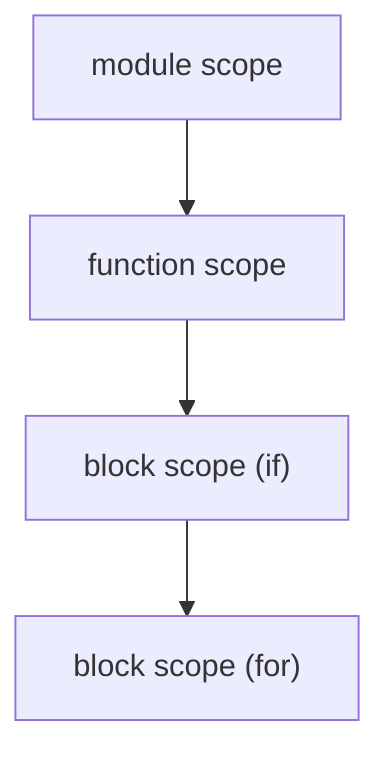

# Compilers 101 (5/10): 심볼 테이블과 스코프

이 글은 Compilers 101 시리즈의 다섯 번째 글입니다.

함수 안의 `x`와 바깥의 `x`를 컴파일러가 어떻게 서로 다른 변수로 구분하는지 이해하면, 이름 해석이 결국 자료구조 설계 문제라는 사실이 선명해집니다.

## 먼저 던지는 질문

- 심볼 테이블은 정확히 무엇이며 왜 컴파일러의 핵심 자료구조일까요?
- 스코프는 스택이나 연결 딕셔너리로 어떻게 표현할 수 있을까요?
- shadowing과 lookup은 왜 자연스럽게 따라올까요?

## 큰 그림


*Compilers 101 5장 흐름 개요*

## 왜 중요한가

이전 글에서는 환경을 단일 딕셔너리로 표현했습니다. 하지만 실제 언어에는 함수, 블록, 클래스, 모듈처럼 여러 스코프가 존재합니다. 결국 스코프를 어떻게 설계하느냐가 그 언어의 가시성 규칙을 결정합니다.

> “이 변수가 여기서 보이는가?”라는 질문에 한 번에 답할 수 있어야 합니다.

## 핵심 개념 한눈에 보기



스코프는 트리이자 스택입니다. lookup은 안쪽에서 바깥쪽으로 진행됩니다.

## 핵심 용어

- **심볼(Symbol)**: 선언 엔트리입니다. 보통 `(name, kind, type, location)`을 갖습니다.
- **스코프(Scope)**: 같은 가시성 규칙을 공유하는 심볼 집합입니다.
- **shadowing**: 안쪽 스코프의 이름이 바깥 스코프의 같은 이름을 가리는 현상입니다.
- **lookup**: 안쪽에서 바깥으로 걸어 올라가며 처음 맞는 선언을 찾는 과정입니다.
- **forward declaration**: 선언이 사용보다 뒤에 나오는 경우입니다.

## 변경 전후

**Before — 평평한 딕셔너리**

```python
env = {"x": "int"}  # cannot express x inside a function
```

**After — 연결된 딕셔너리**

```python
class Scope:
    def __init__(self, parent=None):
        self.parent, self.table = parent, {}
```

부모 포인터 하나만으로 함수, 블록, 모듈을 같은 자료구조 안에 넣을 수 있습니다.

## 실습: 심볼 테이블을 단계별로 만들기

### 1단계 — 가장 단순한 Scope

```python
# 1_scope.py
class Scope:
    def __init__(self, parent=None):
        self.parent, self.table = parent, {}
    def define(self, name, sym):
        if name in self.table:
            raise SyntaxError(f"redeclared: {name}")
        self.table[name] = sym
    def resolve(self, name):
        if name in self.table: return self.table[name]
        if self.parent: return self.parent.resolve(name)
        return None

g = Scope(); g.define("x", "int")
f = Scope(g); print(f.resolve("x"))  # int
```

단 하나의 `parent` 포인터가 중첩 lookup을 자동으로 만들어 줍니다.

### 2단계 — shadowing

```python
# 2_shadow.py
g = Scope(); g.define("x", "int(global)")
f = Scope(g); f.define("x", "int(local)")
print(f.resolve("x"))   # int(local) — inner hides outer
print(g.resolve("x"))   # int(global)
```

안쪽 스코프에서 같은 이름을 다시 정의하면 자동으로 바깥쪽을 가립니다. 이것이 shadowing입니다.

### 3단계 — 스코프 스택 운영하기

```python
# 3_stack.py
class Analyzer:
    def __init__(self):
        self.scopes = [Scope()]
    def enter(self): self.scopes.append(Scope(self.scopes[-1]))
    def exit(self): self.scopes.pop()
    def current(self): return self.scopes[-1]

a = Analyzer()
a.current().define("x", "int")
a.enter()
a.current().define("y", "int")
print(a.current().resolve("x"))  # int (found in outer scope)
a.exit()
```

`enter / exit`가 블록 진입과 종료를 표현합니다. AST를 걷는 동안 이 균형이 반드시 맞아야 합니다.

### 4단계 — 함수 스코프

```python
# 4_function.py
def visit(stmt, analyzer):
    kind, name = stmt
    if kind == "LET":
        analyzer.current().define(name, "local")

def visit_function(name, params, body, analyzer):
    analyzer.current().define(name, "fn")
    analyzer.enter()
    try:
        for p in params:
            analyzer.current().define(p, "param")
        for stmt in body:
            visit(stmt, analyzer)
        print(analyzer.current().resolve("arg"))  # param
        print(analyzer.current().resolve("tmp"))  # local
    finally:
        analyzer.exit()

a = Analyzer()
visit_function("add_one", ["arg"], [("LET", "tmp")], a)
print(a.current().resolve("add_one"))  # fn
print(a.current().resolve("tmp"))      # None
```

함수에 들어가면 새 스코프를 만들고, 매개변수를 넣고, 본문을 분석한 뒤 닫습니다. 위 예제는 `visit(...)`와 `body`까지 포함하므로, 함수 내부의 `arg`와 `tmp`는 보이지만 함수가 끝난 뒤 `tmp`는 사라진다는 점을 그대로 확인할 수 있습니다.

### 5단계 — go-to-definition을 위한 위치 저장

```python
# 5_goto.py
class Symbol:
    def __init__(self, name, kind, ty, line, col):
        self.name, self.kind, self.ty = name, kind, ty
        self.line, self.col = line, col

def goto(scope, name):
    s = scope.resolve(name)
    return f"{s.name} at line {s.line}, col {s.col}" if s else "not found"
```

선언 위치를 심볼에 저장해 두면, IDE의 go-to-definition은 사실상 평범한 lookup이 됩니다.

## 이 코드에서 먼저 봐야 할 점

- 핵심 자료구조는 부모 포인터를 가진 Scope 하나입니다.
- shadowing은 별도 예외 규칙이 아니라 lookup 알고리즘의 자연스러운 결과입니다.
- 함수, 블록, 모듈은 모두 같은 자료구조 형태로 표현됩니다.
- IDE 기능 대부분은 심볼 테이블 위에서 나옵니다.

## 자주 하는 실수 다섯 가지

1. **스코프를 딕셔너리 하나로 끝내려는 것**입니다. 함수 안의 변수와 바깥 변수를 구분할 수 없습니다.
2. **`enter / exit` 호출 균형을 맞추지 않는 것**입니다. 스코프가 새어 나갑니다.
3. **모든 스코프를 검사해 shadowing 자체를 금지하려는 것**입니다. 많은 언어에서 shadowing은 기능입니다.
4. **forward declaration을 고려하지 않는 것**입니다. 함수 안에서 아래쪽 함수를 호출하는 코드가 깨질 수 있습니다.
5. **심볼에 위치 정보를 저장하지 않는 것**입니다. 나중에 go-to-definition을 붙일 수 없습니다.

## 실무에서는 이렇게 나타납니다

LSP 서버의 중심 자료구조가 바로 심볼 테이블입니다. “모든 참조 찾기”는 스코프를 따라 사용 지점을 모으는 일이고, “이름 바꾸기”는 같은 심볼을 가리키는 모든 사용 지점을 함께 다시 쓰는 일입니다. 결국 IDE의 많은 기능은 심볼 테이블 모델 위에 쌓입니다.

## 숙련된 엔지니어는 이렇게 봅니다

- 새 언어 기능을 보면 먼저 “이것은 어느 스코프에 들어가는가?”를 묻습니다.
- shadowing을 허용할지 경고할지 언어 차원에서 결정합니다.
- 심볼에 위치, 가시성, 사용 횟수 같은 메타데이터를 저장합니다.
- 선언 수집과 사용 분석을 나누는 2패스 접근을 기본으로 생각합니다.
- 심볼 테이블이 곧 IDE의 데이터 모델이라는 점을 압니다.

## 체크리스트

- [ ] Scope가 부모 포인터를 가진 딕셔너리라는 설명을 이해했습니까?
- [ ] shadowing이 lookup 규칙의 자연스러운 결과라는 점을 설명할 수 있습니까?
- [ ] 함수 스코프와 블록 스코프를 같은 자료구조로 표현할 수 있습니까?
- [ ] go-to-definition이 결국 lookup이라는 점이 보입니까?
- [ ] 심볼 테이블을 2패스로 채우는 이유를 말할 수 있습니까?

## 연습 문제

1. 특정 스코프에 정의된 모든 심볼을 나열하는 메서드를 Scope에 추가해 보세요.
2. shadowing이 발생하면 경고를 내는 옵션을 추가해 보세요.
3. forward declaration을 지원하기 위해 선언 수집과 사용 분석을 분리한 2패스 의사코드를 작성해 보세요.

## 정리와 다음 글

심볼 테이블은 컴파일러가 “이 이름은 무엇인가?”에 답하기 위해 유지하는 메모리입니다. 다음 글에서는 분석이 끝난 AST를 더 단순한 내부 언어로 바꾸는 단계, intermediate representation을 다룹니다.

## 확장 실습: 프런트엔드부터 LLVM IR 직전까지 한 번에 검증하기

이 시점부터는 단계별 조각 실습을 넘어, 한 입력이 토큰, AST, 타입 정보, IR, 최적화 결과, 코드 생성 결과로 어떻게 이어지는지 한 번에 추적하는 연습이 필요합니다. 핵심은 코드 길이가 아니라 **변환 경계가 보이는 출력**을 남기는 것입니다. 아래 예시는 시리즈 전체를 관통하는 최소 골격입니다.

### 문법 고정: BNF 표기 먼저 확정하기

문법이 흔들리면 파서와 의미 분석 경계도 함께 흔들립니다. 구현 전에 BNF를 먼저 잠그면 우선순위, 결합성, 허용 구문을 팀 단위로 공유할 수 있습니다.

```bnf
<program> ::= <stmt_list>
<stmt_list> ::= <stmt> | <stmt> <stmt_list>
<stmt> ::= "let" <ident> "=" <expr> ";" | "print" <expr> ";"
<expr> ::= <term> | <expr> "+" <term> | <expr> "-" <term>
<term> ::= <factor> | <term> "*" <factor> | <term> "/" <factor>
<factor> ::= <number> | <ident> | "(" <expr> ")"
```

### 렉서 출력 고정: 토큰과 위치 정보를 함께 기록하기

```python
from dataclasses import dataclass
import re

@dataclass
class Token:
    kind: str
    text: str
    line: int
    col: int

SPEC = [
    ("KW", r"\b(let|print)\b"),
    ("IDENT", r"[A-Za-z_][A-Za-z0-9_]*"),
    ("NUMBER", r"\d+"),
    ("OP", r"[+\-*/=]"),
    ("LPAREN", r"\("),
    ("RPAREN", r"\)"),
    ("SEMI", r";"),
    ("WS", r"[ \t\n]+"),
]

def lex(src: str) -> list[Token]:
    out: list[Token] = []
    i, line, col = 0, 1, 1
    while i < len(src):
        for kind, pat in SPEC:
            m = re.match(pat, src[i:])
            if not m:
                continue
            text = m.group(0)
            if kind != "WS":
                out.append(Token(kind, text, line, col))
            for ch in text:
                if ch == "
":
                    line += 1
                    col = 1
                else:
                    col += 1
            i += len(text)
            break
        else:
            raise SyntaxError(f"unexpected character {src[i]!r} at {line}:{col}")
    return out
```

이 출력은 이후 단계에서 오류 메시지 기준 좌표가 됩니다. line/col 정보가 없으면 파서와 의미 분석 품질을 끝까지 올리기 어렵습니다.

### AST 노드 정의: 구조를 명시적으로 분리하기

```python
from dataclasses import dataclass

@dataclass
class Number:
    value: int

@dataclass
class Identifier:
    name: str

@dataclass
class Binary:
    op: str
    left: object
    right: object

@dataclass
class LetStmt:
    name: str
    expr: object

@dataclass
class PrintStmt:
    expr: object
```

여기서 중요한 점은 문법 요소와 실행 요소를 섞지 않는 것입니다. AST는 실행기가 아니라 구조 표현이어야 하며, 해석/타입/코드 생성은 별도 단계로 분리하는 편이 장기적으로 안정적입니다.

### 의미 분석 골격: 선언, 참조, 타입을 한 번에 점검하기

```python
class Scope:
    def __init__(self, parent=None):
        self.parent = parent
        self.table: dict[str, str] = {}

    def define(self, name: str, ty: str):
        if name in self.table:
            raise TypeError(f"redeclared variable: {name}")
        self.table[name] = ty

    def resolve(self, name: str) -> str:
        if name in self.table:
            return self.table[name]
        if self.parent:
            return self.parent.resolve(name)
        raise NameError(f"undefined variable: {name}")

def type_of_expr(node, scope: Scope) -> str:
    if isinstance(node, Number):
        return "int"
    if isinstance(node, Identifier):
        return scope.resolve(node.name)
    if isinstance(node, Binary):
        lt = type_of_expr(node.left, scope)
        rt = type_of_expr(node.right, scope)
        if lt != "int" or rt != "int":
            raise TypeError(f"binary op expects int/int, got {lt}/{rt}")
        return "int"
    raise TypeError(f"unknown node: {node}")
```

시맨틱 단계에서 타입과 이름 해석을 확정하면, 뒤 단계(IR/최적화/코드 생성)는 오류 복구 부담을 크게 줄일 수 있습니다.

### IR 생성과 최적화 패스: 변환 파이프라인 분리하기

```python
def lower_expr(node, out, new_temp):
    if isinstance(node, Number):
        t = new_temp()
        out.append(("const", t, node.value))
        return t
    if isinstance(node, Identifier):
        t = new_temp()
        out.append(("load", t, node.name))
        return t
    if isinstance(node, Binary):
        l = lower_expr(node.left, out, new_temp)
        r = lower_expr(node.right, out, new_temp)
        t = new_temp()
        out.append((node.op, t, l, r))
        return t
    raise RuntimeError("unsupported node")

def constant_folding(ir):
    const = {}
    out = []
    for inst in ir:
        if inst[0] == "const":
            const[inst[1]] = inst[2]
            out.append(inst)
            continue
        if inst[0] in {"+", "-", "*", "/"} and inst[2] in const and inst[3] in const:
            a, b = const[inst[2]], const[inst[3]]
            v = {"+": a+b, "-": a-b, "*": a*b, "/": a//b}[inst[0]]
            const[inst[1]] = v
            out.append(("const", inst[1], v))
        else:
            out.append(inst)
    return out
```

`IR -> 최적화 패스 -> IR` 형태를 유지하면 패스를 안전하게 합성할 수 있고, 결과 비교 테스트도 단순해집니다.

### 코드 생성 스니펫: 단순 스택 머신 또는 어셈블리로 내리기

```python
def emit_stack_vm(ir):
    out = []
    for inst in ir:
        op = inst[0]
        if op == "const":
            out.append(f"PUSH {inst[2]}")
        elif op == "load":
            out.append(f"LOAD {inst[2]}")
        elif op == "+":
            out.append("ADD")
        elif op == "-":
            out.append("SUB")
        elif op == "*":
            out.append("MUL")
        elif op == "/":
            out.append("DIV")
    out.append("HALT")
    return out
```

이 수준의 생성기만 있어도 파서/의미 분석/최적화의 결과가 실제 실행 지시어로 어떻게 바뀌는지 빠르게 검증할 수 있습니다.

### LLVM IR 샘플 읽기: SSA 감각 익히기

```llvm
; 입력 소스의 개념: let x = 2 * 3; print x + 1;
define i32 @main() {
entry:
  %x = mul i32 2, 3
  %y = add i32 %x, 1
  ret i32 %y
}
```

SSA에서 `%x`, `%y`처럼 버전이 분리되면 데이터 흐름 분석과 레지스터 할당 전 단계가 단순해집니다. 시리즈 후반 주제(최적화, 코드 생성, JIT/AOT)를 이해할 때 이 표현이 공통 언어가 됩니다.

### 검증 기준: 단계별 스냅샷을 항상 남기기

실전에서는 정답 코드보다 검증 루틴이 먼저입니다. 최소한 다음 다섯 가지를 파일로 남기면 회귀를 추적하기 쉽습니다.

1. 토큰 덤프 (`tokens.json`)
2. AST 덤프 (`ast.json`)
3. 시맨틱 결과 (`symbols.json`, 타입 오류 목록)
4. 최적화 전후 IR (`ir_before.txt`, `ir_after.txt`)
5. 최종 코드 생성 결과 (`out.asm` 또는 `out.vm`)

이렇게 하면 “어디서 깨졌는지”가 즉시 분리되고, 팀 협업에서도 디버깅 비용이 크게 줄어듭니다.


### 단계별 실패 시나리오와 복구 전략

실제 프로젝트에서는 정답 입력보다 실패 입력이 더 많이 들어옵니다. 따라서 각 단계가 실패했을 때 **다음 단계로 무엇을 전달할지**를 먼저 정해야 합니다. 다음 표는 최소 운영 기준입니다.

| 단계 | 실패 예시 | 즉시 조치 | 다음 단계 전달 |
| --- | --- | --- | --- |
| 렉서 | 알 수 없는 문자 | 위치 포함 오류 생성 | 복구 가능한 토큰만 전달 |
| 파서 | 괄호 누락, 세미콜론 누락 | 동기화 토큰 기준으로 재시작 | 부분 AST와 오류 목록 전달 |
| 시맨틱 | 미선언 변수, 타입 불일치 | 심볼/타입 오류 축적 | 오류 수가 기준치 이하면 IR 생성 계속 |
| IR 생성 | 미지원 구문 | 노드 단위 경고와 스킵 | 분석 가능한 블록만 전달 |
| 최적화 | 패스 전제 위반 | 패스 비활성화 후 원본 IR 유지 | 코드 생성은 계속 |
| 코드 생성 | 레지스터 부족 | spill 강제, 속도 저하 허용 | 실행 가능한 바이너리 우선 |

이 기준은 "완벽한 컴파일"보다 "재현 가능한 컴파일"에 가깝습니다. 품질이 높은 컴파일러는 한 번에 많은 오류를 보여 주되, 어디까지 복구했는지 명확히 보고합니다.

### 테스트 입력 세트: 경계 조건을 먼저 고정하기

아래 입력 세트는 단계별 회귀를 빠르게 잡는 최소 묶음입니다.

```text
# 정상
let x = 2 + 3 * 4;
print x;

# 문법 오류
let x = (2 + 3;

# 의미 오류
print y;

# 최적화 검증
let z = 1 + 2 + 3 + 4;
print z;
```

각 입력에 대해 토큰, AST, 시맨틱 결과, IR, 최종 코드를 별도 파일로 남기면 변경 전후 차이를 기계적으로 비교할 수 있습니다.

### 간단한 골든 출력 비교 스크립트

```python
import json
from pathlib import Path

def save_snapshot(name: str, payload):
    out_dir = Path("artifacts")
    out_dir.mkdir(exist_ok=True)
    p = out_dir / f"{name}.json"
    p.write_text(json.dumps(payload, ensure_ascii=False, indent=2))

# 예시 사용
save_snapshot("tokens_case1", [{"kind": "NUMBER", "text": "2", "line": 1, "col": 1}])
save_snapshot("ast_case1", {"kind": "Binary", "op": "+"})
```

스냅샷 파일을 Git에 남기면 리팩터링 이후에도 파이프라인의 의미가 바뀌었는지 즉시 검출할 수 있습니다.

### 최적화 패스 예시: 상수 전파와 불필요 대입 제거

```python
def constant_propagation(ir):
    env = {}
    out = []
    for inst in ir:
        op = inst[0]
        if op == "const":
            env[inst[1]] = inst[2]
            out.append(inst)
        elif op in {"+", "-", "*", "/"}:
            a = env.get(inst[2], inst[2])
            b = env.get(inst[3], inst[3])
            if isinstance(a, int) and isinstance(b, int):
                v = {"+": a+b, "-": a-b, "*": a*b, "/": a//b}[op]
                env[inst[1]] = v
                out.append(("const", inst[1], v))
            else:
                out.append((op, inst[1], a, b))
        else:
            out.append(inst)
    return out

def remove_trivial_moves(ir):
    return [inst for inst in ir if not (inst[0] == "mov" and inst[1] == inst[2])]
```

최적화는 큰 패스 하나보다 작은 패스 여러 개가 유지보수에 유리합니다. 실패하면 해당 패스만 끄고 원본 IR로 복구할 수 있기 때문입니다.

### 코드 생성 검증: 간단한 레지스터 할당 로그 남기기

```python
REGS = ["r1", "r2", "r3"]

def assign_registers(temporaries):
    mapping = {}
    spill = []
    for t in temporaries:
        if len(mapping) < len(REGS):
            mapping[t] = REGS[len(mapping)]
        else:
            spill.append(t)
    return mapping, spill

m, s = assign_registers(["t1", "t2", "t3", "t4", "t5"])
print("reg-map", m)
print("spill ", s)
```

이 정도 로그만 있어도 특정 입력에서 왜 성능이 급락했는지 원인을 좁히기 쉽습니다. 특히 spill 급증은 코드 생성 병목의 대표 신호입니다.

### LLVM IR 비교 기준: 변경 전후를 줄 단위로 확인하기

```llvm
; before optimization
%t1 = mul i32 3, 4
%t2 = add i32 2, %t1
ret i32 %t2

; after optimization
ret i32 14
```

최적화가 의미를 보존하는지 검증할 때는 사람이 읽는 설명보다 IR diff가 더 신뢰할 수 있습니다. 동일 입력에서 `ret i32 14`로 바뀌면 folding이 실제로 적용되었음을 바로 확인할 수 있습니다.

### 팀 운영 체크포인트

1. 파서 변경 PR에는 반드시 BNF 변경 diff를 포함합니다.
2. 시맨틱 규칙 변경 PR에는 실패 사례 3개 이상을 테스트에 추가합니다.
3. 최적화 패스 추가 PR에는 비활성화 플래그를 함께 제공합니다.
4. 코드 생성 변경 PR에는 최소 두 아키텍처 이상의 스냅샷을 첨부합니다.
5. 릴리스 전에는 동일 입력에 대해 인터프리터 결과와 컴파일 결과를 교차 검증합니다.

이 체크포인트를 유지하면 기능 추가 속도보다 품질 일관성을 더 안정적으로 가져갈 수 있습니다.


### 마무리 점검: 단계 경계를 말로 설명해 보기

마지막으로, 구현을 잠시 멈추고 다음 질문에 답해 보기를 권합니다. 이 질문은 코드량이 아니라 이해도를 검증합니다.

- 렉서가 실패했을 때 파서가 받는 입력은 무엇입니까?
- 파서가 복구한 부분 AST를 시맨틱 단계에서 어디까지 신뢰합니까?
- 시맨틱 오류가 있어도 IR 생성을 계속할 조건은 무엇입니까?
- 최적화 패스를 껐을 때도 결과의 의미가 유지되는지 어떻게 확인합니까?
- 코드 생성 이후 실행 결과를 어떤 기준값과 비교합니까?

이 다섯 질문에 팀이 같은 답을 할 수 있으면, 파이프라인 확장 시 품질이 급격히 흔들릴 가능성이 크게 줄어듭니다. 반대로 답이 제각각이면, 새로운 문법이나 최적화 패스를 추가할 때 같은 종류의 회귀가 반복됩니다.

실무에서는 기능 추가보다 경계 합의가 먼저입니다. 경계를 합의한 다음 기능을 추가하면, 동일한 투자로 더 안정적인 컴파일러를 만들 수 있습니다.

## 처음 질문으로 돌아가기

- **심볼 테이블은 정확히 무엇이며 왜 컴파일러의 핵심 자료구조일까요?**
  - 본문의 기준은 심볼 테이블과 스코프를 한 덩어리 개념으로 보지 않고 입력, 처리, 검증, 운영 신호가 만나는 경계로 나누어 확인하는 것입니다.
- **스코프는 스택이나 연결 딕셔너리로 어떻게 표현할 수 있을까요?**
  - 예제와 그림에서는 어떤 값이 들어오고, 어느 단계에서 바뀌며, 어떤 기준으로 통과 또는 실패하는지를 먼저 확인해야 합니다.
- **shadowing과 lookup은 왜 자연스럽게 따라올까요?**
  - 운영에서는 이 판단을 체크리스트, 로그, 테스트로 남겨 다음 변경에서도 같은 실패가 반복되지 않게 막아야 합니다.

<!-- toc:begin -->
## 시리즈 목차

- [Compilers 101 (1/10): 컴파일러란 무엇인가?](./01-what-is-a-compiler.md)
- [Compilers 101 (2/10): 렉시컬 분석](./02-lexical-analysis.md)
- [Compilers 101 (3/10): 파싱과 AST](./03-parsing-and-ast.md)
- [Compilers 101 (4/10): 시맨틱 분석](./04-semantic-analysis.md)
- **심볼 테이블과 스코프 (현재 글)**
- 중간 표현 (예정)
- 최적화 기초 (예정)
- 코드 생성 (예정)
- JIT vs AOT (예정)
- 작은 인터프리터 만들기 (예정)

<!-- toc:end -->

## 참고 자료

- Alfred V. Aho, Monica S. Lam, Ravi Sethi, Jeffrey D. Ullman, *Compilers: Principles, Techniques, and Tools* (2nd ed.), Section 2.7 “Symbol Tables”.
- [Shriram Krishnamurthi, *Programming Languages: Application and Interpretation* (3rd ed.)](https://www.plai.org/) — 환경 모델과 정적 스코프 설명.
- [Robert Nystrom, *Crafting Interpreters* — Chapter 11 “Resolving and Binding”](https://craftinginterpreters.com/resolving-and-binding.html)
- Keith D. Cooper, Linda Torczon, *Engineering a Compiler* (2nd ed.), name analysis and semantic environment chapters.

- [이 시리즈 예제 코드 (book-examples)](https://github.com/yeongseon-books/book-examples/tree/main/compilers-101/ko)

Tags: Computer Science, Compilers, SymbolTable, Scope, Lookup
