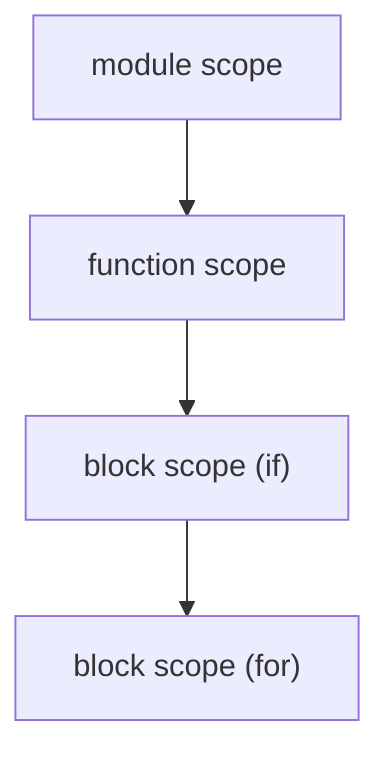

# symbol table과 scope

> Compilers 101 시리즈 (5/10)


## 이 글에서 다룰 문제

이전 글의 semantic analyzer는 환경(Env)을 dictionary 한 개로 표현했습니다. 실제 언어에는 함수, 블록, 클래스, 모듈 같은 여러 scope가 있습니다. symbol table을 어떻게 설계하느냐가 곧 언어의 가시성 규칙(visibility rule)입니다.

> "이 변수가 여기서 보이는가?"라는 질문에 한 번에 답할 수 있어야 합니다.

## 전체 흐름


scope는 트리(또는 stack) 구조입니다. 안쪽에서 바깥쪽으로 lookup이 진행됩니다.

## Before/After

**Before — flat dictionary**

```python
env = {"x": "int"}  # 함수 안의 x를 표현할 수 없다
```

**After — chained dictionary**

```python
class Scope:
    def __init__(self, parent=None):
        self.parent, self.table = parent, {}
```

부모 포인터 한 개로 함수, 블록, 모듈 모두 같은 자료구조에 들어옵니다.

## symbol table을 단계별로

### 1단계 — 가장 단순한 Scope

```python
# 예제 파일: 1_scope.py
class Scope:
    def __init__(self, parent=None):
        self.parent, self.table = parent, {}
    def define(self, name, sym):
        if name in self.table:
            raise SyntaxError(f"redeclared: {name}")
        self.table[name] = sym
    def resolve(self, name):
        if name in self.table: return self.table[name]
        if self.parent: return self.parent.resolve(name)
        return None

g = Scope(); g.define("x", "int")
f = Scope(g); print(f.resolve("x"))  # int
```

`parent` 포인터 하나로 nested lookup이 자동으로 됩니다.

### 2단계 — shadowing

```python
# 예제 파일: 2_shadow.py
g = Scope(); g.define("x", "int(global)")
f = Scope(g); f.define("x", "int(local)")
print(f.resolve("x"))   # int(local) — 안쪽이 가린다
print(g.resolve("x"))   # int(global)
```

같은 이름을 안쪽에서 다시 선언하면 자동으로 가립니다. 이게 shadowing입니다.

### 3단계 — scope stack 운영

```python
# 예제 파일: 3_stack.py
class Analyzer:
    def __init__(self):
        self.scopes = [Scope()]
    def enter(self): self.scopes.append(Scope(self.scopes[-1]))
    def exit(self): self.scopes.pop()
    def current(self): return self.scopes[-1]

a = Analyzer()
a.current().define("x", "int")
a.enter()
a.current().define("y", "int")
print(a.current().resolve("x"))  # int (바깥 scope에서 찾음)
a.exit()
```

`enter/exit`로 블록 진입/탈출을 표현합니다. AST를 순회하면서 호출되어야 합니다.

### 4단계 — 함수 scope

```python
# 예제 파일: 4_function.py
def visit_function(name, params, body, analyzer):
    analyzer.current().define(name, "fn")
    analyzer.enter()
    for p in params:
        analyzer.current().define(p, "param")
    for stmt in body:
        visit(stmt, analyzer)
    analyzer.exit()
```

함수 진입에서 새 scope를 만들고, 매개변수를 그 scope에 넣고, body를 분석합니다. 함수가 끝나면 scope를 닫습니다.

### 5단계 — go-to-definition을 위한 위치 저장

```python
# 예제 파일: 5_goto.py
class Symbol:
    def __init__(self, name, kind, ty, line, col):
        self.name, self.kind, self.ty = name, kind, ty
        self.line, self.col = line, col

def goto(scope, name):
    s = scope.resolve(name)
    return f"{s.name} at line {s.line}, col {s.col}" if s else "not found"
```

선언 위치를 symbol에 같이 저장해 두면 IDE의 go-to-definition이 단순한 lookup이 됩니다.

## 이 코드에서 주목할 점

- 핵심 자료구조는 단 하나, 부모 포인터를 가진 scope입니다.
- shadowing은 lookup 알고리즘의 자연스러운 결과입니다.
- 함수/블록/모듈은 모두 같은 모양으로 표현됩니다.
- IDE 기능은 symbol table에서 90%가 나옵니다.

## 자주 하는 실수 5가지

1. **scope를 dictionary 하나로 끝내려고 한다.** 함수 안의 변수를 표현할 수 없습니다.
2. **enter/exit를 짝 안 맞게 호출한다.** scope가 새기 시작합니다.
3. **shadowing을 막으려고 모든 scope를 검사한다.** shadowing은 기능이지 버그가 아닙니다 (대부분의 언어에서).
4. **forward declaration을 고려하지 않아 함수 안 함수 호출이 깨진다.** 두 패스로 나눠야 합니다.
5. **symbol에 위치 정보를 안 저장한다.** go-to-definition을 나중에 추가할 수 없습니다.

## 실무에서는 이렇게 쓰입니다

LSP 서버의 핵심 자료구조가 바로 symbol table입니다. "Find all references"는 모든 scope를 거꾸로 훑는 것이고, "Rename symbol"은 같은 symbol을 가리키는 모든 사용처를 한 번에 바꾸는 것입니다. 이 모두가 symbol table 위에 얹힙니다.

## 체크리스트

- [ ] Scope가 부모 포인터를 가진 dictionary임을 받아들였는가?
- [ ] shadowing이 lookup 규칙의 자연스러운 결과임을 설명할 수 있는가?
- [ ] 함수와 블록 scope를 같은 자료구조로 표현할 수 있는가?
- [ ] go-to-definition이 lookup임을 알겠는가?
- [ ] symbol table을 두 패스로 채울 이유를 댈 수 있는가?

## 정리 및 다음 단계

Symbol table은 컴파일러가 "이 이름은 무엇인가"를 답하는 메모리입니다. 다음 글에서는 분석이 끝난 AST를 더 단순한 형태로 바꾸는 — intermediate representation — 단계를 살펴봅니다.

<!-- toc:begin -->
- [컴파일러란 무엇인가?](./01-what-is-a-compiler.md)
- [lexical analysis](./02-lexical-analysis.md)
- [parsing과 AST](./03-parsing-and-ast.md)
- [semantic analysis](./04-semantic-analysis.md)
- **symbol table과 scope (현재 글)**
- intermediate representation (예정)
- optimization 기초 (예정)
- code generation (예정)
- JIT vs AOT (예정)
- 작은 인터프리터 만들어 보기 (예정)
<!-- toc:end -->

## 참고 자료

- [Symbol table (Wikipedia)](https://en.wikipedia.org/wiki/Symbol_table)
- [Scope (Wikipedia)](https://en.wikipedia.org/wiki/Scope_(computer_science))
- [Crafting Interpreters — Resolving and Binding](https://craftinginterpreters.com/resolving-and-binding.html)
- [LSP — Symbol Information](https://microsoft.github.io/language-server-protocol/specifications/lsp/3.17/specification/#textDocument_documentSymbol)

Tags: Computer Science, Compilers, SymbolTable, Scope, Lookup
