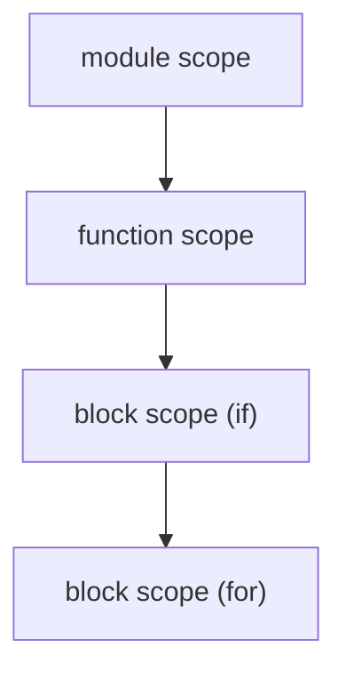

# Compilers 101 (5/10): 심볼 테이블과 스코프

이 글은 Compilers 101 시리즈의 다섯 번째 글입니다. 함수 안의 `x`와 바깥의 `x`를 컴파일러가 어떻게 서로 다른 변수로 구분하는지 이해하면, 이름 해석이 결국 자료구조 설계 문제라는 사실이 선명해집니다.

## 먼저 던지는 질문

- 심볼 테이블은 정확히 무엇이며 왜 컴파일러의 핵심 자료구조일까요?
- 스코프는 스택이나 연결 딕셔너리로 어떻게 표현할 수 있을까요?
- shadowing과 lookup은 왜 자연스럽게 따라올까요?

## 큰 그림


*Compilers 101 5장 흐름 개요*

## 왜 중요한가

이전 글에서는 환경을 단일 딕셔너리로 표현했습니다. 하지만 실제 언어에는 함수, 블록, 클래스, 모듈처럼 여러 스코프가 존재합니다. 결국 스코프를 어떻게 설계하느냐가 그 언어의 가시성 규칙을 결정합니다.

> “이 변수가 여기서 보이는가?”라는 질문에 한 번에 답할 수 있어야 합니다.

## 핵심 개념 한눈에 보기



스코프는 트리이자 스택입니다. lookup은 안쪽에서 바깥쪽으로 진행됩니다.

## 핵심 용어

- **심볼(Symbol)**: 선언 엔트리입니다. 보통 `(name, kind, type, location)`을 갖습니다.
- **스코프(Scope)**: 같은 가시성 규칙을 공유하는 심볼 집합입니다.
- **shadowing**: 안쪽 스코프의 이름이 바깥 스코프의 같은 이름을 가리는 현상입니다.
- **lookup**: 안쪽에서 바깥으로 걸어 올라가며 처음 맞는 선언을 찾는 과정입니다.
- **forward declaration**: 선언이 사용보다 뒤에 나오는 경우입니다.

## Before / After

**Before — 평평한 딕셔너리**

```python
env = {"x": "int"}  # cannot express x inside a function
```

**After — 연결된 딕셔너리**

```python
class Scope:
    def __init__(self, parent=None):
        self.parent, self.table = parent, {}
```

부모 포인터 하나만으로 함수, 블록, 모듈을 같은 자료구조 안에 넣을 수 있습니다.

## 실습: 심볼 테이블을 단계별로 만들기

### 1단계 — 가장 단순한 Scope

```python
# 1_scope.py
class Scope:
    def __init__(self, parent=None):
        self.parent, self.table = parent, {}
    def define(self, name, sym):
        if name in self.table:
            raise SyntaxError(f"redeclared: {name}")
        self.table[name] = sym
    def resolve(self, name):
        if name in self.table: return self.table[name]
        if self.parent: return self.parent.resolve(name)
        return None

g = Scope(); g.define("x", "int")
f = Scope(g); print(f.resolve("x"))  # int
```

단 하나의 `parent` 포인터가 중첩 lookup을 자동으로 만들어 줍니다.

### 2단계 — shadowing

```python
# 2_shadow.py
g = Scope(); g.define("x", "int(global)")
f = Scope(g); f.define("x", "int(local)")
print(f.resolve("x"))   # int(local) — inner hides outer
print(g.resolve("x"))   # int(global)
```

안쪽 스코프에서 같은 이름을 다시 정의하면 자동으로 바깥쪽을 가립니다. 이것이 shadowing입니다.

### 3단계 — 스코프 스택 운영하기

```python
# 3_stack.py
class Analyzer:
    def __init__(self):
        self.scopes = [Scope()]
    def enter(self): self.scopes.append(Scope(self.scopes[-1]))
    def exit(self): self.scopes.pop()
    def current(self): return self.scopes[-1]

a = Analyzer()
a.current().define("x", "int")
a.enter()
a.current().define("y", "int")
print(a.current().resolve("x"))  # int (found in outer scope)
a.exit()
```

`enter / exit`가 블록 진입과 종료를 표현합니다. AST를 걷는 동안 이 균형이 반드시 맞아야 합니다.

### 4단계 — 함수 스코프

```python
# 4_function.py
def visit(stmt, analyzer):
    kind, name = stmt
    if kind == "LET":
        analyzer.current().define(name, "local")

def visit_function(name, params, body, analyzer):
    analyzer.current().define(name, "fn")
    analyzer.enter()
    try:
        for p in params:
            analyzer.current().define(p, "param")
        for stmt in body:
            visit(stmt, analyzer)
        print(analyzer.current().resolve("arg"))  # param
        print(analyzer.current().resolve("tmp"))  # local
    finally:
        analyzer.exit()

a = Analyzer()
visit_function("add_one", ["arg"], [("LET", "tmp")], a)
print(a.current().resolve("add_one"))  # fn
print(a.current().resolve("tmp"))      # None
```

함수에 들어가면 새 스코프를 만들고, 매개변수를 넣고, 본문을 분석한 뒤 닫습니다. 위 예제는 `visit(...)`와 `body`까지 포함하므로, 함수 내부의 `arg`와 `tmp`는 보이지만 함수가 끝난 뒤 `tmp`는 사라진다는 점을 그대로 확인할 수 있습니다.

### 5단계 — go-to-definition을 위한 위치 저장

```python
# 5_goto.py
class Symbol:
    def __init__(self, name, kind, ty, line, col):
        self.name, self.kind, self.ty = name, kind, ty
        self.line, self.col = line, col

def goto(scope, name):
    s = scope.resolve(name)
    return f"{s.name} at line {s.line}, col {s.col}" if s else "not found"
```

선언 위치를 심볼에 저장해 두면, IDE의 go-to-definition은 사실상 평범한 lookup이 됩니다.

## 이 코드에서 먼저 봐야 할 점

- 핵심 자료구조는 부모 포인터를 가진 Scope 하나입니다.
- shadowing은 별도 예외 규칙이 아니라 lookup 알고리즘의 자연스러운 결과입니다.
- 함수, 블록, 모듈은 모두 같은 자료구조 형태로 표현됩니다.
- IDE 기능 대부분은 심볼 테이블 위에서 나옵니다.

## 자주 하는 실수 다섯 가지

1. **스코프를 딕셔너리 하나로 끝내려는 것**입니다. 함수 안의 변수와 바깥 변수를 구분할 수 없습니다.
2. **`enter / exit` 호출 균형을 맞추지 않는 것**입니다. 스코프가 새어 나갑니다.
3. **모든 스코프를 검사해 shadowing 자체를 금지하려는 것**입니다. 많은 언어에서 shadowing은 기능입니다.
4. **forward declaration을 고려하지 않는 것**입니다. 함수 안에서 아래쪽 함수를 호출하는 코드가 깨질 수 있습니다.
5. **심볼에 위치 정보를 저장하지 않는 것**입니다. 나중에 go-to-definition을 붙일 수 없습니다.

## 실무에서는 이렇게 나타납니다

LSP 서버의 중심 자료구조가 바로 심볼 테이블입니다. “모든 참조 찾기”는 스코프를 따라 사용 지점을 모으는 일이고, “이름 바꾸기”는 같은 심볼을 가리키는 모든 사용 지점을 함께 다시 쓰는 일입니다. 결국 IDE의 많은 기능은 심볼 테이블 모델 위에 쌓입니다.

## 숙련된 엔지니어는 이렇게 봅니다

- 새 언어 기능을 보면 먼저 “이것은 어느 스코프에 들어가는가?”를 묻습니다.
- shadowing을 허용할지 경고할지 언어 차원에서 결정합니다.
- 심볼에 위치, 가시성, 사용 횟수 같은 메타데이터를 저장합니다.
- 선언 수집과 사용 분석을 나누는 2패스 접근을 기본으로 생각합니다.
- 심볼 테이블이 곧 IDE의 데이터 모델이라는 점을 압니다.

## 체크리스트

- [ ] Scope가 부모 포인터를 가진 딕셔너리라는 설명을 이해했습니까?
- [ ] shadowing이 lookup 규칙의 자연스러운 결과라는 점을 설명할 수 있습니까?
- [ ] 함수 스코프와 블록 스코프를 같은 자료구조로 표현할 수 있습니까?
- [ ] go-to-definition이 결국 lookup이라는 점이 보입니까?
- [ ] 심볼 테이블을 2패스로 채우는 이유를 말할 수 있습니까?

## 연습 문제

1. 특정 스코프에 정의된 모든 심볼을 나열하는 메서드를 Scope에 추가해 보세요.
2. shadowing이 발생하면 경고를 내는 옵션을 추가해 보세요.
3. forward declaration을 지원하기 위해 선언 수집과 사용 분석을 분리한 2패스 의사코드를 작성해 보세요.

## 정리 및 다음 글

심볼 테이블은 컴파일러가 “이 이름은 무엇인가?”에 답하기 위해 유지하는 메모리입니다. 다음 글에서는 분석이 끝난 AST를 더 단순한 내부 언어로 바꾸는 단계, intermediate representation을 다룹니다.

## 심화 실습: Lexer · Parser · AST를 연결해 보는 기준

이 지점에서는 "각 단계가 왜 분리되어야 하는가"를 코드 단위로 확인하는 것이 중요합니다. 핵심은 정답 코드를 외우는 것이 아니라, 같은 입력이 단계별로 어떻게 다른 데이터 구조로 변환되는지 관찰하는 것입니다.

### EBNF로 문법을 먼저 고정하기

문법을 먼저 적어 두면 파서 구현이 훨씬 명확해집니다. 아래 예시는 사칙연산과 괄호를 포함한 최소 문법입니다.

```ebnf
expr    = term , { ("+" | "-") , term } ;
term    = factor , { ("*" | "/") , factor } ;
factor  = number | "(" , expr , ")" ;
number  = digit , { digit } ;
digit   = "0" | "1" | "2" | "3" | "4" | "5" | "6" | "7" | "8" | "9" ;
```

이 문법에서 `expr -> term -> factor`로 내려가는 구조가 바로 연산자 우선순위를 표현합니다. `+`와 `-`는 `expr` 레벨, `*`와 `/`는 `term` 레벨에 있으므로 `2 + 3 * 4`는 자연스럽게 `2 + (3 * 4)`로 해석됩니다.

### 토큰화에서 위치 정보를 끝까지 보존하기

실무 품질을 좌우하는 부분은 토큰의 `kind`보다 `line`, `column`, `offset`입니다. 오류 메시지 품질은 여기서 결정됩니다.

```python
from dataclasses import dataclass
import re

@dataclass
class Token:
    kind: str
    text: str
    line: int
    col: int

TOKEN_PATTERNS = [
    ("NUMBER", r"\d+"),
    ("PLUS", r"\+"),
    ("MINUS", r"-"),
    ("MUL", r"\*"),
    ("DIV", r"/"),
    ("LPAREN", r"\("),
    ("RPAREN", r"\)"),
    ("WS", r"\s+"),
]

def lex(src: str) -> list[Token]:
    i = 0
    line, col = 1, 1
    out: list[Token] = []
    while i < len(src):
        for kind, pat in TOKEN_PATTERNS:
            m = re.match(pat, src[i:])
            if not m:
                continue
            text = m.group(0)
            if kind != "WS":
                out.append(Token(kind, text, line, col))
            for ch in text:
                if ch == "\n":
                    line += 1
                    col = 1
                else:
                    col += 1
            i += len(text)
            break
        else:
            raise SyntaxError(f"unexpected character '{src[i]}' at {line}:{col}")
    return out
```

### AST를 명시적으로 설계하기

파싱이 끝났을 때 결과가 문자열이 아니라 트리여야 이후 단계가 단순해집니다.

```python
from dataclasses import dataclass

@dataclass
class Number:
    value: int

@dataclass
class Binary:
    op: str
    left: object
    right: object

# 예시 AST: 2 + 3 * 4
ast = Binary(
    op="+",
    left=Number(2),
    right=Binary(op="*", left=Number(3), right=Number(4)),
)
```

여기서 중요한 관찰은 동일한 AST를 여러 소비자가 사용할 수 있다는 점입니다.
- 의미 분석기: 타입/스코프 검사
- 인터프리터: 즉시 평가
- 코드 생성기: 바이트코드/기계어 방출

즉 파서는 "한 번만 정확히" 만들고, 나머지는 AST 위에서 독립적으로 발전시킬 수 있습니다.

### 재귀 하강 파서의 최소 골격

```python
class Parser:
    def __init__(self, tokens):
        self.tokens = tokens
        self.i = 0

    def peek(self):
        return self.tokens[self.i] if self.i < len(self.tokens) else None

    def eat(self, kind):
        tok = self.peek()
        if tok is None or tok.kind != kind:
            where = "EOF" if tok is None else f"{tok.line}:{tok.col}"
            raise SyntaxError(f"expected {kind} at {where}")
        self.i += 1
        return tok

    def parse_expr(self):
        node = self.parse_term()
        while self.peek() and self.peek().kind in ("PLUS", "MINUS"):
            op = self.eat(self.peek().kind).text
            rhs = self.parse_term()
            node = Binary(op, node, rhs)
        return node

    def parse_term(self):
        node = self.parse_factor()
        while self.peek() and self.peek().kind in ("MUL", "DIV"):
            op = self.eat(self.peek().kind).text
            rhs = self.parse_factor()
            node = Binary(op, node, rhs)
        return node

    def parse_factor(self):
        tok = self.peek()
        if tok.kind == "NUMBER":
            self.eat("NUMBER")
            return Number(int(tok.text))
        if tok.kind == "LPAREN":
            self.eat("LPAREN")
            node = self.parse_expr()
            self.eat("RPAREN")
            return node
        raise SyntaxError(f"unexpected token {tok.kind} at {tok.line}:{tok.col}")
```

### 디버깅 체크포인트

파이프라인을 운영할 때는 다음 세 지점을 항상 로그로 남겨야 합니다.
1. **Token stream**: 토큰 종류와 위치
2. **AST dump**: 중첩 구조와 연산자 결합 방향
3. **Type/Scope report**: 선언/참조 매칭 결과

세 지점이 분리되어 있으면 오류를 "문법 단계 문제"인지 "의미 단계 문제"인지 즉시 구분할 수 있습니다. 예를 들어 괄호 누락은 파서에서, 미선언 변수 참조는 의미 분석기에서 실패해야 정상입니다.

### 작은 입력으로 검증하는 습관

다음 세 입력을 고정 테스트로 유지하면 회귀를 빠르게 잡을 수 있습니다.
- `2 + 3 * 4` → 우선순위 검증
- `(2 + 3) * 4` → 괄호 우선 검증
- `2 + * 4` → 오류 위치와 메시지 품질 검증

이처럼 Lexer/Parser/AST를 분리한 뒤, 문법과 테스트를 함께 고정하면 이후 최적화나 코드 생성 단계를 추가해도 프런트엔드 품질이 쉽게 무너지지 않습니다.

## 처음 질문으로 돌아가기

- **심볼 테이블은 정확히 무엇이며 왜 컴파일러의 핵심 자료구조일까요?**
  - 본문의 기준은 심볼 테이블과 스코프를 한 덩어리 개념으로 보지 않고 입력, 처리, 검증, 운영 신호가 만나는 경계로 나누어 확인하는 것입니다.
- **스코프는 스택이나 연결 딕셔너리로 어떻게 표현할 수 있을까요?**
  - 예제와 그림에서는 어떤 값이 들어오고, 어느 단계에서 바뀌며, 어떤 기준으로 통과 또는 실패하는지를 먼저 확인해야 합니다.
- **shadowing과 lookup은 왜 자연스럽게 따라올까요?**
  - 운영에서는 이 판단을 체크리스트, 로그, 테스트로 남겨 다음 변경에서도 같은 실패가 반복되지 않게 막아야 합니다.

<!-- toc:begin -->
## 시리즈 목차

- [Compilers 101 (1/10): 컴파일러란 무엇인가?](./01-what-is-a-compiler.md)
- [Compilers 101 (2/10): 렉시컬 분석](./02-lexical-analysis.md)
- [Compilers 101 (3/10): 파싱과 AST](./03-parsing-and-ast.md)
- [Compilers 101 (4/10): 시맨틱 분석](./04-semantic-analysis.md)
- **심볼 테이블과 스코프 (현재 글)**
- 중간 표현 (예정)
- 최적화 기초 (예정)
- 코드 생성 (예정)
- JIT vs AOT (예정)
- 작은 인터프리터 만들기 (예정)

<!-- toc:end -->

## 참고 자료

- Alfred V. Aho, Monica S. Lam, Ravi Sethi, Jeffrey D. Ullman, *Compilers: Principles, Techniques, and Tools* (2nd ed.), Section 2.7 “Symbol Tables”.
- [Shriram Krishnamurthi, *Programming Languages: Application and Interpretation* (3rd ed.)](https://www.plai.org/) — 환경 모델과 정적 스코프 설명.
- [Robert Nystrom, *Crafting Interpreters* — Chapter 11 “Resolving and Binding”](https://craftinginterpreters.com/resolving-and-binding.html)
- Keith D. Cooper, Linda Torczon, *Engineering a Compiler* (2nd ed.), name analysis and semantic environment chapters.

Tags: Computer Science, Compilers, SymbolTable, Scope, Lookup
