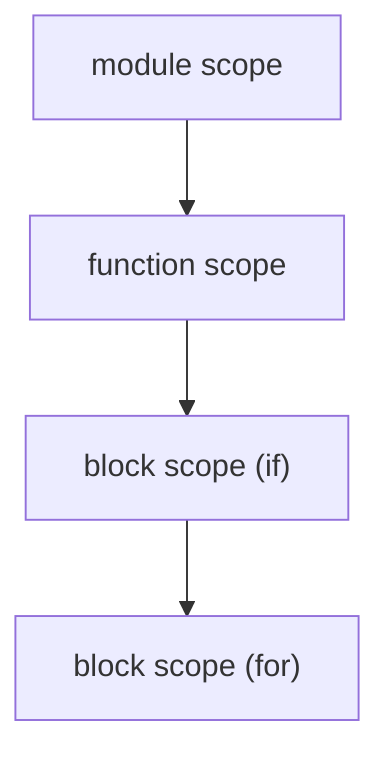

# Compilers 101 (5/10): 심볼 테이블과 스코프

함수 안의 `x`와 바깥의 `x`를 컴파일러가 어떻게 서로 다른 변수로 구분하는지 이해하면, 이름 해석이 결국 자료구조 설계 문제라는 사실이 선명해집니다.

이 글은 Compilers 101 시리즈의 5번째 글입니다.


*Compilers 101 5장 흐름 개요*

## 이 글에서 다룰 문제

- 심볼 테이블은 정확히 무엇이며 왜 컴파일러의 핵심 자료구조일까요?
- 스코프는 스택이나 연결 딕셔너리로 어떻게 표현할 수 있을까요?
- shadowing과 lookup은 왜 자연스럽게 따라올까요?
- 이 단계에서 발생하는 가장 흔한 오류는 어떤 형태일까요?
- 이 개념을 실무에서 잘못 적용하면 어떤 문제가 생길까요?

이전 글에서는 환경을 단일 딕셔너리로 표현했습니다. 하지만 실제 언어에는 함수, 블록, 클래스, 모듈처럼 여러 스코프가 존재합니다. 결국 스코프를 어떻게 설계하느냐가 그 언어의 가시성 규칙을 결정합니다.

> "이 변수가 여기서 보이는가?"라는 질문에 한 번에 답할 수 있어야 합니다.


```mermaid
flowchart TB
    A["module scope"] --> B["function scope"]
    B --> C["block scope (if)"]
    C --> D["block scope (for)"]
```

스코프는 트리이자 스택입니다. lookup은 안쪽에서 바깥쪽으로 진행됩니다.

## 핵심 용어

- **심볼(Symbol)**: 선언 엔트리입니다. 보통 `(name, kind, type, location)`을 갖습니다. 이름 자체가 아니라 이름에 결합된 정보 전체입니다.
- **스코프(Scope)**: 같은 가시성 규칙을 공유하는 심볼 집합입니다. 함수, 블록, 클래스가 각각 하나의 스코프를 만듭니다.
- **shadowing**: 안쪽 스코프의 이름이 바깥 스코프의 같은 이름을 가리는 현상입니다. 많은 언어에서 허용됩니다.
- **lookup**: 안쪽에서 바깥으로 걸어 올라가며 처음 맞는 선언을 찾는 과정입니다.
- **forward declaration**: 선언이 사용보다 뒤에 나오는 경우입니다. 함수가 서로 호출하는 경우에 필요합니다.

## 변경 전후

**Before — 평평한 딕셔너리**

```python
env = {"x": "int"}  # 함수 안의 x와 바깥의 x를 구분할 수 없습니다
```

**After — 연결된 스코프 체인**

```python
class Scope:
    def __init__(self, parent=None):
        self.parent, self.table = parent, {}
    # parent 포인터 하나로 중첩 스코프 전체를 표현합니다
```

부모 포인터 하나만으로 함수, 블록, 모듈을 같은 자료구조 안에 넣을 수 있습니다.

## 실습: 심볼 테이블을 단계별로 만들기

### 1단계 — Symbol과 Scope 구현

```python
# 1_scope.py
from dataclasses import dataclass, field
from typing import Optional

@dataclass
class Symbol:
    """컴파일러가 추적하는 선언 엔트리입니다."""
    name: str
    kind: str          # "var", "param", "fn", "class", "module"
    ty: str            # 타입 이름
    line: int = 0
    col: int = 0
    uses: int = 0      # 사용 횟수 (미사용 경고에 씁니다)

class Scope:
    """부모 포인터를 가진 딕셔너리로 하나의 스코프를 표현합니다."""

    def __init__(self, name: str = "<scope>", parent: "Scope" = None):
        self.name = name
        self.parent = parent
        self.table: dict[str, Symbol] = {}

    def define(self, sym: Symbol) -> None:
        """현재 스코프에 심볼을 등록합니다. 중복 선언이면 오류를 냅니다."""
        if sym.name in self.table:
            prev = self.table[sym.name]
            raise SyntaxError(
                f"'{sym.name}' already declared at line {prev.line}; "
                f"new declaration at line {sym.line}"
            )
        self.table[sym.name] = sym

    def resolve(self, name: str, line: int = 0) -> Optional[Symbol]:
        """안쪽에서 바깥으로 이름을 찾습니다. 없으면 None을 반환합니다."""
        if name in self.table:
            sym = self.table[name]
            sym.uses += 1   # 사용 횟수를 기록합니다
            return sym
        if self.parent:
            return self.parent.resolve(name, line)
        return None

    def require(self, name: str, line: int = 0) -> Symbol:
        """resolve와 같지만 없으면 NameError를 냅니다."""
        sym = self.resolve(name, line)
        if sym is None:
            raise NameError(f"line {line}: '{name}' is not defined")
        return sym

    def unused_symbols(self) -> list[Symbol]:
        """한 번도 사용되지 않은 심볼 목록을 반환합니다."""
        return [s for s in self.table.values() if s.uses == 0]

# 기본 동작 확인
global_scope = Scope("module")
global_scope.define(Symbol("x", "var", "int", line=1))
global_scope.define(Symbol("add", "fn", "fn(int,int)->int", line=2))

fn_scope = Scope("add", parent=global_scope)
fn_scope.define(Symbol("a", "param", "int", line=2))
fn_scope.define(Symbol("b", "param", "int", line=2))

# 함수 안에서 전역 변수를 찾을 수 있습니다
sym = fn_scope.require("x")
print(f"found: {sym.name}: {sym.ty}")  # x: int

# 미사용 심볼 확인
print("unused in fn:", fn_scope.unused_symbols())
```

단 하나의 `parent` 포인터가 중첩 lookup을 자동으로 만들어 줍니다.

### 2단계 — shadowing 동작 확인

```python
# 2_shadow.py
# 전역 스코프
g = Scope("global")
g.define(Symbol("x", "var", "int(global)", line=1))
g.define(Symbol("y", "var", "str", line=2))

# 함수 스코프: 전역의 x를 가립니다
f = Scope("fn", parent=g)
f.define(Symbol("x", "param", "int(local)", line=5))

# lookup 결과
x_in_f = f.require("x")
x_in_g = g.require("x")
y_in_f = f.require("y")   # 함수 안에서 전역 y를 찾습니다

print(f"x in fn scope  : {x_in_f.ty}")  # int(local) — 안쪽이 이깁니다
print(f"x in global    : {x_in_g.ty}")  # int(global)
print(f"y in fn scope  : {y_in_f.ty}")  # str — 부모에서 찾습니다

# 함수 스코프에서는 바깥 x에 직접 접근할 방법이 없습니다 (shadowing 완성)
# 이를 명시적으로 확인하려면 parent 스코프를 직접 참조해야 합니다
outer_x = f.parent.require("x")
print(f"outer x via parent: {outer_x.ty}")  # int(global)
```

안쪽 스코프에서 같은 이름을 다시 정의하면 자동으로 바깥쪽을 가립니다. 이것이 shadowing이며, lookup 알고리즘의 자연스러운 결과입니다.

### 3단계 — 스코프 스택 운영하기

```python
# 3_stack.py
class ScopeStack:
    """
    AST를 순회하는 동안 스코프를 스택처럼 관리합니다.
    블록에 들어가면 push, 나오면 pop합니다.
    """

    def __init__(self):
        self._stack: list[Scope] = [Scope("module")]

    @property
    def current(self) -> Scope:
        return self._stack[-1]

    def enter(self, name: str = "<block>") -> Scope:
        """새 스코프를 만들고 스택에 쌓습니다."""
        new_scope = Scope(name, parent=self.current)
        self._stack.append(new_scope)
        return new_scope

    def exit(self) -> Scope:
        """현재 스코프를 닫고 스택에서 뺍니다."""
        if len(self._stack) <= 1:
            raise RuntimeError("cannot exit module scope")
        return self._stack.pop()

    def define(self, sym: Symbol) -> None:
        self.current.define(sym)

    def resolve(self, name: str, line: int = 0) -> Optional[Symbol]:
        return self.current.resolve(name, line)

    def require(self, name: str, line: int = 0) -> Symbol:
        return self.current.require(name, line)

# 사용 예시
ss = ScopeStack()
ss.define(Symbol("x", "var", "int", line=1))

# if 블록 진입
if_scope = ss.enter("if-block")
ss.define(Symbol("y", "var", "bool", line=3))
print(ss.require("x").ty)   # int — 부모에서 찾습니다
print(ss.require("y").ty)   # bool — 현재에서 찾습니다

# if 블록 종료
ss.exit()
result = ss.resolve("y")    # None — y는 이제 보이지 않습니다
print(f"y after if block: {result}")
```

`enter / exit`가 블록 진입과 종료를 표현합니다. AST를 걷는 동안 이 균형이 반드시 맞아야 합니다.

### 4단계 — 함수 스코프와 2패스 분석

```python
# 4_two_pass.py
from dataclasses import dataclass

@dataclass
class FuncDef:
    name: str
    params: list  # [(name, type), ...]
    body: list    # 문장 목록

@dataclass
class Call:
    name: str
    args: list

@dataclass
class VarDecl:
    name: str
    ty: str
    value: object = None

def analyze_program(stmts: list) -> tuple[ScopeStack, list]:
    """
    2패스 분석:
      패스 1 — 함수 이름을 먼저 등록합니다 (forward declaration 지원)
      패스 2 — 본문을 분석합니다
    """
    ss = ScopeStack()
    errors = []

    # 패스 1: 최상위 함수 이름 수집
    for stmt in stmts:
        if isinstance(stmt, FuncDef):
            param_types = ",".join(ty for _, ty in stmt.params)
            sig = f"fn({param_types})->?"
            try:
                ss.define(Symbol(stmt.name, "fn", sig, line=0))
            except SyntaxError as e:
                errors.append(str(e))

    # 패스 2: 함수 본문 분석
    for stmt in stmts:
        if isinstance(stmt, FuncDef):
            fn_scope = ss.enter(stmt.name)
            try:
                for pname, pty in stmt.params:
                    ss.define(Symbol(pname, "param", pty))
                for body_stmt in stmt.body:
                    if isinstance(body_stmt, VarDecl):
                        ss.define(Symbol(body_stmt.name, "var", body_stmt.ty))
                    elif isinstance(body_stmt, Call):
                        sym = ss.resolve(body_stmt.name)
                        if sym is None:
                            errors.append(f"'{body_stmt.name}' is not defined")
            finally:
                ss.exit()

    return ss, errors

# 서로 호출하는 두 함수 (forward declaration 필요)
program = [
    FuncDef("even", [("n", "int")], [Call("odd", ["n-1"])]),
    FuncDef("odd",  [("n", "int")], [Call("even", ["n-1"])]),
]
_, errs = analyze_program(program)
print("errors:", errs)  # [] — 2패스이므로 forward reference가 OK입니다
```

선언 수집과 사용 분석을 나누는 2패스 접근은 함수가 서로 참조하는 코드를 처리할 때 필수입니다.

### 5단계 — go-to-definition을 위한 위치 저장

```python
# 5_goto.py
def goto_definition(scope: Scope, name: str) -> str:
    """IDE의 'Go to Definition' 기능을 흉내 냅니다."""
    sym = scope.resolve(name)
    if sym is None:
        return f"'{name}': definition not found"
    return (
        f"'{sym.name}' defined at line {sym.line}, col {sym.col}\n"
        f"  kind: {sym.kind}\n"
        f"  type: {sym.ty}\n"
        f"  uses: {sym.uses}"
    )

def find_all_references(root_scope: Scope, name: str) -> list[str]:
    """IDE의 'Find All References'를 흉내 냅니다 — 실제로는 사용 지점 목록이 필요합니다."""
    # 이 예시에서는 사용 횟수만 반환합니다
    sym = root_scope.resolve(name)
    if sym:
        return [f"'{name}' used {sym.uses} time(s)"]
    return [f"'{name}': not found"]

# 사용 예시
g = Scope("global")
g.define(Symbol("width", "var", "int", line=3, col=4))
g.define(Symbol("height", "var", "int", line=4, col=4))

# 두 번 사용
g.require("width")
g.require("width")

print(goto_definition(g, "width"))
# 'width' defined at line 3, col 4
#   kind: var
#   type: int
#   uses: 2

print(find_all_references(g, "height"))
# ['height' used 0 time(s)]  <- 미사용 경고 대상

# 미사용 심볼 전체 출력
for sym in g.unused_symbols():
    print(f"warning: '{sym.name}' declared at line {sym.line} but never used")
```

선언 위치를 심볼에 저장해 두면, IDE의 go-to-definition은 사실상 평범한 lookup이 됩니다.

## 핵심 정리

- 핵심 자료구조는 부모 포인터를 가진 Scope 하나입니다.
- shadowing은 별도 예외 규칙이 아니라 lookup 알고리즘의 자연스러운 결과입니다.
- 함수, 블록, 모듈은 모두 같은 자료구조 형태로 표현됩니다.
- IDE 기능 대부분은 심볼 테이블 위에서 나옵니다.
- 2패스 분석은 forward declaration을 처리하는 표준 방법입니다.

## 자주 하는 실수

1. **스코프를 딕셔너리 하나로 끝내려는 것**입니다. 함수 안의 변수와 바깥 변수를 구분할 수 없습니다. 부모 포인터가 없으면 shadowing이 불가능합니다.
2. **`enter / exit` 호출 균형을 맞추지 않는 것**입니다. `enter` 후 예외가 발생하면 `exit`가 누락됩니다. `try/finally` 패턴으로 항상 쌍을 보장하세요.
3. **모든 스코프를 검사해 shadowing 자체를 금지하려는 것**입니다. 많은 언어에서 shadowing은 기능입니다. 언어 차원에서 허용 여부를 결정하고, 경고(warning)로 처리하는 것이 더 유연합니다.
4. **forward declaration을 고려하지 않는 것**입니다. 함수 안에서 아래쪽 함수를 호출하는 코드가 깨질 수 있습니다. 2패스 분석으로 해결하세요.
5. **심볼에 위치 정보를 저장하지 않는 것**입니다. 나중에 go-to-definition을 붙일 수 없습니다. 선언 시 `line:col`을 반드시 기록하세요.

## 실무에서는 이렇게 나타납니다

LSP 서버의 중심 자료구조가 바로 심볼 테이블입니다.

- **"모든 참조 찾기"**: 같은 심볼을 가리키는 모든 사용 지점을 모읍니다.
- **"이름 바꾸기"**: 같은 심볼의 모든 사용 지점을 함께 다시 씁니다.
- **"미사용 변수 경고"**: `uses == 0`인 심볼을 찾습니다.
- **"자동 완성"**: 현재 스코프에서 보이는 모든 심볼을 나열합니다.

결국 IDE의 많은 기능은 심볼 테이블 모델 위에 쌓입니다.

## 숙련된 엔지니어는 이렇게 봅니다

- 새 언어 기능을 보면 먼저 "이것은 어느 스코프에 들어가는가?"를 묻습니다.
- shadowing을 허용할지 경고할지 언어 차원에서 결정합니다.
- 심볼에 위치, 가시성, 사용 횟수 같은 메타데이터를 저장합니다.
- 선언 수집과 사용 분석을 나누는 2패스 접근을 기본으로 생각합니다.
- 심볼 테이블이 곧 IDE의 데이터 모델이라는 점을 압니다.

## 운영 체크리스트

- [ ] Scope가 부모 포인터를 가진 딕셔너리라는 설명을 이해했습니까?
- [ ] shadowing이 lookup 규칙의 자연스러운 결과라는 점을 설명할 수 있습니까?
- [ ] 함수 스코프와 블록 스코프를 같은 자료구조로 표현할 수 있습니까?
- [ ] go-to-definition이 결국 lookup이라는 점이 보입니까?
- [ ] 심볼 테이블을 2패스로 채우는 이유를 말할 수 있습니까?

## 연습 문제

1. 특정 스코프에 정의된 모든 심볼을 나열하는 메서드를 Scope에 추가해 보세요.
2. shadowing이 발생하면 경고를 내는 옵션을 추가해 보세요.
3. forward declaration을 지원하기 위해 선언 수집과 사용 분석을 분리한 2패스 의사코드를 작성해 보세요.

## 처음 질문으로 돌아가기

- **심볼 테이블은 정확히 무엇이며 왜 컴파일러의 핵심 자료구조일까요?**
  - 심볼 테이블은 이름을 선언 엔트리에 매핑하는 자료구조입니다. 컴파일러의 모든 이후 단계(타입 검사, IR 생성, 코드 생성)는 심볼 테이블에서 "이 이름은 어떤 변수이며 타입은 무엇인가?"를 질의합니다. 이 정보가 없으면 의미 있는 코드를 생성할 수 없습니다.
- **스코프는 스택이나 연결 딕셔너리로 어떻게 표현할 수 있을까요?**
  - 각 스코프는 `{name: Symbol}` 딕셔너리와 부모 스코프 포인터를 가집니다. 블록에 들어갈 때 새 스코프를 만들어 현재 스코프를 부모로 설정하고, 나올 때 현재 스코프를 버립니다. AST 순회 중에는 이 스코프를 스택으로 관리합니다.
- **shadowing과 lookup은 왜 자연스럽게 따라올까요?**
  - lookup이 "안쪽 → 바깥쪽" 순서로 진행되기 때문입니다. 안쪽 스코프에 같은 이름이 있으면 거기서 멈추고, 없으면 부모로 올라갑니다. shadowing은 이 알고리즘의 자연스러운 결과이며, 예외 처리 코드가 따로 필요하지 않습니다.

## 정리와 다음 글

심볼 테이블은 컴파일러가 "이 이름은 무엇인가?"에 답하기 위해 유지하는 메모리입니다. 다음 글에서는 분석이 끝난 AST를 더 단순한 내부 언어로 바꾸는 단계, intermediate representation을 다룹니다.

<!-- toc:begin -->
## 시리즈 목차

- [Compilers 101 (1/10): 컴파일러란 무엇인가?](./01-what-is-a-compiler.md)
- [Compilers 101 (2/10): 렉시컬 분석](./02-lexical-analysis.md)
- [Compilers 101 (3/10): 파싱과 AST](./03-parsing-and-ast.md)
- [Compilers 101 (4/10): 시맨틱 분석](./04-semantic-analysis.md)
- **Compilers 101 (5/10): 심볼 테이블과 스코프 (현재 글)**
- [Compilers 101 (6/10): 중간 표현](./06-intermediate-representation.md)
- [Compilers 101 (7/10): 최적화 기초](./07-optimization-basics.md)
- [Compilers 101 (8/10): 코드 생성](./08-code-generation.md)
- [Compilers 101 (9/10): JIT vs AOT](./09-jit-vs-aot.md)
- [작은 인터프리터 만들기](./10-building-a-tiny-interpreter.md)

<!-- toc:end -->

## 참고 자료

- Alfred V. Aho, Monica S. Lam, Ravi Sethi, Jeffrey D. Ullman, *Compilers: Principles, Techniques, and Tools* (2nd ed.), Section 2.7 "Symbol Tables".
- [Shriram Krishnamurthi, *Programming Languages: Application and Interpretation* (3rd ed.)](https://www.plai.org/) — 환경 모델과 정적 스코프 설명.
- [Robert Nystrom, *Crafting Interpreters* — Chapter 11 "Resolving and Binding"](https://craftinginterpreters.com/resolving-and-binding.html)
- Keith D. Cooper, Linda Torczon, *Engineering a Compiler* (2nd ed.), name analysis and semantic environment chapters.

- [이 시리즈 예제 코드 (book-examples)](https://github.com/yeongseon-books/book-examples/tree/main/compilers-101/ko)

Tags: Computer Science, Compilers, SymbolTable, Scope, Lookup
