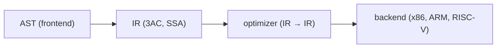

# Compilers 101 (6/10): 중간 표현

이 글은 Compilers 101 시리즈의 여섯 번째 글입니다.

AST에서 바로 기계어로 내려가지 않고 굳이 중간 언어를 두는 이유를 이해하면, 컴파일러가 왜 프런트엔드와 백엔드로 깔끔하게 분리되는지 자연스럽게 보이기 시작합니다.


*Compilers 101 6장 흐름 개요*

## 먼저 던지는 질문

- IR은 무엇이며 왜 필요할까요?
- three-address code는 어떤 모양일까요?
- SSA는 왜 분석을 단순하게 만들까요?

## 왜 중요한가

AST는 사람이 이해하기 좋은 형태이고, 기계어는 CPU가 실행하기 좋은 형태입니다. 둘 사이에 IR이 없으면 최적화는 AST 구조에 강하게 묶이고, 새 CPU를 지원할 때마다 분석과 백엔드 구현을 함께 다시 손봐야 합니다. IR은 컴파일러를 두 절반으로 분리해 주는 핵심 경계입니다.

> “M개 언어 × N개 아키텍처” 문제를 “M + N”으로 바꾸는 다리가 바로 IR입니다.

## 핵심 개념 한눈에 보기



IR이 잘 정의되면 optimizer와 backend는 소스 언어의 복잡한 구문을 몰라도 IR만 보고 일할 수 있습니다.

## 핵심 용어

- **IR**: 컴파일러 내부에서 쓰는 중간 언어입니다.
- **three-address code**: 한 줄에 피연산자가 최대 세 개 있는 표현입니다. 예를 들어 `t1 = a + b` 같은 형태입니다.
- **basic block**: 분기 없는 직선형 명령어 시퀀스입니다.
- **CFG**: basic block들을 노드로 갖는 제어 흐름 그래프입니다.
- **SSA**: 변수에 값을 정확히 한 번만 대입하는 표현입니다. 데이터 흐름 분석이 단순해집니다.

## 변경 전후

**Before — 트리 기반 평가**

```python
ast = Bin("+", Num(1), Bin("*", Num(2), Num(3)))
# 트리를 따라 재귀적으로 계산합니다.
```

**After — 평평한 명령어 시퀀스**

```text
t1 = 2 * 3
t2 = 1 + t1
return t2
```

트리보다 명령어 단위 분석이 훨씬 쉬워집니다.

## 실습: AST를 IR로 내리기

### 1단계 — IR 명령어 정의

```python
# 1_ir.py
from dataclasses import dataclass
@dataclass
class Inst:
    op: str
    dst: str
    src1: object
    src2: object = None
```

`(op, dst, src1, src2)` 네 필드만으로도 산술, 비교, 대입의 상당 부분을 표현할 수 있습니다.

### 2단계 — 임시 변수 생성하기

```python
# 2_temps.py
class TempGen:
    def __init__(self): self.n = 0
    def fresh(self):
        self.n += 1; return f"t{self.n}"

g = TempGen()
print(g.fresh(), g.fresh(), g.fresh())  # t1 t2 t3
```

식의 중간 결과마다 이름이 필요합니다. 카운터 하나면 충분합니다.

### 3단계 — 표현식을 3AC로 낮추기

```python
# 3_lower.py
def lower(node, code, g):
    kind = node[0]
    if kind == "NUM":
        t = g.fresh(); code.append(("LOAD", t, node[1])); return t
    if kind == "BIN":
        l = lower(node[2], code, g)
        r = lower(node[3], code, g)
        t = g.fresh(); code.append((node[1], t, l, r)); return t

g = TempGen(); code = []
ast = ("BIN","+",("NUM",1),("BIN","*",("NUM",2),("NUM",3)))
result = lower(ast, code, g)
for inst in code: print(inst)
print("result:", result)
```

트리를 한 번 순회하면 평평한 명령어 목록이 나옵니다. 최종 결과는 마지막 temporary에 들어 있습니다.

실제로 위 코드를 실행하면 다음처럼 3AC 덤프가 나옵니다.

```text
('LOAD', 't1', 1)
('LOAD', 't2', 2)
('LOAD', 't3', 3)
('*', 't4', 't2', 't3')
('+', 't5', 't1', 't4')
result: t5
```

이 출력은 AST의 중첩 구조가 `LOAD`, `*`, `+` 같은 한 줄짜리 명령어 시퀀스로 평평해졌다는 사실을 증명합니다.

### 4단계 — basic block과 CFG

```python
# 4_cfg.py
class Block:
    def __init__(self, name):
        self.name, self.insts, self.next = name, [], []

entry = Block("entry"); body = Block("body"); exit_ = Block("exit")
entry.next = [body]; body.next = [body, exit_]   # loop
```

조건 분기와 점프가 등장하는 순간 IR은 단순한 리스트가 아니라 그래프가 됩니다. 많은 분석과 최적화는 이 그래프 위에서 수행됩니다.

예를 들어 위 블록 연결은 텍스트로 쓰면 다음 CFG와 같습니다.

```text
entry -> body
body  -> body   # loop back-edge
body  -> exit
```

이처럼 basic block을 노드로, 점프 가능 경로를 간선으로 적기만 해도 CFG의 핵심이 드러납니다.

### 5단계 — SSA 맛보기

```python
# 5_ssa.py
# 같은 변수에 여러 번 대입하는 코드
# x = 1
# x = x + 2
# return x

# in SSA:
# x1 = 1
# x2 = x1 + 2
# return x2
```

모든 대입에 인덱스를 붙여 “한 번만 대입” 규칙을 강제합니다. 이것이 SSA이며, 데이터 흐름 분석을 단순하게 만드는 강력한 표현입니다.

분기가 합쳐지는 지점에서는 `phi`가 어떤 버전이 살아남는지 명시합니다.

```text
# before SSA
entry:
  br cond, then, else
then:
  x = 1
  br join
else:
  x = 2
  br join
join:
  y = x + 3

# after SSA
entry:
  br cond, then, else
then:
  x1 = 1
  br join
else:
  x2 = 2
  br join
join:
  x3 = phi(x1, x2)
  y1 = x3 + 3
```

이 예제는 “같은 변수 `x`를 여러 번 갱신한다”는 원래 코드를, “각 버전은 한 번만 정의되고 `phi`가 합류 지점을 담당한다”는 SSA 형태로 바꾸는 과정을 보여 줍니다.

## 이 코드에서 먼저 봐야 할 점

- IR의 핵심은 한 줄에 하나의 연산을 두는 것입니다.
- temporary는 자유롭게 많이 만들어도 됩니다. 나중에 레지스터 할당기가 정리합니다.
- AST는 트리이지만 IR은 보통 그래프입니다.
- SSA는 실행용 표현이 아니라 분석용 표현입니다.

## 자주 하는 실수 다섯 가지

1. **AST 위에서 직접 최적화하려는 것**입니다. 트리 형태는 분석하기에 너무 풍부합니다.
2. **미리 “최적화”하려고 temporary 이름을 일찍 재사용하는 것**입니다. SSA의 장점을 잃습니다.
3. **basic block이 분기에서만 나뉜다고 생각하는 것**입니다. 라벨도 경계를 만듭니다.
4. **IR을 아키텍처에 너무 종속적으로 만드는 것**입니다. 새 백엔드 지원이 힘들어집니다.
5. **IR을 지나치게 추상적으로 만드는 것**입니다. 좋은 코드 생성이 어려워집니다.

## 실무에서는 이렇게 나타납니다

LLVM IR이 대표 사례입니다. C, C++, Rust, Swift 같은 여러 언어가 같은 IR로 내려가고, 같은 최적화 패스를 공유하며, 여러 아키텍처로 코드를 생성합니다. CPython 바이트코드나 Java 바이트코드도 넓은 의미에서 IR의 한 종류로 볼 수 있습니다.

## 숙련된 엔지니어는 이렇게 봅니다

- 새 언어를 만나면 먼저 “기존 IR로 낮출 수 있는가?”를 묻습니다.
- IR 설계는 단순함과 표현력의 균형 문제로 봅니다.
- 분석 기본 형태로 SSA를 선호합니다.
- 디버그 정보를 위해 source-level 위치를 IR까지 들고 갑니다.
- 백엔드는 IR만 알게 하고 프런트엔드와 분리합니다.

## 체크리스트

- [ ] IR이 왜 존재하는지 한 문장으로 설명할 수 있습니까?
- [ ] three-address code의 형태를 적을 수 있습니까?
- [ ] basic block의 정의를 말할 수 있습니까?
- [ ] SSA가 분석을 단순하게 만드는 이유를 설명할 수 있습니까?
- [ ] IR이 프런트엔드와 백엔드를 가르는 경계라는 점을 이해했습니까?

## 연습 문제

1. 위 `lower` 함수에 비교 연산자(`<`, `>`)를 추가해 보세요.
2. `if (x < 10) { ... } else { ... }`를 손으로 IR로 바꿔 보세요.
3. 같은 변수를 두 번 대입하는 코드를 SSA 형태로 직접 바꿔 보세요.

## 정리와 다음 글

IR은 컴파일러를 둘로 깨끗하게 나누는 다리입니다. 다음 글에서는 이 위에서 돌아가는 가장 기본적인 최적화들, 특히 constant folding과 dead code elimination을 살펴봅니다.

## 처음 질문으로 돌아가기

- **IR은 무엇이며 왜 필요할까요?**
  - IR은 AST와 기계어 사이에 놓인 컴파일러 내부 언어로, 프런트엔드의 복잡한 문법과 백엔드의 아키텍처 의존성을 분리해 줍니다. 본문에서 `Bin("+", ...)` 트리를 `LOAD`, `*`, `+`, `return`으로 평평하게 바꾼 예제가 왜 IR이 최적화와 다중 백엔드를 위한 공통 경계인지 보여 줍니다.
- **three-address code는 어떤 모양일까요?**
  - three-address code는 `t1 = a + b`처럼 한 줄에 연산 하나와 최대 세 개의 피연산자를 두는 형태입니다. `lower()`가 `("BIN","+",...)` AST를 `('LOAD', 't1', 1)`, `('*', 't4', 't2', 't3')`, `('+', 't5', 't1', 't4')`로 내리는 출력이 그 전형적인 모양입니다.
- **SSA는 왜 분석을 단순하게 만들까요?**
  - SSA는 `x1`, `x2`, `x3`처럼 각 대입에 새 버전을 부여해 한 이름이 정확히 한 번만 정의되도록 만드는 표현입니다. 분기 합류 지점에서 `x3 = phi(x1, x2)`를 명시하면 어떤 값이 살아남는지 바로 드러나므로, 데이터 흐름 분석과 CSE 같은 최적화가 훨씬 단순해집니다.

<!-- toc:begin -->
## 시리즈 목차

- [Compilers 101 (1/10): 컴파일러란 무엇인가?](./01-what-is-a-compiler.md)
- [Compilers 101 (2/10): 렉시컬 분석](./02-lexical-analysis.md)
- [Compilers 101 (3/10): 파싱과 AST](./03-parsing-and-ast.md)
- [Compilers 101 (4/10): 시맨틱 분석](./04-semantic-analysis.md)
- [Compilers 101 (5/10): 심볼 테이블과 스코프](./05-symbol-table-and-scope.md)
- **중간 표현 (현재 글)**
- 최적화 기초 (예정)
- 코드 생성 (예정)
- JIT vs AOT (예정)
- 작은 인터프리터 만들기 (예정)

<!-- toc:end -->

## 참고 자료

- Keith D. Cooper, Linda Torczon, *Engineering a Compiler* (2nd ed.), IR design and SSA chapters.
- [LLVM Language Reference Manual](https://llvm.org/docs/LangRef.html) — SSA-based IR overview, function structure, and the [`phi` instruction](https://llvm.org/docs/LangRef.html#phi-instruction).
- [LLVM Kaleidoscope Tutorial — Chapter 3 “Code generation to LLVM IR”](https://llvm.org/docs/tutorial/MyFirstLanguageFrontend/LangImpl03.html)
- Alfred V. Aho, Monica S. Lam, Ravi Sethi, Jeffrey D. Ullman, *Compilers: Principles, Techniques, and Tools* (2nd ed.), intermediate-code generation chapters.

- [이 시리즈 예제 코드 (book-examples)](https://github.com/yeongseon-books/book-examples/tree/main/compilers-101/ko)

Tags: Computer Science, Compilers, IR, ThreeAddressCode, SSA
