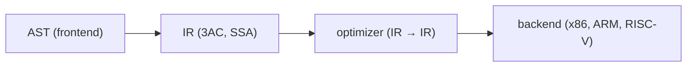

# Compilers 101 (6/10): 중간 표현

이 글은 Compilers 101 시리즈의 여섯 번째 글입니다.

AST에서 바로 기계어로 내려가지 않고 굳이 중간 언어를 두는 이유를 이해하면, 컴파일러가 왜 프런트엔드와 백엔드로 깔끔하게 분리되는지 자연스럽게 보이기 시작합니다.

## 먼저 던지는 질문

- IR은 무엇이며 왜 필요할까요?
- three-address code는 어떤 모양일까요?
- SSA는 왜 분석을 단순하게 만들까요?

## 큰 그림


*Compilers 101 6장 흐름 개요*

## 왜 중요한가

AST는 사람이 이해하기 좋은 형태이고, 기계어는 CPU가 실행하기 좋은 형태입니다. 둘 사이에 IR이 없으면 최적화는 AST 구조에 강하게 묶이고, 새 CPU를 지원할 때마다 분석과 백엔드 구현을 함께 다시 손봐야 합니다. IR은 컴파일러를 두 절반으로 분리해 주는 핵심 경계입니다.

> “M개 언어 × N개 아키텍처” 문제를 “M + N”으로 바꾸는 다리가 바로 IR입니다.

## 핵심 개념 한눈에 보기



IR이 잘 정의되면 optimizer와 backend는 소스 언어의 복잡한 구문을 몰라도 IR만 보고 일할 수 있습니다.

## 핵심 용어

- **IR**: 컴파일러 내부에서 쓰는 중간 언어입니다.
- **three-address code**: 한 줄에 피연산자가 최대 세 개 있는 표현입니다. 예를 들어 `t1 = a + b` 같은 형태입니다.
- **basic block**: 분기 없는 직선형 명령어 시퀀스입니다.
- **CFG**: basic block들을 노드로 갖는 제어 흐름 그래프입니다.
- **SSA**: 변수에 값을 정확히 한 번만 대입하는 표현입니다. 데이터 흐름 분석이 단순해집니다.

## 변경 전후

**Before — 트리 기반 평가**

```python
ast = Bin("+", Num(1), Bin("*", Num(2), Num(3)))
# evaluate recursively over the tree
```

**After — 평평한 명령어 시퀀스**

```text
t1 = 2 * 3
t2 = 1 + t1
return t2
```

트리보다 명령어 단위 분석이 훨씬 쉬워집니다.

## 실습: AST를 IR로 내리기

### 1단계 — IR 명령어 정의

```python
# 1_ir.py
from dataclasses import dataclass
@dataclass
class Inst:
    op: str
    dst: str
    src1: object
    src2: object = None
```

`(op, dst, src1, src2)` 네 필드만으로도 산술, 비교, 대입의 상당 부분을 표현할 수 있습니다.

### 2단계 — 임시 변수 생성하기

```python
# 2_temps.py
class TempGen:
    def __init__(self): self.n = 0
    def fresh(self):
        self.n += 1; return f"t{self.n}"

g = TempGen()
print(g.fresh(), g.fresh(), g.fresh())  # t1 t2 t3
```

식의 중간 결과마다 이름이 필요합니다. 카운터 하나면 충분합니다.

### 3단계 — 표현식을 3AC로 낮추기

```python
# 3_lower.py
def lower(node, code, g):
    kind = node[0]
    if kind == "NUM":
        t = g.fresh(); code.append(("LOAD", t, node[1])); return t
    if kind == "BIN":
        l = lower(node[2], code, g)
        r = lower(node[3], code, g)
        t = g.fresh(); code.append((node[1], t, l, r)); return t

g = TempGen(); code = []
ast = ("BIN","+",("NUM",1),("BIN","*",("NUM",2),("NUM",3)))
result = lower(ast, code, g)
for inst in code: print(inst)
print("result:", result)
```

트리를 한 번 순회하면 평평한 명령어 목록이 나옵니다. 최종 결과는 마지막 temporary에 들어 있습니다.

실제로 위 코드를 실행하면 다음처럼 3AC 덤프가 나옵니다.

```text
('LOAD', 't1', 1)
('LOAD', 't2', 2)
('LOAD', 't3', 3)
('*', 't4', 't2', 't3')
('+', 't5', 't1', 't4')
result: t5
```

이 출력은 AST의 중첩 구조가 `LOAD`, `*`, `+` 같은 한 줄짜리 명령어 시퀀스로 평평해졌다는 사실을 증명합니다.

### 4단계 — basic block과 CFG

```python
# 4_cfg.py
class Block:
    def __init__(self, name):
        self.name, self.insts, self.next = name, [], []

entry = Block("entry"); body = Block("body"); exit_ = Block("exit")
entry.next = [body]; body.next = [body, exit_]   # loop
```

조건 분기와 점프가 등장하는 순간 IR은 단순한 리스트가 아니라 그래프가 됩니다. 많은 분석과 최적화는 이 그래프 위에서 수행됩니다.

예를 들어 위 블록 연결은 텍스트로 쓰면 다음 CFG와 같습니다.

```text
entry -> body
body  -> body   # loop back-edge
body  -> exit
```

이처럼 basic block을 노드로, 점프 가능 경로를 간선으로 적기만 해도 CFG의 핵심이 드러납니다.

### 5단계 — SSA 맛보기

```python
# 5_ssa.py
# code that assigns the same variable several times
# x = 1
# x = x + 2
# return x

# in SSA:
# x1 = 1
# x2 = x1 + 2
# return x2
```

모든 대입에 인덱스를 붙여 “한 번만 대입” 규칙을 강제합니다. 이것이 SSA이며, 데이터 흐름 분석을 단순하게 만드는 강력한 표현입니다.

분기가 합쳐지는 지점에서는 `phi`가 어떤 버전이 살아남는지 명시합니다.

```text
# before SSA
entry:
  br cond, then, else
then:
  x = 1
  br join
else:
  x = 2
  br join
join:
  y = x + 3

# after SSA
entry:
  br cond, then, else
then:
  x1 = 1
  br join
else:
  x2 = 2
  br join
join:
  x3 = phi(x1, x2)
  y1 = x3 + 3
```

이 예제는 “같은 변수 `x`를 여러 번 갱신한다”는 원래 코드를, “각 버전은 한 번만 정의되고 `phi`가 합류 지점을 담당한다”는 SSA 형태로 바꾸는 과정을 보여 줍니다.

## 이 코드에서 먼저 봐야 할 점

- IR의 핵심은 한 줄에 하나의 연산을 두는 것입니다.
- temporary는 자유롭게 많이 만들어도 됩니다. 나중에 레지스터 할당기가 정리합니다.
- AST는 트리이지만 IR은 보통 그래프입니다.
- SSA는 실행용 표현이 아니라 분석용 표현입니다.

## 자주 하는 실수 다섯 가지

1. **AST 위에서 직접 최적화하려는 것**입니다. 트리 형태는 분석하기에 너무 풍부합니다.
2. **미리 “최적화”하려고 temporary 이름을 일찍 재사용하는 것**입니다. SSA의 장점을 잃습니다.
3. **basic block이 분기에서만 나뉜다고 생각하는 것**입니다. 라벨도 경계를 만듭니다.
4. **IR을 아키텍처에 너무 종속적으로 만드는 것**입니다. 새 백엔드 지원이 힘들어집니다.
5. **IR을 지나치게 추상적으로 만드는 것**입니다. 좋은 코드 생성이 어려워집니다.

## 실무에서는 이렇게 나타납니다

LLVM IR이 대표 사례입니다. C, C++, Rust, Swift 같은 여러 언어가 같은 IR로 내려가고, 같은 최적화 패스를 공유하며, 여러 아키텍처로 코드를 생성합니다. CPython 바이트코드나 Java 바이트코드도 넓은 의미에서 IR의 한 종류로 볼 수 있습니다.

## 숙련된 엔지니어는 이렇게 봅니다

- 새 언어를 만나면 먼저 “기존 IR로 낮출 수 있는가?”를 묻습니다.
- IR 설계는 단순함과 표현력의 균형 문제로 봅니다.
- 분석 기본 형태로 SSA를 선호합니다.
- 디버그 정보를 위해 source-level 위치를 IR까지 들고 갑니다.
- 백엔드는 IR만 알게 하고 프런트엔드와 분리합니다.

## 체크리스트

- [ ] IR이 왜 존재하는지 한 문장으로 설명할 수 있습니까?
- [ ] three-address code의 형태를 적을 수 있습니까?
- [ ] basic block의 정의를 말할 수 있습니까?
- [ ] SSA가 분석을 단순하게 만드는 이유를 설명할 수 있습니까?
- [ ] IR이 프런트엔드와 백엔드를 가르는 경계라는 점을 이해했습니까?

## 연습 문제

1. 위 `lower` 함수에 비교 연산자(`<`, `>`)를 추가해 보세요.
2. `if (x < 10) { ... } else { ... }`를 손으로 IR로 바꿔 보세요.
3. 같은 변수를 두 번 대입하는 코드를 SSA 형태로 직접 바꿔 보세요.

## 정리와 다음 글

IR은 컴파일러를 둘로 깨끗하게 나누는 다리입니다. 다음 글에서는 이 위에서 돌아가는 가장 기본적인 최적화들, 특히 constant folding과 dead code elimination을 살펴봅니다.

## 확장 실습: 프런트엔드부터 LLVM IR 직전까지 한 번에 검증하기

이 시점부터는 단계별 조각 실습을 넘어, 한 입력이 토큰, AST, 타입 정보, IR, 최적화 결과, 코드 생성 결과로 어떻게 이어지는지 한 번에 추적하는 연습이 필요합니다. 핵심은 코드 길이가 아니라 **변환 경계가 보이는 출력**을 남기는 것입니다. 아래 예시는 시리즈 전체를 관통하는 최소 골격입니다.

### 문법 고정: BNF 표기 먼저 확정하기

문법이 흔들리면 파서와 의미 분석 경계도 함께 흔들립니다. 구현 전에 BNF를 먼저 잠그면 우선순위, 결합성, 허용 구문을 팀 단위로 공유할 수 있습니다.

```bnf
<program> ::= <stmt_list>
<stmt_list> ::= <stmt> | <stmt> <stmt_list>
<stmt> ::= "let" <ident> "=" <expr> ";" | "print" <expr> ";"
<expr> ::= <term> | <expr> "+" <term> | <expr> "-" <term>
<term> ::= <factor> | <term> "*" <factor> | <term> "/" <factor>
<factor> ::= <number> | <ident> | "(" <expr> ")"
```

### 렉서 출력 고정: 토큰과 위치 정보를 함께 기록하기

```python
from dataclasses import dataclass
import re

@dataclass
class Token:
    kind: str
    text: str
    line: int
    col: int

SPEC = [
    ("KW", r"\b(let|print)\b"),
    ("IDENT", r"[A-Za-z_][A-Za-z0-9_]*"),
    ("NUMBER", r"\d+"),
    ("OP", r"[+\-*/=]"),
    ("LPAREN", r"\("),
    ("RPAREN", r"\)"),
    ("SEMI", r";"),
    ("WS", r"[ \t\n]+"),
]

def lex(src: str) -> list[Token]:
    out: list[Token] = []
    i, line, col = 0, 1, 1
    while i < len(src):
        for kind, pat in SPEC:
            m = re.match(pat, src[i:])
            if not m:
                continue
            text = m.group(0)
            if kind != "WS":
                out.append(Token(kind, text, line, col))
            for ch in text:
                if ch == "
":
                    line += 1
                    col = 1
                else:
                    col += 1
            i += len(text)
            break
        else:
            raise SyntaxError(f"unexpected character {src[i]!r} at {line}:{col}")
    return out
```

이 출력은 이후 단계에서 오류 메시지 기준 좌표가 됩니다. line/col 정보가 없으면 파서와 의미 분석 품질을 끝까지 올리기 어렵습니다.

### AST 노드 정의: 구조를 명시적으로 분리하기

```python
from dataclasses import dataclass

@dataclass
class Number:
    value: int

@dataclass
class Identifier:
    name: str

@dataclass
class Binary:
    op: str
    left: object
    right: object

@dataclass
class LetStmt:
    name: str
    expr: object

@dataclass
class PrintStmt:
    expr: object
```

여기서 중요한 점은 문법 요소와 실행 요소를 섞지 않는 것입니다. AST는 실행기가 아니라 구조 표현이어야 하며, 해석/타입/코드 생성은 별도 단계로 분리하는 편이 장기적으로 안정적입니다.

### 의미 분석 골격: 선언, 참조, 타입을 한 번에 점검하기

```python
class Scope:
    def __init__(self, parent=None):
        self.parent = parent
        self.table: dict[str, str] = {}

    def define(self, name: str, ty: str):
        if name in self.table:
            raise TypeError(f"redeclared variable: {name}")
        self.table[name] = ty

    def resolve(self, name: str) -> str:
        if name in self.table:
            return self.table[name]
        if self.parent:
            return self.parent.resolve(name)
        raise NameError(f"undefined variable: {name}")

def type_of_expr(node, scope: Scope) -> str:
    if isinstance(node, Number):
        return "int"
    if isinstance(node, Identifier):
        return scope.resolve(node.name)
    if isinstance(node, Binary):
        lt = type_of_expr(node.left, scope)
        rt = type_of_expr(node.right, scope)
        if lt != "int" or rt != "int":
            raise TypeError(f"binary op expects int/int, got {lt}/{rt}")
        return "int"
    raise TypeError(f"unknown node: {node}")
```

시맨틱 단계에서 타입과 이름 해석을 확정하면, 뒤 단계(IR/최적화/코드 생성)는 오류 복구 부담을 크게 줄일 수 있습니다.

### IR 생성과 최적화 패스: 변환 파이프라인 분리하기

```python
def lower_expr(node, out, new_temp):
    if isinstance(node, Number):
        t = new_temp()
        out.append(("const", t, node.value))
        return t
    if isinstance(node, Identifier):
        t = new_temp()
        out.append(("load", t, node.name))
        return t
    if isinstance(node, Binary):
        l = lower_expr(node.left, out, new_temp)
        r = lower_expr(node.right, out, new_temp)
        t = new_temp()
        out.append((node.op, t, l, r))
        return t
    raise RuntimeError("unsupported node")

def constant_folding(ir):
    const = {}
    out = []
    for inst in ir:
        if inst[0] == "const":
            const[inst[1]] = inst[2]
            out.append(inst)
            continue
        if inst[0] in {"+", "-", "*", "/"} and inst[2] in const and inst[3] in const:
            a, b = const[inst[2]], const[inst[3]]
            v = {"+": a+b, "-": a-b, "*": a*b, "/": a//b}[inst[0]]
            const[inst[1]] = v
            out.append(("const", inst[1], v))
        else:
            out.append(inst)
    return out
```

`IR -> 최적화 패스 -> IR` 형태를 유지하면 패스를 안전하게 합성할 수 있고, 결과 비교 테스트도 단순해집니다.

### 코드 생성 스니펫: 단순 스택 머신 또는 어셈블리로 내리기

```python
def emit_stack_vm(ir):
    out = []
    for inst in ir:
        op = inst[0]
        if op == "const":
            out.append(f"PUSH {inst[2]}")
        elif op == "load":
            out.append(f"LOAD {inst[2]}")
        elif op == "+":
            out.append("ADD")
        elif op == "-":
            out.append("SUB")
        elif op == "*":
            out.append("MUL")
        elif op == "/":
            out.append("DIV")
    out.append("HALT")
    return out
```

이 수준의 생성기만 있어도 파서/의미 분석/최적화의 결과가 실제 실행 지시어로 어떻게 바뀌는지 빠르게 검증할 수 있습니다.

### LLVM IR 샘플 읽기: SSA 감각 익히기

```llvm
; 입력 소스의 개념: let x = 2 * 3; print x + 1;
define i32 @main() {
entry:
  %x = mul i32 2, 3
  %y = add i32 %x, 1
  ret i32 %y
}
```

SSA에서 `%x`, `%y`처럼 버전이 분리되면 데이터 흐름 분석과 레지스터 할당 전 단계가 단순해집니다. 시리즈 후반 주제(최적화, 코드 생성, JIT/AOT)를 이해할 때 이 표현이 공통 언어가 됩니다.

### 검증 기준: 단계별 스냅샷을 항상 남기기

실전에서는 정답 코드보다 검증 루틴이 먼저입니다. 최소한 다음 다섯 가지를 파일로 남기면 회귀를 추적하기 쉽습니다.

1. 토큰 덤프 (`tokens.json`)
2. AST 덤프 (`ast.json`)
3. 시맨틱 결과 (`symbols.json`, 타입 오류 목록)
4. 최적화 전후 IR (`ir_before.txt`, `ir_after.txt`)
5. 최종 코드 생성 결과 (`out.asm` 또는 `out.vm`)

이렇게 하면 “어디서 깨졌는지”가 즉시 분리되고, 팀 협업에서도 디버깅 비용이 크게 줄어듭니다.


### 단계별 실패 시나리오와 복구 전략

실제 프로젝트에서는 정답 입력보다 실패 입력이 더 많이 들어옵니다. 따라서 각 단계가 실패했을 때 **다음 단계로 무엇을 전달할지**를 먼저 정해야 합니다. 다음 표는 최소 운영 기준입니다.

| 단계 | 실패 예시 | 즉시 조치 | 다음 단계 전달 |
| --- | --- | --- | --- |
| 렉서 | 알 수 없는 문자 | 위치 포함 오류 생성 | 복구 가능한 토큰만 전달 |
| 파서 | 괄호 누락, 세미콜론 누락 | 동기화 토큰 기준으로 재시작 | 부분 AST와 오류 목록 전달 |
| 시맨틱 | 미선언 변수, 타입 불일치 | 심볼/타입 오류 축적 | 오류 수가 기준치 이하면 IR 생성 계속 |
| IR 생성 | 미지원 구문 | 노드 단위 경고와 스킵 | 분석 가능한 블록만 전달 |
| 최적화 | 패스 전제 위반 | 패스 비활성화 후 원본 IR 유지 | 코드 생성은 계속 |
| 코드 생성 | 레지스터 부족 | spill 강제, 속도 저하 허용 | 실행 가능한 바이너리 우선 |

이 기준은 "완벽한 컴파일"보다 "재현 가능한 컴파일"에 가깝습니다. 품질이 높은 컴파일러는 한 번에 많은 오류를 보여 주되, 어디까지 복구했는지 명확히 보고합니다.

### 테스트 입력 세트: 경계 조건을 먼저 고정하기

아래 입력 세트는 단계별 회귀를 빠르게 잡는 최소 묶음입니다.

```text
# 정상
let x = 2 + 3 * 4;
print x;

# 문법 오류
let x = (2 + 3;

# 의미 오류
print y;

# 최적화 검증
let z = 1 + 2 + 3 + 4;
print z;
```

각 입력에 대해 토큰, AST, 시맨틱 결과, IR, 최종 코드를 별도 파일로 남기면 변경 전후 차이를 기계적으로 비교할 수 있습니다.

### 간단한 골든 출력 비교 스크립트

```python
import json
from pathlib import Path

def save_snapshot(name: str, payload):
    out_dir = Path("artifacts")
    out_dir.mkdir(exist_ok=True)
    p = out_dir / f"{name}.json"
    p.write_text(json.dumps(payload, ensure_ascii=False, indent=2))

# 예시 사용
save_snapshot("tokens_case1", [{"kind": "NUMBER", "text": "2", "line": 1, "col": 1}])
save_snapshot("ast_case1", {"kind": "Binary", "op": "+"})
```

스냅샷 파일을 Git에 남기면 리팩터링 이후에도 파이프라인의 의미가 바뀌었는지 즉시 검출할 수 있습니다.

### 최적화 패스 예시: 상수 전파와 불필요 대입 제거

```python
def constant_propagation(ir):
    env = {}
    out = []
    for inst in ir:
        op = inst[0]
        if op == "const":
            env[inst[1]] = inst[2]
            out.append(inst)
        elif op in {"+", "-", "*", "/"}:
            a = env.get(inst[2], inst[2])
            b = env.get(inst[3], inst[3])
            if isinstance(a, int) and isinstance(b, int):
                v = {"+": a+b, "-": a-b, "*": a*b, "/": a//b}[op]
                env[inst[1]] = v
                out.append(("const", inst[1], v))
            else:
                out.append((op, inst[1], a, b))
        else:
            out.append(inst)
    return out

def remove_trivial_moves(ir):
    return [inst for inst in ir if not (inst[0] == "mov" and inst[1] == inst[2])]
```

최적화는 큰 패스 하나보다 작은 패스 여러 개가 유지보수에 유리합니다. 실패하면 해당 패스만 끄고 원본 IR로 복구할 수 있기 때문입니다.

### 코드 생성 검증: 간단한 레지스터 할당 로그 남기기

```python
REGS = ["r1", "r2", "r3"]

def assign_registers(temporaries):
    mapping = {}
    spill = []
    for t in temporaries:
        if len(mapping) < len(REGS):
            mapping[t] = REGS[len(mapping)]
        else:
            spill.append(t)
    return mapping, spill

m, s = assign_registers(["t1", "t2", "t3", "t4", "t5"])
print("reg-map", m)
print("spill ", s)
```

이 정도 로그만 있어도 특정 입력에서 왜 성능이 급락했는지 원인을 좁히기 쉽습니다. 특히 spill 급증은 코드 생성 병목의 대표 신호입니다.

### LLVM IR 비교 기준: 변경 전후를 줄 단위로 확인하기

```llvm
; before optimization
%t1 = mul i32 3, 4
%t2 = add i32 2, %t1
ret i32 %t2

; after optimization
ret i32 14
```

최적화가 의미를 보존하는지 검증할 때는 사람이 읽는 설명보다 IR diff가 더 신뢰할 수 있습니다. 동일 입력에서 `ret i32 14`로 바뀌면 folding이 실제로 적용되었음을 바로 확인할 수 있습니다.

### 팀 운영 체크포인트

1. 파서 변경 PR에는 반드시 BNF 변경 diff를 포함합니다.
2. 시맨틱 규칙 변경 PR에는 실패 사례 3개 이상을 테스트에 추가합니다.
3. 최적화 패스 추가 PR에는 비활성화 플래그를 함께 제공합니다.
4. 코드 생성 변경 PR에는 최소 두 아키텍처 이상의 스냅샷을 첨부합니다.
5. 릴리스 전에는 동일 입력에 대해 인터프리터 결과와 컴파일 결과를 교차 검증합니다.

이 체크포인트를 유지하면 기능 추가 속도보다 품질 일관성을 더 안정적으로 가져갈 수 있습니다.


### 마무리 점검: 단계 경계를 말로 설명해 보기

마지막으로, 구현을 잠시 멈추고 다음 질문에 답해 보기를 권합니다. 이 질문은 코드량이 아니라 이해도를 검증합니다.

- 렉서가 실패했을 때 파서가 받는 입력은 무엇입니까?
- 파서가 복구한 부분 AST를 시맨틱 단계에서 어디까지 신뢰합니까?
- 시맨틱 오류가 있어도 IR 생성을 계속할 조건은 무엇입니까?
- 최적화 패스를 껐을 때도 결과의 의미가 유지되는지 어떻게 확인합니까?
- 코드 생성 이후 실행 결과를 어떤 기준값과 비교합니까?

이 다섯 질문에 팀이 같은 답을 할 수 있으면, 파이프라인 확장 시 품질이 급격히 흔들릴 가능성이 크게 줄어듭니다. 반대로 답이 제각각이면, 새로운 문법이나 최적화 패스를 추가할 때 같은 종류의 회귀가 반복됩니다.

실무에서는 기능 추가보다 경계 합의가 먼저입니다. 경계를 합의한 다음 기능을 추가하면, 동일한 투자로 더 안정적인 컴파일러를 만들 수 있습니다.

## 처음 질문으로 돌아가기

- **IR은 무엇이며 왜 필요할까요?**
  - 본문의 기준은 중간 표현를 한 덩어리 개념으로 보지 않고 입력, 처리, 검증, 운영 신호가 만나는 경계로 나누어 확인하는 것입니다.
- **three-address code는 어떤 모양일까요?**
  - 예제와 그림에서는 어떤 값이 들어오고, 어느 단계에서 바뀌며, 어떤 기준으로 통과 또는 실패하는지를 먼저 확인해야 합니다.
- **SSA는 왜 분석을 단순하게 만들까요?**
  - 운영에서는 이 판단을 체크리스트, 로그, 테스트로 남겨 다음 변경에서도 같은 실패가 반복되지 않게 막아야 합니다.

<!-- toc:begin -->
## 시리즈 목차

- [Compilers 101 (1/10): 컴파일러란 무엇인가?](./01-what-is-a-compiler.md)
- [Compilers 101 (2/10): 렉시컬 분석](./02-lexical-analysis.md)
- [Compilers 101 (3/10): 파싱과 AST](./03-parsing-and-ast.md)
- [Compilers 101 (4/10): 시맨틱 분석](./04-semantic-analysis.md)
- [Compilers 101 (5/10): 심볼 테이블과 스코프](./05-symbol-table-and-scope.md)
- **중간 표현 (현재 글)**
- 최적화 기초 (예정)
- 코드 생성 (예정)
- JIT vs AOT (예정)
- 작은 인터프리터 만들기 (예정)

<!-- toc:end -->

## 참고 자료

- Keith D. Cooper, Linda Torczon, *Engineering a Compiler* (2nd ed.), IR design and SSA chapters.
- [LLVM Language Reference Manual](https://llvm.org/docs/LangRef.html) — SSA-based IR overview, function structure, and the [`phi` instruction](https://llvm.org/docs/LangRef.html#phi-instruction).
- [LLVM Kaleidoscope Tutorial — Chapter 3 “Code generation to LLVM IR”](https://llvm.org/docs/tutorial/MyFirstLanguageFrontend/LangImpl03.html)
- Alfred V. Aho, Monica S. Lam, Ravi Sethi, Jeffrey D. Ullman, *Compilers: Principles, Techniques, and Tools* (2nd ed.), intermediate-code generation chapters.

- [이 시리즈 예제 코드 (book-examples)](https://github.com/yeongseon-books/book-examples/tree/main/compilers-101/ko)

Tags: Computer Science, Compilers, IR, ThreeAddressCode, SSA
