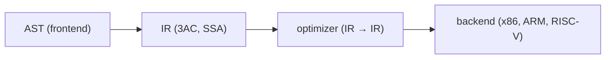

# intermediate representation

> Compilers 101 시리즈 (6/10)

<!-- a-grade-intro:begin -->

**핵심 질문**: AST를 그대로 두고 바로 기계어로 가지 않고, 왜 중간에 또 한 단계를 두는 걸까요?

> Intermediate representation(IR)은 AST보다 단순하고 기계어보다 추상적인 중간 언어입니다. optimization과 다중 백엔드 지원이 모두 이 위에서 이뤄집니다.

<!-- a-grade-intro:end -->

## 이 글에서 배울 것

- IR이 무엇이고 왜 필요한가
- three-address code(3AC)의 형태
- SSA(static single assignment)의 직관
- 같은 IR에서 여러 architecture를 지원하는 구조
- AST → IR 변환을 직접 짜기

## 왜 중요한가

AST는 사람을 위한 형태입니다. 기계어는 CPU를 위한 형태입니다. 그 사이를 잇는 IR이 없으면 optimization은 AST에 강하게 묶이고, 새 CPU를 지원하려면 모든 분석을 다시 짜야 합니다. IR은 컴파일러를 두 부분 — frontend와 backend — 으로 깔끔히 나눕니다.

> "M개 언어 × N개 아키텍처"를 "M + N"으로 줄이는 다리, 그게 IR입니다.

## 개념 한눈에 보기



IR이 한 번 잘 정의되면, optimizer와 backend는 IR만 알면 됩니다.

## 핵심 용어 정리

- **IR (intermediate representation)**: 컴파일러 내부에서 다루는 중간 언어.
- **Three-address code**: `t1 = a + b`처럼 한 줄에 최대 세 개 피연산자.
- **Basic block**: 분기가 없는 연속된 명령어 묶음.
- **CFG (control flow graph)**: basic block을 노드로 한 그래프.
- **SSA**: 모든 변수에 정확히 한 번만 할당. optimization을 단순하게 만듭니다.

## Before/After

**Before — 트리 기반 평가**

```python
ast = Bin("+", Num(1), Bin("*", Num(2), Num(3)))
# 트리를 따라 재귀적으로 평가
```

**After — 평탄한 명령어 시퀀스**

```text
t1 = 2 * 3
t2 = 1 + t1
return t2
```

명령어 단위로 분석하기가 훨씬 쉽습니다.

## 실습: AST → IR 변환

### 1단계 — IR 명령어 정의

```python
# 1_ir.py
from dataclasses import dataclass
@dataclass
class Inst:
    op: str
    dst: str
    src1: object
    src2: object = None
```

`(op, dst, src1, src2)` 네 필드면 거의 모든 산술/비교/대입을 표현할 수 있습니다.

### 2단계 — temporary 이름 생성

```python
# 2_temps.py
class TempGen:
    def __init__(self): self.n = 0
    def fresh(self):
        self.n += 1; return f"t{self.n}"

g = TempGen()
print(g.fresh(), g.fresh(), g.fresh())  # t1 t2 t3
```

표현식의 중간값마다 이름이 필요합니다. counter 하나면 충분합니다.

### 3단계 — 표현식 → 3AC

```python
# 3_lower.py
def lower(node, code, g):
    kind = node[0]
    if kind == "NUM":
        t = g.fresh(); code.append(("LOAD", t, node[1])); return t
    if kind == "BIN":
        l = lower(node[2], code, g)
        r = lower(node[3], code, g)
        t = g.fresh(); code.append((node[1], t, l, r)); return t

g = TempGen(); code = []
ast = ("BIN","+",("NUM",1),("BIN","*",("NUM",2),("NUM",3)))
result = lower(ast, code, g)
for inst in code: print(inst)
print("result:", result)
```

트리 순회 한 번이면 평탄한 명령어 리스트가 나옵니다. 결과는 마지막 temporary에 들어 있습니다.

### 4단계 — basic block과 CFG

```python
# 4_cfg.py
class Block:
    def __init__(self, name):
        self.name, self.insts, self.next = name, [], []

entry = Block("entry"); body = Block("body"); exit_ = Block("exit")
entry.next = [body]; body.next = [body, exit_]   # loop
```

조건 분기와 점프가 들어가는 순간 IR은 그래프가 됩니다. 이 그래프 위에서 optimization과 분석이 돌아갑니다.

### 5단계 — SSA 맛보기

```python
# 5_ssa.py
# 같은 변수에 여러 번 대입한 코드
# x = 1
# x = x + 2
# return x

# SSA 형태:
# x1 = 1
# x2 = x1 + 2
# return x2
```

각 변수에 인덱스를 붙여 "한 번만 할당"을 강제합니다. 이게 SSA입니다. 데이터 흐름 분석이 매우 단순해집니다.

## 이 코드에서 주목할 점

- 한 줄당 한 연산이 IR의 핵심입니다.
- temporary는 무한히 만들어도 됩니다 (나중에 register allocator가 정리).
- AST는 트리, IR은 (보통) 그래프.
- SSA는 분석을 위한 표현 형식이지 실행 형식이 아닙니다.

## 자주 하는 실수 5가지

1. **AST 위에서 바로 optimization을 하려고 한다.** 트리 위에서는 표현이 너무 풍부해서 분석이 폭발합니다.
2. **Temporary 이름을 재사용하려고 너무 일찍 최적화한다.** SSA의 이점이 사라집니다.
3. **Basic block 경계를 분기에서만 끊는다고 잊는다.** label도 경계입니다.
4. **IR을 너무 architecture-dependent하게 만든다.** 그러면 backend 추가가 어렵습니다.
5. **IR을 너무 추상적으로 만든다.** 그러면 좋은 코드 생성이 어렵습니다.

## 실무에서는 이렇게 쓰입니다

LLVM의 LLVM IR이 대표적입니다. 수많은 언어(C/C++/Rust/Swift 등)가 같은 IR로 내려간 뒤, 같은 optimization을 거치고, 다양한 architecture로 코드 생성됩니다. CPython의 bytecode, Java의 bytecode도 일종의 IR입니다.

## 시니어 엔지니어는 이렇게 생각합니다

- 새 언어를 보면 "기존 IR로 lowering할 수 있는가?"를 먼저 묻습니다.
- IR 설계는 "단순함 + 충분한 표현력" 사이의 균형 잡기입니다.
- SSA를 분석의 기본 형태로 둡니다.
- IR에 source-level 정보(line, column)를 끝까지 들고 다닙니다 (디버그 정보).
- backend를 IR 위에서만 작성해 frontend와 분리합니다.

## 체크리스트

- [ ] IR이 왜 필요한지 한 줄로 답할 수 있는가?
- [ ] three-address code의 형태를 받아쓸 수 있는가?
- [ ] basic block의 정의가 무엇인지 답할 수 있는가?
- [ ] SSA가 분석을 왜 단순하게 만드는지 직관이 있는가?
- [ ] frontend와 backend의 분리 지점이 IR임을 받아들였는가?

## 연습 문제

1. 위 lower 함수에 비교 연산자 (`<`, `>`)를 추가해 보세요.
2. `if (x < 10) { ... } else { ... }` 한 줄을 IR로 직접 손으로 변환해 보세요.
3. 같은 변수에 두 번 대입하는 코드를 SSA 형태로 손으로 변환해 보세요.

## 정리 및 다음 단계

IR은 컴파일러를 절반으로 깔끔하게 가르는 다리입니다. 다음 글에서는 이 IR 위에서 일어나는 가장 단순한 — 그러나 가장 자주 쓰이는 — 두세 가지 optimization을 살펴봅니다.

<!-- toc:begin -->
- [컴파일러란 무엇인가?](./01-what-is-a-compiler.md)
- [lexical analysis](./02-lexical-analysis.md)
- [parsing과 AST](./03-parsing-and-ast.md)
- [semantic analysis](./04-semantic-analysis.md)
- [symbol table과 scope](./05-symbol-table-and-scope.md)
- **intermediate representation (현재 글)**
- optimization 기초 (예정)
- code generation (예정)
- JIT vs AOT (예정)
- 작은 인터프리터 만들어 보기 (예정)
<!-- toc:end -->

## 참고 자료

- [Three-address code (Wikipedia)](https://en.wikipedia.org/wiki/Three-address_code)
- [Static single-assignment form (Wikipedia)](https://en.wikipedia.org/wiki/Static_single-assignment_form)
- [LLVM Language Reference](https://llvm.org/docs/LangRef.html)
- [Control-flow graph (Wikipedia)](https://en.wikipedia.org/wiki/Control-flow_graph)

Tags: Computer Science, Compilers, IR, ThreeAddressCode, SSA
