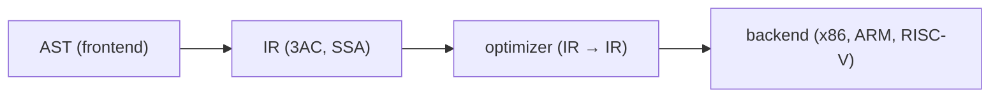

# Compilers 101 (6/10): 중간 표현

IR은 컴파일러를 두 절반으로 나눕니다. 프런트엔드는 소스 언어를 IR로 낮추고, 백엔드는 IR을 타깃 코드로 올립니다. 이 분리가 "M개 언어 × N개 아키텍처" 문제를 "M + N"으로 줄이는 열쇠입니다.

이 글은 Compilers 101 시리즈의 여섯 번째 글입니다.

AST에서 바로 기계어로 내려가지 않고 굳이 중간 언어를 두는 이유를 이해하면, 컴파일러가 왜 프런트엔드와 백엔드로 깔끔하게 분리되는지 자연스럽게 보이기 시작합니다.


*Compilers 101 6장 흐름 개요*

## 이 글에서 다룰 문제

- IR은 무엇이며 왜 필요할까요?
- three-address code는 어떤 모양일까요?
- SSA는 왜 분석을 단순하게 만들까요?
- 이 단계에서 발생하는 가장 흔한 오류는 어떤 형태일까요?
- 이 개념을 실무에서 잘못 적용하면 어떤 문제가 생길까요?

AST는 사람이 이해하기 좋은 형태이고, 기계어는 CPU가 실행하기 좋은 형태입니다. 둘 사이에 IR이 없으면 최적화는 AST 구조에 강하게 묶이고, 새 CPU를 지원할 때마다 분석과 백엔드 구현을 함께 다시 손봐야 합니다. IR은 컴파일러를 두 절반으로 분리해 주는 핵심 경계입니다.

> "M개 언어 × N개 아키텍처" 문제를 "M + N"으로 바꾸는 다리가 바로 IR입니다.


```mermaid
flowchart LR
    A["AST (frontend)"] --> B["IR (3AC, SSA)"]
    B --> C["optimizer (IR → IR)"]
    C --> D["backend (x86, ARM, RISC-V)"]
```

IR이 잘 정의되면 optimizer와 backend는 소스 언어의 복잡한 구문을 몰라도 IR만 보고 일할 수 있습니다.

## 핵심 용어

- **IR**: 컴파일러 내부에서 쓰는 중간 언어입니다. AST보다 단순하고 기계어보다 추상적입니다.
- **three-address code (3AC)**: 한 줄에 피연산자가 최대 세 개 있는 표현입니다. `t1 = a + b` 같은 형태입니다.
- **basic block**: 분기 없는 직선형 명령어 시퀀스입니다. 첫 줄로만 진입하고 마지막 줄에서만 나갑니다.
- **CFG(Control Flow Graph)**: basic block들을 노드로 갖는 제어 흐름 그래프입니다. 분기와 반복이 간선으로 표현됩니다.
- **SSA(Static Single Assignment)**: 변수에 값을 정확히 한 번만 대입하는 표현입니다. 데이터 흐름 분석이 단순해집니다.

## 변경 전후

**Before — 트리 기반 평가**

```python
ast = BinOp("+", Num(1), BinOp("*", Num(2), Num(3)))
# 트리를 따라 재귀적으로 계산합니다. 중간 값이 어디에 있는지 불명확합니다.
```

**After — 평평한 명령어 시퀀스 (3AC)**

```text
t1 = LOAD 2
t2 = LOAD 3
t3 = t1 * t2      # 2 * 3 = 6
t4 = LOAD 1
t5 = t4 + t3      # 1 + 6 = 7
```

트리보다 명령어 단위 분석이 훨씬 쉬워집니다. 각 명령어는 입력과 출력이 명확합니다.

## 실습: AST를 IR로 내리기

### 1단계 — IR 명령어 정의

```python
# 1_ir.py
from dataclasses import dataclass, field
from typing import Optional, Union

# IR의 피연산자: 정수 상수이거나 임시 변수 이름입니다
Operand = Union[int, str]

@dataclass
class Inst:
    """Three-address code 명령어 하나입니다."""
    op: str                    # "LOAD", "+", "-", "*", "/", "RET", "JMP", "JZ"
    dst: Optional[str]         # 결과를 저장하는 임시 변수
    src1: Optional[Operand]    # 첫 번째 피연산자
    src2: Optional[Operand] = None  # 두 번째 피연산자 (없을 수 있습니다)

    def __repr__(self):
        if self.op == "LOAD":
            return f"  {self.dst} = LOAD {self.src1}"
        if self.op == "RET":
            return f"  RET {self.src1}"
        if self.op == "JMP":
            return f"  JMP {self.src1}"
        if self.op == "JZ":
            return f"  JZ {self.src1} -> {self.src2}"
        return f"  {self.dst} = {self.src1} {self.op} {self.src2}"

# 예시 명령어들
instrs = [
    Inst("LOAD", "t1", 2),
    Inst("LOAD", "t2", 3),
    Inst("*",    "t3", "t1", "t2"),
    Inst("LOAD", "t4", 1),
    Inst("+",    "t5", "t4", "t3"),
    Inst("RET",  None, "t5"),
]
for i in instrs:
    print(i)
```

`(op, dst, src1, src2)` 네 필드만으로도 산술, 비교, 대입, 분기의 상당 부분을 표현할 수 있습니다.

### 2단계 — 임시 변수 생성기와 레이블 생성기

```python
# 2_gen.py
class FreshGen:
    """유일한 임시 변수와 레이블 이름을 생성합니다."""

    def __init__(self):
        self._temp_n = 0
        self._label_n = 0

    def temp(self) -> str:
        """새 임시 변수 이름을 만듭니다: t1, t2, ..."""
        self._temp_n += 1
        return f"t{self._temp_n}"

    def label(self) -> str:
        """새 레이블 이름을 만듭니다: L1, L2, ..."""
        self._label_n += 1
        return f"L{self._label_n}"

gen = FreshGen()
print(gen.temp(),  gen.temp(),  gen.temp())   # t1 t2 t3
print(gen.label(), gen.label())               # L1 L2
```

식의 중간 결과마다 이름이 필요합니다. 카운터 하나면 충분합니다. SSA에서는 변수를 재사용하지 않으므로 임시 변수가 많이 생겨도 괜찮습니다.

### 3단계 — 표현식을 3AC로 낮추기 (AST lowering)

```python
# 3_lower.py
from dataclasses import dataclass

@dataclass
class Num: value: int
@dataclass
class BinOp: op: str; left: object; right: object
@dataclass
class Var: name: str

def lower_expr(node: object, code: list, gen: FreshGen) -> str:
    """
    AST 표현식을 3AC 명령어 목록으로 낮춥니다.
    결과를 담은 임시 변수 이름을 반환합니다.
    """
    if isinstance(node, Num):
        t = gen.temp()
        code.append(Inst("LOAD", t, node.value))
        return t

    if isinstance(node, Var):
        t = gen.temp()
        code.append(Inst("LOAD", t, node.name))  # 변수 이름으로 로드
        return t

    if isinstance(node, BinOp):
        # 왼쪽과 오른쪽을 먼저 낮춥니다
        l = lower_expr(node.left,  code, gen)
        r = lower_expr(node.right, code, gen)
        t = gen.temp()
        code.append(Inst(node.op, t, l, r))
        return t

    raise RuntimeError(f"unknown node: {type(node)}")

# 테스트: 1 + 2 * 3
gen = FreshGen()
code: list[Inst] = []
ast = BinOp("+", Num(1), BinOp("*", Num(2), Num(3)))
result_var = lower_expr(ast, code, gen)
code.append(Inst("RET", None, result_var))

print("3AC output:")
for inst in code:
    print(inst)
print(f"result in: {result_var}")
# 3AC output:
#   t1 = LOAD 1
#   t2 = LOAD 2
#   t3 = LOAD 3
#   t4 = t2 * t3
#   t5 = t1 + t4
#   RET t5
# result in: t5
```

트리를 한 번 순회하면 평평한 명령어 목록이 나옵니다. 최종 결과는 마지막 temporary에 들어 있습니다.

### 4단계 — basic block과 CFG

```python
# 4_cfg.py
from dataclasses import dataclass, field

@dataclass
class BasicBlock:
    """분기 없는 직선형 명령어 시퀀스입니다."""
    name: str
    insts: list = field(default_factory=list)
    successors: list = field(default_factory=list)   # 다음 블록들

    def add(self, inst: Inst) -> None:
        self.insts.append(inst)

    def __repr__(self):
        lines = [f"[{self.name}]"]
        for i in self.insts:
            lines.append(str(i))
        if self.successors:
            lines.append(f"  -> {[b.name for b in self.successors]}")
        return "\n".join(lines)

def make_if_cfg(gen: FreshGen) -> list[BasicBlock]:
    """
    if (x < 10) { y = 1 } else { y = 2 } 의 CFG를 만듭니다.
    """
    entry = BasicBlock("entry")
    then  = BasicBlock("then")
    else_ = BasicBlock("else")
    join  = BasicBlock("join")

    # entry: x < 10 을 평가하고 조건 분기합니다
    t_x   = gen.temp()
    t_10  = gen.temp()
    t_cmp = gen.temp()
    entry.add(Inst("LOAD", t_x,  "x"))
    entry.add(Inst("LOAD", t_10, 10))
    entry.add(Inst("<",    t_cmp, t_x, t_10))
    entry.add(Inst("JZ",   None, t_cmp, "else"))  # 조건이 0이면 else로 점프
    entry.successors = [then, else_]

    # then: y = 1
    t_one = gen.temp()
    then.add(Inst("LOAD",  t_one, 1))
    then.add(Inst("STORE", None, "y", t_one))
    then.add(Inst("JMP",   None, "join"))
    then.successors = [join]

    # else: y = 2
    t_two = gen.temp()
    else_.add(Inst("LOAD",  t_two, 2))
    else_.add(Inst("STORE", None, "y", t_two))
    else_.add(Inst("JMP",   None, "join"))
    else_.successors = [join]

    join.successors = []
    return [entry, then, else_, join]

gen2 = FreshGen()
blocks = make_if_cfg(gen2)
for b in blocks:
    print(b)
    print()
```

조건 분기와 점프가 등장하는 순간 IR은 단순한 리스트가 아니라 그래프가 됩니다. 많은 분석과 최적화는 이 그래프 위에서 수행됩니다.

### 5단계 — SSA 변환과 phi 함수

```python
# 5_ssa.py
# SSA 변환: 각 변수 정의에 버전 번호를 붙입니다.

# 원본 코드 (SSA 이전)
# entry:
#   x = 0
#   br cond, then, else
# then:
#   x = 1
#   br join
# else:
#   x = 2
#   br join
# join:
#   y = x + 3    <- 어떤 x인가?

# SSA 변환 후
ssa_example = """
entry:
  x0 = LOAD 0
  JZ cond -> else

then:
  x1 = LOAD 1
  JMP join

else:
  x2 = LOAD 2
  JMP join

join:
  x3 = phi(x1, x2)    <- then에서 왔으면 x1, else에서 왔으면 x2
  t1 = LOAD 3
  t2 = x3 + t1
  RET t2
"""
print(ssa_example)

# phi 함수의 의미를 Python으로 흉내 내면:
def phi(came_from_then: bool, x1: int, x2: int) -> int:
    """phi는 어느 경로를 통해 왔는지에 따라 값을 선택합니다."""
    return x1 if came_from_then else x2

# 시뮬레이션
print("came from then:", phi(True,  1, 2) + 3)   # 1 + 3 = 4
print("came from else:", phi(False, 1, 2) + 3)   # 2 + 3 = 5
```

모든 대입에 인덱스를 붙여 "한 번만 대입" 규칙을 강제합니다. 이것이 SSA이며, 데이터 흐름 분석을 단순하게 만드는 강력한 표현입니다. LLVM IR은 SSA 기반입니다.

## 핵심 정리

- IR의 핵심은 한 줄에 하나의 연산을 두는 것입니다.
- temporary는 자유롭게 많이 만들어도 됩니다. 나중에 레지스터 할당기가 정리합니다.
- AST는 트리이지만 IR은 보통 그래프입니다(CFG).
- SSA는 실행용 표현이 아니라 분석용 표현입니다.
- IR이 잘 정의되면 프런트엔드와 백엔드를 독립적으로 개발할 수 있습니다.

## 자주 하는 실수

1. **AST 위에서 직접 최적화하려는 것**입니다. 트리 형태는 분기, 반복, 데이터 흐름 분석에 너무 불편합니다. IR을 먼저 만드세요.
2. **미리 "최적화"하려고 temporary 이름을 일찍 재사용하는 것**입니다. SSA의 "한 번만 대입" 불변식이 깨지면 분석 전체가 무너집니다.
3. **basic block이 분기에서만 나뉜다고 생각하는 것**입니다. 점프 대상이 되는 레이블도 새 basic block의 시작입니다.
4. **IR을 아키텍처에 너무 종속적으로 만드는 것**입니다. 레지스터 이름이나 특정 명령어가 IR에 들어가면 새 아키텍처 지원이 힘들어집니다.
5. **IR을 지나치게 추상적으로 만드는 것**입니다. 코드 생성기가 패턴을 인식하지 못할 정도로 고수준이면 좋은 코드를 내기 어렵습니다.

## 실무에서는 이렇게 나타납니다

LLVM IR이 대표 사례입니다. C, C++, Rust, Swift 같은 여러 언어가 같은 IR로 내려가고, 같은 최적화 패스를 공유하며, 여러 아키텍처로 코드를 생성합니다.

```bash
# C 코드를 LLVM IR로 컴파일하는 예시
clang -S -emit-llvm -O0 hello.c -o hello.ll
cat hello.ll
# define i32 @main() {
# entry:
#   %retval = alloca i32, align 4
#   store i32 0, ptr %retval, align 4
#   ret i32 0
# }
```

CPython 바이트코드나 Java 바이트코드도 넓은 의미에서 IR의 한 종류로 볼 수 있습니다.

## 숙련된 엔지니어는 이렇게 봅니다

- 새 언어를 만나면 먼저 "기존 IR로 낮출 수 있는가?"를 묻습니다.
- IR 설계는 단순함과 표현력의 균형 문제로 봅니다.
- 분석 기본 형태로 SSA를 선호합니다.
- 디버그 정보를 위해 source-level 위치를 IR까지 들고 갑니다.
- 백엔드는 IR만 알게 하고 프런트엔드와 분리합니다.

## 운영 체크리스트

- [ ] IR이 왜 존재하는지 한 문장으로 설명할 수 있습니까?
- [ ] three-address code의 형태를 적을 수 있습니까?
- [ ] basic block의 정의를 말할 수 있습니까?
- [ ] SSA가 분석을 단순하게 만드는 이유를 설명할 수 있습니까?
- [ ] IR이 프런트엔드와 백엔드를 가르는 경계라는 점을 이해했습니까?

## 연습 문제

1. 위 `lower_expr` 함수에 비교 연산자(`<`, `>`)를 추가해 보세요.
2. `if (x < 10) { ... } else { ... }`를 손으로 IR로 바꿔 보세요.
3. 같은 변수를 두 번 대입하는 코드를 SSA 형태로 직접 바꿔 보세요.

## 처음 질문으로 돌아가기

- **IR은 무엇이며 왜 필요할까요?**
  - IR은 컴파일러 내부에서 쓰는 중간 언어입니다. AST는 소스 언어 구조에 종속되고 기계어는 아키텍처에 종속됩니다. IR은 그 사이에 서서 최적화와 코드 생성이 소스 언어와 아키텍처를 동시에 신경 쓰지 않아도 되게 해 줍니다. M개 언어와 N개 아키텍처가 있을 때, IR 없이는 M×N개 번역기가 필요하지만 IR이 있으면 M+N개면 충분합니다.
- **three-address code는 어떤 모양일까요?**
  - `dst = src1 op src2` 형태로, 한 줄에 피연산자가 최대 세 개입니다. `t1 = a + b`, `t2 = t1 * 3`, `RET t2` 같은 식입니다. 모든 중간 값에 이름이 붙어서 분석하기 쉽습니다.
- **SSA는 왜 분석을 단순하게 만들까요?**
  - 각 변수가 정확히 한 곳에서만 정의되므로, "이 변수가 어디서 정의됐는가?"를 항상 정확히 알 수 있습니다. def-use 체인이 자명해지고, 상수 전파나 dead code 분석이 훨씬 단순해집니다. 복수 경로가 합류하는 지점의 phi 함수가 이 불변식을 유지해 줍니다.

## 정리와 다음 글

IR은 컴파일러를 둘로 깨끗하게 나누는 다리입니다. 다음 글에서는 이 위에서 돌아가는 가장 기본적인 최적화들, 특히 constant folding과 dead code elimination을 살펴봅니다.

<!-- toc:begin -->
## 시리즈 목차

- [Compilers 101 (1/10): 컴파일러란 무엇인가?](./01-what-is-a-compiler.md)
- [Compilers 101 (2/10): 렉시컬 분석](./02-lexical-analysis.md)
- [Compilers 101 (3/10): 파싱과 AST](./03-parsing-and-ast.md)
- [Compilers 101 (4/10): 시맨틱 분석](./04-semantic-analysis.md)
- [Compilers 101 (5/10): 심볼 테이블과 스코프](./05-symbol-table-and-scope.md)
- **Compilers 101 (6/10): 중간 표현 (현재 글)**
- [Compilers 101 (7/10): 최적화 기초](./07-optimization-basics.md)
- [Compilers 101 (8/10): 코드 생성](./08-code-generation.md)
- [Compilers 101 (9/10): JIT vs AOT](./09-jit-vs-aot.md)
- [작은 인터프리터 만들기](./10-building-a-tiny-interpreter.md)

<!-- toc:end -->

## 참고 자료

- Keith D. Cooper, Linda Torczon, *Engineering a Compiler* (2nd ed.), IR design and SSA chapters.
- [LLVM Language Reference Manual](https://llvm.org/docs/LangRef.html) — SSA-based IR overview, function structure, and the [`phi` instruction](https://llvm.org/docs/LangRef.html#phi-instruction).
- [LLVM Kaleidoscope Tutorial — Chapter 3 "Code generation to LLVM IR"](https://llvm.org/docs/tutorial/MyFirstLanguageFrontend/LangImpl03.html)
- Alfred V. Aho, Monica S. Lam, Ravi Sethi, Jeffrey D. Ullman, *Compilers: Principles, Techniques, and Tools* (2nd ed.), intermediate-code generation chapters.

- [이 시리즈 예제 코드 (book-examples)](https://github.com/yeongseon-books/book-examples/tree/main/compilers-101/ko)

Tags: Computer Science, Compilers, IR, ThreeAddressCode, SSA
