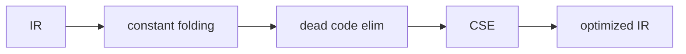

# Compilers 101 (7/10): 최적화 기초

이 글은 Compilers 101 시리즈의 일곱 번째 글입니다.

컴파일러가 `2 + 3 * 4`를 실행할 때마다 계산하지 않고 미리 `14`로 바꿔 둘 수 있다는 사실을 이해하면, 최적화가 “더 빠르게”만이 아니라 “의미를 절대 바꾸지 않으면서” 수행되는 정교한 변환이라는 점이 드러납니다.

## 먼저 던지는 질문

- 최적화에서 가장 절대적인 규칙은 무엇일까요?
- constant folding은 어떤 식으로 동작할까요?
- dead code elimination은 어떤 정보를 기반으로 할까요?

## 큰 그림


*Compilers 101 7장 흐름 개요*

## 왜 중요한가

같은 알고리즘이라도 최적화가 잘 되면 10배 빠르게 돌거나 크기가 10분의 1로 줄 수 있습니다. 반대로 잘못된 최적화는 프로그램 의미 자체를 바꿔 버립니다. 그래서 최적화기는 성능 도구이면서 동시에 신뢰성 시험대이기도 합니다.

> “더 빠르게, 그러나 의미는 그대로.” 이 두 조건을 동시에 지키는 것이 최적화기의 일입니다.

## 핵심 개념 한눈에 보기



각 패스는 IR을 받아 IR을 내보냅니다. 그래서 작은 변환을 여러 개 합성할 수 있습니다.

## 핵심 용어

- **패스(pass)**: IR을 한 번 순회하며 수행하는 변환입니다.
- **constant folding**: 상수끼리의 계산을 컴파일 시점에 미리 수행하는 최적화입니다.
- **dead code elimination**: 결과가 전혀 사용되지 않는 코드를 제거하는 최적화입니다.
- **common subexpression elimination**: 동일한 표현식의 중복 계산을 제거하는 최적화입니다.
- **strength reduction**: `x * 2`를 `x + x`나 `x << 1`로 바꾸는 식의 저비용 연산 대체입니다.

## 변경 전후

**Before — 순진한 IR**

```text
t1 = 2 * 3
t2 = 1 + t1
t3 = t2
return t3
```

**After — 최적화된 IR**

```text
return 7
```

결과는 같지만 명령어 수는 4개에서 1개로 줄어듭니다.

## 실습: 작은 최적화기 만들기

### 1단계 — IR 명령어 표현

```python
# 1_inst.py
# work on tuples of (op, dst, src1, src2)
code = [
    ("LOAD", "t1", 2, None),
    ("LOAD", "t2", 3, None),
    ("*",    "t3", "t1", "t2"),
    ("LOAD", "t4", 1, None),
    ("+",    "t5", "t4", "t3"),
    ("RET",  None, "t5", None),
]
```

대부분의 변환은 결국 이런 평평한 리스트를 대상으로 동작합니다.

### 2단계 — constant folding

```python
# 2_fold.py
def fold(code):
    consts = {}
    out = []
    for op, dst, a, b in code:
        if op == "LOAD" and isinstance(a, int):
            consts[dst] = a; out.append((op, dst, a, b)); continue
        if op in "+-*/" and a in consts and b in consts:
            v = {"+":consts[a]+consts[b],"-":consts[a]-consts[b],
                 "*":consts[a]*consts[b],"/":consts[a]//consts[b]}[op]
            consts[dst] = v
            out.append(("LOAD", dst, v, None))
        else:
            out.append((op, dst, a, b))
    return out
```

상수 환경을 유지하면서 양쪽 피연산자가 모두 상수면 그 자리에서 계산해 버립니다.

### 3단계 — dead code elimination

```python
# 3_dce.py
def dce(code):
    used = set()
    # gather use info from the bottom up
    for op, dst, a, b in reversed(code):
        if op == "RET":
            used.add(a)
        else:
            if dst in used:
                if isinstance(a, str): used.add(a)
                if isinstance(b, str): used.add(b)
    # one more pass keeps only live instructions
    return [(op, dst, a, b) for op, dst, a, b in code
            if op == "RET" or dst in used]
```

아래에서 위로 사용 정보를 모은 뒤, 결과가 쓰이지 않는 명령어를 버립니다.

### 4단계 — 패스 조합하기

```python
# 4_pipeline.py
def optimize(code):
    code = fold(code)
    code = dce(code)
    return code

for inst in optimize(code): print(inst)
```

패스는 함수처럼 조합할 수 있습니다. 같은 패스를 두 번 이상 돌리면 더 줄어드는 경우도 많습니다.

### 5단계 — CSE의 직관

```python
# 5_cse.py
# the same right-hand side appearing twice
# t1 = a + b
# t2 = a + b   <- same expression
# replace the second line with t2 = t1
```

`(op, src1, src2) → dst` 형태의 해시 테이블만 있어도 기본 아이디어는 구현됩니다. SSA 형태에서는 특히 더 단순해집니다.

## 이 코드에서 먼저 봐야 할 점

- 모든 패스는 IR → IR 변환입니다.
- 각 패스는 작고 단순해야 합니다.
- 패스 순서는 결과 품질에 영향을 줍니다.
- “고정점까지 반복 실행” 패턴이 매우 흔합니다.

## 자주 하는 실수 다섯 가지

1. **부작용을 무시한 DCE를 하는 것**입니다. I/O 호출은 결과가 안 쓰여도 살아 있어야 합니다.
2. **부동소수점 계산을 무심코 folding하는 것**입니다. 결합법칙이 깨질 수 있습니다.
3. **분기 구조를 무시한 CSE를 하는 것**입니다. 같은 식이라도 basic block이 다르면 값이 다를 수 있습니다.
4. **패스 순서를 고민하지 않는 것**입니다. 보통 `fold → dce` 순서가 안전한 출발점입니다.
5. **한 번만 실행하고 끝내는 것**입니다. folding이 새 dead code를 만들고, DCE가 새 folding 기회를 만들 수 있습니다.

## 실무에서는 이렇게 나타납니다

LLVM에는 수십 개의 패스가 있으며, `-O2`, `-O3` 같은 플래그는 어떤 패스를 어떤 순서로 돌릴지 묶어 둔 설정입니다. JIT 컴파일러는 hot path에 더 공격적인 최적화를 적용하고, PGO는 실제 실행 데이터를 바탕으로 패스 선택을 더 정교하게 합니다.

## 숙련된 엔지니어는 이렇게 봅니다

- 새 패스를 추가하기 전에 먼저 의미 보존을 검증합니다.
- 패스를 작고 단일 책임으로 유지합니다.
- 고정점 반복이 흔한 패턴이라는 점을 압니다.
- 추측보다 프로파일 기반 판단을 신뢰합니다.
- “이 변환이 어떤 아키텍처에서 실제 이득을 내는가?”를 항상 묻습니다.

## 체크리스트

- [ ] 의미 보존이 최적화의 절대 규칙이라는 점을 받아들였습니까?
- [ ] constant folding을 한 페이지 안에 직접 쓸 수 있습니까?
- [ ] DCE가 사용 정보 분석에서 나온다는 점을 설명할 수 있습니까?
- [ ] 패스 순서가 왜 결과에 영향을 주는지 설명할 수 있습니까?
- [ ] SSA에서 CSE가 더 쉬워지는 직관을 갖고 있습니까?

## 연습 문제

1. 위 `fold`에 strength reduction(`x * 2 → x + x`)을 추가해 보세요.
2. `fold + dce`를 더 이상 줄어들지 않을 때까지 반복하는 고정점 루프를 작성해 보세요.
3. `PRINT`, `STORE` 같은 부작용 명령어를 추가하고 DCE가 지우지 않도록 만들어 보세요.

## 정리와 다음 글

최적화는 IR 위에서 돌아가는 의미 보존 변환들의 연속입니다. 다음 글에서는 이 최적화된 IR을 실제 CPU 명령어로 바꾸는 마지막 단계, code generation을 다룹니다.

## 확장 실습: 프런트엔드부터 LLVM IR 직전까지 한 번에 검증하기

이 시점부터는 단계별 조각 실습을 넘어, 한 입력이 토큰, AST, 타입 정보, IR, 최적화 결과, 코드 생성 결과로 어떻게 이어지는지 한 번에 추적하는 연습이 필요합니다. 핵심은 코드 길이가 아니라 **변환 경계가 보이는 출력**을 남기는 것입니다. 아래 예시는 시리즈 전체를 관통하는 최소 골격입니다.

### 문법 고정: BNF 표기 먼저 확정하기

문법이 흔들리면 파서와 의미 분석 경계도 함께 흔들립니다. 구현 전에 BNF를 먼저 잠그면 우선순위, 결합성, 허용 구문을 팀 단위로 공유할 수 있습니다.

```bnf
<program> ::= <stmt_list>
<stmt_list> ::= <stmt> | <stmt> <stmt_list>
<stmt> ::= "let" <ident> "=" <expr> ";" | "print" <expr> ";"
<expr> ::= <term> | <expr> "+" <term> | <expr> "-" <term>
<term> ::= <factor> | <term> "*" <factor> | <term> "/" <factor>
<factor> ::= <number> | <ident> | "(" <expr> ")"
```

### 렉서 출력 고정: 토큰과 위치 정보를 함께 기록하기

```python
from dataclasses import dataclass
import re

@dataclass
class Token:
    kind: str
    text: str
    line: int
    col: int

SPEC = [
    ("KW", r"\b(let|print)\b"),
    ("IDENT", r"[A-Za-z_][A-Za-z0-9_]*"),
    ("NUMBER", r"\d+"),
    ("OP", r"[+\-*/=]"),
    ("LPAREN", r"\("),
    ("RPAREN", r"\)"),
    ("SEMI", r";"),
    ("WS", r"[ \t\n]+"),
]

def lex(src: str) -> list[Token]:
    out: list[Token] = []
    i, line, col = 0, 1, 1
    while i < len(src):
        for kind, pat in SPEC:
            m = re.match(pat, src[i:])
            if not m:
                continue
            text = m.group(0)
            if kind != "WS":
                out.append(Token(kind, text, line, col))
            for ch in text:
                if ch == "
":
                    line += 1
                    col = 1
                else:
                    col += 1
            i += len(text)
            break
        else:
            raise SyntaxError(f"unexpected character {src[i]!r} at {line}:{col}")
    return out
```

이 출력은 이후 단계에서 오류 메시지 기준 좌표가 됩니다. line/col 정보가 없으면 파서와 의미 분석 품질을 끝까지 올리기 어렵습니다.

### AST 노드 정의: 구조를 명시적으로 분리하기

```python
from dataclasses import dataclass

@dataclass
class Number:
    value: int

@dataclass
class Identifier:
    name: str

@dataclass
class Binary:
    op: str
    left: object
    right: object

@dataclass
class LetStmt:
    name: str
    expr: object

@dataclass
class PrintStmt:
    expr: object
```

여기서 중요한 점은 문법 요소와 실행 요소를 섞지 않는 것입니다. AST는 실행기가 아니라 구조 표현이어야 하며, 해석/타입/코드 생성은 별도 단계로 분리하는 편이 장기적으로 안정적입니다.

### 의미 분석 골격: 선언, 참조, 타입을 한 번에 점검하기

```python
class Scope:
    def __init__(self, parent=None):
        self.parent = parent
        self.table: dict[str, str] = {}

    def define(self, name: str, ty: str):
        if name in self.table:
            raise TypeError(f"redeclared variable: {name}")
        self.table[name] = ty

    def resolve(self, name: str) -> str:
        if name in self.table:
            return self.table[name]
        if self.parent:
            return self.parent.resolve(name)
        raise NameError(f"undefined variable: {name}")

def type_of_expr(node, scope: Scope) -> str:
    if isinstance(node, Number):
        return "int"
    if isinstance(node, Identifier):
        return scope.resolve(node.name)
    if isinstance(node, Binary):
        lt = type_of_expr(node.left, scope)
        rt = type_of_expr(node.right, scope)
        if lt != "int" or rt != "int":
            raise TypeError(f"binary op expects int/int, got {lt}/{rt}")
        return "int"
    raise TypeError(f"unknown node: {node}")
```

시맨틱 단계에서 타입과 이름 해석을 확정하면, 뒤 단계(IR/최적화/코드 생성)는 오류 복구 부담을 크게 줄일 수 있습니다.

### IR 생성과 최적화 패스: 변환 파이프라인 분리하기

```python
def lower_expr(node, out, new_temp):
    if isinstance(node, Number):
        t = new_temp()
        out.append(("const", t, node.value))
        return t
    if isinstance(node, Identifier):
        t = new_temp()
        out.append(("load", t, node.name))
        return t
    if isinstance(node, Binary):
        l = lower_expr(node.left, out, new_temp)
        r = lower_expr(node.right, out, new_temp)
        t = new_temp()
        out.append((node.op, t, l, r))
        return t
    raise RuntimeError("unsupported node")

def constant_folding(ir):
    const = {}
    out = []
    for inst in ir:
        if inst[0] == "const":
            const[inst[1]] = inst[2]
            out.append(inst)
            continue
        if inst[0] in {"+", "-", "*", "/"} and inst[2] in const and inst[3] in const:
            a, b = const[inst[2]], const[inst[3]]
            v = {"+": a+b, "-": a-b, "*": a*b, "/": a//b}[inst[0]]
            const[inst[1]] = v
            out.append(("const", inst[1], v))
        else:
            out.append(inst)
    return out
```

`IR -> 최적화 패스 -> IR` 형태를 유지하면 패스를 안전하게 합성할 수 있고, 결과 비교 테스트도 단순해집니다.

### 코드 생성 스니펫: 단순 스택 머신 또는 어셈블리로 내리기

```python
def emit_stack_vm(ir):
    out = []
    for inst in ir:
        op = inst[0]
        if op == "const":
            out.append(f"PUSH {inst[2]}")
        elif op == "load":
            out.append(f"LOAD {inst[2]}")
        elif op == "+":
            out.append("ADD")
        elif op == "-":
            out.append("SUB")
        elif op == "*":
            out.append("MUL")
        elif op == "/":
            out.append("DIV")
    out.append("HALT")
    return out
```

이 수준의 생성기만 있어도 파서/의미 분석/최적화의 결과가 실제 실행 지시어로 어떻게 바뀌는지 빠르게 검증할 수 있습니다.

### LLVM IR 샘플 읽기: SSA 감각 익히기

```llvm
; 입력 소스의 개념: let x = 2 * 3; print x + 1;
define i32 @main() {
entry:
  %x = mul i32 2, 3
  %y = add i32 %x, 1
  ret i32 %y
}
```

SSA에서 `%x`, `%y`처럼 버전이 분리되면 데이터 흐름 분석과 레지스터 할당 전 단계가 단순해집니다. 시리즈 후반 주제(최적화, 코드 생성, JIT/AOT)를 이해할 때 이 표현이 공통 언어가 됩니다.

### 검증 기준: 단계별 스냅샷을 항상 남기기

실전에서는 정답 코드보다 검증 루틴이 먼저입니다. 최소한 다음 다섯 가지를 파일로 남기면 회귀를 추적하기 쉽습니다.

1. 토큰 덤프 (`tokens.json`)
2. AST 덤프 (`ast.json`)
3. 시맨틱 결과 (`symbols.json`, 타입 오류 목록)
4. 최적화 전후 IR (`ir_before.txt`, `ir_after.txt`)
5. 최종 코드 생성 결과 (`out.asm` 또는 `out.vm`)

이렇게 하면 “어디서 깨졌는지”가 즉시 분리되고, 팀 협업에서도 디버깅 비용이 크게 줄어듭니다.


### 단계별 실패 시나리오와 복구 전략

실제 프로젝트에서는 정답 입력보다 실패 입력이 더 많이 들어옵니다. 따라서 각 단계가 실패했을 때 **다음 단계로 무엇을 전달할지**를 먼저 정해야 합니다. 다음 표는 최소 운영 기준입니다.

| 단계 | 실패 예시 | 즉시 조치 | 다음 단계 전달 |
| --- | --- | --- | --- |
| 렉서 | 알 수 없는 문자 | 위치 포함 오류 생성 | 복구 가능한 토큰만 전달 |
| 파서 | 괄호 누락, 세미콜론 누락 | 동기화 토큰 기준으로 재시작 | 부분 AST와 오류 목록 전달 |
| 시맨틱 | 미선언 변수, 타입 불일치 | 심볼/타입 오류 축적 | 오류 수가 기준치 이하면 IR 생성 계속 |
| IR 생성 | 미지원 구문 | 노드 단위 경고와 스킵 | 분석 가능한 블록만 전달 |
| 최적화 | 패스 전제 위반 | 패스 비활성화 후 원본 IR 유지 | 코드 생성은 계속 |
| 코드 생성 | 레지스터 부족 | spill 강제, 속도 저하 허용 | 실행 가능한 바이너리 우선 |

이 기준은 "완벽한 컴파일"보다 "재현 가능한 컴파일"에 가깝습니다. 품질이 높은 컴파일러는 한 번에 많은 오류를 보여 주되, 어디까지 복구했는지 명확히 보고합니다.

### 테스트 입력 세트: 경계 조건을 먼저 고정하기

아래 입력 세트는 단계별 회귀를 빠르게 잡는 최소 묶음입니다.

```text
# 정상
let x = 2 + 3 * 4;
print x;

# 문법 오류
let x = (2 + 3;

# 의미 오류
print y;

# 최적화 검증
let z = 1 + 2 + 3 + 4;
print z;
```

각 입력에 대해 토큰, AST, 시맨틱 결과, IR, 최종 코드를 별도 파일로 남기면 변경 전후 차이를 기계적으로 비교할 수 있습니다.

### 간단한 골든 출력 비교 스크립트

```python
import json
from pathlib import Path

def save_snapshot(name: str, payload):
    out_dir = Path("artifacts")
    out_dir.mkdir(exist_ok=True)
    p = out_dir / f"{name}.json"
    p.write_text(json.dumps(payload, ensure_ascii=False, indent=2))

# 예시 사용
save_snapshot("tokens_case1", [{"kind": "NUMBER", "text": "2", "line": 1, "col": 1}])
save_snapshot("ast_case1", {"kind": "Binary", "op": "+"})
```

스냅샷 파일을 Git에 남기면 리팩터링 이후에도 파이프라인의 의미가 바뀌었는지 즉시 검출할 수 있습니다.

### 최적화 패스 예시: 상수 전파와 불필요 대입 제거

```python
def constant_propagation(ir):
    env = {}
    out = []
    for inst in ir:
        op = inst[0]
        if op == "const":
            env[inst[1]] = inst[2]
            out.append(inst)
        elif op in {"+", "-", "*", "/"}:
            a = env.get(inst[2], inst[2])
            b = env.get(inst[3], inst[3])
            if isinstance(a, int) and isinstance(b, int):
                v = {"+": a+b, "-": a-b, "*": a*b, "/": a//b}[op]
                env[inst[1]] = v
                out.append(("const", inst[1], v))
            else:
                out.append((op, inst[1], a, b))
        else:
            out.append(inst)
    return out

def remove_trivial_moves(ir):
    return [inst for inst in ir if not (inst[0] == "mov" and inst[1] == inst[2])]
```

최적화는 큰 패스 하나보다 작은 패스 여러 개가 유지보수에 유리합니다. 실패하면 해당 패스만 끄고 원본 IR로 복구할 수 있기 때문입니다.

### 코드 생성 검증: 간단한 레지스터 할당 로그 남기기

```python
REGS = ["r1", "r2", "r3"]

def assign_registers(temporaries):
    mapping = {}
    spill = []
    for t in temporaries:
        if len(mapping) < len(REGS):
            mapping[t] = REGS[len(mapping)]
        else:
            spill.append(t)
    return mapping, spill

m, s = assign_registers(["t1", "t2", "t3", "t4", "t5"])
print("reg-map", m)
print("spill ", s)
```

이 정도 로그만 있어도 특정 입력에서 왜 성능이 급락했는지 원인을 좁히기 쉽습니다. 특히 spill 급증은 코드 생성 병목의 대표 신호입니다.

### LLVM IR 비교 기준: 변경 전후를 줄 단위로 확인하기

```llvm
; before optimization
%t1 = mul i32 3, 4
%t2 = add i32 2, %t1
ret i32 %t2

; after optimization
ret i32 14
```

최적화가 의미를 보존하는지 검증할 때는 사람이 읽는 설명보다 IR diff가 더 신뢰할 수 있습니다. 동일 입력에서 `ret i32 14`로 바뀌면 folding이 실제로 적용되었음을 바로 확인할 수 있습니다.

### 팀 운영 체크포인트

1. 파서 변경 PR에는 반드시 BNF 변경 diff를 포함합니다.
2. 시맨틱 규칙 변경 PR에는 실패 사례 3개 이상을 테스트에 추가합니다.
3. 최적화 패스 추가 PR에는 비활성화 플래그를 함께 제공합니다.
4. 코드 생성 변경 PR에는 최소 두 아키텍처 이상의 스냅샷을 첨부합니다.
5. 릴리스 전에는 동일 입력에 대해 인터프리터 결과와 컴파일 결과를 교차 검증합니다.

이 체크포인트를 유지하면 기능 추가 속도보다 품질 일관성을 더 안정적으로 가져갈 수 있습니다.


### 마무리 점검: 단계 경계를 말로 설명해 보기

마지막으로, 구현을 잠시 멈추고 다음 질문에 답해 보기를 권합니다. 이 질문은 코드량이 아니라 이해도를 검증합니다.

- 렉서가 실패했을 때 파서가 받는 입력은 무엇입니까?
- 파서가 복구한 부분 AST를 시맨틱 단계에서 어디까지 신뢰합니까?
- 시맨틱 오류가 있어도 IR 생성을 계속할 조건은 무엇입니까?
- 최적화 패스를 껐을 때도 결과의 의미가 유지되는지 어떻게 확인합니까?
- 코드 생성 이후 실행 결과를 어떤 기준값과 비교합니까?

이 다섯 질문에 팀이 같은 답을 할 수 있으면, 파이프라인 확장 시 품질이 급격히 흔들릴 가능성이 크게 줄어듭니다. 반대로 답이 제각각이면, 새로운 문법이나 최적화 패스를 추가할 때 같은 종류의 회귀가 반복됩니다.

실무에서는 기능 추가보다 경계 합의가 먼저입니다. 경계를 합의한 다음 기능을 추가하면, 동일한 투자로 더 안정적인 컴파일러를 만들 수 있습니다.

추가로 최적화 단계에서는 "성능 이득"과 "검증 비용"을 함께 기록해야 합니다. 예를 들어 constant folding 하나를 추가했을 때 실행 시간이 8% 줄었지만, 부동소수점 경계 테스트를 20개 늘려야 한다면 그 비용까지 설계 문서에 남겨야 합니다. 이런 기록이 쌓여야 패스 우선순위를 합리적으로 조정할 수 있고, 운영 환경에서 예기치 않은 의미 변경을 사전에 차단할 수 있습니다.

## 처음 질문으로 돌아가기

- **최적화에서 가장 절대적인 규칙은 무엇일까요?**
  - 본문의 기준은 최적화 기초를 한 덩어리 개념으로 보지 않고 입력, 처리, 검증, 운영 신호가 만나는 경계로 나누어 확인하는 것입니다.
- **constant folding은 어떤 식으로 동작할까요?**
  - 예제와 그림에서는 어떤 값이 들어오고, 어느 단계에서 바뀌며, 어떤 기준으로 통과 또는 실패하는지를 먼저 확인해야 합니다.
- **dead code elimination은 어떤 정보를 기반으로 할까요?**
  - 운영에서는 이 판단을 체크리스트, 로그, 테스트로 남겨 다음 변경에서도 같은 실패가 반복되지 않게 막아야 합니다.

<!-- toc:begin -->
## 시리즈 목차

- [Compilers 101 (1/10): 컴파일러란 무엇인가?](./01-what-is-a-compiler.md)
- [Compilers 101 (2/10): 렉시컬 분석](./02-lexical-analysis.md)
- [Compilers 101 (3/10): 파싱과 AST](./03-parsing-and-ast.md)
- [Compilers 101 (4/10): 시맨틱 분석](./04-semantic-analysis.md)
- [Compilers 101 (5/10): 심볼 테이블과 스코프](./05-symbol-table-and-scope.md)
- [Compilers 101 (6/10): 중간 표현](./06-intermediate-representation.md)
- **최적화 기초 (현재 글)**
- 코드 생성 (예정)
- JIT vs AOT (예정)
- 작은 인터프리터 만들기 (예정)

<!-- toc:end -->

## 참고 자료

- Alfred V. Aho, Monica S. Lam, Ravi Sethi, Jeffrey D. Ullman, *Compilers: Principles, Techniques, and Tools* (2nd ed.), optimization chapters.
- Keith D. Cooper, Linda Torczon, *Engineering a Compiler* (2nd ed.), scalar-optimization and data-flow chapters.
- [LLVM’s Analysis and Transform Passes](https://llvm.org/docs/Passes.html)
- [LLVM — Using the New Pass Manager](https://llvm.org/docs/NewPassManager.html) — 기본 최적화 파이프라인과 패스 구성 방식.

- [이 시리즈 예제 코드 (book-examples)](https://github.com/yeongseon-books/book-examples/tree/main/compilers-101/ko)

Tags: Computer Science, Compilers, Optimization, ConstantFolding, DeadCode
