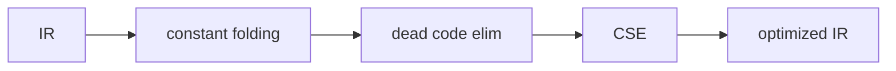

# Compilers 101 (7/10): 최적화 기초

각 패스는 IR을 받아 IR을 내보냅니다. 그래서 작은 변환을 여러 개 합성하고, 고정점에 도달할 때까지 반복 실행할 수 있습니다.

이 글은 Compilers 101 시리즈의 7번째 글입니다.

컴파일러가 `2 + 3 * 4`를 실행할 때마다 계산하지 않고 미리 `14`로 바꿔 둘 수 있다는 사실을 이해하면, 최적화가 "더 빠르게"만이 아니라 "의미를 절대 바꾸지 않으면서" 수행되는 정교한 변환이라는 점이 드러납니다.


*Compilers 101 7장 흐름 개요*

## 이 글에서 다룰 문제

- 최적화에서 가장 절대적인 규칙은 무엇일까요?
- constant folding은 어떤 식으로 동작할까요?
- dead code elimination은 어떤 정보를 기반으로 할까요?
- 이 단계에서 발생하는 가장 흔한 오류는 어떤 형태일까요?
- 이 개념을 실무에서 잘못 적용하면 어떤 문제가 생길까요?

같은 알고리즘이라도 최적화가 잘 되면 10배 빠르게 돌거나 크기가 10분의 1로 줄 수 있습니다. 반대로 잘못된 최적화는 프로그램 의미 자체를 바꿔 버립니다. 그래서 최적화기는 성능 도구이면서 동시에 신뢰성 시험대이기도 합니다.

> "더 빠르게, 그러나 의미는 그대로." 이 두 조건을 동시에 지키는 것이 최적화기의 일입니다.


```mermaid
flowchart LR
    A["IR"] --> B["constant folding"]
    B --> C["dead code elim"]
    C --> D["CSE"]
    D --> E["optimized IR"]
```

각 패스는 IR을 받아 IR을 내보냅니다. 그래서 작은 변환을 여러 개 합성할 수 있습니다.

## 핵심 용어

- **패스(pass)**: IR을 한 번 순회하며 수행하는 변환입니다. 각 패스는 작고 단일 책임을 가집니다.
- **constant folding**: 상수끼리의 계산을 컴파일 시점에 미리 수행하는 최적화입니다.
- **dead code elimination (DCE)**: 결과가 전혀 사용되지 않는 코드를 제거하는 최적화입니다.
- **common subexpression elimination (CSE)**: 동일한 표현식의 중복 계산을 제거하는 최적화입니다.
- **strength reduction**: `x * 2`를 `x + x`나 `x << 1`로 바꾸는 식의 저비용 연산 대체입니다.

## 변경 전후

**Before — 순진한 IR**

```text
t1 = LOAD 2
t2 = LOAD 3
t3 = t1 * t2     <- 2 * 3 = 6 (상수)
t4 = LOAD 1
t5 = t4 + t3     <- 1 + 6 = 7 (상수)
t6 = t5          <- t5의 복사
RET t6
```

**After — 최적화된 IR (constant folding + DCE + copy propagation)**

```text
t5 = LOAD 7
RET t5
```

결과는 같지만 명령어 수는 7개에서 2개로 줄어듭니다.

## 실습: 작은 최적화기 만들기

### 1단계 — IR 명령어 표현

```python
# 1_inst.py
from dataclasses import dataclass
from typing import Optional, Union

Operand = Union[int, float, str, None]

@dataclass
class Inst:
    op:   str
    dst:  Optional[str]
    src1: Operand
    src2: Operand = None

    def __repr__(self):
        if self.op == "LOAD":
            return f"  {self.dst} = LOAD {self.src1}"
        if self.op == "RET":
            return f"  RET {self.src1}"
        return f"  {self.dst} = {self.src1} {self.op} {self.src2}"

# 예시 IR: (2 * 3) + 1 를 순진하게 내린 결과
code = [
    Inst("LOAD", "t1", 2),
    Inst("LOAD", "t2", 3),
    Inst("*",    "t3", "t1", "t2"),
    Inst("LOAD", "t4", 1),
    Inst("+",    "t5", "t4", "t3"),
    Inst("RET",  None, "t5"),
]

def print_code(code: list, label: str = ""):
    if label:
        print(f"\n--- {label} ---")
    for inst in code:
        print(inst)
```

대부분의 변환은 결국 이런 평평한 리스트를 대상으로 동작합니다.

### 2단계 — constant folding

```python
# 2_fold.py
def fold(code: list[Inst]) -> list[Inst]:
    """
    양쪽 피연산자가 모두 상수인 연산을 컴파일 시점에 계산합니다.
    const_map: temporary -> int 값 (상수인 경우만 추적합니다)
    """
    const_map: dict[str, int] = {}
    out: list[Inst] = []

    for inst in code:
        op, dst, a, b = inst.op, inst.dst, inst.src1, inst.src2

        # LOAD 상수: 추적 테이블에 등록합니다
        if op == "LOAD" and isinstance(a, (int, float)):
            const_map[dst] = a
            out.append(inst)
            continue

        # 양쪽이 모두 상수인 산술 연산을 접습니다
        if op in ("+", "-", "*", "/") and a in const_map and b in const_map:
            ca, cb = const_map[a], const_map[b]
            try:
                result = {
                    "+": ca + cb,
                    "-": ca - cb,
                    "*": ca * cb,
                    "/": ca // cb if isinstance(ca, int) else ca / cb,
                }[op]
            except ZeroDivisionError:
                out.append(inst)   # 0으로 나누기는 접지 않습니다
                continue
            const_map[dst] = result
            out.append(Inst("LOAD", dst, result))
            continue

        # 비교 연산도 접습니다
        if op in ("<", ">", "==", "<=", ">=") and a in const_map and b in const_map:
            ca, cb = const_map[a], const_map[b]
            result = int({"<": ca < cb, ">": ca > cb, "==": ca == cb,
                           "<=": ca <= cb, ">=": ca >= cb}[op])
            const_map[dst] = result
            out.append(Inst("LOAD", dst, result))
            continue

        out.append(inst)

    return out

print_code(fold(code), "after constant folding")
# --- after constant folding ---
#   t1 = LOAD 2
#   t2 = LOAD 3
#   t3 = LOAD 6      <- 2 * 3 접힘
#   t4 = LOAD 1
#   t5 = LOAD 7      <- 1 + 6 접힘
#   RET t5
```

상수 환경을 유지하면서 양쪽 피연산자가 모두 상수면 그 자리에서 계산해 버립니다.

### 3단계 — dead code elimination (DCE)

```python
# 3_dce.py
def dce(code: list[Inst]) -> list[Inst]:
    """
    사용되지 않는 임시 변수를 계산하는 명령어를 제거합니다.
    뒤에서 앞으로 살아있는(live) 변수 집합을 추적합니다.
    """
    # 패스 1: 뒤에서 앞으로 use 집합을 수집합니다
    live: set[str] = set()
    liveness: list[set] = []   # 각 명령어 실행 직전의 live 집합

    for inst in reversed(code):
        op, dst, a, b = inst.op, inst.dst, inst.src1, inst.src2

        # RET, STORE, PRINT 같은 부작용 명령어는 항상 살아있습니다
        if op in ("RET", "STORE", "PRINT", "JMP", "JZ"):
            if isinstance(a, str): live.add(a)
            if isinstance(b, str): live.add(b)
        elif dst in live:
            # 이 dst가 이후에 사용된다면 이 명령어는 살아있습니다
            live.discard(dst)
            if isinstance(a, str): live.add(a)
            if isinstance(b, str): live.add(b)
        # dst가 사용되지 않으면 dead입니다 (live에 추가하지 않습니다)

        liveness.append(frozenset(live))

    liveness.reverse()

    # 패스 2: dead 명령어를 제거합니다
    out = []
    for inst, live_before in zip(code, liveness):
        op, dst = inst.op, inst.dst
        # 부작용 명령어 또는 결과가 사용되는 명령어만 남깁니다
        if op in ("RET", "STORE", "PRINT", "JMP", "JZ") or dst in live_before:
            out.append(inst)
        # 그 외: dead code (제거합니다)

    return out

print_code(dce(fold(code)), "after fold + DCE")
# --- after fold + DCE ---
#   t5 = LOAD 7
#   RET t5
```

아래에서 위로 사용 정보를 모은 뒤, 결과가 쓰이지 않는 명령어를 버립니다.

### 4단계 — copy propagation

```python
# 4_copy_prop.py
def copy_propagation(code: list[Inst]) -> list[Inst]:
    """
    t2 = t1 같은 단순 복사를 추적해서 t2를 t1으로 교체합니다.
    그러면 t2 = t1 자체가 dead code가 됩니다.
    """
    copies: dict[str, str] = {}   # t2 -> t1

    def resolve(v: Operand) -> Operand:
        """복사 체인을 따라 원본을 찾습니다."""
        while isinstance(v, str) and v in copies:
            v = copies[v]
        return v

    out = []
    for inst in code:
        op, dst, a, b = inst.op, inst.dst, inst.src1, inst.src2
        a = resolve(a)
        b = resolve(b)

        # LOAD t2, t1 (src1이 str이면 복사 명령)
        if op == "LOAD" and isinstance(a, str):
            copies[dst] = a
            out.append(Inst(op, dst, a, b))
        else:
            if dst and dst in copies:
                del copies[dst]  # 재정의 시 복사 추적에서 제거합니다
            out.append(Inst(op, dst, a, b))

    return out
```

### 5단계 — 패스 조합하고 고정점까지 반복하기

```python
# 5_pipeline.py
def optimize(code: list[Inst], max_rounds: int = 10) -> list[Inst]:
    """
    fold → copy_prop → DCE 를 고정점에 도달할 때까지 반복합니다.
    각 라운드마다 코드가 줄어들다가 더 이상 변하지 않으면 멈춥니다.
    """
    for round_n in range(max_rounds):
        prev_len = len(code)
        code = fold(code)
        code = copy_propagation(code)
        code = dce(code)
        if len(code) == prev_len:
            print(f"converged after {round_n + 1} round(s)")
            break
    return code

# 최적화 전
print_code(code, "before optimization")
# 최적화 후
opt = optimize(code)
print_code(opt, "after optimization")

# 명령어 수 비교
print(f"\nbefore: {len(code)} instructions")
print(f"after : {len(opt)} instructions")
print(f"reduction: {100*(1 - len(opt)/len(code)):.0f}%")
```

패스는 함수처럼 조합할 수 있습니다. 같은 패스를 두 번 이상 돌리면 더 줄어드는 경우도 많습니다.

### 6단계 — CSE (Common Subexpression Elimination) 직관

```python
# 6_cse.py
def cse(code: list[Inst]) -> list[Inst]:
    """
    같은 (op, src1, src2)를 가진 명령어의 중복 계산을 제거합니다.
    두 번째 등장부터는 첫 번째 결과를 재사용합니다.
    """
    expr_to_temp: dict[tuple, str] = {}   # (op, src1, src2) -> first dst
    copies: dict[str, str] = {}           # new dst -> old dst (복사로 대체)
    out = []

    for inst in code:
        op, dst, a, b = inst.op, inst.dst, inst.src1, inst.src2

        if op not in ("LOAD", "RET", "STORE", "JMP", "JZ"):
            key = (op, a, b)
            if key in expr_to_temp:
                # 이미 같은 계산이 있습니다. 복사로 대체합니다.
                copies[dst] = expr_to_temp[key]
                out.append(Inst("LOAD", dst, expr_to_temp[key]))
                continue
            else:
                expr_to_temp[key] = dst

        out.append(Inst(op, dst, a, b))

    return out

# 중복 계산 예시
dup_code = [
    Inst("LOAD", "t1", "a"),
    Inst("LOAD", "t2", "b"),
    Inst("+",    "t3", "t1", "t2"),   # a + b
    Inst("+",    "t4", "t1", "t2"),   # a + b 다시 (중복!)
    Inst("*",    "t5", "t3", "t4"),
    Inst("RET",  None, "t5"),
]
print_code(cse(dup_code), "after CSE")
# t4 = LOAD t3  <- t3와 같은 계산이므로 복사로 대체됩니다
```

`(op, src1, src2) → dst` 형태의 해시 테이블만 있어도 기본 아이디어는 구현됩니다. SSA 형태에서는 특히 더 단순해집니다.

## 핵심 정리

- 모든 패스는 IR → IR 변환입니다.
- 각 패스는 작고 단순해야 합니다.
- 패스 순서는 결과 품질에 영향을 줍니다.
- "고정점까지 반복 실행" 패턴이 매우 흔합니다.
- 의미 보존이 모든 최적화의 전제 조건입니다.

## 자주 하는 실수

1. **부작용을 무시한 DCE를 하는 것**입니다. I/O 호출, 메모리 쓰기는 결과가 안 쓰여도 살아 있어야 합니다. `op in ("STORE", "PRINT", "CALL")` 같은 부작용 목록을 유지하세요.
2. **부동소수점 계산을 무심코 folding하는 것**입니다. `(a + b) + c != a + (b + c)`일 수 있습니다. 부동소수점은 결합법칙이 깨집니다. 정수만 안전하게 접으세요.
3. **분기 구조를 무시한 CSE를 하는 것**입니다. 같은 식이라도 basic block이 다르면 값이 다를 수 있습니다. CSE는 같은 basic block 안에서만 적용하는 것이 안전합니다.
4. **패스 순서를 고민하지 않는 것**입니다. 보통 `fold → copy_prop → DCE` 순서가 안전한 출발점입니다. fold가 만든 새 상수를 DCE가 정리합니다.
5. **한 번만 실행하고 끝내는 것**입니다. folding이 새 dead code를 만들고, DCE가 새 folding 기회를 만들 수 있습니다. 고정점까지 반복하세요.

## 실무에서는 이렇게 나타납니다

LLVM에는 수십 개의 패스가 있으며, `-O2`, `-O3` 같은 플래그는 어떤 패스를 어떤 순서로 돌릴지 묶어 둔 설정입니다.

```bash
# LLVM 패스 목록 확인
llvm-as < /dev/null | opt -O2 -print-pipeline-passes -o /dev/null 2>&1 | head -20

# 특정 패스만 돌리기
opt -passes="instcombine,dce" input.ll -o output.ll
```

JIT 컴파일러는 hot path에 더 공격적인 최적화를 적용하고, PGO는 실제 실행 데이터를 바탕으로 패스 선택을 더 정교하게 합니다.

## 숙련된 엔지니어는 이렇게 봅니다

- 새 패스를 추가하기 전에 먼저 의미 보존을 검증합니다.
- 패스를 작고 단일 책임으로 유지합니다.
- 고정점 반복이 흔한 패턴이라는 점을 압니다.
- 추측보다 프로파일 기반 판단을 신뢰합니다.
- "이 변환이 어떤 아키텍처에서 실제 이득을 내는가?"를 항상 묻습니다.

## 운영 체크리스트

- [ ] 의미 보존이 최적화의 절대 규칙이라는 점을 받아들였습니까?
- [ ] constant folding을 한 페이지 안에 직접 쓸 수 있습니까?
- [ ] DCE가 사용 정보 분석에서 나온다는 점을 설명할 수 있습니까?
- [ ] 패스 순서가 왜 결과에 영향을 주는지 설명할 수 있습니까?
- [ ] SSA에서 CSE가 더 쉬워지는 직관을 갖고 있습니까?

## 연습 문제

1. 위 `fold`에 strength reduction(`x * 2 → x + x`, `x * 4 → x << 2`)을 추가해 보세요.
2. `fold + dce`를 더 이상 줄어들지 않을 때까지 반복하는 고정점 루프를 작성해 보세요.
3. `PRINT`, `STORE` 같은 부작용 명령어를 추가하고 DCE가 지우지 않도록 만들어 보세요.

## 처음 질문으로 돌아가기

- **최적화에서 가장 절대적인 규칙은 무엇일까요?**
  - 의미 보존입니다. 최적화 전후로 프로그램이 같은 입력에 대해 같은 출력을 내야 합니다. 이 규칙을 어기는 최적화는 버그이며, 얼마나 빠르게 실행되든 의미가 없습니다.
- **constant folding은 어떤 식으로 동작할까요?**
  - 상수 값을 담은 임시 변수 테이블을 유지하면서 IR을 순회합니다. 양쪽 피연산자가 모두 테이블에 있으면 컴파일 시점에 계산한 뒤 그 결과로 LOAD 명령어를 대체합니다. 연쇄적으로 새 상수가 생기므로 고정점에 도달할 때까지 반복합니다.
- **dead code elimination은 어떤 정보를 기반으로 할까요?**
  - liveness 분석입니다. IR을 뒤에서 앞으로 순회하며 "이 변수가 이후에 사용되는가?"를 추적합니다. 사용되지 않는 변수를 계산하는 명령어는 dead이므로 제거합니다. 단, 부작용 명령어(I/O, 메모리 쓰기)는 결과가 사용되지 않아도 항상 살아있습니다.

## 정리와 다음 글

최적화는 IR 위에서 돌아가는 의미 보존 변환들의 연속입니다. 다음 글에서는 이 최적화된 IR을 실제 CPU 명령어로 바꾸는 마지막 단계, code generation을 다룹니다.

<!-- toc:begin -->
## 시리즈 목차

- [Compilers 101 (1/10): 컴파일러란 무엇인가?](./01-what-is-a-compiler.md)
- [Compilers 101 (2/10): 렉시컬 분석](./02-lexical-analysis.md)
- [Compilers 101 (3/10): 파싱과 AST](./03-parsing-and-ast.md)
- [Compilers 101 (4/10): 시맨틱 분석](./04-semantic-analysis.md)
- [Compilers 101 (5/10): 심볼 테이블과 스코프](./05-symbol-table-and-scope.md)
- [Compilers 101 (6/10): 중간 표현](./06-intermediate-representation.md)
- **Compilers 101 (7/10): 최적화 기초 (현재 글)**
- [Compilers 101 (8/10): 코드 생성](./08-code-generation.md)
- [Compilers 101 (9/10): JIT vs AOT](./09-jit-vs-aot.md)
- [작은 인터프리터 만들기](./10-building-a-tiny-interpreter.md)

<!-- toc:end -->

## 참고 자료

- Alfred V. Aho, Monica S. Lam, Ravi Sethi, Jeffrey D. Ullman, *Compilers: Principles, Techniques, and Tools* (2nd ed.), optimization chapters.
- Keith D. Cooper, Linda Torczon, *Engineering a Compiler* (2nd ed.), scalar-optimization and data-flow chapters.
- [LLVM's Analysis and Transform Passes](https://llvm.org/docs/Passes.html)
- [LLVM — Using the New Pass Manager](https://llvm.org/docs/NewPassManager.html) — 기본 최적화 파이프라인과 패스 구성 방식.

- [이 시리즈 예제 코드 (book-examples)](https://github.com/yeongseon-books/book-examples/tree/main/compilers-101/ko)

Tags: Computer Science, Compilers, Optimization, ConstantFolding, DeadCode
