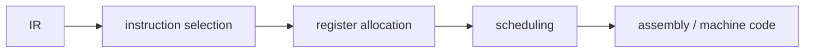

# Compilers 101 (8/10): 코드 생성

이 글은 Compilers 101 시리즈의 여덟 번째 글입니다.

IR에는 `t1`, `t2`, `t3`처럼 임시 값이 무한히 있는 것처럼 보이지만 실제 CPU에는 레지스터가 몇 개 없다는 사실을 이해하면, 코드 생성이 왜 컴파일러 백엔드의 핵심 기술인지 바로 체감하게 됩니다.

## 먼저 던지는 질문

- 코드 생성이 해결해야 하는 두 핵심 문제는 무엇일까요?
- instruction selection은 어떤 직관으로 동작할까요?
- register allocation은 왜 그래프 색칠 문제로 보일까요?

## 큰 그림


*Compilers 101 8장 흐름 개요*

## 왜 중요한가

앞 단계가 모두 잘 되어 있어도 마지막에 잘못 내리면 프로그램은 실행되지 않습니다. 같은 IR이라도 백엔드 품질이 낮으면 실행 속도가 몇 배씩 차이 날 수 있습니다. 그래서 코드 생성은 컴파일러의 최종 평판을 좌우합니다.

> 이론은 IR에서 끝나지만, 실력은 백엔드에서 드러납니다.

## 핵심 개념 한눈에 보기



이 세 단계가 거의 모든 백엔드의 뼈대입니다.

## 핵심 용어

- **instruction selection**: IR 노드마다 어떤 CPU 명령어를 쓸지 고르는 과정입니다.
- **register allocation**: 가상 레지스터를 실제 물리 레지스터에 매핑하는 과정입니다.
- **spill**: 레지스터가 모자라 임시 값을 메모리에 저장하는 일입니다.
- **calling convention**: 함수 호출 시 어떤 레지스터에 어떤 값을 넣을지에 대한 약속입니다.
- **ABI**: 서로 다른 컴파일 결과물이 함께 호출되고 연결될 수 있게 하는 이진 인터페이스 규약입니다.

## 변경 전후

**Before — 무한 가상 레지스터를 가진 IR**

```text
t1 = LOAD a
t2 = LOAD b
t3 = t1 + t2
RET t3
```

**After — 실제 명령어 (예: x86-64)**

```asm
mov rax, [a]
add rax, [b]
ret
```

가상 레지스터들이 실제 레지스터에 접혀 들어가고, LOAD와 ADD가 결합되기도 합니다.

## 실습: 작은 코드 생성기 만들기

### 1단계 — 직선형 instruction selection

```python
# 1_select.py
# very simple 1:1 matching
def select(inst):
    op, dst, a, b = inst
    if op == "LOAD":  return [f"mov {dst}, {a}"]
    if op == "+":     return [f"mov {dst}, {a}", f"add {dst}, {b}"]
    if op == "*":     return [f"mov {dst}, {a}", f"imul {dst}, {b}"]
    if op == "RET":   return [f"mov rax, {a}", "ret"]
    return [f"; unknown {op}"]

for inst in [("LOAD","t1",2,None),("LOAD","t2",3,None),
             ("+","t3","t1","t2"),("RET",None,"t3",None)]:
    print("\n".join(select(inst)))
```

처음에는 가장 단순한 1:1 매칭으로 시작하면 됩니다. 더 정교한 백엔드는 트리 패턴 매칭으로 발전합니다.

### 2단계 — 간섭 그래프

```python
# 2_interference.py
# two temporaries alive at the same time cannot share a register
# → an edge in the graph
def interferences(code):
    live = set(); edges = set()
    for op, dst, a, b in reversed(code):
        if op == "RET":
            live.add(a); continue
        if dst in live:
            live.discard(dst)
        for x in live:
            if isinstance(dst, str):
                edges.add(frozenset({dst, x}))
        if isinstance(a, str): live.add(a)
        if isinstance(b, str): live.add(b)
    return edges
```

동시에 살아 있는 값끼리는 같은 레지스터를 공유할 수 없습니다. 그 관계를 그래프로 만들면 register allocation 문제를 더 명확히 볼 수 있습니다.

### 3단계 — 그래프 색칠 직관

```python
# 3_color.py
# given K colors (registers), color so adjacent nodes differ
def greedy_color(nodes, edges, k):
    color = {}
    for n in nodes:
        used = {color[m] for m in nodes if frozenset({n,m}) in edges and m in color}
        for c in range(k):
            if c not in used:
                color[n] = c; break
        else:
            color[n] = "SPILL"
    return color
```

K개의 색으로 칠할 수 없으면 spill 후보가 됩니다. 실제 알고리즘은 더 정교하지만 핵심 직관은 같습니다.

### 4단계 — spill: 메모리에 임시 보관하기

```python
# 4_spill.py
# when registers run out, save to stack and reload
def spill(code, var):
    new = []
    for op, dst, a, b in code:
        if op != "RET" and a == var:
            new.append(("LOAD", "tmp", f"[stack:{var}]", None)); a = "tmp"
        if dst == var:
            new.append((op, "tmp", a, b))
            new.append(("STORE", None, "tmp", f"[stack:{var}]")); continue
        new.append((op, dst, a, b))
    return new
```

spill은 느리지만 올바릅니다. 좋은 백엔드는 spill을 최소화하지만, spill 자체를 실패로 보지는 않습니다.

### 5단계 — calling convention

```python
# 5_call.py
# x86-64 System V: first 6 integer args go in rdi, rsi, rdx, rcx, r8, r9
# return value in rax
def emit_call(name, args):
    regs = ["rdi","rsi","rdx","rcx","r8","r9"]
    out = []
    for r, a in zip(regs, args):
        out.append(f"mov {r}, {a}")
    out.append(f"call {name}")
    return out

print("\n".join(emit_call("printf", ["fmt", "x"])))
```

여러분의 함수와 외부 라이브러리가 같은 약속을 따라야 호출이 성립합니다. 그것이 ABI의 핵심입니다.

## 이 코드에서 먼저 봐야 할 점

- instruction selection은 패턴 매칭의 한 형태입니다.
- register allocation의 본질은 그래프 색칠입니다.
- spill은 패배가 아니라 정상적인 도구입니다.
- calling convention을 어기면 프로그램은 쉽게 비정상 종료합니다.

## 자주 하는 실수 다섯 가지

1. **liveness 분석 없이 레지스터를 배정하는 것**입니다. 아직 살아 있는 값을 덮어쓸 수 있습니다.
2. **spill을 지나치게 두려워하는 것**입니다. 일부 spill은 불가피합니다.
3. **자체 calling convention을 발명하는 것**입니다. 외부 라이브러리와 상호 운용할 수 없습니다.
4. **EFLAGS 같은 암묵 레지스터를 잊는 것**입니다. compare와 jump 사이에 다른 명령을 끼우면 깨질 수 있습니다.
5. **너무 이르게 고급 instruction selection 최적화에 집착하는 것**입니다. 먼저 정확한 1:1 변환부터 동작시켜야 합니다.

## 실무에서는 이렇게 나타납니다

LLVM 백엔드는 SelectionDAG와 GlobalISel처럼 서로 다른 선택 전략을 제공합니다. register allocator도 LinearScan, Greedy 같은 여러 방식을 선택할 수 있습니다. ABI는 운영체제와 아키텍처마다 달라서, 같은 함수라도 Linux x86-64와 macOS ARM64에서 호출 방식이 달라집니다.

## 숙련된 엔지니어는 이렇게 봅니다

- 가장 먼저 “이 백엔드는 어떤 ABI를 따르는가?”를 확인합니다.
- 새 아키텍처에서는 레지스터 개수와 calling convention부터 봅니다.
- spill을 두려워하지 않고, 정확성을 우선합니다.
- 백엔드 작업의 출발점을 liveness 분석으로 잡습니다.
- flags, 예외, 원자성 같은 암묵 요소를 항상 의심합니다.

## 체크리스트

- [ ] 코드 생성이 해결하는 두 핵심 문제를 말할 수 있습니까?
- [ ] register allocation을 그래프 색칠로 이해하고 있습니까?
- [ ] spill이 무엇이며 언제 생기는지 설명할 수 있습니까?
- [ ] calling convention과 ABI의 차이를 설명할 수 있습니까?
- [ ] liveness 분석이 왜 필요한지 한 문장으로 말할 수 있습니까?

## 연습 문제

1. 위 `select` 함수에 비교(`<`)와 조건 분기(`jl`)를 추가해 보세요.
2. 간섭 그래프를 직접 그리고 `k=2`일 때 어떤 노드가 spill되는지 찾아보세요.
3. 같은 레지스터를 두 함수 호출이 동시에 원할 때 spill이 어디에 들어가야 하는지 추론해 보세요.

## 정리와 다음 글

코드 생성은 IR과 실제 CPU 사이의 마지막 다리입니다. 다음 글에서는 이 전체 파이프라인이 언제 실행되는지를 비교하는 주제, JIT vs AOT를 다룹니다.

## 확장 실습: 프런트엔드부터 LLVM IR 직전까지 한 번에 검증하기

이 시점부터는 단계별 조각 실습을 넘어, 한 입력이 토큰, AST, 타입 정보, IR, 최적화 결과, 코드 생성 결과로 어떻게 이어지는지 한 번에 추적하는 연습이 필요합니다. 핵심은 코드 길이가 아니라 **변환 경계가 보이는 출력**을 남기는 것입니다. 아래 예시는 시리즈 전체를 관통하는 최소 골격입니다.

### 문법 고정: BNF 표기 먼저 확정하기

문법이 흔들리면 파서와 의미 분석 경계도 함께 흔들립니다. 구현 전에 BNF를 먼저 잠그면 우선순위, 결합성, 허용 구문을 팀 단위로 공유할 수 있습니다.

```bnf
<program> ::= <stmt_list>
<stmt_list> ::= <stmt> | <stmt> <stmt_list>
<stmt> ::= "let" <ident> "=" <expr> ";" | "print" <expr> ";"
<expr> ::= <term> | <expr> "+" <term> | <expr> "-" <term>
<term> ::= <factor> | <term> "*" <factor> | <term> "/" <factor>
<factor> ::= <number> | <ident> | "(" <expr> ")"
```

### 렉서 출력 고정: 토큰과 위치 정보를 함께 기록하기

```python
from dataclasses import dataclass
import re

@dataclass
class Token:
    kind: str
    text: str
    line: int
    col: int

SPEC = [
    ("KW", r"\b(let|print)\b"),
    ("IDENT", r"[A-Za-z_][A-Za-z0-9_]*"),
    ("NUMBER", r"\d+"),
    ("OP", r"[+\-*/=]"),
    ("LPAREN", r"\("),
    ("RPAREN", r"\)"),
    ("SEMI", r";"),
    ("WS", r"[ \t\n]+"),
]

def lex(src: str) -> list[Token]:
    out: list[Token] = []
    i, line, col = 0, 1, 1
    while i < len(src):
        for kind, pat in SPEC:
            m = re.match(pat, src[i:])
            if not m:
                continue
            text = m.group(0)
            if kind != "WS":
                out.append(Token(kind, text, line, col))
            for ch in text:
                if ch == "
":
                    line += 1
                    col = 1
                else:
                    col += 1
            i += len(text)
            break
        else:
            raise SyntaxError(f"unexpected character {src[i]!r} at {line}:{col}")
    return out
```

이 출력은 이후 단계에서 오류 메시지 기준 좌표가 됩니다. line/col 정보가 없으면 파서와 의미 분석 품질을 끝까지 올리기 어렵습니다.

### AST 노드 정의: 구조를 명시적으로 분리하기

```python
from dataclasses import dataclass

@dataclass
class Number:
    value: int

@dataclass
class Identifier:
    name: str

@dataclass
class Binary:
    op: str
    left: object
    right: object

@dataclass
class LetStmt:
    name: str
    expr: object

@dataclass
class PrintStmt:
    expr: object
```

여기서 중요한 점은 문법 요소와 실행 요소를 섞지 않는 것입니다. AST는 실행기가 아니라 구조 표현이어야 하며, 해석/타입/코드 생성은 별도 단계로 분리하는 편이 장기적으로 안정적입니다.

### 의미 분석 골격: 선언, 참조, 타입을 한 번에 점검하기

```python
class Scope:
    def __init__(self, parent=None):
        self.parent = parent
        self.table: dict[str, str] = {}

    def define(self, name: str, ty: str):
        if name in self.table:
            raise TypeError(f"redeclared variable: {name}")
        self.table[name] = ty

    def resolve(self, name: str) -> str:
        if name in self.table:
            return self.table[name]
        if self.parent:
            return self.parent.resolve(name)
        raise NameError(f"undefined variable: {name}")

def type_of_expr(node, scope: Scope) -> str:
    if isinstance(node, Number):
        return "int"
    if isinstance(node, Identifier):
        return scope.resolve(node.name)
    if isinstance(node, Binary):
        lt = type_of_expr(node.left, scope)
        rt = type_of_expr(node.right, scope)
        if lt != "int" or rt != "int":
            raise TypeError(f"binary op expects int/int, got {lt}/{rt}")
        return "int"
    raise TypeError(f"unknown node: {node}")
```

시맨틱 단계에서 타입과 이름 해석을 확정하면, 뒤 단계(IR/최적화/코드 생성)는 오류 복구 부담을 크게 줄일 수 있습니다.

### IR 생성과 최적화 패스: 변환 파이프라인 분리하기

```python
def lower_expr(node, out, new_temp):
    if isinstance(node, Number):
        t = new_temp()
        out.append(("const", t, node.value))
        return t
    if isinstance(node, Identifier):
        t = new_temp()
        out.append(("load", t, node.name))
        return t
    if isinstance(node, Binary):
        l = lower_expr(node.left, out, new_temp)
        r = lower_expr(node.right, out, new_temp)
        t = new_temp()
        out.append((node.op, t, l, r))
        return t
    raise RuntimeError("unsupported node")

def constant_folding(ir):
    const = {}
    out = []
    for inst in ir:
        if inst[0] == "const":
            const[inst[1]] = inst[2]
            out.append(inst)
            continue
        if inst[0] in {"+", "-", "*", "/"} and inst[2] in const and inst[3] in const:
            a, b = const[inst[2]], const[inst[3]]
            v = {"+": a+b, "-": a-b, "*": a*b, "/": a//b}[inst[0]]
            const[inst[1]] = v
            out.append(("const", inst[1], v))
        else:
            out.append(inst)
    return out
```

`IR -> 최적화 패스 -> IR` 형태를 유지하면 패스를 안전하게 합성할 수 있고, 결과 비교 테스트도 단순해집니다.

### 코드 생성 스니펫: 단순 스택 머신 또는 어셈블리로 내리기

```python
def emit_stack_vm(ir):
    out = []
    for inst in ir:
        op = inst[0]
        if op == "const":
            out.append(f"PUSH {inst[2]}")
        elif op == "load":
            out.append(f"LOAD {inst[2]}")
        elif op == "+":
            out.append("ADD")
        elif op == "-":
            out.append("SUB")
        elif op == "*":
            out.append("MUL")
        elif op == "/":
            out.append("DIV")
    out.append("HALT")
    return out
```

이 수준의 생성기만 있어도 파서/의미 분석/최적화의 결과가 실제 실행 지시어로 어떻게 바뀌는지 빠르게 검증할 수 있습니다.

### LLVM IR 샘플 읽기: SSA 감각 익히기

```llvm
; 입력 소스의 개념: let x = 2 * 3; print x + 1;
define i32 @main() {
entry:
  %x = mul i32 2, 3
  %y = add i32 %x, 1
  ret i32 %y
}
```

SSA에서 `%x`, `%y`처럼 버전이 분리되면 데이터 흐름 분석과 레지스터 할당 전 단계가 단순해집니다. 시리즈 후반 주제(최적화, 코드 생성, JIT/AOT)를 이해할 때 이 표현이 공통 언어가 됩니다.

### 검증 기준: 단계별 스냅샷을 항상 남기기

실전에서는 정답 코드보다 검증 루틴이 먼저입니다. 최소한 다음 다섯 가지를 파일로 남기면 회귀를 추적하기 쉽습니다.

1. 토큰 덤프 (`tokens.json`)
2. AST 덤프 (`ast.json`)
3. 시맨틱 결과 (`symbols.json`, 타입 오류 목록)
4. 최적화 전후 IR (`ir_before.txt`, `ir_after.txt`)
5. 최종 코드 생성 결과 (`out.asm` 또는 `out.vm`)

이렇게 하면 “어디서 깨졌는지”가 즉시 분리되고, 팀 협업에서도 디버깅 비용이 크게 줄어듭니다.


### 단계별 실패 시나리오와 복구 전략

실제 프로젝트에서는 정답 입력보다 실패 입력이 더 많이 들어옵니다. 따라서 각 단계가 실패했을 때 **다음 단계로 무엇을 전달할지**를 먼저 정해야 합니다. 다음 표는 최소 운영 기준입니다.

| 단계 | 실패 예시 | 즉시 조치 | 다음 단계 전달 |
| --- | --- | --- | --- |
| 렉서 | 알 수 없는 문자 | 위치 포함 오류 생성 | 복구 가능한 토큰만 전달 |
| 파서 | 괄호 누락, 세미콜론 누락 | 동기화 토큰 기준으로 재시작 | 부분 AST와 오류 목록 전달 |
| 시맨틱 | 미선언 변수, 타입 불일치 | 심볼/타입 오류 축적 | 오류 수가 기준치 이하면 IR 생성 계속 |
| IR 생성 | 미지원 구문 | 노드 단위 경고와 스킵 | 분석 가능한 블록만 전달 |
| 최적화 | 패스 전제 위반 | 패스 비활성화 후 원본 IR 유지 | 코드 생성은 계속 |
| 코드 생성 | 레지스터 부족 | spill 강제, 속도 저하 허용 | 실행 가능한 바이너리 우선 |

이 기준은 "완벽한 컴파일"보다 "재현 가능한 컴파일"에 가깝습니다. 품질이 높은 컴파일러는 한 번에 많은 오류를 보여 주되, 어디까지 복구했는지 명확히 보고합니다.

### 테스트 입력 세트: 경계 조건을 먼저 고정하기

아래 입력 세트는 단계별 회귀를 빠르게 잡는 최소 묶음입니다.

```text
# 정상
let x = 2 + 3 * 4;
print x;

# 문법 오류
let x = (2 + 3;

# 의미 오류
print y;

# 최적화 검증
let z = 1 + 2 + 3 + 4;
print z;
```

각 입력에 대해 토큰, AST, 시맨틱 결과, IR, 최종 코드를 별도 파일로 남기면 변경 전후 차이를 기계적으로 비교할 수 있습니다.

### 간단한 골든 출력 비교 스크립트

```python
import json
from pathlib import Path

def save_snapshot(name: str, payload):
    out_dir = Path("artifacts")
    out_dir.mkdir(exist_ok=True)
    p = out_dir / f"{name}.json"
    p.write_text(json.dumps(payload, ensure_ascii=False, indent=2))

# 예시 사용
save_snapshot("tokens_case1", [{"kind": "NUMBER", "text": "2", "line": 1, "col": 1}])
save_snapshot("ast_case1", {"kind": "Binary", "op": "+"})
```

스냅샷 파일을 Git에 남기면 리팩터링 이후에도 파이프라인의 의미가 바뀌었는지 즉시 검출할 수 있습니다.

### 최적화 패스 예시: 상수 전파와 불필요 대입 제거

```python
def constant_propagation(ir):
    env = {}
    out = []
    for inst in ir:
        op = inst[0]
        if op == "const":
            env[inst[1]] = inst[2]
            out.append(inst)
        elif op in {"+", "-", "*", "/"}:
            a = env.get(inst[2], inst[2])
            b = env.get(inst[3], inst[3])
            if isinstance(a, int) and isinstance(b, int):
                v = {"+": a+b, "-": a-b, "*": a*b, "/": a//b}[op]
                env[inst[1]] = v
                out.append(("const", inst[1], v))
            else:
                out.append((op, inst[1], a, b))
        else:
            out.append(inst)
    return out

def remove_trivial_moves(ir):
    return [inst for inst in ir if not (inst[0] == "mov" and inst[1] == inst[2])]
```

최적화는 큰 패스 하나보다 작은 패스 여러 개가 유지보수에 유리합니다. 실패하면 해당 패스만 끄고 원본 IR로 복구할 수 있기 때문입니다.

### 코드 생성 검증: 간단한 레지스터 할당 로그 남기기

```python
REGS = ["r1", "r2", "r3"]

def assign_registers(temporaries):
    mapping = {}
    spill = []
    for t in temporaries:
        if len(mapping) < len(REGS):
            mapping[t] = REGS[len(mapping)]
        else:
            spill.append(t)
    return mapping, spill

m, s = assign_registers(["t1", "t2", "t3", "t4", "t5"])
print("reg-map", m)
print("spill ", s)
```

이 정도 로그만 있어도 특정 입력에서 왜 성능이 급락했는지 원인을 좁히기 쉽습니다. 특히 spill 급증은 코드 생성 병목의 대표 신호입니다.

### LLVM IR 비교 기준: 변경 전후를 줄 단위로 확인하기

```llvm
; before optimization
%t1 = mul i32 3, 4
%t2 = add i32 2, %t1
ret i32 %t2

; after optimization
ret i32 14
```

최적화가 의미를 보존하는지 검증할 때는 사람이 읽는 설명보다 IR diff가 더 신뢰할 수 있습니다. 동일 입력에서 `ret i32 14`로 바뀌면 folding이 실제로 적용되었음을 바로 확인할 수 있습니다.

### 팀 운영 체크포인트

1. 파서 변경 PR에는 반드시 BNF 변경 diff를 포함합니다.
2. 시맨틱 규칙 변경 PR에는 실패 사례 3개 이상을 테스트에 추가합니다.
3. 최적화 패스 추가 PR에는 비활성화 플래그를 함께 제공합니다.
4. 코드 생성 변경 PR에는 최소 두 아키텍처 이상의 스냅샷을 첨부합니다.
5. 릴리스 전에는 동일 입력에 대해 인터프리터 결과와 컴파일 결과를 교차 검증합니다.

이 체크포인트를 유지하면 기능 추가 속도보다 품질 일관성을 더 안정적으로 가져갈 수 있습니다.


### 마무리 점검: 단계 경계를 말로 설명해 보기

마지막으로, 구현을 잠시 멈추고 다음 질문에 답해 보기를 권합니다. 이 질문은 코드량이 아니라 이해도를 검증합니다.

- 렉서가 실패했을 때 파서가 받는 입력은 무엇입니까?
- 파서가 복구한 부분 AST를 시맨틱 단계에서 어디까지 신뢰합니까?
- 시맨틱 오류가 있어도 IR 생성을 계속할 조건은 무엇입니까?
- 최적화 패스를 껐을 때도 결과의 의미가 유지되는지 어떻게 확인합니까?
- 코드 생성 이후 실행 결과를 어떤 기준값과 비교합니까?

이 다섯 질문에 팀이 같은 답을 할 수 있으면, 파이프라인 확장 시 품질이 급격히 흔들릴 가능성이 크게 줄어듭니다. 반대로 답이 제각각이면, 새로운 문법이나 최적화 패스를 추가할 때 같은 종류의 회귀가 반복됩니다.

실무에서는 기능 추가보다 경계 합의가 먼저입니다. 경계를 합의한 다음 기능을 추가하면, 동일한 투자로 더 안정적인 컴파일러를 만들 수 있습니다.

## 처음 질문으로 돌아가기

- **코드 생성이 해결해야 하는 두 핵심 문제는 무엇일까요?**
  - 본문의 기준은 코드 생성를 한 덩어리 개념으로 보지 않고 입력, 처리, 검증, 운영 신호가 만나는 경계로 나누어 확인하는 것입니다.
- **instruction selection은 어떤 직관으로 동작할까요?**
  - 예제와 그림에서는 어떤 값이 들어오고, 어느 단계에서 바뀌며, 어떤 기준으로 통과 또는 실패하는지를 먼저 확인해야 합니다.
- **register allocation은 왜 그래프 색칠 문제로 보일까요?**
  - 운영에서는 이 판단을 체크리스트, 로그, 테스트로 남겨 다음 변경에서도 같은 실패가 반복되지 않게 막아야 합니다.

<!-- toc:begin -->
## 시리즈 목차

- [Compilers 101 (1/10): 컴파일러란 무엇인가?](./01-what-is-a-compiler.md)
- [Compilers 101 (2/10): 렉시컬 분석](./02-lexical-analysis.md)
- [Compilers 101 (3/10): 파싱과 AST](./03-parsing-and-ast.md)
- [Compilers 101 (4/10): 시맨틱 분석](./04-semantic-analysis.md)
- [Compilers 101 (5/10): 심볼 테이블과 스코프](./05-symbol-table-and-scope.md)
- [Compilers 101 (6/10): 중간 표현](./06-intermediate-representation.md)
- [Compilers 101 (7/10): 최적화 기초](./07-optimization-basics.md)
- **코드 생성 (현재 글)**
- JIT vs AOT (예정)
- 작은 인터프리터 만들기 (예정)

<!-- toc:end -->

## 참고 자료

- [Code generation (Wikipedia)](https://en.wikipedia.org/wiki/Code_generation_(compiler))
- [Register allocation (Wikipedia)](https://en.wikipedia.org/wiki/Register_allocation)
- [System V AMD64 ABI](https://gitlab.com/x86-psABIs/x86-64-ABI)
- [LLVM CodeGen overview](https://llvm.org/docs/CodeGenerator.html)

- [이 시리즈 예제 코드 (book-examples)](https://github.com/yeongseon-books/book-examples/tree/main/compilers-101/ko)

Tags: Computer Science, Compilers, CodeGen, RegisterAllocation, Assembly
