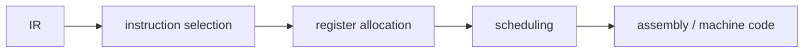

# 코드 생성

이 글은 Compilers 101 시리즈의 여덟 번째 글입니다. IR에는 `t1`, `t2`, `t3`처럼 임시 값이 무한히 있는 것처럼 보이지만 실제 CPU에는 레지스터가 몇 개 없다는 사실을 이해하면, 코드 생성이 왜 컴파일러 백엔드의 핵심 기술인지 바로 체감하게 됩니다.

## 이 글에서 다룰 문제

- 코드 생성이 해결해야 하는 두 핵심 문제는 무엇일까요?
- instruction selection은 어떤 직관으로 동작할까요?
- register allocation은 왜 그래프 색칠 문제로 보일까요?
- spill은 언제 왜 필요할까요?
- calling convention과 ABI는 왜 꼭 필요할까요?

> 코드 생성은 IR을 실제 명령어로 바꾸는 단계이며, 핵심 일은 어떤 명령어를 고를지와 값을 어디에 둘지를 결정하는 것입니다.

## 왜 중요한가

앞 단계가 모두 잘 되어 있어도 마지막에 잘못 내리면 프로그램은 실행되지 않습니다. 같은 IR이라도 백엔드 품질이 낮으면 실행 속도가 몇 배씩 차이 날 수 있습니다. 그래서 코드 생성은 컴파일러의 최종 평판을 좌우합니다.

> 이론은 IR에서 끝나지만, 실력은 백엔드에서 드러납니다.

## 핵심 개념 한눈에 보기



이 세 단계가 거의 모든 백엔드의 뼈대입니다.

## 핵심 용어

- **instruction selection**: IR 노드마다 어떤 CPU 명령어를 쓸지 고르는 과정입니다.
- **register allocation**: 가상 레지스터를 실제 물리 레지스터에 매핑하는 과정입니다.
- **spill**: 레지스터가 모자라 임시 값을 메모리에 저장하는 일입니다.
- **calling convention**: 함수 호출 시 어떤 레지스터에 어떤 값을 넣을지에 대한 약속입니다.
- **ABI**: 서로 다른 컴파일 결과물이 함께 호출되고 연결될 수 있게 하는 이진 인터페이스 규약입니다.

## Before / After

**Before — 무한 가상 레지스터를 가진 IR**

```text
t1 = LOAD a
t2 = LOAD b
t3 = t1 + t2
RET t3
```

**After — 실제 명령어 (예: x86-64)**

```asm
mov rax, [a]
add rax, [b]
ret
```

가상 레지스터들이 실제 레지스터에 접혀 들어가고, LOAD와 ADD가 결합되기도 합니다.

## 실습: 작은 코드 생성기 만들기

### 1단계 — 직선형 instruction selection

```python
# 1_select.py
# very simple 1:1 matching
def select(inst):
    op, dst, a, b = inst
    if op == "LOAD":  return [f"mov {dst}, {a}"]
    if op == "+":     return [f"mov {dst}, {a}", f"add {dst}, {b}"]
    if op == "*":     return [f"mov {dst}, {a}", f"imul {dst}, {b}"]
    if op == "RET":   return [f"mov rax, {a}", "ret"]
    return [f"; unknown {op}"]

for inst in [("LOAD","t1",2,None),("LOAD","t2",3,None),
             ("+","t3","t1","t2"),("RET",None,"t3",None)]:
    print("\n".join(select(inst)))
```

처음에는 가장 단순한 1:1 매칭으로 시작하면 됩니다. 더 정교한 백엔드는 트리 패턴 매칭으로 발전합니다.

### 2단계 — 간섭 그래프

```python
# 2_interference.py
# two temporaries alive at the same time cannot share a register
# → an edge in the graph
def interferences(code):
    live = set(); edges = set()
    for op, dst, a, b in reversed(code):
        if op == "RET":
            live.add(a); continue
        if dst in live:
            live.discard(dst)
        for x in live:
            if isinstance(dst, str):
                edges.add(frozenset({dst, x}))
        if isinstance(a, str): live.add(a)
        if isinstance(b, str): live.add(b)
    return edges
```

동시에 살아 있는 값끼리는 같은 레지스터를 공유할 수 없습니다. 그 관계를 그래프로 만들면 register allocation 문제를 더 명확히 볼 수 있습니다.

### 3단계 — 그래프 색칠 직관

```python
# 3_color.py
# given K colors (registers), color so adjacent nodes differ
def greedy_color(nodes, edges, k):
    color = {}
    for n in nodes:
        used = {color[m] for m in nodes if frozenset({n,m}) in edges and m in color}
        for c in range(k):
            if c not in used:
                color[n] = c; break
        else:
            color[n] = "SPILL"
    return color
```

K개의 색으로 칠할 수 없으면 spill 후보가 됩니다. 실제 알고리즘은 더 정교하지만 핵심 직관은 같습니다.

### 4단계 — spill: 메모리에 임시 보관하기

```python
# 4_spill.py
# when registers run out, save to stack and reload
def spill(code, var):
    new = []
    for op, dst, a, b in code:
        if op != "RET" and a == var:
            new.append(("LOAD", "tmp", f"[stack:{var}]", None)); a = "tmp"
        if dst == var:
            new.append((op, "tmp", a, b))
            new.append(("STORE", None, "tmp", f"[stack:{var}]")); continue
        new.append((op, dst, a, b))
    return new
```

spill은 느리지만 올바릅니다. 좋은 백엔드는 spill을 최소화하지만, spill 자체를 실패로 보지는 않습니다.

### 5단계 — calling convention

```python
# 5_call.py
# x86-64 System V: first 6 integer args go in rdi, rsi, rdx, rcx, r8, r9
# return value in rax
def emit_call(name, args):
    regs = ["rdi","rsi","rdx","rcx","r8","r9"]
    out = []
    for r, a in zip(regs, args):
        out.append(f"mov {r}, {a}")
    out.append(f"call {name}")
    return out

print("\n".join(emit_call("printf", ["fmt", "x"])))
```

여러분의 함수와 외부 라이브러리가 같은 약속을 따라야 호출이 성립합니다. 그것이 ABI의 핵심입니다.

## 이 코드에서 먼저 봐야 할 점

- instruction selection은 패턴 매칭의 한 형태입니다.
- register allocation의 본질은 그래프 색칠입니다.
- spill은 패배가 아니라 정상적인 도구입니다.
- calling convention을 어기면 프로그램은 쉽게 비정상 종료합니다.

## 자주 하는 실수 다섯 가지

1. **liveness 분석 없이 레지스터를 배정하는 것**입니다. 아직 살아 있는 값을 덮어쓸 수 있습니다.
2. **spill을 지나치게 두려워하는 것**입니다. 일부 spill은 불가피합니다.
3. **자체 calling convention을 발명하는 것**입니다. 외부 라이브러리와 상호 운용할 수 없습니다.
4. **EFLAGS 같은 암묵 레지스터를 잊는 것**입니다. compare와 jump 사이에 다른 명령을 끼우면 깨질 수 있습니다.
5. **너무 이르게 고급 instruction selection 최적화에 집착하는 것**입니다. 먼저 정확한 1:1 변환부터 동작시켜야 합니다.

## 실무에서는 이렇게 나타납니다

LLVM 백엔드는 SelectionDAG와 GlobalISel처럼 서로 다른 선택 전략을 제공합니다. register allocator도 LinearScan, Greedy 같은 여러 방식을 선택할 수 있습니다. ABI는 운영체제와 아키텍처마다 달라서, 같은 함수라도 Linux x86-64와 macOS ARM64에서 호출 방식이 달라집니다.

## 숙련된 엔지니어는 이렇게 봅니다

- 가장 먼저 “이 백엔드는 어떤 ABI를 따르는가?”를 확인합니다.
- 새 아키텍처에서는 레지스터 개수와 calling convention부터 봅니다.
- spill을 두려워하지 않고, 정확성을 우선합니다.
- 백엔드 작업의 출발점을 liveness 분석으로 잡습니다.
- flags, 예외, 원자성 같은 암묵 요소를 항상 의심합니다.

## 체크리스트

- [ ] 코드 생성이 해결하는 두 핵심 문제를 말할 수 있습니까?
- [ ] register allocation을 그래프 색칠로 이해하고 있습니까?
- [ ] spill이 무엇이며 언제 생기는지 설명할 수 있습니까?
- [ ] calling convention과 ABI의 차이를 설명할 수 있습니까?
- [ ] liveness 분석이 왜 필요한지 한 문장으로 말할 수 있습니까?

## 연습 문제

1. 위 `select` 함수에 비교(`<`)와 조건 분기(`jl`)를 추가해 보세요.
2. 간섭 그래프를 직접 그리고 `k=2`일 때 어떤 노드가 spill되는지 찾아보세요.
3. 같은 레지스터를 두 함수 호출이 동시에 원할 때 spill이 어디에 들어가야 하는지 추론해 보세요.

## 정리 및 다음 글

코드 생성은 IR과 실제 CPU 사이의 마지막 다리입니다. 다음 글에서는 이 전체 파이프라인이 언제 실행되는지를 비교하는 주제, JIT vs AOT를 다룹니다.

<!-- toc:begin -->
- [컴파일러란 무엇인가?](./01-what-is-a-compiler.md)
- [렉시컬 분석](./02-lexical-analysis.md)
- [파싱과 AST](./03-parsing-and-ast.md)
- [시맨틱 분석](./04-semantic-analysis.md)
- [심볼 테이블과 스코프](./05-symbol-table-and-scope.md)
- [중간 표현](./06-intermediate-representation.md)
- [최적화 기초](./07-optimization-basics.md)
- **코드 생성 (현재 글)**
- JIT vs AOT (예정)
- 작은 인터프리터 만들기 (예정)
<!-- toc:end -->

## 참고 자료

- [Code generation (Wikipedia)](https://en.wikipedia.org/wiki/Code_generation_(compiler))
- [Register allocation (Wikipedia)](https://en.wikipedia.org/wiki/Register_allocation)
- [System V AMD64 ABI](https://gitlab.com/x86-psABIs/x86-64-ABI)
- [LLVM CodeGen overview](https://llvm.org/docs/CodeGenerator.html)

Tags: Computer Science, Compilers, CodeGen, RegisterAllocation, Assembly
