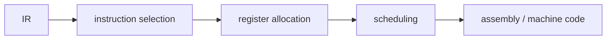

# Compilers 101 (8/10): 코드 생성

이론은 IR에서 끝나지만, 실력은 백엔드에서 드러납니다. IR에는 임시 변수가 무한히 있는 것처럼 보이지만, 실제 CPU에는 레지스터가 몇 개 없습니다. 이 간극을 메우는 것이 코드 생성의 핵심 과제입니다.

이 글은 Compilers 101 시리즈의 여덟 번째 글입니다.

IR에는 `t1`, `t2`, `t3`처럼 임시 값이 무한히 있는 것처럼 보이지만 실제 CPU에는 레지스터가 몇 개 없다는 사실을 이해하면, 코드 생성이 왜 컴파일러 백엔드의 핵심 기술인지 바로 체감하게 됩니다.


*Compilers 101 8장 흐름 개요*

## 이 글에서 다룰 문제

- 코드 생성이 해결해야 하는 두 핵심 문제는 무엇일까요?
- instruction selection은 어떤 직관으로 동작할까요?
- register allocation은 왜 그래프 색칠 문제로 보일까요?
- 이 단계에서 발생하는 가장 흔한 오류는 어떤 형태일까요?
- 이 개념을 실무에서 잘못 적용하면 어떤 문제가 생길까요?

앞 단계가 모두 잘 되어 있어도 마지막에 잘못 내리면 프로그램은 실행되지 않습니다. 같은 IR이라도 백엔드 품질이 낮으면 실행 속도가 몇 배씩 차이 날 수 있습니다. 그래서 코드 생성은 컴파일러의 최종 평판을 좌우합니다.

> 이론은 IR에서 끝나지만, 실력은 백엔드에서 드러납니다.


```mermaid
flowchart LR
    A["IR"] --> B["instruction selection"]
    B --> C["register allocation"]
    C --> D["scheduling"]
    D --> E["assembly / machine code"]
```

이 세 단계가 거의 모든 백엔드의 뼈대입니다.

## 핵심 용어

- **instruction selection**: IR 노드마다 어떤 CPU 명령어를 쓸지 고르는 과정입니다.
- **register allocation**: 가상 레지스터(임시 변수)를 실제 물리 레지스터에 매핑하는 과정입니다.
- **spill**: 레지스터가 모자라 임시 값을 메모리(스택)에 저장하는 일입니다.
- **calling convention**: 함수 호출 시 어떤 레지스터에 어떤 값을 넣을지에 대한 약속입니다.
- **ABI(Application Binary Interface)**: 서로 다른 컴파일 결과물이 함께 호출되고 연결될 수 있게 하는 이진 인터페이스 규약입니다.

## 변경 전후

**Before — 무한 가상 레지스터를 가진 IR**

```text
t1 = LOAD a
t2 = LOAD b
t3 = t1 + t2
RET t3
```

**After — 실제 명령어 (예: x86-64)**

```asm
mov rax, [a]
add rax, [b]
ret
```

가상 레지스터들이 실제 레지스터에 접혀 들어가고, LOAD와 ADD가 결합되기도 합니다.

## 실습: 작은 코드 생성기 만들기

### 1단계 — 직선형 instruction selection

```python
# 1_select.py
from dataclasses import dataclass
from typing import Optional, Union

@dataclass
class Inst:
    op:   str
    dst:  Optional[str]
    src1: object
    src2: object = None

def select_inst(inst: Inst) -> list[str]:
    """
    IR 명령어 하나를 x86-64 어셈블리 줄 목록으로 변환합니다.
    가장 단순한 1:1 매칭부터 시작합니다.
    """
    op, dst, a, b = inst.op, inst.dst, inst.src1, inst.src2

    if op == "LOAD":
        if isinstance(a, (int, float)):
            return [f"mov {dst}, {a}"]           # 상수 로드
        else:
            return [f"mov {dst}, [{a}]"]          # 메모리에서 로드

    if op == "STORE":
        return [f"mov [{a}], {b}"]

    if op == "+":
        return [
            f"mov {dst}, {a}",
            f"add {dst}, {b}",
        ]
    if op == "-":
        return [
            f"mov {dst}, {a}",
            f"sub {dst}, {b}",
        ]
    if op == "*":
        return [
            f"mov {dst}, {a}",
            f"imul {dst}, {b}",
        ]
    if op == "/":
        # x86-64 정수 나눗셈: rax / rbx, 몫은 rax에
        return [
            f"mov rax, {a}",
            f"cqo",                 # rdx:rax로 부호 확장
            f"idiv {b}",
            f"mov {dst}, rax",
        ]
    if op == "<":
        return [
            f"cmp {a}, {b}",
            f"setl {dst}b",         # 비교 결과를 바이트에 저장
            f"movzx {dst}, {dst}b",  # 제로 확장
        ]
    if op == "RET":
        return [
            f"mov rax, {a}",
            "ret",
        ]
    if op == "JMP":
        return [f"jmp {a}"]
    if op == "JZ":
        return [
            f"test {a}, {a}",
            f"jz {b}",
        ]

    return [f"; unknown: {inst}"]

# 예시 실행
ir = [
    Inst("LOAD", "t1", 2),
    Inst("LOAD", "t2", 3),
    Inst("+",    "t3", "t1", "t2"),
    Inst("RET",  None, "t3"),
]

print("; generated assembly")
for inst in ir:
    asm_lines = select_inst(inst)
    for line in asm_lines:
        print(f"  {line}")
# mov t1, 2
# mov t2, 3
# mov t3, t1
# add t3, t2
# mov rax, t3
# ret
```

처음에는 가장 단순한 1:1 매칭으로 시작하면 됩니다. 더 정교한 백엔드는 트리 패턴 매칭으로 발전합니다.

### 2단계 — liveness 분석

```python
# 2_liveness.py
def compute_liveness(code: list[Inst]) -> list[frozenset]:
    """
    각 명령어 실행 직전에 살아있는(live) 변수 집합을 계산합니다.
    뒤에서 앞으로 분석합니다.
    """
    live: set[str] = set()
    live_sets: list[frozenset] = []

    for inst in reversed(code):
        op, dst, a, b = inst.op, inst.dst, inst.src1, inst.src2

        # 현재 명령어의 실행 직전 live 집합을 기록합니다
        live_sets.append(frozenset(live))

        # def: dst는 이 명령어로 정의됩니다 -> live에서 제거
        if dst and dst in live:
            live.discard(dst)

        # use: a, b는 이 명령어가 읽습니다 -> live에 추가
        if isinstance(a, str): live.add(a)
        if isinstance(b, str): live.add(b)

    live_sets.reverse()
    return live_sets

# 예시
ir2 = [
    Inst("LOAD", "t1", 10),
    Inst("LOAD", "t2", 20),
    Inst("+",    "t3", "t1", "t2"),
    Inst("*",    "t4", "t3", "t2"),
    Inst("RET",  None, "t4"),
]

live_sets = compute_liveness(ir2)
for inst, live in zip(ir2, live_sets):
    print(f"live={sorted(live):20s}  {inst}")
```

liveness 분석은 register allocation의 전제 조건입니다. 동시에 살아있는 변수끼리는 같은 레지스터를 공유할 수 없습니다.

### 3단계 — 간섭 그래프 구축

```python
# 3_interference.py
def build_interference_graph(code: list[Inst]) -> dict[str, set[str]]:
    """
    동시에 살아있는 두 임시 변수는 같은 레지스터를 공유할 수 없습니다.
    이 관계를 그래프로 만듭니다.
    """
    live_sets = compute_liveness(code)
    graph: dict[str, set[str]] = {}

    # 모든 변수를 노드로 추가합니다
    for inst in code:
        if inst.dst:
            graph.setdefault(inst.dst, set())

    # 동시에 살아있는 쌍마다 간선을 추가합니다
    for inst, live in zip(code, live_sets):
        live_with_dst = set(live)
        if inst.dst:
            live_with_dst.add(inst.dst)

        for u in live_with_dst:
            for v in live_with_dst:
                if u != v:
                    graph.setdefault(u, set()).add(v)
                    graph.setdefault(v, set()).add(u)

    return graph

# 테스트
graph = build_interference_graph(ir2)
for var, neighbors in sorted(graph.items()):
    print(f"{var}: interferes with {sorted(neighbors)}")
```

동시에 살아 있는 값끼리는 같은 레지스터를 공유할 수 없습니다. 그 관계를 그래프로 만들면 register allocation 문제를 더 명확히 볼 수 있습니다.

### 4단계 — 그래프 색칠로 레지스터 할당하기

```python
# 4_color.py
# 실제 레지스터 이름 (x86-64 caller-saved)
X86_64_REGS = ["rax", "rcx", "rdx", "rsi", "rdi", "r8", "r9", "r10", "r11"]

def greedy_color(graph: dict[str, set], regs: list[str]) -> dict[str, str]:
    """
    탐욕 그래프 색칠로 각 임시 변수에 레지스터를 할당합니다.
    레지스터가 모자라면 "SPILL"을 반환합니다.
    """
    # 간섭 수가 많은 순으로 처리합니다 (휴리스틱)
    order = sorted(graph.keys(), key=lambda v: len(graph[v]), reverse=True)
    allocation: dict[str, str] = {}

    for var in order:
        # 이웃이 이미 사용하는 레지스터를 피합니다
        used = {allocation[n] for n in graph.get(var, set()) if n in allocation}
        assigned = None
        for reg in regs:
            if reg not in used:
                assigned = reg
                break
        allocation[var] = assigned if assigned else "SPILL"

    return allocation

# 테스트
alloc = greedy_color(graph, X86_64_REGS)
for var, reg in sorted(alloc.items()):
    status = "spilled" if reg == "SPILL" else f"-> {reg}"
    print(f"  {var}: {status}")
```

K개의 색으로 칠할 수 없으면 spill 후보가 됩니다. 실제 알고리즘은 더 정교하지만 핵심 직관은 같습니다.

### 5단계 — spill 처리: 메모리에 임시 보관하기

```python
# 5_spill.py
class StackFrame:
    """스필된 변수를 스택에 배치합니다."""

    def __init__(self):
        self.slots: dict[str, int] = {}
        self.next_offset = 8  # rsp 기준 오프셋 (바이트)

    def get_slot(self, var: str) -> str:
        """변수의 스택 슬롯 주소를 반환합니다. 없으면 새로 만듭니다."""
        if var not in self.slots:
            self.slots[var] = self.next_offset
            self.next_offset += 8
        offset = self.slots[var]
        return f"[rsp+{offset}]"

def apply_spill(code: list[Inst], alloc: dict[str, str]) -> list[Inst]:
    """
    SPILL된 변수를 스택 로드/저장으로 대체합니다.
    """
    frame = StackFrame()
    out = []

    for inst in code:
        op, dst, a, b = inst.op, inst.dst, inst.src1, inst.src2

        # src1이 스필된 변수라면 임시로 로드합니다
        if isinstance(a, str) and alloc.get(a) == "SPILL":
            tmp = "r15"  # scratch register
            out.append(Inst("LOAD", tmp, frame.get_slot(a)))
            a = tmp

        # src2도 마찬가지입니다
        if isinstance(b, str) and alloc.get(b) == "SPILL":
            tmp2 = "r14"
            out.append(Inst("LOAD", tmp2, frame.get_slot(b)))
            b = tmp2

        out.append(Inst(op, dst, a, b))

        # dst가 스필된 변수라면 계산 후 저장합니다
        if isinstance(dst, str) and alloc.get(dst) == "SPILL":
            out.append(Inst("STORE", None, frame.get_slot(dst), dst))

    return out
```

spill은 느리지만 올바릅니다. 좋은 백엔드는 spill을 최소화하지만, spill 자체를 실패로 보지는 않습니다.

### 6단계 — calling convention

```python
# 6_call.py
# x86-64 System V ABI: 앞의 6개 정수 인자는 rdi, rsi, rdx, rcx, r8, r9에 전달
# return 값은 rax에 둡니다.

ARG_REGS = ["rdi", "rsi", "rdx", "rcx", "r8", "r9"]

def emit_call(func_name: str, args: list[str]) -> list[str]:
    """
    함수 호출을 어셈블리로 내보냅니다.
    x86-64 System V calling convention을 따릅니다.
    """
    asm = []
    # 인자를 레지스터에 배치합니다
    for reg, arg in zip(ARG_REGS, args):
        asm.append(f"mov {reg}, {arg}")
    # 스택에 넘치는 인자는 역순으로 푸시합니다 (6개 초과)
    for arg in reversed(args[len(ARG_REGS):]):
        asm.append(f"push {arg}")
    asm.append(f"call {func_name}")
    # 스택 인자를 정리합니다
    extra = max(0, len(args) - len(ARG_REGS))
    if extra:
        asm.append(f"add rsp, {extra * 8}")
    return asm

# 예시: printf("%d\n", x) 호출
asm_lines = emit_call("printf", ["fmt_str", "x"])
for line in asm_lines:
    print(f"  {line}")
# mov rdi, fmt_str
# mov rsi, x
# call printf
```

여러분의 함수와 외부 라이브러리가 같은 약속을 따라야 호출이 성립합니다. 그것이 ABI의 핵심입니다.

## 핵심 정리

- instruction selection은 패턴 매칭의 한 형태입니다.
- register allocation의 본질은 그래프 색칠입니다.
- spill은 패배가 아니라 정상적인 도구입니다.
- calling convention을 어기면 프로그램은 쉽게 비정상 종료합니다.
- liveness 분석이 register allocation의 입력입니다.

## 자주 하는 실수

1. **liveness 분석 없이 레지스터를 배정하는 것**입니다. 아직 살아 있는 값을 덮어쓸 수 있습니다. 반드시 간섭 그래프를 먼저 만들고 색칠하세요.
2. **spill을 지나치게 두려워하는 것**입니다. 일부 spill은 불가피합니다. 먼저 정확하게, 그다음 빠르게 개선하세요.
3. **자체 calling convention을 발명하는 것**입니다. 외부 라이브러리(`libc`, 시스템 콜)와 상호 운용할 수 없습니다. 플랫폼의 ABI를 따르세요.
4. **EFLAGS 같은 암묵 레지스터를 잊는 것**입니다. `cmp`와 `jl` 사이에 `add`를 끼우면 플래그가 변합니다.
5. **너무 이르게 고급 instruction selection 최적화에 집착하는 것**입니다. 먼저 정확한 1:1 변환부터 동작시켜야 합니다. 그 다음에 패턴 매칭을 개선하세요.

## 실무에서는 이렇게 나타납니다

LLVM 백엔드는 SelectionDAG와 GlobalISel처럼 서로 다른 선택 전략을 제공합니다. register allocator도 LinearScan, Greedy 같은 여러 방식을 선택할 수 있습니다. ABI는 운영체제와 아키텍처마다 달라서, 같은 함수라도 Linux x86-64와 macOS ARM64에서 호출 방식이 달라집니다.

```bash
# 간단한 C 함수를 어셈블리로 보는 방법
cat > add.c << 'EOF'
int add(int a, int b) { return a + b; }
EOF
gcc -O2 -S add.c -o add.s && cat add.s
# add:
#   lea eax, [rdi+rsi]
#   ret
```

## 숙련된 엔지니어는 이렇게 봅니다

- 가장 먼저 "이 백엔드는 어떤 ABI를 따르는가?"를 확인합니다.
- 새 아키텍처에서는 레지스터 개수와 calling convention부터 봅니다.
- spill을 두려워하지 않고, 정확성을 우선합니다.
- 백엔드 작업의 출발점을 liveness 분석으로 잡습니다.
- flags, 예외, 원자성 같은 암묵 요소를 항상 의심합니다.

## 운영 체크리스트

- [ ] 코드 생성이 해결하는 두 핵심 문제를 말할 수 있습니까?
- [ ] register allocation을 그래프 색칠로 이해하고 있습니까?
- [ ] spill이 무엇이며 언제 생기는지 설명할 수 있습니까?
- [ ] calling convention과 ABI의 차이를 설명할 수 있습니까?
- [ ] liveness 분석이 왜 필요한지 한 문장으로 말할 수 있습니까?

## 연습 문제

1. 위 `select_inst` 함수에 비교(`<`)와 조건 분기(`jl`)를 추가해 보세요.
2. 간섭 그래프를 직접 그리고 `k=2`일 때 어떤 노드가 spill되는지 찾아보세요.
3. 같은 레지스터를 두 함수 호출이 동시에 원할 때 spill이 어디에 들어가야 하는지 추론해 보세요.

## 처음 질문으로 돌아가기

- **코드 생성이 해결해야 하는 두 핵심 문제는 무엇일까요?**
  - 첫째는 instruction selection — IR 연산마다 어떤 CPU 명령어를 쓸지 결정합니다. 둘째는 register allocation — 무한히 많은 가상 레지스터(임시 변수)를 유한한 물리 레지스터에 매핑합니다. 이 두 문제가 코드 생성의 품질과 정확성을 결정합니다.
- **instruction selection은 어떤 직관으로 동작할까요?**
  - IR 명령어를 패턴으로 인식하고, 각 패턴에 맞는 CPU 명령어를 선택하는 패턴 매칭입니다. 단순한 1:1 매칭(LOAD → mov, + → add)에서 시작해, 여러 IR 명령어를 하나의 복잡한 CPU 명령어로 합치는 트리 패턴 매칭으로 발전합니다.
- **register allocation은 왜 그래프 색칠 문제로 보일까요?**
  - 동시에 살아있는 두 변수는 같은 레지스터를 쓸 수 없습니다. 이 "같이 사용할 수 없음" 관계를 그래프 간선으로 표현하면, "인접 노드가 다른 색(레지스터)을 가지도록 그래프를 K색(물리 레지스터 수)으로 칠하는 문제"가 됩니다.

## 정리와 다음 글

코드 생성은 IR과 실제 CPU 사이의 마지막 다리입니다. 다음 글에서는 이 전체 파이프라인이 언제 실행되는지를 비교하는 주제, JIT vs AOT를 다룹니다.

<!-- toc:begin -->
## 시리즈 목차

- [Compilers 101 (1/10): 컴파일러란 무엇인가?](./01-what-is-a-compiler.md)
- [Compilers 101 (2/10): 렉시컬 분석](./02-lexical-analysis.md)
- [Compilers 101 (3/10): 파싱과 AST](./03-parsing-and-ast.md)
- [Compilers 101 (4/10): 시맨틱 분석](./04-semantic-analysis.md)
- [Compilers 101 (5/10): 심볼 테이블과 스코프](./05-symbol-table-and-scope.md)
- [Compilers 101 (6/10): 중간 표현](./06-intermediate-representation.md)
- [Compilers 101 (7/10): 최적화 기초](./07-optimization-basics.md)
- **Compilers 101 (8/10): 코드 생성 (현재 글)**
- [Compilers 101 (9/10): JIT vs AOT](./09-jit-vs-aot.md)
- [작은 인터프리터 만들기](./10-building-a-tiny-interpreter.md)

<!-- toc:end -->

## 참고 자료

- [Code generation (Wikipedia)](https://en.wikipedia.org/wiki/Code_generation_(compiler))
- [Register allocation (Wikipedia)](https://en.wikipedia.org/wiki/Register_allocation)
- [System V AMD64 ABI](https://gitlab.com/x86-psABIs/x86-64-ABI)
- [LLVM CodeGen overview](https://llvm.org/docs/CodeGenerator.html)

- [이 시리즈 예제 코드 (book-examples)](https://github.com/yeongseon-books/book-examples/tree/main/compilers-101/ko)

Tags: Computer Science, Compilers, CodeGen, RegisterAllocation, Assembly
