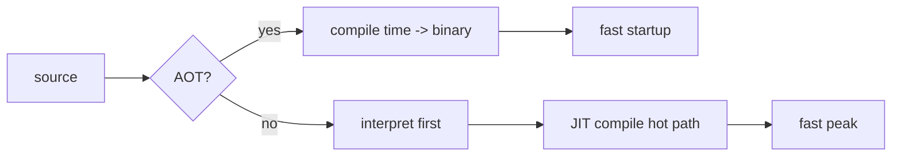

# Compilers 101 (9/10): JIT vs AOT

이 글은 Compilers 101 시리즈의 아홉 번째 글입니다.

같은 JavaScript 코드가 처음에는 느리다가 어느 순간 빨라지는 이유를 이해하면, 컴파일러 선택이 아니라 **컴파일 시점 선택**이 성능 경험을 바꾼다는 사실이 보이기 시작합니다.


*Compilers 101 9장 흐름 개요*

## 먼저 던지는 질문

- AOT와 JIT는 각각 어떻게 정의할 수 있을까요?
- warmup은 왜 생기고 어떻게 측정해야 할까요?
- 각 실행 모델은 어떤 최적화 기회를 열어 줄까요?

## 왜 중요한가

같은 알고리즘이라도 실행 모드가 인터프리터인지, JIT인지, AOT인지에 따라 체감 성능이 크게 달라질 수 있습니다. 짧게 끝나는 CLI에는 AOT나 인터프리터가 유리할 수 있고, 오래 도는 서버에는 JIT가 유리할 수 있습니다. 즉, 우리는 이제 언어만이 아니라 컴파일 방식까지 선택하고 있습니다.

> 언제 컴파일하느냐가 사용자가 체감하는 성능이 됩니다.

## 핵심 개념 한눈에 보기



AOT는 한 번 컴파일하고 매번 빠르게 시작합니다. JIT는 처음에는 느릴 수 있지만 hot path를 본 뒤 더 공격적으로 최적화할 수 있습니다.

## 핵심 용어

- **AOT**: 배포 전에 미리 컴파일하는 방식입니다. 결과물은 보통 바이너리입니다.
- **JIT**: 실행 중에 컴파일하는 방식입니다. 결과 코드는 메모리에 머뭅니다.
- **warmup**: JIT가 hot path를 찾아 최적화하기 전까지의 느린 구간입니다.
- **tiered compilation**: 인터프리터 → baseline JIT → optimizing JIT처럼 여러 단계를 거치는 구조입니다.
- **profile-guided**: 실제 실행 데이터를 바탕으로 더 공격적으로 최적화하는 접근입니다.

## 변경 전후

**Before — 단일 모드의 한계**

```text
pure interpreter: fast startup, slow peak
pure AOT       : fast startup, fast peak, but blind to dynamic info
```

**After — 현대 런타임의 혼합 모델**

```text
JVM, V8, .NET: interpreter or baseline first -> optimizing JIT for hot code only
```

여러 단계를 섞으면 각 방식의 장점을 더 잘 가져갈 수 있습니다.

## 실습: JIT 효과 직접 보기

### 1단계 — 순수 Python 루프

```python
# 1_naive.py
def sum_to(n):
    s = 0
    for i in range(n):
        s += i
    return s

import time
t = time.perf_counter()
sum_to(10**7)
print("python:", time.perf_counter()-t)
```

CPython은 바이트코드를 인터프리터로 실행합니다. JIT가 없기 때문에 매 호출이 한 단계씩 해석됩니다.

### 2단계 — PyPy나 numba로 JIT 효과 보기

```python
# 2_jit.py
# pip install numba
from numba import njit
import time

@njit
def sum_to(n):
    s = 0
    for i in range(n):
        s += i
    return s

# First call compiles and runs
t = time.perf_counter(); sum_to(10**7); print("first:", time.perf_counter()-t)
# Second call reuses the compiled code
t = time.perf_counter(); sum_to(10**7); print("warm :", time.perf_counter()-t)
```

첫 호출은 warmup 비용을 내고, 두 번째 호출은 이미 만들어 둔 기계 코드를 재사용합니다.

### 3단계 — AOT 예시(C)

```c
// 3_aot.c
#include <stdio.h>
long sum_to(long n){ long s=0; for(long i=0;i<n;i++) s+=i; return s; }
int main(){ printf("%ld\n", sum_to(10000000)); return 0; }
```

```bash
gcc -O2 3_aot.c -o sum && ./sum
```

AOT 바이너리는 이미 최적화된 형태로 배포되므로 시작도 빠르고 최고 성능도 빠릅니다. 대신 런타임의 동적 정보는 직접 볼 수 없습니다.

### 4단계 — tiered compilation 직관

```python
# 4_tiered.py
# pseudocode
def execute(fn, args):
    if call_count(fn) < 10:    return interpret(fn, args)
    if not has_baseline(fn):   compile_baseline(fn)
    if call_count(fn) > 1000:  compile_optimized(fn)
    return run_compiled(fn, args)
```

JVM, V8, .NET은 대체로 이런 흐름을 따릅니다. 빨리 만들 수 있는 형태로 먼저 실행하고, 자주 호출되는 함수만 더 느리게 만들지만 더 빠르게 도는 형태로 승격합니다.

### 5단계 — PGO

```bash
# 5_pgo.sh
gcc -fprofile-generate -O2 prog.c -o prog
./prog                 # collect profile
gcc -fprofile-use -O2 prog.c -o prog
```

실제 호출 빈도와 분기 방향을 알면 AOT도 더 공격적인 인라이닝과 재배치를 할 수 있습니다. PGO는 AOT가 JIT의 장점을 일부 빌려오는 대표적 방식입니다.

## 이 코드에서 먼저 봐야 할 점

- 같은 소스라도 실행 모드에 따라 시작 시간과 최고 성능이 달라집니다.
- JIT의 가장 강한 무기는 런타임에서 수집한 동적 정보입니다.
- AOT의 가장 큰 장점은 배포 단위가 단순하다는 점입니다.
- 실제 시스템은 대개 두 방식을 섞습니다.

## 자주 하는 실수 다섯 가지

1. **JIT를 단 한 번의 호출만 보고 평가하는 것**입니다. warmup을 빼고 봐야 합니다.
2. **AOT가 항상 이긴다고 가정하는 것**입니다. 동적 디스패치가 많으면 JIT가 더 유리할 수 있습니다.
3. **JIT의 메모리 비용을 무시하는 것**입니다. 생성된 코드와 프로파일 데이터가 RAM을 사용합니다.
4. **AOT 바이너리 크기를 과소평가하는 것**입니다. 인라이닝과 다중 아키텍처 지원이 크기를 키울 수 있습니다.
5. **PGO를 공짜라고 생각하는 것**입니다. 프로파일 수집 실행 자체가 시간과 인프라를 요구합니다.

## 실무에서는 이렇게 나타납니다

JVM, .NET, V8, JavaScriptCore는 모두 계층형 JIT를 사용합니다. Go, Rust, C, C++는 대표적인 AOT 계열입니다. Android ART는 AOT와 JIT를 혼합하고, WebAssembly 엔진도 AOT와 JIT를 모두 지원합니다. CPython은 인터프리터 중심이지만 JIT 도입 논의도 계속 진행되고 있습니다.

## 숙련된 엔지니어는 이렇게 봅니다

- 워크로드의 시작 시간 대비 최고 성능 비율을 먼저 측정합니다.
- 짧게 끝나는 프로세스는 AOT나 인터프리터가 유리하다는 점을 압니다.
- 오래 도는 서버는 warmup 비용을 상쇄하고 JIT 이득을 얻기 쉽다는 점을 압니다.
- 메모리 제약 환경에서는 JIT가 배제될 수 있다는 점을 압니다.
- 측정 없이 실행 모드를 바꾸지 않습니다.

## 체크리스트

- [ ] AOT와 JIT를 한 문장으로 비교할 수 있습니까?
- [ ] warmup이 왜 생기는지 설명할 수 있습니까?
- [ ] 동적 정보가 열어 주는 최적화 예를 하나 들 수 있습니까?
- [ ] tiered compilation 흐름을 그릴 수 있습니까?
- [ ] PGO가 AOT의 어떤 약점을 보완하는지 말할 수 있습니까?

## 연습 문제

1. 같은 함수를 CPython과 numba에서 실행해 첫 호출과 warm 호출 시간을 비교해 보세요.
2. 짧게 끝나는 CLI 도구 하나를 가정하고 AOT와 JIT 중 어느 쪽이 더 맞는지 1분 안에 판단해 보세요.
3. JIT가 inline cache를 이용해 동적 디스패치 비용을 줄이는 방식을 한 단락으로 설명해 보세요.

## 정리와 다음 글

JIT와 AOT는 결국 “언제 컴파일할 것인가?”라는 한 질문에서 갈라진 두 모델입니다. 다음 글에서는 지금까지 배운 렉서, 파서, 평가기를 한 파일로 합쳐 작은 인터프리터를 직접 만들어 봅니다.

## 확장 실습: 프런트엔드부터 LLVM IR 직전까지 한 번에 검증하기

이 시점부터는 단계별 조각 실습을 넘어, 한 입력이 토큰, AST, 타입 정보, IR, 최적화 결과, 코드 생성 결과로 어떻게 이어지는지 한 번에 추적하는 연습이 필요합니다. 핵심은 코드 길이가 아니라 **변환 경계가 보이는 출력**을 남기는 것입니다. 아래 예시는 시리즈 전체를 관통하는 최소 골격입니다.

### 문법 고정: BNF 표기 먼저 확정하기

문법이 흔들리면 파서와 의미 분석 경계도 함께 흔들립니다. 구현 전에 BNF를 먼저 잠그면 우선순위, 결합성, 허용 구문을 팀 단위로 공유할 수 있습니다.

```bnf
<program> ::= <stmt_list>
<stmt_list> ::= <stmt> | <stmt> <stmt_list>
<stmt> ::= "let" <ident> "=" <expr> ";" | "print" <expr> ";"
<expr> ::= <term> | <expr> "+" <term> | <expr> "-" <term>
<term> ::= <factor> | <term> "*" <factor> | <term> "/" <factor>
<factor> ::= <number> | <ident> | "(" <expr> ")"
```

### 렉서 출력 고정: 토큰과 위치 정보를 함께 기록하기

```python
from dataclasses import dataclass
import re

@dataclass
class Token:
    kind: str
    text: str
    line: int
    col: int

SPEC = [
    ("KW", r"\b(let|print)\b"),
    ("IDENT", r"[A-Za-z_][A-Za-z0-9_]*"),
    ("NUMBER", r"\d+"),
    ("OP", r"[+\-*/=]"),
    ("LPAREN", r"\("),
    ("RPAREN", r"\)"),
    ("SEMI", r";"),
    ("WS", r"[ \t\n]+"),
]

def lex(src: str) -> list[Token]:
    out: list[Token] = []
    i, line, col = 0, 1, 1
    while i < len(src):
        for kind, pat in SPEC:
            m = re.match(pat, src[i:])
            if not m:
                continue
            text = m.group(0)
            if kind != "WS":
                out.append(Token(kind, text, line, col))
            for ch in text:
                if ch == "
":
                    line += 1
                    col = 1
                else:
                    col += 1
            i += len(text)
            break
        else:
            raise SyntaxError(f"unexpected character {src[i]!r} at {line}:{col}")
    return out
```

이 출력은 이후 단계에서 오류 메시지 기준 좌표가 됩니다. line/col 정보가 없으면 파서와 의미 분석 품질을 끝까지 올리기 어렵습니다.

### AST 노드 정의: 구조를 명시적으로 분리하기

```python
from dataclasses import dataclass

@dataclass
class Number:
    value: int

@dataclass
class Identifier:
    name: str

@dataclass
class Binary:
    op: str
    left: object
    right: object

@dataclass
class LetStmt:
    name: str
    expr: object

@dataclass
class PrintStmt:
    expr: object
```

여기서 중요한 점은 문법 요소와 실행 요소를 섞지 않는 것입니다. AST는 실행기가 아니라 구조 표현이어야 하며, 해석/타입/코드 생성은 별도 단계로 분리하는 편이 장기적으로 안정적입니다.

### 의미 분석 골격: 선언, 참조, 타입을 한 번에 점검하기

```python
class Scope:
    def __init__(self, parent=None):
        self.parent = parent
        self.table: dict[str, str] = {}

    def define(self, name: str, ty: str):
        if name in self.table:
            raise TypeError(f"redeclared variable: {name}")
        self.table[name] = ty

    def resolve(self, name: str) -> str:
        if name in self.table:
            return self.table[name]
        if self.parent:
            return self.parent.resolve(name)
        raise NameError(f"undefined variable: {name}")

def type_of_expr(node, scope: Scope) -> str:
    if isinstance(node, Number):
        return "int"
    if isinstance(node, Identifier):
        return scope.resolve(node.name)
    if isinstance(node, Binary):
        lt = type_of_expr(node.left, scope)
        rt = type_of_expr(node.right, scope)
        if lt != "int" or rt != "int":
            raise TypeError(f"binary op expects int/int, got {lt}/{rt}")
        return "int"
    raise TypeError(f"unknown node: {node}")
```

시맨틱 단계에서 타입과 이름 해석을 확정하면, 뒤 단계(IR/최적화/코드 생성)는 오류 복구 부담을 크게 줄일 수 있습니다.

### IR 생성과 최적화 패스: 변환 파이프라인 분리하기

```python
def lower_expr(node, out, new_temp):
    if isinstance(node, Number):
        t = new_temp()
        out.append(("const", t, node.value))
        return t
    if isinstance(node, Identifier):
        t = new_temp()
        out.append(("load", t, node.name))
        return t
    if isinstance(node, Binary):
        l = lower_expr(node.left, out, new_temp)
        r = lower_expr(node.right, out, new_temp)
        t = new_temp()
        out.append((node.op, t, l, r))
        return t
    raise RuntimeError("unsupported node")

def constant_folding(ir):
    const = {}
    out = []
    for inst in ir:
        if inst[0] == "const":
            const[inst[1]] = inst[2]
            out.append(inst)
            continue
        if inst[0] in {"+", "-", "*", "/"} and inst[2] in const and inst[3] in const:
            a, b = const[inst[2]], const[inst[3]]
            v = {"+": a+b, "-": a-b, "*": a*b, "/": a//b}[inst[0]]
            const[inst[1]] = v
            out.append(("const", inst[1], v))
        else:
            out.append(inst)
    return out
```

`IR -> 최적화 패스 -> IR` 형태를 유지하면 패스를 안전하게 합성할 수 있고, 결과 비교 테스트도 단순해집니다.

### 코드 생성 스니펫: 단순 스택 머신 또는 어셈블리로 내리기

```python
def emit_stack_vm(ir):
    out = []
    for inst in ir:
        op = inst[0]
        if op == "const":
            out.append(f"PUSH {inst[2]}")
        elif op == "load":
            out.append(f"LOAD {inst[2]}")
        elif op == "+":
            out.append("ADD")
        elif op == "-":
            out.append("SUB")
        elif op == "*":
            out.append("MUL")
        elif op == "/":
            out.append("DIV")
    out.append("HALT")
    return out
```

이 수준의 생성기만 있어도 파서/의미 분석/최적화의 결과가 실제 실행 지시어로 어떻게 바뀌는지 빠르게 검증할 수 있습니다.

### LLVM IR 샘플 읽기: SSA 감각 익히기

```llvm
; 입력 소스의 개념: let x = 2 * 3; print x + 1;
define i32 @main() {
entry:
  %x = mul i32 2, 3
  %y = add i32 %x, 1
  ret i32 %y
}
```

SSA에서 `%x`, `%y`처럼 버전이 분리되면 데이터 흐름 분석과 레지스터 할당 전 단계가 단순해집니다. 시리즈 후반 주제(최적화, 코드 생성, JIT/AOT)를 이해할 때 이 표현이 공통 언어가 됩니다.

### 검증 기준: 단계별 스냅샷을 항상 남기기

실전에서는 정답 코드보다 검증 루틴이 먼저입니다. 최소한 다음 다섯 가지를 파일로 남기면 회귀를 추적하기 쉽습니다.

1. 토큰 덤프 (`tokens.json`)
2. AST 덤프 (`ast.json`)
3. 시맨틱 결과 (`symbols.json`, 타입 오류 목록)
4. 최적화 전후 IR (`ir_before.txt`, `ir_after.txt`)
5. 최종 코드 생성 결과 (`out.asm` 또는 `out.vm`)

이렇게 하면 “어디서 깨졌는지”가 즉시 분리되고, 팀 협업에서도 디버깅 비용이 크게 줄어듭니다.


### 단계별 실패 시나리오와 복구 전략

실제 프로젝트에서는 정답 입력보다 실패 입력이 더 많이 들어옵니다. 따라서 각 단계가 실패했을 때 **다음 단계로 무엇을 전달할지**를 먼저 정해야 합니다. 다음 표는 최소 운영 기준입니다.

| 단계 | 실패 예시 | 즉시 조치 | 다음 단계 전달 |
| --- | --- | --- | --- |
| 렉서 | 알 수 없는 문자 | 위치 포함 오류 생성 | 복구 가능한 토큰만 전달 |
| 파서 | 괄호 누락, 세미콜론 누락 | 동기화 토큰 기준으로 재시작 | 부분 AST와 오류 목록 전달 |
| 시맨틱 | 미선언 변수, 타입 불일치 | 심볼/타입 오류 축적 | 오류 수가 기준치 이하면 IR 생성 계속 |
| IR 생성 | 미지원 구문 | 노드 단위 경고와 스킵 | 분석 가능한 블록만 전달 |
| 최적화 | 패스 전제 위반 | 패스 비활성화 후 원본 IR 유지 | 코드 생성은 계속 |
| 코드 생성 | 레지스터 부족 | spill 강제, 속도 저하 허용 | 실행 가능한 바이너리 우선 |

이 기준은 "완벽한 컴파일"보다 "재현 가능한 컴파일"에 가깝습니다. 품질이 높은 컴파일러는 한 번에 많은 오류를 보여 주되, 어디까지 복구했는지 명확히 보고합니다.

### 테스트 입력 세트: 경계 조건을 먼저 고정하기

아래 입력 세트는 단계별 회귀를 빠르게 잡는 최소 묶음입니다.

```text
# 정상
let x = 2 + 3 * 4;
print x;

# 문법 오류
let x = (2 + 3;

# 의미 오류
print y;

# 최적화 검증
let z = 1 + 2 + 3 + 4;
print z;
```

각 입력에 대해 토큰, AST, 시맨틱 결과, IR, 최종 코드를 별도 파일로 남기면 변경 전후 차이를 기계적으로 비교할 수 있습니다.

### 간단한 골든 출력 비교 스크립트

```python
import json
from pathlib import Path

def save_snapshot(name: str, payload):
    out_dir = Path("artifacts")
    out_dir.mkdir(exist_ok=True)
    p = out_dir / f"{name}.json"
    p.write_text(json.dumps(payload, ensure_ascii=False, indent=2))

# 예시 사용
save_snapshot("tokens_case1", [{"kind": "NUMBER", "text": "2", "line": 1, "col": 1}])
save_snapshot("ast_case1", {"kind": "Binary", "op": "+"})
```

스냅샷 파일을 Git에 남기면 리팩터링 이후에도 파이프라인의 의미가 바뀌었는지 즉시 검출할 수 있습니다.

### 최적화 패스 예시: 상수 전파와 불필요 대입 제거

```python
def constant_propagation(ir):
    env = {}
    out = []
    for inst in ir:
        op = inst[0]
        if op == "const":
            env[inst[1]] = inst[2]
            out.append(inst)
        elif op in {"+", "-", "*", "/"}:
            a = env.get(inst[2], inst[2])
            b = env.get(inst[3], inst[3])
            if isinstance(a, int) and isinstance(b, int):
                v = {"+": a+b, "-": a-b, "*": a*b, "/": a//b}[op]
                env[inst[1]] = v
                out.append(("const", inst[1], v))
            else:
                out.append((op, inst[1], a, b))
        else:
            out.append(inst)
    return out

def remove_trivial_moves(ir):
    return [inst for inst in ir if not (inst[0] == "mov" and inst[1] == inst[2])]
```

최적화는 큰 패스 하나보다 작은 패스 여러 개가 유지보수에 유리합니다. 실패하면 해당 패스만 끄고 원본 IR로 복구할 수 있기 때문입니다.

### 코드 생성 검증: 간단한 레지스터 할당 로그 남기기

```python
REGS = ["r1", "r2", "r3"]

def assign_registers(temporaries):
    mapping = {}
    spill = []
    for t in temporaries:
        if len(mapping) < len(REGS):
            mapping[t] = REGS[len(mapping)]
        else:
            spill.append(t)
    return mapping, spill

m, s = assign_registers(["t1", "t2", "t3", "t4", "t5"])
print("reg-map", m)
print("spill ", s)
```

이 정도 로그만 있어도 특정 입력에서 왜 성능이 급락했는지 원인을 좁히기 쉽습니다. 특히 spill 급증은 코드 생성 병목의 대표 신호입니다.

### LLVM IR 비교 기준: 변경 전후를 줄 단위로 확인하기

```llvm
; before optimization
%t1 = mul i32 3, 4
%t2 = add i32 2, %t1
ret i32 %t2

; after optimization
ret i32 14
```

최적화가 의미를 보존하는지 검증할 때는 사람이 읽는 설명보다 IR diff가 더 신뢰할 수 있습니다. 동일 입력에서 `ret i32 14`로 바뀌면 folding이 실제로 적용되었음을 바로 확인할 수 있습니다.

### 팀 운영 체크포인트

1. 파서 변경 PR에는 반드시 BNF 변경 diff를 포함합니다.
2. 시맨틱 규칙 변경 PR에는 실패 사례 3개 이상을 테스트에 추가합니다.
3. 최적화 패스 추가 PR에는 비활성화 플래그를 함께 제공합니다.
4. 코드 생성 변경 PR에는 최소 두 아키텍처 이상의 스냅샷을 첨부합니다.
5. 릴리스 전에는 동일 입력에 대해 인터프리터 결과와 컴파일 결과를 교차 검증합니다.

이 체크포인트를 유지하면 기능 추가 속도보다 품질 일관성을 더 안정적으로 가져갈 수 있습니다.


### 마무리 점검: 단계 경계를 말로 설명해 보기

마지막으로, 구현을 잠시 멈추고 다음 질문에 답해 보기를 권합니다. 이 질문은 코드량이 아니라 이해도를 검증합니다.

- 렉서가 실패했을 때 파서가 받는 입력은 무엇입니까?
- 파서가 복구한 부분 AST를 시맨틱 단계에서 어디까지 신뢰합니까?
- 시맨틱 오류가 있어도 IR 생성을 계속할 조건은 무엇입니까?
- 최적화 패스를 껐을 때도 결과의 의미가 유지되는지 어떻게 확인합니까?
- 코드 생성 이후 실행 결과를 어떤 기준값과 비교합니까?

이 다섯 질문에 팀이 같은 답을 할 수 있으면, 파이프라인 확장 시 품질이 급격히 흔들릴 가능성이 크게 줄어듭니다. 반대로 답이 제각각이면, 새로운 문법이나 최적화 패스를 추가할 때 같은 종류의 회귀가 반복됩니다.

실무에서는 기능 추가보다 경계 합의가 먼저입니다. 경계를 합의한 다음 기능을 추가하면, 동일한 투자로 더 안정적인 컴파일러를 만들 수 있습니다.

## 처음 질문으로 돌아가기

- **AOT와 JIT는 각각 어떻게 정의할 수 있을까요?**
  - 본문의 기준은 JIT vs AOT를 한 덩어리 개념으로 보지 않고 입력, 처리, 검증, 운영 신호가 만나는 경계로 나누어 확인하는 것입니다.
- **warmup은 왜 생기고 어떻게 측정해야 할까요?**
  - 예제와 그림에서는 어떤 값이 들어오고, 어느 단계에서 바뀌며, 어떤 기준으로 통과 또는 실패하는지를 먼저 확인해야 합니다.
- **각 실행 모델은 어떤 최적화 기회를 열어 줄까요?**
  - 운영에서는 이 판단을 체크리스트, 로그, 테스트로 남겨 다음 변경에서도 같은 실패가 반복되지 않게 막아야 합니다.

<!-- toc:begin -->
## 시리즈 목차

- [Compilers 101 (1/10): 컴파일러란 무엇인가?](./01-what-is-a-compiler.md)
- [Compilers 101 (2/10): 렉시컬 분석](./02-lexical-analysis.md)
- [Compilers 101 (3/10): 파싱과 AST](./03-parsing-and-ast.md)
- [Compilers 101 (4/10): 시맨틱 분석](./04-semantic-analysis.md)
- [Compilers 101 (5/10): 심볼 테이블과 스코프](./05-symbol-table-and-scope.md)
- [Compilers 101 (6/10): 중간 표현](./06-intermediate-representation.md)
- [Compilers 101 (7/10): 최적화 기초](./07-optimization-basics.md)
- [Compilers 101 (8/10): 코드 생성](./08-code-generation.md)
- **JIT vs AOT (현재 글)**
- 작은 인터프리터 만들기 (예정)

<!-- toc:end -->

## 참고 자료

- [Just-in-time compilation (Wikipedia)](https://en.wikipedia.org/wiki/Just-in-time_compilation)
- [Ahead-of-time compilation (Wikipedia)](https://en.wikipedia.org/wiki/Ahead-of-time_compilation)
- [V8 — Ignition and TurboFan](https://v8.dev/blog/launching-ignition-and-turbofan)
- [Profile-guided optimization (Wikipedia)](https://en.wikipedia.org/wiki/Profile-guided_optimization)

- [이 시리즈 예제 코드 (book-examples)](https://github.com/yeongseon-books/book-examples/tree/main/compilers-101/ko)

Tags: Computer Science, Compilers, JIT, AOT, Tradeoffs, Warmup
