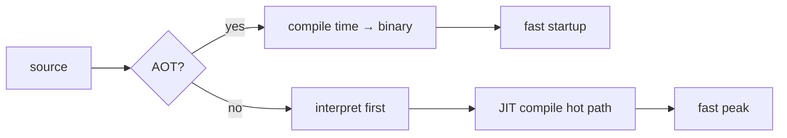

# JIT vs AOT

> Compilers 101 시리즈 (9/10)


## 이 글에서 다룰 문제

같은 알고리즘이라도 실행 환경(JIT/AOT/interpreted)에 따라 성능이 10배 차이가 납니다. 그리고 startup vs peak 균형에 따라 같은 언어가 서버에는 좋고 데스크톱에는 부적합할 수도 있습니다. 컴파일러를 고르는 게 아니라 컴파일러의 모드를 고르는 시대입니다.

> "언제 컴파일하느냐"가 사용자가 체감하는 성능을 결정합니다.

## 전체 흐름


AOT는 한 번 컴파일하고 매번 빠르게 시작합니다. JIT는 시작은 느리지만 hot path가 발견되면 그때 최적화합니다.

## Before/After

**Before — 단일 모드의 한계**

```text
순수 interpreter: 시작 빠름, peak 느림
순수 AOT       : 시작 빠름, peak 빠름, 그러나 동적 정보 못 씀
```

**After — 섞은 현대 런타임**

```text
JVM, V8, .NET: 처음엔 인터프리터/baseline → hot path만 optimizing JIT
```

각 단계의 장점만 골라 씁니다.

## JIT 효과 측정해 보기

### 1단계 — 순수 Python 루프

```python
# 1_naive.py
def sum_to(n):
    s = 0
    for i in range(n):
        s += i
    return s

import time
t = time.perf_counter()
sum_to(10**7)
print("python:", time.perf_counter()-t)
```

CPython은 bytecode 인터프리터입니다. JIT 없이 한 호출 한 호출 실행됩니다.

### 2단계 — PyPy 또는 numba로 JIT 효과

```python
# 2_jit.py
# pip install numba
from numba import njit
import time

@njit
def sum_to(n):
    s = 0
    for i in range(n):
        s += i
    return s

# 첫 호출은 컴파일 + 실행
t = time.perf_counter(); sum_to(10**7); print("first:", time.perf_counter()-t)
# 두 번째는 컴파일된 코드만
t = time.perf_counter(); sum_to(10**7); print("warm :", time.perf_counter()-t)
```

첫 호출은 warmup 비용이 들고, 두 번째 호출부터는 native에 가까운 속도가 나옵니다.

### 3단계 — AOT (예: C 컴파일)

```c
// 3_aot.c
#include <stdio.h>
long sum_to(long n){ long s=0; for(long i=0;i<n;i++) s+=i; return s; }
int main(){ printf("%ld\n", sum_to(10000000)); return 0; }
```

```bash
gcc -O2 3_aot.c -o sum && ./sum
```

binary에 이미 최적화가 박혀 있어 시작도 빠르고 peak도 빠릅니다. 단, 동적 타입에는 못 적응합니다.

### 4단계 — tiered compilation 직관

```python
# 4_tiered.py
# 의사코드
def execute(fn, args):
    if call_count(fn) < 10:    return interpret(fn, args)
    if not has_baseline(fn):   compile_baseline(fn)
    if call_count(fn) > 1000:  compile_optimized(fn)
    return run_compiled(fn, args)
```

JVM, V8, .NET 모두 비슷한 모양입니다. 처음엔 빨리 실행 가능한 형태로, 자주 호출되면 더 비싸지만 빠른 형태로.

### 5단계 — profile-guided optimization

```bash
# 5_pgo.sh
gcc -fprofile-generate -O2 prog.c -o prog
./prog                 # 프로파일 수집
gcc -fprofile-use -O2 prog.c -o prog
```

실제 호출 빈도, 분기 방향을 알면 더 공격적으로 inline/branch 최적화를 할 수 있습니다. AOT가 JIT의 동적 정보를 일부 빌리는 방법입니다.

## 이 코드에서 주목할 점

- 같은 코드가 컴파일러 모드에 따라 startup과 peak이 다릅니다.
- JIT는 동적 정보를 활용할 수 있는 게 가장 큰 무기입니다.
- AOT는 배포 형태가 단순하다는 게 가장 큰 장점입니다.
- 실무 시스템 대부분은 둘을 섞어 씁니다.

## 자주 하는 실수 5가지

1. **단일 호출의 시간만 보고 JIT가 느리다고 결론짓는다.** warmup을 빼고 측정해야 합니다.
2. **AOT는 무조건 빠르다고 가정한다.** 동적 dispatch가 많으면 JIT가 이깁니다.
3. **JIT의 메모리 사용을 무시한다.** 컴파일된 코드와 분석 데이터로 RAM이 늘어납니다.
4. **AOT binary의 코드 크기를 무시한다.** inline + 다중 architecture로 binary가 커집니다.
5. **PGO 비용을 0으로 본다.** 프로파일 수집 단계 자체에 시간이 듭니다.

## 실무에서는 이렇게 쓰입니다

JVM, .NET, V8, JavaScriptCore는 tiered JIT입니다. Go, Rust, C/C++은 순수 AOT. Android는 ART에서 AOT + JIT를 섞어 씁니다. CPython은 인터프리터지만 PEP 744로 JIT 도입을 진행 중입니다. WebAssembly는 AOT/JIT 둘 다 가능합니다.

## 체크리스트

- [ ] AOT와 JIT를 한 줄로 비교할 수 있는가?
- [ ] warmup이 왜 일어나는지 답할 수 있는가?
- [ ] 동적 정보로 가능한 최적화의 예를 들 수 있는가?
- [ ] tiered compilation의 흐름을 그릴 수 있는가?
- [ ] PGO가 AOT 진영의 어떤 약점을 보완하는지 답할 수 있는가?

## 정리 및 다음 단계

JIT와 AOT는 "언제 컴파일하느냐"의 차이가 만든 두 모델입니다. 다음 글에서는 이 시리즈에서 배운 모든 단계를 모아, 한 화면에 들어가는 작은 인터프리터를 직접 만듭니다.

<!-- toc:begin -->
- [컴파일러란 무엇인가?](./01-what-is-a-compiler.md)
- [lexical analysis](./02-lexical-analysis.md)
- [parsing과 AST](./03-parsing-and-ast.md)
- [semantic analysis](./04-semantic-analysis.md)
- [symbol table과 scope](./05-symbol-table-and-scope.md)
- [intermediate representation](./06-intermediate-representation.md)
- [optimization 기초](./07-optimization-basics.md)
- [code generation](./08-code-generation.md)
- **JIT vs AOT (현재 글)**
- 작은 인터프리터 만들어 보기 (예정)
<!-- toc:end -->

## 참고 자료

- [Just-in-time compilation (Wikipedia)](https://en.wikipedia.org/wiki/Just-in-time_compilation)
- [Ahead-of-time compilation (Wikipedia)](https://en.wikipedia.org/wiki/Ahead-of-time_compilation)
- [V8 — Ignition and TurboFan](https://v8.dev/blog/launching-ignition-and-turbofan)
- [Profile-guided optimization (Wikipedia)](https://en.wikipedia.org/wiki/Profile-guided_optimization)

Tags: Computer Science, Compilers, JIT, AOT, Tradeoffs, Warmup
