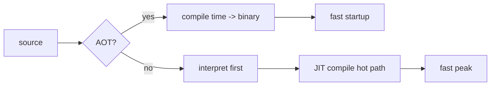

# Compilers 101 (9/10): JIT vs AOT

이 글은 Compilers 101 시리즈의 아홉 번째 글입니다. 같은 JavaScript 코드가 처음에는 느리다가 어느 순간 빨라지는 이유를 이해하면, 컴파일러 선택이 아니라 **컴파일 시점 선택**이 성능 경험을 바꾼다는 사실이 보이기 시작합니다.

## 먼저 던지는 질문

- AOT와 JIT는 각각 어떻게 정의할 수 있을까요?
- warmup은 왜 생기고 어떻게 측정해야 할까요?
- 각 실행 모델은 어떤 최적화 기회를 열어 줄까요?

## 큰 그림


*Compilers 101 9장 흐름 개요*

## 왜 중요한가

같은 알고리즘이라도 실행 모드가 인터프리터인지, JIT인지, AOT인지에 따라 체감 성능이 크게 달라질 수 있습니다. 짧게 끝나는 CLI에는 AOT나 인터프리터가 유리할 수 있고, 오래 도는 서버에는 JIT가 유리할 수 있습니다. 즉, 우리는 이제 언어만이 아니라 컴파일 방식까지 선택하고 있습니다.

> 언제 컴파일하느냐가 사용자가 체감하는 성능이 됩니다.

## 핵심 개념 한눈에 보기



AOT는 한 번 컴파일하고 매번 빠르게 시작합니다. JIT는 처음에는 느릴 수 있지만 hot path를 본 뒤 더 공격적으로 최적화할 수 있습니다.

## 핵심 용어

- **AOT**: 배포 전에 미리 컴파일하는 방식입니다. 결과물은 보통 바이너리입니다.
- **JIT**: 실행 중에 컴파일하는 방식입니다. 결과 코드는 메모리에 머뭅니다.
- **warmup**: JIT가 hot path를 찾아 최적화하기 전까지의 느린 구간입니다.
- **tiered compilation**: 인터프리터 → baseline JIT → optimizing JIT처럼 여러 단계를 거치는 구조입니다.
- **profile-guided**: 실제 실행 데이터를 바탕으로 더 공격적으로 최적화하는 접근입니다.

## Before / After

**Before — 단일 모드의 한계**

```text
pure interpreter: fast startup, slow peak
pure AOT       : fast startup, fast peak, but blind to dynamic info
```

**After — 현대 런타임의 혼합 모델**

```text
JVM, V8, .NET: interpreter or baseline first -> optimizing JIT for hot code only
```

여러 단계를 섞으면 각 방식의 장점을 더 잘 가져갈 수 있습니다.

## 실습: JIT 효과 직접 보기

### 1단계 — 순수 Python 루프

```python
# 1_naive.py
def sum_to(n):
    s = 0
    for i in range(n):
        s += i
    return s

import time
t = time.perf_counter()
sum_to(10**7)
print("python:", time.perf_counter()-t)
```

CPython은 바이트코드를 인터프리터로 실행합니다. JIT가 없기 때문에 매 호출이 한 단계씩 해석됩니다.

### 2단계 — PyPy나 numba로 JIT 효과 보기

```python
# 2_jit.py
# pip install numba
from numba import njit
import time

@njit
def sum_to(n):
    s = 0
    for i in range(n):
        s += i
    return s

# First call compiles and runs
t = time.perf_counter(); sum_to(10**7); print("first:", time.perf_counter()-t)
# Second call reuses the compiled code
t = time.perf_counter(); sum_to(10**7); print("warm :", time.perf_counter()-t)
```

첫 호출은 warmup 비용을 내고, 두 번째 호출은 이미 만들어 둔 기계 코드를 재사용합니다.

### 3단계 — AOT 예시(C)

```c
// 3_aot.c
#include <stdio.h>
long sum_to(long n){ long s=0; for(long i=0;i<n;i++) s+=i; return s; }
int main(){ printf("%ld\n", sum_to(10000000)); return 0; }
```

```bash
gcc -O2 3_aot.c -o sum && ./sum
```

AOT 바이너리는 이미 최적화된 형태로 배포되므로 시작도 빠르고 최고 성능도 빠릅니다. 대신 런타임의 동적 정보는 직접 볼 수 없습니다.

### 4단계 — tiered compilation 직관

```python
# 4_tiered.py
# pseudocode
def execute(fn, args):
    if call_count(fn) < 10:    return interpret(fn, args)
    if not has_baseline(fn):   compile_baseline(fn)
    if call_count(fn) > 1000:  compile_optimized(fn)
    return run_compiled(fn, args)
```

JVM, V8, .NET은 대체로 이런 흐름을 따릅니다. 빨리 만들 수 있는 형태로 먼저 실행하고, 자주 호출되는 함수만 더 느리게 만들지만 더 빠르게 도는 형태로 승격합니다.

### 5단계 — PGO

```bash
# 5_pgo.sh
gcc -fprofile-generate -O2 prog.c -o prog
./prog                 # collect profile
gcc -fprofile-use -O2 prog.c -o prog
```

실제 호출 빈도와 분기 방향을 알면 AOT도 더 공격적인 인라이닝과 재배치를 할 수 있습니다. PGO는 AOT가 JIT의 장점을 일부 빌려오는 대표적 방식입니다.

## 이 코드에서 먼저 봐야 할 점

- 같은 소스라도 실행 모드에 따라 시작 시간과 최고 성능이 달라집니다.
- JIT의 가장 강한 무기는 런타임에서 수집한 동적 정보입니다.
- AOT의 가장 큰 장점은 배포 단위가 단순하다는 점입니다.
- 실제 시스템은 대개 두 방식을 섞습니다.

## 자주 하는 실수 다섯 가지

1. **JIT를 단 한 번의 호출만 보고 평가하는 것**입니다. warmup을 빼고 봐야 합니다.
2. **AOT가 항상 이긴다고 가정하는 것**입니다. 동적 디스패치가 많으면 JIT가 더 유리할 수 있습니다.
3. **JIT의 메모리 비용을 무시하는 것**입니다. 생성된 코드와 프로파일 데이터가 RAM을 사용합니다.
4. **AOT 바이너리 크기를 과소평가하는 것**입니다. 인라이닝과 다중 아키텍처 지원이 크기를 키울 수 있습니다.
5. **PGO를 공짜라고 생각하는 것**입니다. 프로파일 수집 실행 자체가 시간과 인프라를 요구합니다.

## 실무에서는 이렇게 나타납니다

JVM, .NET, V8, JavaScriptCore는 모두 계층형 JIT를 사용합니다. Go, Rust, C, C++는 대표적인 AOT 계열입니다. Android ART는 AOT와 JIT를 혼합하고, WebAssembly 엔진도 AOT와 JIT를 모두 지원합니다. CPython은 인터프리터 중심이지만 JIT 도입 논의도 계속 진행되고 있습니다.

## 숙련된 엔지니어는 이렇게 봅니다

- 워크로드의 시작 시간 대비 최고 성능 비율을 먼저 측정합니다.
- 짧게 끝나는 프로세스는 AOT나 인터프리터가 유리하다는 점을 압니다.
- 오래 도는 서버는 warmup 비용을 상쇄하고 JIT 이득을 얻기 쉽다는 점을 압니다.
- 메모리 제약 환경에서는 JIT가 배제될 수 있다는 점을 압니다.
- 측정 없이 실행 모드를 바꾸지 않습니다.

## 체크리스트

- [ ] AOT와 JIT를 한 문장으로 비교할 수 있습니까?
- [ ] warmup이 왜 생기는지 설명할 수 있습니까?
- [ ] 동적 정보가 열어 주는 최적화 예를 하나 들 수 있습니까?
- [ ] tiered compilation 흐름을 그릴 수 있습니까?
- [ ] PGO가 AOT의 어떤 약점을 보완하는지 말할 수 있습니까?

## 연습 문제

1. 같은 함수를 CPython과 numba에서 실행해 첫 호출과 warm 호출 시간을 비교해 보세요.
2. 짧게 끝나는 CLI 도구 하나를 가정하고 AOT와 JIT 중 어느 쪽이 더 맞는지 1분 안에 판단해 보세요.
3. JIT가 inline cache를 이용해 동적 디스패치 비용을 줄이는 방식을 한 단락으로 설명해 보세요.

## 정리 및 다음 글

JIT와 AOT는 결국 “언제 컴파일할 것인가?”라는 한 질문에서 갈라진 두 모델입니다. 다음 글에서는 지금까지 배운 렉서, 파서, 평가기를 한 파일로 합쳐 작은 인터프리터를 직접 만들어 봅니다.

## 심화 실습: Lexer · Parser · AST를 연결해 보는 기준

이 지점에서는 "각 단계가 왜 분리되어야 하는가"를 코드 단위로 확인하는 것이 중요합니다. 핵심은 정답 코드를 외우는 것이 아니라, 같은 입력이 단계별로 어떻게 다른 데이터 구조로 변환되는지 관찰하는 것입니다.

### EBNF로 문법을 먼저 고정하기

문법을 먼저 적어 두면 파서 구현이 훨씬 명확해집니다. 아래 예시는 사칙연산과 괄호를 포함한 최소 문법입니다.

```ebnf
expr    = term , { ("+" | "-") , term } ;
term    = factor , { ("*" | "/") , factor } ;
factor  = number | "(" , expr , ")" ;
number  = digit , { digit } ;
digit   = "0" | "1" | "2" | "3" | "4" | "5" | "6" | "7" | "8" | "9" ;
```

이 문법에서 `expr -> term -> factor`로 내려가는 구조가 바로 연산자 우선순위를 표현합니다. `+`와 `-`는 `expr` 레벨, `*`와 `/`는 `term` 레벨에 있으므로 `2 + 3 * 4`는 자연스럽게 `2 + (3 * 4)`로 해석됩니다.

### 토큰화에서 위치 정보를 끝까지 보존하기

실무 품질을 좌우하는 부분은 토큰의 `kind`보다 `line`, `column`, `offset`입니다. 오류 메시지 품질은 여기서 결정됩니다.

```python
from dataclasses import dataclass
import re

@dataclass
class Token:
    kind: str
    text: str
    line: int
    col: int

TOKEN_PATTERNS = [
    ("NUMBER", r"\d+"),
    ("PLUS", r"\+"),
    ("MINUS", r"-"),
    ("MUL", r"\*"),
    ("DIV", r"/"),
    ("LPAREN", r"\("),
    ("RPAREN", r"\)"),
    ("WS", r"\s+"),
]

def lex(src: str) -> list[Token]:
    i = 0
    line, col = 1, 1
    out: list[Token] = []
    while i < len(src):
        for kind, pat in TOKEN_PATTERNS:
            m = re.match(pat, src[i:])
            if not m:
                continue
            text = m.group(0)
            if kind != "WS":
                out.append(Token(kind, text, line, col))
            for ch in text:
                if ch == "\n":
                    line += 1
                    col = 1
                else:
                    col += 1
            i += len(text)
            break
        else:
            raise SyntaxError(f"unexpected character '{src[i]}' at {line}:{col}")
    return out
```

### AST를 명시적으로 설계하기

파싱이 끝났을 때 결과가 문자열이 아니라 트리여야 이후 단계가 단순해집니다.

```python
from dataclasses import dataclass

@dataclass
class Number:
    value: int

@dataclass
class Binary:
    op: str
    left: object
    right: object

# 예시 AST: 2 + 3 * 4
ast = Binary(
    op="+",
    left=Number(2),
    right=Binary(op="*", left=Number(3), right=Number(4)),
)
```

여기서 중요한 관찰은 동일한 AST를 여러 소비자가 사용할 수 있다는 점입니다.
- 의미 분석기: 타입/스코프 검사
- 인터프리터: 즉시 평가
- 코드 생성기: 바이트코드/기계어 방출

즉 파서는 "한 번만 정확히" 만들고, 나머지는 AST 위에서 독립적으로 발전시킬 수 있습니다.

### 재귀 하강 파서의 최소 골격

```python
class Parser:
    def __init__(self, tokens):
        self.tokens = tokens
        self.i = 0

    def peek(self):
        return self.tokens[self.i] if self.i < len(self.tokens) else None

    def eat(self, kind):
        tok = self.peek()
        if tok is None or tok.kind != kind:
            where = "EOF" if tok is None else f"{tok.line}:{tok.col}"
            raise SyntaxError(f"expected {kind} at {where}")
        self.i += 1
        return tok

    def parse_expr(self):
        node = self.parse_term()
        while self.peek() and self.peek().kind in ("PLUS", "MINUS"):
            op = self.eat(self.peek().kind).text
            rhs = self.parse_term()
            node = Binary(op, node, rhs)
        return node

    def parse_term(self):
        node = self.parse_factor()
        while self.peek() and self.peek().kind in ("MUL", "DIV"):
            op = self.eat(self.peek().kind).text
            rhs = self.parse_factor()
            node = Binary(op, node, rhs)
        return node

    def parse_factor(self):
        tok = self.peek()
        if tok.kind == "NUMBER":
            self.eat("NUMBER")
            return Number(int(tok.text))
        if tok.kind == "LPAREN":
            self.eat("LPAREN")
            node = self.parse_expr()
            self.eat("RPAREN")
            return node
        raise SyntaxError(f"unexpected token {tok.kind} at {tok.line}:{tok.col}")
```

### 디버깅 체크포인트

파이프라인을 운영할 때는 다음 세 지점을 항상 로그로 남겨야 합니다.
1. **Token stream**: 토큰 종류와 위치
2. **AST dump**: 중첩 구조와 연산자 결합 방향
3. **Type/Scope report**: 선언/참조 매칭 결과

세 지점이 분리되어 있으면 오류를 "문법 단계 문제"인지 "의미 단계 문제"인지 즉시 구분할 수 있습니다. 예를 들어 괄호 누락은 파서에서, 미선언 변수 참조는 의미 분석기에서 실패해야 정상입니다.

### 작은 입력으로 검증하는 습관

다음 세 입력을 고정 테스트로 유지하면 회귀를 빠르게 잡을 수 있습니다.
- `2 + 3 * 4` → 우선순위 검증
- `(2 + 3) * 4` → 괄호 우선 검증
- `2 + * 4` → 오류 위치와 메시지 품질 검증

이처럼 Lexer/Parser/AST를 분리한 뒤, 문법과 테스트를 함께 고정하면 이후 최적화나 코드 생성 단계를 추가해도 프런트엔드 품질이 쉽게 무너지지 않습니다.

## 처음 질문으로 돌아가기

- **AOT와 JIT는 각각 어떻게 정의할 수 있을까요?**
  - 본문의 기준은 JIT vs AOT를 한 덩어리 개념으로 보지 않고 입력, 처리, 검증, 운영 신호가 만나는 경계로 나누어 확인하는 것입니다.
- **warmup은 왜 생기고 어떻게 측정해야 할까요?**
  - 예제와 그림에서는 어떤 값이 들어오고, 어느 단계에서 바뀌며, 어떤 기준으로 통과 또는 실패하는지를 먼저 확인해야 합니다.
- **각 실행 모델은 어떤 최적화 기회를 열어 줄까요?**
  - 운영에서는 이 판단을 체크리스트, 로그, 테스트로 남겨 다음 변경에서도 같은 실패가 반복되지 않게 막아야 합니다.

<!-- toc:begin -->
## 시리즈 목차

- [Compilers 101 (1/10): 컴파일러란 무엇인가?](./01-what-is-a-compiler.md)
- [Compilers 101 (2/10): 렉시컬 분석](./02-lexical-analysis.md)
- [Compilers 101 (3/10): 파싱과 AST](./03-parsing-and-ast.md)
- [Compilers 101 (4/10): 시맨틱 분석](./04-semantic-analysis.md)
- [Compilers 101 (5/10): 심볼 테이블과 스코프](./05-symbol-table-and-scope.md)
- [Compilers 101 (6/10): 중간 표현](./06-intermediate-representation.md)
- [Compilers 101 (7/10): 최적화 기초](./07-optimization-basics.md)
- [Compilers 101 (8/10): 코드 생성](./08-code-generation.md)
- **JIT vs AOT (현재 글)**
- 작은 인터프리터 만들기 (예정)

<!-- toc:end -->

## 참고 자료

- [Just-in-time compilation (Wikipedia)](https://en.wikipedia.org/wiki/Just-in-time_compilation)
- [Ahead-of-time compilation (Wikipedia)](https://en.wikipedia.org/wiki/Ahead-of-time_compilation)
- [V8 — Ignition and TurboFan](https://v8.dev/blog/launching-ignition-and-turbofan)
- [Profile-guided optimization (Wikipedia)](https://en.wikipedia.org/wiki/Profile-guided_optimization)

Tags: Computer Science, Compilers, JIT, AOT, Tradeoffs, Warmup
