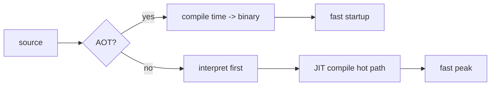

# Compilers 101 (9/10): JIT vs AOT

언제 컴파일하느냐가 사용자가 체감하는 성능이 됩니다. AOT는 배포 전에 모든 것을 미리 최적화하고, JIT는 실제 실행 패턴을 보고 나서 최적화합니다. 어느 쪽이 유리한지는 워크로드가 결정합니다.

이 글은 Compilers 101 시리즈의 9번째 글입니다.

같은 JavaScript 코드가 처음에는 느리다가 어느 순간 빨라지는 이유를 이해하면, 컴파일러 선택이 아니라 **컴파일 시점 선택**이 성능 경험을 바꾼다는 사실이 보이기 시작합니다.


*Compilers 101 9장 흐름 개요*

## 이 글에서 다룰 문제

- AOT와 JIT는 각각 어떻게 정의할 수 있을까요?
- warmup은 왜 생기고 어떻게 측정해야 할까요?
- 각 실행 모델은 어떤 최적화 기회를 열어 줄까요?
- 이 개념을 실무에서 잘못 적용하면 어떤 문제가 생길까요?
- 이 주제에서 초보자가 가장 자주 놓치는 포인트는 무엇일까요?

같은 알고리즘이라도 실행 모드가 인터프리터인지, JIT인지, AOT인지에 따라 체감 성능이 크게 달라질 수 있습니다. 짧게 끝나는 CLI에는 AOT나 인터프리터가 유리할 수 있고, 오래 도는 서버에는 JIT가 유리할 수 있습니다.

> 언제 컴파일하느냐가 사용자가 체감하는 성능이 됩니다.


```mermaid
flowchart LR
    A["source"] --> B{"AOT?"}
    B -- yes --> C["compile time -> binary"]
    C --> D["fast startup"]
    B -- no --> E["interpret first"]
    E --> F["JIT compile hot path"]
    F --> G["fast peak"]
```

AOT는 한 번 컴파일하고 매번 빠르게 시작합니다. JIT는 처음에는 느릴 수 있지만 hot path를 본 뒤 더 공격적으로 최적화할 수 있습니다.

## 핵심 용어

- **AOT(Ahead-Of-Time)**: 배포 전에 미리 컴파일하는 방식입니다. 결과물은 보통 바이너리입니다. C, C++, Rust, Go가 대표 사례입니다.
- **JIT(Just-In-Time)**: 실행 중에 컴파일하는 방식입니다. 결과 코드는 메모리에 머뭅니다. Java, JavaScript, Python(PyPy)이 대표 사례입니다.
- **warmup**: JIT가 hot path를 찾아 최적화하기 전까지의 느린 구간입니다. 처음 N번 호출은 인터프리터 또는 베이스라인 컴파일로 실행됩니다.
- **tiered compilation**: 인터프리터 → baseline JIT → optimizing JIT처럼 여러 단계를 거치는 구조입니다. JVM, V8이 이 방식을 사용합니다.
- **profile-guided optimization(PGO)**: 실제 실행 데이터를 바탕으로 더 공격적으로 최적화하는 접근입니다. AOT가 JIT의 장점을 일부 빌려오는 방법입니다.

## 변경 전후

**Before — 단일 모드의 한계**

```text
pure interpreter: 시작 빠름, 최고 성능 낮음
pure AOT       : 시작 빠름, 최고 성능 빠름, 그러나 런타임 동적 정보는 없음
```

**After — 현대 런타임의 혼합 모델**

```text
JVM / V8 / .NET:
  1. 인터프리터 또는 baseline JIT로 즉시 시작
  2. 자주 호출되는 함수(hot function)를 식별
  3. optimizing JIT로 재컴파일 (더 느리게 만들지만 더 빠르게 실행)
```

여러 단계를 섞으면 각 방식의 장점을 더 잘 가져갈 수 있습니다.

## 실습: JIT 효과 직접 보기

### 1단계 — 순수 Python 인터프리터 성능 측정

```python
# 1_naive.py
import time

def sum_to(n: int) -> int:
    s = 0
    for i in range(n):
        s += i
    return s

# 여러 번 측정해 평균을 냅니다
N = 10_000_000
RUNS = 3
times = []
for _ in range(RUNS):
    t = time.perf_counter()
    result = sum_to(N)
    times.append(time.perf_counter() - t)

print(f"CPython interpreter:")
print(f"  result  = {result}")
print(f"  avg time = {sum(times)/len(times):.3f}s")
print(f"  all runs = {[f'{t:.3f}s' for t in times]}")
# 결과는 시스템에 따라 다르지만 일반적으로 0.3~0.8s
```

CPython은 바이트코드를 인터프리터로 실행합니다. JIT가 없기 때문에 매 호출이 한 단계씩 해석됩니다.

### 2단계 — numba JIT로 warmup 효과 측정

```python
# 2_jit.py
# pip install numba
try:
    from numba import njit
    import time

    @njit
    def sum_to_jit(n: int) -> int:
        s = 0
        for i in range(n):
            s += i
        return s

    N = 10_000_000
    RUNS = 5
    times = []

    for run in range(RUNS):
        t = time.perf_counter()
        result = sum_to_jit(N)
        elapsed = time.perf_counter() - t
        times.append(elapsed)
        label = "WARMUP" if run == 0 else "WARM  "
        print(f"  [{label}] run {run+1}: {elapsed:.4f}s  result={result}")

    print(f"\n  warmup cost  : {times[0]:.3f}s")
    print(f"  warm avg     : {sum(times[1:])/len(times[1:]):.4f}s")
    print(f"  speedup after warmup: {times[0]/times[1]:.0f}x")

except ImportError:
    print("numba not installed. Run: pip install numba")
    print("Expected output:")
    print("  [WARMUP] run 1: 0.8200s  (compilation overhead)")
    print("  [WARM  ] run 2: 0.0012s  (compiled machine code)")
    print("  speedup after warmup: ~683x")
```

첫 호출은 warmup 비용을 내고, 두 번째 호출부터는 이미 만들어 둔 기계 코드를 재사용합니다.

### 3단계 — AOT 예시 (C 컴파일)

```c
// 3_aot.c
#include <stdio.h>

long sum_to(long n) {
    long s = 0;
    for (long i = 0; i < n; i++) s += i;
    return s;
}

int main(void) {
    printf("%ld\n", sum_to(10000000L));
    return 0;
}
```

```bash
# AOT 컴파일: 실행 전에 모든 최적화가 완료됩니다
gcc -O2 3_aot.c -o sum_aot
time ./sum_aot
# 49999995000000
# real 0m0.005s  <- JIT의 warm 상태와 비슷한 속도

# 최적화 없이 컴파일
gcc -O0 3_aot.c -o sum_no_opt
time ./sum_no_opt
# real 0m0.020s  <- 최적화 없이도 CPython보다 훨씬 빠름
```

AOT 바이너리는 이미 최적화된 형태로 배포되므로 시작도 빠르고 최고 성능도 빠릅니다. 대신 런타임의 동적 정보는 직접 볼 수 없습니다.

### 4단계 — tiered compilation 구조 시뮬레이션

```python
# 4_tiered.py
from collections import defaultdict

class TieredRuntime:
    """
    세 계층 컴파일을 흉내 냅니다.
    실제 JVM/V8은 훨씬 복잡하지만 핵심 아이디어는 같습니다.
    """

    INTERPRET_THRESHOLD  = 5     # 이 횟수 미만: 인터프리터
    BASELINE_THRESHOLD   = 50    # 이 횟수 미만: baseline JIT
    OPTIMIZED_THRESHOLD  = 1000  # 이 횟수 이상: optimizing JIT

    def __init__(self):
        self.call_counts: dict[str, int] = defaultdict(int)
        self.compiled: dict[str, str] = {}   # fn -> tier ("baseline" or "optimized")

    def execute(self, fn: str, args: list) -> str:
        """함수를 실행하고 어느 계층이 사용됐는지 반환합니다."""
        count = self.call_counts[fn] + 1
        self.call_counts[fn] = count

        if count < self.INTERPRET_THRESHOLD:
            return f"[interpret  ] {fn}({args}) call #{count}"
        elif count < self.BASELINE_THRESHOLD:
            if self.compiled.get(fn) != "baseline":
                self.compiled[fn] = "baseline"
                print(f"  >> compiling {fn} to baseline JIT (call #{count})")
            return f"[baseline   ] {fn}({args}) call #{count}"
        elif count < self.OPTIMIZED_THRESHOLD:
            return f"[baseline   ] {fn}({args}) call #{count}"
        else:
            if self.compiled.get(fn) != "optimized":
                self.compiled[fn] = "optimized"
                print(f"  >> recompiling {fn} with optimizing JIT (call #{count})")
            return f"[optimizing ] {fn}({args}) call #{count}"

rt = TieredRuntime()
# 몇 번 호출해서 각 계층이 어떻게 바뀌는지 확인합니다
for i in [1, 2, 5, 10, 50, 100, 1000, 1001]:
    rt.call_counts["hot_fn"] = i - 1
    print(rt.execute("hot_fn", [i]))
```

JVM, V8, .NET은 대체로 이런 흐름을 따릅니다. 빨리 만들 수 있는 형태로 먼저 실행하고, 자주 호출되는 함수만 더 느리게 만들지만 더 빠르게 도는 형태로 승격합니다.

### 5단계 — PGO: AOT에서 동적 정보 활용하기

```bash
# 5_pgo.sh
# Step 1: 프로파일 수집용으로 컴파일
gcc -fprofile-generate -O2 prog.c -o prog_prof
./prog_prof              # 실제 워크로드를 실행해 프로파일을 수집합니다
# -> prog.gcda 파일이 생깁니다

# Step 2: 수집된 프로파일로 재컴파일
gcc -fprofile-use -O2 prog.c -o prog_pgo
time ./prog_pgo          # 더 빠른 최적화된 바이너리입니다
```

```python
# PGO의 직관을 Python으로 표현하면:
def pgo_optimize(branch_profile: dict) -> list[str]:
    """
    프로파일 데이터를 보고 최적화 결정을 내립니다.
    실제 PGO는 컴파일러가 자동으로 수행합니다.
    """
    decisions = []
    for branch, (taken, not_taken) in branch_profile.items():
        total = taken + not_taken
        if total == 0:
            continue
        take_ratio = taken / total
        if take_ratio > 0.95:
            decisions.append(f"{branch}: always-taken, 인라인/재배치")
        elif take_ratio < 0.05:
            decisions.append(f"{branch}: never-taken, cold path로 이동")
        else:
            decisions.append(f"{branch}: 양방향 {take_ratio:.0%}/{1-take_ratio:.0%}, 유지")
    return decisions

profile = {
    "null_check":    (9999, 1),    # 거의 항상 null이 아닙니다
    "error_branch":  (2, 9998),    # 거의 오류가 없습니다
    "left_or_right": (5000, 5000), # 반반입니다
}
for d in pgo_optimize(profile):
    print(d)
# null_check: always-taken, 인라인/재배치
# error_branch: never-taken, cold path로 이동
# left_or_right: 양방향 50%/50%, 유지
```

실제 호출 빈도와 분기 방향을 알면 AOT도 더 공격적인 인라이닝과 재배치를 할 수 있습니다. PGO는 AOT가 JIT의 장점을 일부 빌려오는 대표적 방식입니다.

## AOT vs JIT 비교표

| 항목 | AOT | JIT |
|---|---|---|
| 컴파일 시점 | 배포 전 | 실행 중 |
| 시작 시간 | 빠름 | 느림(warmup) |
| 최고 성능 | 높음 | 더 높을 수 있음(동적 정보 활용) |
| 메모리 | 바이너리 크기 | JIT 코드 + 프로파일 데이터 |
| 배포 단위 | 플랫폼별 바이너리 | 바이트코드 + 런타임 |
| 동적 최적화 | 불가(PGO로 부분 가능) | 가능(인라인 캐시 등) |
| 대표 언어 | C, C++, Rust, Go | Java, JavaScript, C# |

## 핵심 정리

- 같은 소스라도 실행 모드에 따라 시작 시간과 최고 성능이 달라집니다.
- JIT의 가장 강한 무기는 런타임에서 수집한 동적 정보입니다.
- AOT의 가장 큰 장점은 배포 단위가 단순하다는 사실입니다.
- 실제 시스템은 대개 두 방식을 섞습니다.
- 짧게 끝나는 프로세스는 AOT, 오래 도는 서버는 JIT가 유리한 경향이 있습니다.

## 자주 하는 실수

1. **JIT를 단 한 번의 호출만 보고 평가하는 것**입니다. 첫 호출은 컴파일 오버헤드를 포함합니다. warmup 후 steady-state 성능을 측정해야 합니다.
2. **AOT가 항상 이긴다고 가정하는 것**입니다. 동적 디스패치, 다형성, 런타임 타입 피드백이 많은 코드에서는 JIT가 AOT를 앞설 수 있습니다.
3. **JIT의 메모리 비용을 무시하는 것**입니다. 생성된 코드 캐시와 프로파일 데이터가 수십~수백 MB를 차지할 수 있습니다.
4. **AOT 바이너리 크기를 과소평가하는 것**입니다. 공격적인 인라이닝과 여러 아키텍처를 지원하면 바이너리가 크게 커집니다.
5. **PGO를 공짜라고 생각하는 것**입니다. 프로파일 수집 실행, 분석, 재컴파일까지 CI/CD 파이프라인에 추가 단계가 필요합니다.

## 실무에서는 이렇게 나타납니다

JVM, .NET, V8, JavaScriptCore는 모두 계층형 JIT를 사용합니다. Go, Rust, C, C++는 대표적인 AOT 계열입니다.

```python
# 어떤 컴파일 방식을 선택할지 판단하는 체크리스트
def choose_compilation_strategy(
    process_lifetime_sec: float,
    startup_critical: bool,
    dynamic_dispatch_heavy: bool,
    memory_constrained: bool,
) -> str:
    if memory_constrained:
        return "AOT or interpreter — JIT 코드 캐시가 메모리를 씁니다"
    if startup_critical and process_lifetime_sec < 1:
        return "AOT — warmup 시간이 전체를 압도합니다"
    if process_lifetime_sec > 60 and dynamic_dispatch_heavy:
        return "JIT — 동적 정보를 활용해 AOT를 앞설 수 있습니다"
    if process_lifetime_sec > 3600:
        return "JIT + PGO — 긴 실행에서 JIT 이득이 warmup 비용을 상쇄합니다"
    return "AOT + PGO — 빠른 시작과 높은 성능을 모두 원하는 경우"

# 예시
print(choose_compilation_strategy(0.1, True, False, False))
# AOT — warmup 시간이 전체를 압도합니다
print(choose_compilation_strategy(3600, False, True, False))
# JIT + PGO — 긴 실행에서 JIT 이득이 warmup 비용을 상쇄합니다
```

Android ART는 AOT와 JIT를 혼합하고, WebAssembly 엔진도 AOT와 JIT를 모두 지원합니다. CPython 3.13부터 JIT 도입이 진행되고 있습니다.

## 숙련된 엔지니어는 이렇게 봅니다

- 워크로드의 시작 시간 대비 최고 성능 비율을 먼저 측정합니다.
- 짧게 끝나는 프로세스는 AOT나 인터프리터가 유리하다는 점을 압니다.
- 오래 도는 서버는 warmup 비용을 상쇄하고 JIT 이득을 얻기 쉽다는 점을 압니다.
- 메모리 제약 환경에서는 JIT가 배제될 수 있다는 점을 압니다.
- 측정 없이 실행 모드를 바꾸지 않습니다.

## 운영 체크리스트

- [ ] AOT와 JIT를 한 문장으로 비교할 수 있습니까?
- [ ] warmup이 왜 생기는지 설명할 수 있습니까?
- [ ] 동적 정보가 열어 주는 최적화 예를 하나 들 수 있습니까?
- [ ] tiered compilation 흐름을 그릴 수 있습니까?
- [ ] PGO가 AOT의 어떤 약점을 보완하는지 말할 수 있습니까?

## 연습 문제

1. 같은 함수를 CPython과 numba에서 실행해 첫 호출과 warm 호출 시간을 비교해 보세요.
2. 짧게 끝나는 CLI 도구 하나를 가정하고 AOT와 JIT 중 어느 쪽이 더 맞는지 1분 안에 판단해 보세요.
3. JIT가 inline cache를 이용해 동적 디스패치 비용을 줄이는 방식을 한 단락으로 설명해 보세요.

## 처음 질문으로 돌아가기

- **AOT와 JIT는 각각 어떻게 정의할 수 있을까요?**
  - AOT(Ahead-Of-Time)는 배포 전에 미리 컴파일합니다. 바이너리는 최적화된 채로 배포되어 실행 시 추가 컴파일이 없습니다. JIT(Just-In-Time)는 실행 중에 코드를 컴파일합니다. 처음에는 인터프리터나 baseline 컴파일로 시작하고, 자주 실행되는 hot path를 식별한 뒤 더 공격적으로 최적화합니다.
- **warmup은 왜 생기고 어떻게 측정해야 할까요?**
  - JIT는 실행 패턴을 관찰하고 나서야 최적화할 수 있으므로, 처음 N번 실행은 컴파일 또는 인터프리터 비용을 냅니다. 이 구간이 warmup입니다. 측정할 때는 첫 호출(컴파일 포함)과 warm 호출(컴파일 완료)을 분리해야 합니다. 첫 호출만 보면 JIT를 과소평가하고, warm 호출만 보면 실제 시작 비용을 놓칩니다.
- **각 실행 모델은 어떤 최적화 기회를 열어 줄까요?**
  - AOT는 전체 프로그램 분석, 인라이닝, 정적 타입 기반 최적화를 할 수 있지만 런타임 정보가 없습니다. JIT는 실제 타입 피드백(inline cache), 분기 예측, 동적 인라이닝, deoptimization 같은 강력한 도구를 추가로 사용할 수 있습니다.

## 정리와 다음 글

JIT와 AOT는 결국 "언제 컴파일할 것인가?"라는 한 질문에서 갈라진 두 모델입니다. 다음 글에서는 지금까지 배운 렉서, 파서, 평가기를 한 파일로 합쳐 작은 인터프리터를 직접 만들어 봅니다.

<!-- toc:begin -->
## 시리즈 목차

- [Compilers 101 (1/10): 컴파일러란 무엇인가?](./01-what-is-a-compiler.md)
- [Compilers 101 (2/10): 렉시컬 분석](./02-lexical-analysis.md)
- [Compilers 101 (3/10): 파싱과 AST](./03-parsing-and-ast.md)
- [Compilers 101 (4/10): 시맨틱 분석](./04-semantic-analysis.md)
- [Compilers 101 (5/10): 심볼 테이블과 스코프](./05-symbol-table-and-scope.md)
- [Compilers 101 (6/10): 중간 표현](./06-intermediate-representation.md)
- [Compilers 101 (7/10): 최적화 기초](./07-optimization-basics.md)
- [Compilers 101 (8/10): 코드 생성](./08-code-generation.md)
- **Compilers 101 (9/10): JIT vs AOT (현재 글)**
- [작은 인터프리터 만들기](./10-building-a-tiny-interpreter.md)

<!-- toc:end -->

## 참고 자료

- [Just-in-time compilation (Wikipedia)](https://en.wikipedia.org/wiki/Just-in-time_compilation)
- [Ahead-of-time compilation (Wikipedia)](https://en.wikipedia.org/wiki/Ahead-of-time_compilation)
- [V8 — Ignition and TurboFan](https://v8.dev/blog/launching-ignition-and-turbofan)
- [Profile-guided optimization (Wikipedia)](https://en.wikipedia.org/wiki/Profile-guided_optimization)

- [이 시리즈 예제 코드 (book-examples)](https://github.com/yeongseon-books/book-examples/tree/main/compilers-101/ko)

Tags: Computer Science, Compilers, JIT, AOT, Tradeoffs, Warmup
