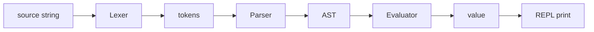

# 작은 인터프리터 만들기

이 글은 Compilers 101 시리즈의 마지막 글입니다. 지금까지 따로 배운 렉서, 파서, 평가기가 한 파일 안에서 어떻게 연결되는지 직접 보면, 각 단계의 인터페이스가 실제로 어디에서 만나고 무엇을 주고받는지 한눈에 정리됩니다.

## 이 글에서 다룰 문제

- 렉서, 파서, 평가기를 한 파일로 어떻게 조합할 수 있을까요?
- 재귀 하강 파서의 최소 구현은 어떤 모습일까요?
- 인터프리터는 AST를 어떻게 걸어 값을 만들까요?
- REPL은 하나의 실행 사이클을 어떻게 닫아 줄까요?
- 이 코드를 다음 단계에서 어떻게 확장할 수 있을까요?

> 이 글에서는 산술식 인터프리터를 한 파일로 만들며, 입력을 토큰화하고 AST로 바꾸고 값을 평가한 뒤 REPL로 감싸는 전체 흐름을 직접 연결합니다.

## 왜 중요한가

단계를 따로 배울 때는 각각이 이해된 것처럼 보여도, 실제로는 연결 지점이 보이지 않으면 감이 남지 않습니다. 한 파일로 합친 예제는 “내가 어느 단계까지 직접 다룰 수 있는가?”를 확인하는 가장 좋은 점검 도구이기도 합니다.

> 모든 단계를 한 파일에 모으면 각 인터페이스가 무엇인지 즉시 드러납니다.

## 핵심 개념 한눈에 보기



각 화살표는 명확한 자료형을 주고받습니다. 이 단순한 자료형 경계가 미니 인터프리터의 핵심입니다.

## 핵심 용어

- 토큰: 렉서가 만드는 가장 작은 의미 단위입니다.
- **AST 노드**: 파서가 만드는 트리 노드입니다.
- **재귀 하강**: 문법 규칙 하나를 함수 하나가 담당하는 파서 스타일입니다.
- 평가기: AST를 순회하며 실제 값으로 줄이는 단계입니다.
- **REPL**: Read-Eval-Print Loop의 약자로, 입력 한 줄 → 평가 → 출력 한 줄의 반복입니다.

## Before / After

**Before — 단계가 파일마다 흩어져 있는 상태**

```text
lexer.py, parser.py, evaluator.py  -> the flow is hard to see at once
```

**After — 한 파일 미니 인터프리터**

```text
mini.py: Lexer -> Parser -> Evaluator -> REPL
```

흐름과 자료형 전환이 한 화면 안에 들어옵니다.

## 실습: 산술식 인터프리터 만들기

### 1단계 — Lexer

```python
# mini.py (1)
import re

TOKEN = re.compile(r"\s*(?:(\d+(?:\.\d+)?)|(.))")

def tokenize(src):
    tokens = []
    for num, op in TOKEN.findall(src):
        if num:
            tokens.append(("NUM", float(num)))
        elif op.strip():
            tokens.append((op, op))
    tokens.append(("EOF", None))
    return tokens
```

`tokenize("1 + 2")`는 `[ ("NUM",1.0), ("+","+"), ("NUM",2.0), ("EOF",None) ]` 같은 형태를 돌려줍니다. 정규식 하나가 전체 입력 분해를 담당합니다.

### 2단계 — Parser (재귀 하강)

```python
# mini.py (2)
class Parser:
    def __init__(self, tokens):
        self.tokens = tokens
        self.pos = 0

    def peek(self): return self.tokens[self.pos]
    def eat(self, kind):
        tok = self.tokens[self.pos]
        if tok[0] != kind:
            raise SyntaxError(f"expected {kind}, got {tok[0]}")
        self.pos += 1
        return tok

    def parse(self):
        node = self.expr()
        self.eat("EOF")
        return node

    def expr(self):
        node = self.term()
        while self.peek()[0] in ("+", "-"):
            op = self.eat(self.peek()[0])[0]
            node = ("BinOp", op, node, self.term())
        return node

    def term(self):
        node = self.factor()
        while self.peek()[0] in ("*", "/"):
            op = self.eat(self.peek()[0])[0]
            node = ("BinOp", op, node, self.factor())
        return node

    def factor(self):
        tok = self.peek()
        if tok[0] == "NUM":
            self.eat("NUM")
            return ("Num", tok[1])
        if tok[0] == "(":
            self.eat("(")
            node = self.expr()
            self.eat(")")
            return node
        raise SyntaxError(f"unexpected {tok}")
```

`expr -> term ((+|-) term)*`과 `term -> factor ((*|/) factor)*`라는 두 규칙만으로 우선순위가 자연스럽게 드러납니다.

### 3단계 — Evaluator

```python
# mini.py (3)
def evaluate(node):
    kind = node[0]
    if kind == "Num":
        return node[1]
    if kind == "BinOp":
        op, l, r = node[1], evaluate(node[2]), evaluate(node[3])
        if op == "+": return l + r
        if op == "-": return l - r
        if op == "*": return l * r
        if op == "/": return l / r
    raise RuntimeError(f"unknown node {node}")
```

이 크기에서는 Visitor 패턴 없이 튜플 기반 AST만으로도 충분히 깔끔합니다.

### 4단계 — REPL

```python
# mini.py (4)
def run(src):
    return evaluate(Parser(tokenize(src)).parse())

if __name__ == "__main__":
    while True:
        try:
            line = input("mini> ")
        except (EOFError, KeyboardInterrupt):
            break
        if not line.strip():
            continue
        try:
            print(run(line))
        except Exception as e:
            print("error:", e)
```

`mini> 1 + 2 * 3`을 입력하면 `7.0`을 출력합니다. 한 줄 입력, 한 줄 출력이라는 전형적인 REPL 구조입니다.

### 5단계 — 직접 실행해 보기

```bash
python3 mini.py
mini> (1 + 2) * 3
9.0
mini> 10 / 4
2.5
mini> 1 +
error: expected NUM, got EOF
```

짧은 예제지만 렉서, 파서, 평가기가 모두 협력해 결과를 내는 과정을 그대로 볼 수 있습니다.

## 이 코드에서 먼저 봐야 할 점

- 각 단계의 자료형이 명확합니다. `str -> list[token] -> tuple AST -> float`입니다.
- 우선순위는 평가기가 아니라 문법 함수(`expr / term / factor`)에 인코딩됩니다.
- 오류는 가능한 한 각 단계 가까이에서 발생합니다.
- 튜플 AST는 이 규모에서 출력과 디버깅이 매우 쉽습니다.

## 자주 하는 실수 다섯 가지

1. **lex, parse, eval을 한 함수에 몰아넣는 것**입니다. 단계 분리가 무너지면 디버깅이 어려워집니다.
2. **우선순위를 단일 함수에서 처리하려는 것**입니다. 덧셈과 곱셈이 섞이면 바로 오답이 나옵니다.
3. **EOF 토큰을 생략하는 것**입니다. 입력 종료 지점이 모호해집니다.
4. **위치 정보 없는 오류를 내는 것**입니다. REPL 사용자는 어디가 잘못됐는지 알기 어렵습니다.
5. **0으로 나누기 같은 런타임 오류를 고려하지 않는 것**입니다. REPL이 그대로 죽을 수 있습니다.

## 실무에서는 이렇게 나타납니다

작은 DSL, 검색 질의 언어, 필터 표현식, 설정 표현식은 거의 언제나 이 구조에서 시작합니다. 데이터 도구의 식 평가기, SQL의 WHERE 절 평가기, 게임 런타임의 룰 엔진도 기본 형태는 비슷합니다. 여기에 변수와 함수만 더하면 교육용 언어가 됩니다.

## 숙련된 엔지니어는 이렇게 봅니다

- 코드를 쓰기 전에 각 단계의 입력/출력 자료형부터 적어 둡니다.
- 우선순위는 평가기에서 처리하지 않고 문법에 넣습니다.
- 오류 메시지를 위해 위치 정보를 처음부터 유지합니다.
- AST는 동작하는 한 가장 단순한 구조로 유지합니다.
- 변수, 함수 같은 확장은 다음 반복으로 미룹니다.

## 체크리스트

- [ ] 렉서, 파서, 평가기의 입력/출력 타입을 말할 수 있습니까?
- [ ] 재귀 하강이 우선순위를 어떻게 표현하는지 설명할 수 있습니까?
- [ ] EOF 토큰이 왜 필요한지 말할 수 있습니까?
- [ ] REPL 사이클을 한 문장으로 요약할 수 있습니까?
- [ ] 다음으로 추가할 확장 하나를 정했습니까?

## 연습 문제

1. unary minus(`-3`, `-(1+2)`)를 처리하도록 파서와 평가기를 확장해 보세요.
2. 환경 딕셔너리를 추가해 `x = 1 + 2` 다음 `x * 3`을 평가하게 만들어 보세요.
3. 에러 메시지에 토큰 위치(index 또는 column)를 추가해 보세요.

## 정리 및 다음 단계

이 글에서는 한 파일 안에서 렉서, 파서, 평가기를 연결해 작은 인터프리터를 완성했습니다. 이제 이 코드를 변수, 함수, 타입이 있는 장난감 언어로 확장할 수도 있고, 같은 AST를 백엔드 코드로 내려 실제 컴파일러 쪽으로 더 나아갈 수도 있습니다. 시리즈는 여기서 끝납니다.

<!-- toc:begin -->
- [컴파일러란 무엇인가?](./01-what-is-a-compiler.md)
- [렉시컬 분석](./02-lexical-analysis.md)
- [파싱과 AST](./03-parsing-and-ast.md)
- [시맨틱 분석](./04-semantic-analysis.md)
- [심볼 테이블과 스코프](./05-symbol-table-and-scope.md)
- [중간 표현](./06-intermediate-representation.md)
- [최적화 기초](./07-optimization-basics.md)
- [코드 생성](./08-code-generation.md)
- [JIT vs AOT](./09-jit-vs-aot.md)
- **작은 인터프리터 만들기 (현재 글)**
<!-- toc:end -->

## 참고 자료

- [Crafting Interpreters — Robert Nystrom](https://craftinginterpreters.com/)
- [Recursive descent parser (Wikipedia)](https://en.wikipedia.org/wiki/Recursive_descent_parser)
- [Read–eval–print loop (Wikipedia)](https://en.wikipedia.org/wiki/Read%E2%80%93eval%E2%80%93print_loop)
- [Abstract syntax tree (Wikipedia)](https://en.wikipedia.org/wiki/Abstract_syntax_tree)

Tags: Computer Science, Compilers, Interpreter, Capstone, AST, REPL
