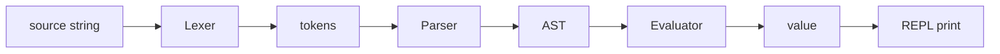

# 작은 인터프리터 만들어 보기

> Compilers 101 시리즈 (10/10)


## 이 글에서 다룰 문제

분리해서 배운 단계는 합쳐 봐야 진짜로 이해됩니다. 이 글의 코드 한 파일이면 "내가 컴파일러의 어느 단계까지 다뤘는가"를 한눈에 점검할 수 있습니다. 변수, 함수, 타입을 더 얹어 가는 출발점이기도 합니다.

> 한 파일에 모으면 모든 단계의 인터페이스가 분명해집니다.

## 전체 흐름


각 화살표는 명확한 자료형을 주고받습니다. 이 자료형의 단순함이 이 미니 인터프리터의 핵심입니다.

## Before/After

**Before — 단계가 흩어져 있는 코드**

```text
lexer.py, parser.py, evaluator.py  → 흐름이 한눈에 안 들어옴
```

**After — 한 파일 미니 인터프리터**

```text
mini.py: Lexer → Parser → Evaluator → REPL
```

흐름과 자료형 변환이 한 화면에서 보입니다.

## 산술식 인터프리터 만들기

### 1단계 — Lexer

```python
# mini.py (1)
import re

TOKEN = re.compile(r"\s*(?:(\d+(?:\.\d+)?)|(.))")

def tokenize(src):
    tokens = []
    for num, op in TOKEN.findall(src):
        if num:
            tokens.append(("NUM", float(num)))
        elif op.strip():
            tokens.append((op, op))
    tokens.append(("EOF", None))
    return tokens
```

`tokenize("1 + 2")` → `[("NUM",1.0), ("+","+"), ("NUM",2.0), ("EOF",None)]`. 정규식 하나로 끝낸 점이 핵심입니다.

### 2단계 — Parser (recursive descent)

```python
# mini.py (2)
class Parser:
    def __init__(self, tokens):
        self.tokens = tokens
        self.pos = 0

    def peek(self): return self.tokens[self.pos]
    def eat(self, kind):
        tok = self.tokens[self.pos]
        if tok[0] != kind:
            raise SyntaxError(f"expected {kind}, got {tok[0]}")
        self.pos += 1
        return tok

    def parse(self):
        node = self.expr()
        self.eat("EOF")
        return node

    def expr(self):
        node = self.term()
        while self.peek()[0] in ("+", "-"):
            op = self.eat(self.peek()[0])[0]
            node = ("BinOp", op, node, self.term())
        return node

    def term(self):
        node = self.factor()
        while self.peek()[0] in ("*", "/"):
            op = self.eat(self.peek()[0])[0]
            node = ("BinOp", op, node, self.factor())
        return node

    def factor(self):
        tok = self.peek()
        if tok[0] == "NUM":
            self.eat("NUM")
            return ("Num", tok[1])
        if tok[0] == "(":
            self.eat("(")
            node = self.expr()
            self.eat(")")
            return node
        raise SyntaxError(f"unexpected {tok}")
```

`expr → term ((+|-) term)*`, `term → factor ((*|/) factor)*`. 이 한 쌍으로 우선순위가 자연스레 잡힙니다.

### 3단계 — Evaluator

```python
# mini.py (3)
def evaluate(node):
    kind = node[0]
    if kind == "Num":
        return node[1]
    if kind == "BinOp":
        op, l, r = node[1], evaluate(node[2]), evaluate(node[3])
        if op == "+": return l + r
        if op == "-": return l - r
        if op == "*": return l * r
        if op == "/": return l / r
    raise RuntimeError(f"unknown node {node}")
```

Visitor를 쓰지 않고 tuple만으로도 충분히 깔끔합니다.

### 4단계 — REPL

```python
# mini.py (4)
def run(src):
    return evaluate(Parser(tokenize(src)).parse())

if __name__ == "__main__":
    while True:
        try:
            line = input("mini> ")
        except (EOFError, KeyboardInterrupt):
            break
        if not line.strip():
            continue
        try:
            print(run(line))
        except Exception as e:
            print("error:", e)
```

`mini> 1 + 2 * 3` → `7.0`. 입력 한 줄, 결과 한 줄. read-eval-print loop의 기본형입니다.

### 5단계 — 직접 시험해 보기

```bash
python3 mini.py
mini> (1 + 2) * 3
9.0
mini> 10 / 4
2.5
mini> 1 +
error: expected NUM, got EOF
```

모든 단계가 협력해 사용자에게 한 줄짜리 결과를 돌려주는 것을 확인할 수 있습니다.

## 이 코드에서 주목할 점

- 자료형이 명확합니다: `str → list[token] → tuple AST → float`.
- 우선순위는 문법 함수 분리(`expr`/`term`/`factor`)로 표현됩니다.
- error는 단계마다 가까이서 던집니다 (lexer/parser/evaluator).
- AST를 tuple로 두니 시각화와 디버깅이 쉽습니다.

## 자주 하는 실수 5가지

1. **한 함수에 lex/parse/eval을 다 넣는다.** 단계 분리는 디버깅을 결정합니다.
2. **우선순위를 한 함수로 처리한다.** 곱셈과 덧셈이 섞이면 결과가 달라집니다.
3. **EOF token을 안 넣는다.** parser 끝맺음이 모호해져 무한 루프가 됩니다.
4. **error 메시지에 위치를 안 붙인다.** REPL 사용자가 디버깅을 못 합니다.
5. **0으로 나눔을 catch하지 않는다.** REPL이 그대로 죽습니다.

## 실무에서는 이렇게 쓰입니다

작은 DSL(검색 쿼리, 필터 표현식, 설정 표현식)은 이 구조에서 거의 그대로 출발합니다. 데이터 도구의 expression evaluator, SQL의 WHERE 절 평가기, 게임 엔진의 룰 평가기 모두 동일한 layout입니다. 변수와 함수를 더하면 곧장 학습용 toy language가 됩니다.

## 체크리스트

- [ ] lexer/parser/evaluator의 입출력 자료형을 말할 수 있는가?
- [ ] recursive descent로 우선순위를 표현하는 법을 설명할 수 있는가?
- [ ] EOF token이 왜 필요한지 답할 수 있는가?
- [ ] REPL의 사이클을 한 문장으로 정리할 수 있는가?
- [ ] 다음 확장으로 무엇을 더할지 한 가지 정했는가?

## 정리 및 다음 단계

작은 인터프리터를 한 파일로 만들었고, 그 안에서 이 시리즈에서 배운 모든 단계를 확인했습니다. 다음 단계는 변수, 함수, 타입을 얹어 toy language로 키우거나, 같은 AST를 backend code로 변환해 진짜 컴파일러로 확장하는 것입니다. 시리즈는 여기서 마칩니다.

<!-- toc:begin -->
- [컴파일러란 무엇인가?](./01-what-is-a-compiler.md)
- [lexical analysis](./02-lexical-analysis.md)
- [parsing과 AST](./03-parsing-and-ast.md)
- [semantic analysis](./04-semantic-analysis.md)
- [symbol table과 scope](./05-symbol-table-and-scope.md)
- [intermediate representation](./06-intermediate-representation.md)
- [optimization 기초](./07-optimization-basics.md)
- [code generation](./08-code-generation.md)
- [JIT vs AOT](./09-jit-vs-aot.md)
- **작은 인터프리터 만들어 보기 (현재 글)**
<!-- toc:end -->

## 참고 자료

- [Crafting Interpreters — Robert Nystrom](https://craftinginterpreters.com/)
- [Recursive descent parser (Wikipedia)](https://en.wikipedia.org/wiki/Recursive_descent_parser)
- [Read–eval–print loop (Wikipedia)](https://en.wikipedia.org/wiki/Read%E2%80%93eval%E2%80%93print_loop)
- [Abstract syntax tree (Wikipedia)](https://en.wikipedia.org/wiki/Abstract_syntax_tree)

Tags: Computer Science, Compilers, Interpreter, Capstone, AST, REPL
