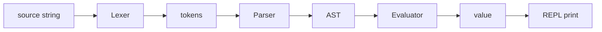

# Compilers 101 (10/10): 작은 인터프리터 만들기

이 글은 Compilers 101 시리즈의 마지막 글입니다.

지금까지 따로 배운 렉서, 파서, 평가기가 한 파일 안에서 어떻게 연결되는지 직접 보면, 각 단계의 인터페이스가 실제로 어디에서 만나고 무엇을 주고받는지 한눈에 정리됩니다.


*Compilers 101 10장 흐름 개요*

## 먼저 던지는 질문

- 렉서, 파서, 평가기를 한 파일로 어떻게 조합할 수 있을까요?
- 재귀 하강 파서의 최소 구현은 어떤 모습일까요?
- 인터프리터는 AST를 어떻게 걸어 값을 만들까요?

## 왜 중요한가

단계를 따로 배울 때는 각각이 이해된 것처럼 보여도, 실제로는 연결 지점이 보이지 않으면 감이 남지 않습니다. 한 파일로 합친 예제는 “내가 어느 단계까지 직접 다룰 수 있는가?”를 확인하는 가장 좋은 점검 도구이기도 합니다.

> 모든 단계를 한 파일에 모으면 각 인터페이스가 무엇인지 즉시 드러납니다.

## 핵심 개념 한눈에 보기



각 화살표는 명확한 자료형을 주고받습니다. 이 단순한 자료형 경계가 미니 인터프리터의 핵심입니다.

## 핵심 용어

- 토큰: 렉서가 만드는 가장 작은 의미 단위입니다.
- **AST 노드**: 파서가 만드는 트리 노드입니다.
- **재귀 하강**: 문법 규칙 하나를 함수 하나가 담당하는 파서 스타일입니다.
- 평가기: AST를 순회하며 실제 값으로 줄이는 단계입니다.
- **REPL**: Read-Eval-Print Loop의 약자로, 입력 한 줄 → 평가 → 출력 한 줄의 반복입니다.

## 변경 전후

**Before — 단계가 파일마다 흩어져 있는 상태**

```text
lexer.py, parser.py, evaluator.py  -> the flow is hard to see at once
```

**After — 한 파일 미니 인터프리터**

```text
mini.py: Lexer -> Parser -> Evaluator -> REPL
```

흐름과 자료형 전환이 한 화면 안에 들어옵니다.

## 실습: 산술식 인터프리터 만들기

### 1단계 — Lexer

```python
# mini.py (1)
import re

TOKEN = re.compile(r"\s*(?:(\d+(?:\.\d+)?)|(.))")

def tokenize(src):
    tokens = []
    for num, op in TOKEN.findall(src):
        if num:
            tokens.append(("NUM", float(num)))
        elif op.strip():
            tokens.append((op, op))
    tokens.append(("EOF", None))
    return tokens
```

`tokenize("1 + 2")`는 `[ ("NUM",1.0), ("+","+"), ("NUM",2.0), ("EOF",None) ]` 같은 형태를 돌려줍니다. 정규식 하나가 전체 입력 분해를 담당합니다.

### 2단계 — Parser (재귀 하강)

```python
# mini.py (2)
class Parser:
    def __init__(self, tokens):
        self.tokens = tokens
        self.pos = 0

    def peek(self): return self.tokens[self.pos]
    def eat(self, kind):
        tok = self.tokens[self.pos]
        if tok[0] != kind:
            raise SyntaxError(f"expected {kind}, got {tok[0]}")
        self.pos += 1
        return tok

    def parse(self):
        node = self.expr()
        self.eat("EOF")
        return node

    def expr(self):
        node = self.term()
        while self.peek()[0] in ("+", "-"):
            op = self.eat(self.peek()[0])[0]
            node = ("BinOp", op, node, self.term())
        return node

    def term(self):
        node = self.factor()
        while self.peek()[0] in ("*", "/"):
            op = self.eat(self.peek()[0])[0]
            node = ("BinOp", op, node, self.factor())
        return node

    def factor(self):
        tok = self.peek()
        if tok[0] == "NUM":
            self.eat("NUM")
            return ("Num", tok[1])
        if tok[0] == "(":
            self.eat("(")
            node = self.expr()
            self.eat(")")
            return node
        raise SyntaxError(f"unexpected {tok}")
```

`expr -> term ((+|-) term)*`과 `term -> factor ((*|/) factor)*`라는 두 규칙만으로 우선순위가 자연스럽게 드러납니다.

### 3단계 — Evaluator

```python
# mini.py (3)
def evaluate(node):
    kind = node[0]
    if kind == "Num":
        return node[1]
    if kind == "BinOp":
        op, l, r = node[1], evaluate(node[2]), evaluate(node[3])
        if op == "+": return l + r
        if op == "-": return l - r
        if op == "*": return l * r
        if op == "/": return l / r
    raise RuntimeError(f"unknown node {node}")
```

이 크기에서는 Visitor 패턴 없이 튜플 기반 AST만으로도 충분히 깔끔합니다.

### 4단계 — REPL

```python
# mini.py (4)
def run(src):
    return evaluate(Parser(tokenize(src)).parse())

if __name__ == "__main__":
    while True:
        try:
            line = input("mini> ")
        except (EOFError, KeyboardInterrupt):
            break
        if not line.strip():
            continue
        try:
            print(run(line))
        except Exception as e:
            print("error:", e)
```

`mini> 1 + 2 * 3`을 입력하면 `7.0`을 출력합니다. 한 줄 입력, 한 줄 출력이라는 전형적인 REPL 구조입니다.

### 5단계 — 직접 실행해 보기

```bash
python3 mini.py
mini> (1 + 2) * 3
9.0
mini> 10 / 4
2.5
mini> 1 +
error: expected NUM, got EOF
```

짧은 예제지만 렉서, 파서, 평가기가 모두 협력해 결과를 내는 과정을 그대로 볼 수 있습니다.

## 이 코드에서 먼저 봐야 할 점

- 각 단계의 자료형이 명확합니다. `str -> list[token] -> tuple AST -> float`입니다.
- 우선순위는 평가기가 아니라 문법 함수(`expr / term / factor`)에 인코딩됩니다.
- 오류는 가능한 한 각 단계 가까이에서 발생합니다.
- 튜플 AST는 이 규모에서 출력과 디버깅이 매우 쉽습니다.

## 자주 하는 실수 다섯 가지

1. **lex, parse, eval을 한 함수에 몰아넣는 것**입니다. 단계 분리가 무너지면 디버깅이 어려워집니다.
2. **우선순위를 단일 함수에서 처리하려는 것**입니다. 덧셈과 곱셈이 섞이면 바로 오답이 나옵니다.
3. **EOF 토큰을 생략하는 것**입니다. 입력 종료 지점이 모호해집니다.
4. **위치 정보 없는 오류를 내는 것**입니다. REPL 사용자는 어디가 잘못됐는지 알기 어렵습니다.
5. **0으로 나누기 같은 런타임 오류를 고려하지 않는 것**입니다. REPL이 그대로 죽을 수 있습니다.

## 실무에서는 이렇게 나타납니다

작은 DSL, 검색 질의 언어, 필터 표현식, 설정 표현식은 거의 언제나 이 구조에서 시작합니다. 데이터 도구의 식 평가기, SQL의 WHERE 절 평가기, 게임 런타임의 룰 엔진도 기본 형태는 비슷합니다. 여기에 변수와 함수만 더하면 교육용 언어가 됩니다.

## 숙련된 엔지니어는 이렇게 봅니다

- 코드를 쓰기 전에 각 단계의 입력/출력 자료형부터 적어 둡니다.
- 우선순위는 평가기에서 처리하지 않고 문법에 넣습니다.
- 오류 메시지를 위해 위치 정보를 처음부터 유지합니다.
- AST는 동작하는 한 가장 단순한 구조로 유지합니다.
- 변수, 함수 같은 확장은 다음 반복으로 미룹니다.

## 체크리스트

- [ ] 렉서, 파서, 평가기의 입력/출력 타입을 말할 수 있습니까?
- [ ] 재귀 하강이 우선순위를 어떻게 표현하는지 설명할 수 있습니까?
- [ ] EOF 토큰이 왜 필요한지 말할 수 있습니까?
- [ ] REPL 사이클을 한 문장으로 요약할 수 있습니까?
- [ ] 다음으로 추가할 확장 하나를 정했습니까?

## 연습 문제

1. unary minus(`-3`, `-(1+2)`)를 처리하도록 파서와 평가기를 확장해 보세요.
2. 환경 딕셔너리를 추가해 `x = 1 + 2` 다음 `x * 3`을 평가하게 만들어 보세요.
3. 에러 메시지에 토큰 위치(index 또는 column)를 추가해 보세요.

## 정리와 다음 단계

이 글에서는 한 파일 안에서 렉서, 파서, 평가기를 연결해 작은 인터프리터를 완성했습니다. 이제 이 코드를 변수, 함수, 타입이 있는 장난감 언어로 확장할 수도 있고, 같은 AST를 백엔드 코드로 내려 실제 컴파일러 쪽으로 더 나아갈 수도 있습니다. 시리즈는 여기서 끝납니다.

## 확장 실습: 프런트엔드부터 LLVM IR 직전까지 한 번에 검증하기

이 시점부터는 단계별 조각 실습을 넘어, 한 입력이 토큰, AST, 타입 정보, IR, 최적화 결과, 코드 생성 결과로 어떻게 이어지는지 한 번에 추적하는 연습이 필요합니다. 핵심은 코드 길이가 아니라 **변환 경계가 보이는 출력**을 남기는 것입니다. 아래 예시는 시리즈 전체를 관통하는 최소 골격입니다.

### 문법 고정: BNF 표기 먼저 확정하기

문법이 흔들리면 파서와 의미 분석 경계도 함께 흔들립니다. 구현 전에 BNF를 먼저 잠그면 우선순위, 결합성, 허용 구문을 팀 단위로 공유할 수 있습니다.

```bnf
<program> ::= <stmt_list>
<stmt_list> ::= <stmt> | <stmt> <stmt_list>
<stmt> ::= "let" <ident> "=" <expr> ";" | "print" <expr> ";"
<expr> ::= <term> | <expr> "+" <term> | <expr> "-" <term>
<term> ::= <factor> | <term> "*" <factor> | <term> "/" <factor>
<factor> ::= <number> | <ident> | "(" <expr> ")"
```

### 렉서 출력 고정: 토큰과 위치 정보를 함께 기록하기

```python
from dataclasses import dataclass
import re

@dataclass
class Token:
    kind: str
    text: str
    line: int
    col: int

SPEC = [
    ("KW", r"\b(let|print)\b"),
    ("IDENT", r"[A-Za-z_][A-Za-z0-9_]*"),
    ("NUMBER", r"\d+"),
    ("OP", r"[+\-*/=]"),
    ("LPAREN", r"\("),
    ("RPAREN", r"\)"),
    ("SEMI", r";"),
    ("WS", r"[ \t\n]+"),
]

def lex(src: str) -> list[Token]:
    out: list[Token] = []
    i, line, col = 0, 1, 1
    while i < len(src):
        for kind, pat in SPEC:
            m = re.match(pat, src[i:])
            if not m:
                continue
            text = m.group(0)
            if kind != "WS":
                out.append(Token(kind, text, line, col))
            for ch in text:
                if ch == "
":
                    line += 1
                    col = 1
                else:
                    col += 1
            i += len(text)
            break
        else:
            raise SyntaxError(f"unexpected character {src[i]!r} at {line}:{col}")
    return out
```

이 출력은 이후 단계에서 오류 메시지 기준 좌표가 됩니다. line/col 정보가 없으면 파서와 의미 분석 품질을 끝까지 올리기 어렵습니다.

### AST 노드 정의: 구조를 명시적으로 분리하기

```python
from dataclasses import dataclass

@dataclass
class Number:
    value: int

@dataclass
class Identifier:
    name: str

@dataclass
class Binary:
    op: str
    left: object
    right: object

@dataclass
class LetStmt:
    name: str
    expr: object

@dataclass
class PrintStmt:
    expr: object
```

여기서 중요한 점은 문법 요소와 실행 요소를 섞지 않는 것입니다. AST는 실행기가 아니라 구조 표현이어야 하며, 해석/타입/코드 생성은 별도 단계로 분리하는 편이 장기적으로 안정적입니다.

### 의미 분석 골격: 선언, 참조, 타입을 한 번에 점검하기

```python
class Scope:
    def __init__(self, parent=None):
        self.parent = parent
        self.table: dict[str, str] = {}

    def define(self, name: str, ty: str):
        if name in self.table:
            raise TypeError(f"redeclared variable: {name}")
        self.table[name] = ty

    def resolve(self, name: str) -> str:
        if name in self.table:
            return self.table[name]
        if self.parent:
            return self.parent.resolve(name)
        raise NameError(f"undefined variable: {name}")

def type_of_expr(node, scope: Scope) -> str:
    if isinstance(node, Number):
        return "int"
    if isinstance(node, Identifier):
        return scope.resolve(node.name)
    if isinstance(node, Binary):
        lt = type_of_expr(node.left, scope)
        rt = type_of_expr(node.right, scope)
        if lt != "int" or rt != "int":
            raise TypeError(f"binary op expects int/int, got {lt}/{rt}")
        return "int"
    raise TypeError(f"unknown node: {node}")
```

시맨틱 단계에서 타입과 이름 해석을 확정하면, 뒤 단계(IR/최적화/코드 생성)는 오류 복구 부담을 크게 줄일 수 있습니다.

### IR 생성과 최적화 패스: 변환 파이프라인 분리하기

```python
def lower_expr(node, out, new_temp):
    if isinstance(node, Number):
        t = new_temp()
        out.append(("const", t, node.value))
        return t
    if isinstance(node, Identifier):
        t = new_temp()
        out.append(("load", t, node.name))
        return t
    if isinstance(node, Binary):
        l = lower_expr(node.left, out, new_temp)
        r = lower_expr(node.right, out, new_temp)
        t = new_temp()
        out.append((node.op, t, l, r))
        return t
    raise RuntimeError("unsupported node")

def constant_folding(ir):
    const = {}
    out = []
    for inst in ir:
        if inst[0] == "const":
            const[inst[1]] = inst[2]
            out.append(inst)
            continue
        if inst[0] in {"+", "-", "*", "/"} and inst[2] in const and inst[3] in const:
            a, b = const[inst[2]], const[inst[3]]
            v = {"+": a+b, "-": a-b, "*": a*b, "/": a//b}[inst[0]]
            const[inst[1]] = v
            out.append(("const", inst[1], v))
        else:
            out.append(inst)
    return out
```

`IR -> 최적화 패스 -> IR` 형태를 유지하면 패스를 안전하게 합성할 수 있고, 결과 비교 테스트도 단순해집니다.

### 코드 생성 스니펫: 단순 스택 머신 또는 어셈블리로 내리기

```python
def emit_stack_vm(ir):
    out = []
    for inst in ir:
        op = inst[0]
        if op == "const":
            out.append(f"PUSH {inst[2]}")
        elif op == "load":
            out.append(f"LOAD {inst[2]}")
        elif op == "+":
            out.append("ADD")
        elif op == "-":
            out.append("SUB")
        elif op == "*":
            out.append("MUL")
        elif op == "/":
            out.append("DIV")
    out.append("HALT")
    return out
```

이 수준의 생성기만 있어도 파서/의미 분석/최적화의 결과가 실제 실행 지시어로 어떻게 바뀌는지 빠르게 검증할 수 있습니다.

### LLVM IR 샘플 읽기: SSA 감각 익히기

```llvm
; 입력 소스의 개념: let x = 2 * 3; print x + 1;
define i32 @main() {
entry:
  %x = mul i32 2, 3
  %y = add i32 %x, 1
  ret i32 %y
}
```

SSA에서 `%x`, `%y`처럼 버전이 분리되면 데이터 흐름 분석과 레지스터 할당 전 단계가 단순해집니다. 시리즈 후반 주제(최적화, 코드 생성, JIT/AOT)를 이해할 때 이 표현이 공통 언어가 됩니다.

### 검증 기준: 단계별 스냅샷을 항상 남기기

실전에서는 정답 코드보다 검증 루틴이 먼저입니다. 최소한 다음 다섯 가지를 파일로 남기면 회귀를 추적하기 쉽습니다.

1. 토큰 덤프 (`tokens.json`)
2. AST 덤프 (`ast.json`)
3. 시맨틱 결과 (`symbols.json`, 타입 오류 목록)
4. 최적화 전후 IR (`ir_before.txt`, `ir_after.txt`)
5. 최종 코드 생성 결과 (`out.asm` 또는 `out.vm`)

이렇게 하면 “어디서 깨졌는지”가 즉시 분리되고, 팀 협업에서도 디버깅 비용이 크게 줄어듭니다.


### 단계별 실패 시나리오와 복구 전략

실제 프로젝트에서는 정답 입력보다 실패 입력이 더 많이 들어옵니다. 따라서 각 단계가 실패했을 때 **다음 단계로 무엇을 전달할지**를 먼저 정해야 합니다. 다음 표는 최소 운영 기준입니다.

| 단계 | 실패 예시 | 즉시 조치 | 다음 단계 전달 |
| --- | --- | --- | --- |
| 렉서 | 알 수 없는 문자 | 위치 포함 오류 생성 | 복구 가능한 토큰만 전달 |
| 파서 | 괄호 누락, 세미콜론 누락 | 동기화 토큰 기준으로 재시작 | 부분 AST와 오류 목록 전달 |
| 시맨틱 | 미선언 변수, 타입 불일치 | 심볼/타입 오류 축적 | 오류 수가 기준치 이하면 IR 생성 계속 |
| IR 생성 | 미지원 구문 | 노드 단위 경고와 스킵 | 분석 가능한 블록만 전달 |
| 최적화 | 패스 전제 위반 | 패스 비활성화 후 원본 IR 유지 | 코드 생성은 계속 |
| 코드 생성 | 레지스터 부족 | spill 강제, 속도 저하 허용 | 실행 가능한 바이너리 우선 |

이 기준은 "완벽한 컴파일"보다 "재현 가능한 컴파일"에 가깝습니다. 품질이 높은 컴파일러는 한 번에 많은 오류를 보여 주되, 어디까지 복구했는지 명확히 보고합니다.

### 테스트 입력 세트: 경계 조건을 먼저 고정하기

아래 입력 세트는 단계별 회귀를 빠르게 잡는 최소 묶음입니다.

```text
# 정상
let x = 2 + 3 * 4;
print x;

# 문법 오류
let x = (2 + 3;

# 의미 오류
print y;

# 최적화 검증
let z = 1 + 2 + 3 + 4;
print z;
```

각 입력에 대해 토큰, AST, 시맨틱 결과, IR, 최종 코드를 별도 파일로 남기면 변경 전후 차이를 기계적으로 비교할 수 있습니다.

### 간단한 골든 출력 비교 스크립트

```python
import json
from pathlib import Path

def save_snapshot(name: str, payload):
    out_dir = Path("artifacts")
    out_dir.mkdir(exist_ok=True)
    p = out_dir / f"{name}.json"
    p.write_text(json.dumps(payload, ensure_ascii=False, indent=2))

# 예시 사용
save_snapshot("tokens_case1", [{"kind": "NUMBER", "text": "2", "line": 1, "col": 1}])
save_snapshot("ast_case1", {"kind": "Binary", "op": "+"})
```

스냅샷 파일을 Git에 남기면 리팩터링 이후에도 파이프라인의 의미가 바뀌었는지 즉시 검출할 수 있습니다.

### 최적화 패스 예시: 상수 전파와 불필요 대입 제거

```python
def constant_propagation(ir):
    env = {}
    out = []
    for inst in ir:
        op = inst[0]
        if op == "const":
            env[inst[1]] = inst[2]
            out.append(inst)
        elif op in {"+", "-", "*", "/"}:
            a = env.get(inst[2], inst[2])
            b = env.get(inst[3], inst[3])
            if isinstance(a, int) and isinstance(b, int):
                v = {"+": a+b, "-": a-b, "*": a*b, "/": a//b}[op]
                env[inst[1]] = v
                out.append(("const", inst[1], v))
            else:
                out.append((op, inst[1], a, b))
        else:
            out.append(inst)
    return out

def remove_trivial_moves(ir):
    return [inst for inst in ir if not (inst[0] == "mov" and inst[1] == inst[2])]
```

최적화는 큰 패스 하나보다 작은 패스 여러 개가 유지보수에 유리합니다. 실패하면 해당 패스만 끄고 원본 IR로 복구할 수 있기 때문입니다.

### 코드 생성 검증: 간단한 레지스터 할당 로그 남기기

```python
REGS = ["r1", "r2", "r3"]

def assign_registers(temporaries):
    mapping = {}
    spill = []
    for t in temporaries:
        if len(mapping) < len(REGS):
            mapping[t] = REGS[len(mapping)]
        else:
            spill.append(t)
    return mapping, spill

m, s = assign_registers(["t1", "t2", "t3", "t4", "t5"])
print("reg-map", m)
print("spill ", s)
```

이 정도 로그만 있어도 특정 입력에서 왜 성능이 급락했는지 원인을 좁히기 쉽습니다. 특히 spill 급증은 코드 생성 병목의 대표 신호입니다.

### LLVM IR 비교 기준: 변경 전후를 줄 단위로 확인하기

```llvm
; before optimization
%t1 = mul i32 3, 4
%t2 = add i32 2, %t1
ret i32 %t2

; after optimization
ret i32 14
```

최적화가 의미를 보존하는지 검증할 때는 사람이 읽는 설명보다 IR diff가 더 신뢰할 수 있습니다. 동일 입력에서 `ret i32 14`로 바뀌면 folding이 실제로 적용되었음을 바로 확인할 수 있습니다.

### 팀 운영 체크포인트

1. 파서 변경 PR에는 반드시 BNF 변경 diff를 포함합니다.
2. 시맨틱 규칙 변경 PR에는 실패 사례 3개 이상을 테스트에 추가합니다.
3. 최적화 패스 추가 PR에는 비활성화 플래그를 함께 제공합니다.
4. 코드 생성 변경 PR에는 최소 두 아키텍처 이상의 스냅샷을 첨부합니다.
5. 릴리스 전에는 동일 입력에 대해 인터프리터 결과와 컴파일 결과를 교차 검증합니다.

이 체크포인트를 유지하면 기능 추가 속도보다 품질 일관성을 더 안정적으로 가져갈 수 있습니다.


### 마무리 점검: 단계 경계를 말로 설명해 보기

마지막으로, 구현을 잠시 멈추고 다음 질문에 답해 보기를 권합니다. 이 질문은 코드량이 아니라 이해도를 검증합니다.

- 렉서가 실패했을 때 파서가 받는 입력은 무엇입니까?
- 파서가 복구한 부분 AST를 시맨틱 단계에서 어디까지 신뢰합니까?
- 시맨틱 오류가 있어도 IR 생성을 계속할 조건은 무엇입니까?
- 최적화 패스를 껐을 때도 결과의 의미가 유지되는지 어떻게 확인합니까?
- 코드 생성 이후 실행 결과를 어떤 기준값과 비교합니까?

이 다섯 질문에 팀이 같은 답을 할 수 있으면, 파이프라인 확장 시 품질이 급격히 흔들릴 가능성이 크게 줄어듭니다. 반대로 답이 제각각이면, 새로운 문법이나 최적화 패스를 추가할 때 같은 종류의 회귀가 반복됩니다.

실무에서는 기능 추가보다 경계 합의가 먼저입니다. 경계를 합의한 다음 기능을 추가하면, 동일한 투자로 더 안정적인 컴파일러를 만들 수 있습니다.

## 처음 질문으로 돌아가기

- **렉서, 파서, 평가기를 한 파일로 어떻게 조합할 수 있을까요?**
  - 본문의 기준은 작은 인터프리터 만들기를 한 덩어리 개념으로 보지 않고 입력, 처리, 검증, 운영 신호가 만나는 경계로 나누어 확인하는 것입니다.
- **재귀 하강 파서의 최소 구현은 어떤 모습일까요?**
  - 예제와 그림에서는 어떤 값이 들어오고, 어느 단계에서 바뀌며, 어떤 기준으로 통과 또는 실패하는지를 먼저 확인해야 합니다.
- **인터프리터는 AST를 어떻게 걸어 값을 만들까요?**
  - 운영에서는 이 판단을 체크리스트, 로그, 테스트로 남겨 다음 변경에서도 같은 실패가 반복되지 않게 막아야 합니다.

<!-- toc:begin -->
## 시리즈 목차

- [Compilers 101 (1/10): 컴파일러란 무엇인가?](./01-what-is-a-compiler.md)
- [Compilers 101 (2/10): 렉시컬 분석](./02-lexical-analysis.md)
- [Compilers 101 (3/10): 파싱과 AST](./03-parsing-and-ast.md)
- [Compilers 101 (4/10): 시맨틱 분석](./04-semantic-analysis.md)
- [Compilers 101 (5/10): 심볼 테이블과 스코프](./05-symbol-table-and-scope.md)
- [Compilers 101 (6/10): 중간 표현](./06-intermediate-representation.md)
- [Compilers 101 (7/10): 최적화 기초](./07-optimization-basics.md)
- [Compilers 101 (8/10): 코드 생성](./08-code-generation.md)
- [Compilers 101 (9/10): JIT vs AOT](./09-jit-vs-aot.md)
- **작은 인터프리터 만들기 (현재 글)**

<!-- toc:end -->

## 참고 자료

- [Crafting Interpreters — Robert Nystrom](https://craftinginterpreters.com/)
- [Recursive descent parser (Wikipedia)](https://en.wikipedia.org/wiki/Recursive_descent_parser)
- [Read–eval–print loop (Wikipedia)](https://en.wikipedia.org/wiki/Read%E2%80%93eval%E2%80%93print_loop)
- [Abstract syntax tree (Wikipedia)](https://en.wikipedia.org/wiki/Abstract_syntax_tree)

- [이 시리즈 예제 코드 (book-examples)](https://github.com/yeongseon-books/book-examples/tree/main/compilers-101/ko)

Tags: Computer Science, Compilers, Interpreter, Capstone, AST, REPL
