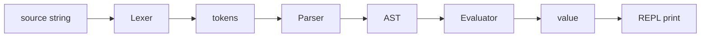

# Compilers 101 (10/10): 작은 인터프리터 만들기

지금까지 따로 배운 렉서, 파서, 평가기가 한 파일 안에서 어떻게 연결되는지 직접 보면, 각 단계의 인터페이스가 실제로 어디에서 만나고 무엇을 주고받는지 한눈에 정리됩니다.

이 글은 Compilers 101 시리즈의 마지막 글입니다.

단계를 따로 배울 때는 각각이 이해된 것처럼 보여도, 실제로는 연결 지점이 보이지 않으면 감이 남지 않습니다. 한 파일로 합친 예제는 "내가 어느 단계까지 직접 다룰 수 있는가?"를 확인하는 가장 좋은 점검 도구이기도 합니다.


*Compilers 101 10장 흐름 개요*

## 이 글에서 다룰 문제

- 렉서, 파서, 평가기를 한 파일로 어떻게 조합할 수 있을까요?
- 재귀 하강 파서의 최소 구현은 어떤 모습일까요?
- 인터프리터는 AST를 어떻게 걸어 값을 만들까요?
- 이 단계에서 발생하는 가장 흔한 오류는 어떤 형태일까요?
- 이 개념을 실무에서 잘못 적용하면 어떤 문제가 생길까요?

> 모든 단계를 한 파일에 모으면 각 인터페이스가 무엇인지 즉시 드러납니다.


```mermaid
flowchart LR
    A["source string"] --> B["Lexer"]
    B --> C["tokens"]
    C --> D["Parser"]
    D --> E["AST"]
    E --> F["Evaluator"]
    F --> G["value"]
    G --> H["REPL print"]
```

각 화살표는 명확한 자료형을 주고받습니다. 이 단순한 자료형 경계가 미니 인터프리터의 핵심입니다.

## 핵심 용어

- **토큰**: 렉서가 만드는 가장 작은 의미 단위입니다. `(kind, text)` 쌍으로 표현합니다.
- **AST 노드**: 파서가 만드는 트리 노드입니다. 재귀 구조로 표현식을 담습니다.
- **재귀 하강**: 문법 규칙 하나를 함수 하나가 담당하는 파서 스타일입니다.
- **평가기**: AST를 순회하며 실제 값으로 줄이는 단계입니다.
- **REPL**: Read-Eval-Print Loop의 약자로, 입력 한 줄 → 평가 → 출력 한 줄의 반복입니다.

## 변경 전후

**Before — 단계가 파일마다 흩어져 있는 상태**

```text
lexer.py    -> tokens
parser.py   -> AST
evaluator.py -> value
# 각 파일이 무엇을 주고받는지 한눈에 보이지 않습니다
```

**After — 한 파일 미니 인터프리터**

```text
mini.py: str -> tokens -> AST -> float
         Lexer -> Parser -> Evaluator -> REPL
```

흐름과 자료형 전환이 한 화면 안에 들어옵니다.

## 실습: 산술식 인터프리터 만들기

이 섹션에서는 변수, 함수 호출, 비교 연산자를 지원하는 완전한 미니 인터프리터를 단계별로 만듭니다.

### 1단계 — 렉서: 텍스트를 토큰으로

```python
# mini.py (1/4) — Lexer
import re
from dataclasses import dataclass
from typing import Optional

@dataclass
class Token:
    kind: str
    text: str
    line: int = 1
    col: int = 1

    def __repr__(self):
        return f"Token({self.kind}, {self.text!r})"

# 토큰 패턴 (순서 중요: 긴 패턴을 먼저)
TOKEN_SPEC = [
    ("NUM",    r"\d+(?:\.\d+)?"),    # 정수 또는 실수
    ("ID",     r"[A-Za-z_]\w*"),     # 식별자 (키워드 포함)
    ("EQ",     r"=="),               # == (= 보다 먼저)
    ("LE",     r"<="),
    ("GE",     r">="),
    ("NE",     r"!="),
    ("ASSIGN", r"="),
    ("LP",     r"\("),
    ("RP",     r"\)"),
    ("COMMA",  r","),
    ("SEMI",   r";"),
    ("OP",     r"[+\-*/]"),
    ("CMP",    r"[<>]"),
    ("NL",     r"\n"),
    ("WS",     r"[ \t]+"),
]
KEYWORDS = {"if", "else", "while", "return", "let", "fn", "true", "false"}

def tokenize(src: str) -> list[Token]:
    """소스 텍스트를 토큰 목록으로 변환합니다."""
    tokens: list[Token] = []
    i, line, col = 0, 1, 1

    while i < len(src):
        matched = False
        for kind, pat in TOKEN_SPEC:
            m = re.match(pat, src[i:])
            if m:
                text = m.group()
                actual_kind = "KW" if kind == "ID" and text in KEYWORDS else kind
                if actual_kind not in ("WS", "NL"):
                    tokens.append(Token(actual_kind, text, line, col))
                if kind == "NL":
                    line += 1; col = 1
                else:
                    col += len(text)
                i += len(text)
                matched = True
                break
        if not matched:
            raise SyntaxError(f"line {line}:{col} — unexpected {src[i]!r}")

    tokens.append(Token("EOF", "", line, col))
    return tokens
```

### 2단계 — 파서: 토큰을 AST로

```python
# mini.py (2/4) — Parser
from dataclasses import dataclass, field

# AST 노드들
@dataclass
class Num:    value: float
@dataclass
class Bool:   value: bool
@dataclass
class Var:    name: str
@dataclass
class BinOp:  op: str; left: object; right: object
@dataclass
class UnaryOp: op: str; operand: object
@dataclass
class Assign: name: str; value: object
@dataclass
class Call:   name: str; args: list
@dataclass
class IfExpr: cond: object; then: object; else_: object = None
@dataclass
class Block:  stmts: list

class Parser:
    def __init__(self, tokens: list[Token]):
        self.tokens = tokens
        self.pos = 0

    def peek(self, offset: int = 0) -> Token:
        idx = self.pos + offset
        return self.tokens[idx] if idx < len(self.tokens) else Token("EOF", "")

    def eat(self, kind: str = None) -> Token:
        tok = self.peek()
        if kind and tok.kind != kind:
            raise SyntaxError(
                f"line {tok.line}:{tok.col} — expected {kind!r}, got {tok.kind!r} ({tok.text!r})"
            )
        self.pos += 1
        return tok

    def match(self, *kinds: str) -> Optional[Token]:
        if self.peek().kind in kinds:
            return self.eat()
        return None

    # ---- 문법 규칙 ----
    # program := stmt*
    # stmt    := assign | expr
    # assign  := ID "=" expr
    # expr    := compare
    # compare := add (("=="|"<"|">"|"<="|">="|"!=") add)*
    # add     := mul (("+"|"-") mul)*
    # mul     := unary (("*"|"/") unary)*
    # unary   := ("-"|"+") unary | primary
    # primary := NUM | BOOL | ID ("(" args ")")? | "(" expr ")"

    def parse(self) -> Block:
        stmts = []
        while self.peek().kind != "EOF":
            stmts.append(self.stmt())
            self.match("SEMI", "NL")
        return Block(stmts)

    def stmt(self) -> object:
        # ID = expr (대입)
        if self.peek().kind == "ID" and self.peek(1).kind == "ASSIGN":
            name = self.eat("ID").text
            self.eat("ASSIGN")
            return Assign(name, self.expr())
        return self.expr()

    def expr(self) -> object:
        return self.compare()

    def compare(self) -> object:
        node = self.add()
        while self.peek().kind in ("EQ", "CMP", "LE", "GE", "NE"):
            op = self.eat().text
            node = BinOp(op, node, self.add())
        return node

    def add(self) -> object:
        node = self.mul()
        while self.peek().kind == "OP" and self.peek().text in "+-":
            op = self.eat().text
            node = BinOp(op, node, self.mul())
        return node

    def mul(self) -> object:
        node = self.unary()
        while self.peek().kind == "OP" and self.peek().text in "*/":
            op = self.eat().text
            node = BinOp(op, node, self.unary())
        return node

    def unary(self) -> object:
        if self.peek().kind == "OP" and self.peek().text == "-":
            self.eat()
            return UnaryOp("-", self.unary())
        return self.primary()

    def primary(self) -> object:
        tok = self.peek()
        if tok.kind == "NUM":
            self.eat()
            v = float(tok.text)
            return Num(int(v) if v == int(v) else v)
        if tok.kind == "KW" and tok.text in ("true", "false"):
            self.eat()
            return Bool(tok.text == "true")
        if tok.kind == "ID":
            self.eat()
            if self.peek().kind == "LP":      # 함수 호출
                self.eat("LP")
                args = []
                while self.peek().kind != "RP":
                    args.append(self.expr())
                    if not self.match("COMMA"):
                        break
                self.eat("RP")
                return Call(tok.text, args)
            return Var(tok.text)
        if tok.kind == "LP":
            self.eat("LP")
            node = self.expr()
            self.eat("RP")
            return node
        raise SyntaxError(f"line {tok.line}:{tok.col} — unexpected {tok.kind!r} ({tok.text!r})")
```

### 3단계 — 평가기: AST를 값으로

```python
# mini.py (3/4) — Evaluator
import math

class Environment:
    """변수를 저장하는 환경입니다."""
    def __init__(self, parent: "Environment" = None):
        self.parent = parent
        self.vars: dict[str, object] = {}

    def get(self, name: str) -> object:
        if name in self.vars:
            return self.vars[name]
        if self.parent:
            return self.parent.get(name)
        raise NameError(f"'{name}' is not defined")

    def set(self, name: str, value: object) -> None:
        self.vars[name] = value

# 내장 함수 등록
BUILTINS: dict[str, callable] = {
    "abs":   abs,
    "sqrt":  math.sqrt,
    "max":   max,
    "min":   min,
    "round": round,
    "print": lambda *args: (print(*args), None)[1],
}

def evaluate(node: object, env: Environment) -> object:
    """AST 노드를 평가해 값을 반환합니다."""
    if isinstance(node, Num):
        return node.value
    if isinstance(node, Bool):
        return node.value
    if isinstance(node, Var):
        return env.get(node.name)
    if isinstance(node, Assign):
        value = evaluate(node.value, env)
        env.set(node.name, value)
        return value
    if isinstance(node, UnaryOp):
        v = evaluate(node.operand, env)
        if node.op == "-": return -v
        return v
    if isinstance(node, BinOp):
        l = evaluate(node.left, env)
        r = evaluate(node.right, env)
        ops = {
            "+": lambda a, b: a + b,
            "-": lambda a, b: a - b,
            "*": lambda a, b: a * b,
            "/": lambda a, b: a / b,
            "<": lambda a, b: a < b,
            ">": lambda a, b: a > b,
            "==": lambda a, b: a == b,
            "!=": lambda a, b: a != b,
            "<=": lambda a, b: a <= b,
            ">=": lambda a, b: a >= b,
        }
        if node.op not in ops:
            raise RuntimeError(f"unknown operator: {node.op!r}")
        if node.op == "/" and r == 0:
            raise ZeroDivisionError("division by zero")
        return ops[node.op](l, r)
    if isinstance(node, Call):
        fn = BUILTINS.get(node.name)
        if fn is None:
            raise NameError(f"'{node.name}' is not a function")
        args = [evaluate(a, env) for a in node.args]
        result = fn(*args)
        return result if result is not None else 0.0
    if isinstance(node, Block):
        result = None
        for stmt in node.stmts:
            result = evaluate(stmt, env)
        return result
    raise RuntimeError(f"unknown AST node: {type(node).__name__}")
```

### 4단계 — REPL: 대화형 루프

```python
# mini.py (4/4) — REPL

def run(src: str, env: Environment) -> object:
    """소스 코드를 평가하고 마지막 값을 반환합니다."""
    tokens = tokenize(src)
    ast    = Parser(tokens).parse()
    return evaluate(ast, env)

def format_result(value: object) -> str:
    """결과를 보기 좋게 포맷합니다."""
    if isinstance(value, float) and value == int(value):
        return str(int(value))
    if isinstance(value, bool):
        return "true" if value else "false"
    if value is None:
        return ""
    return str(value)

def repl():
    """대화형 인터프리터 루프입니다."""
    env = Environment()
    # 기본 상수 등록
    env.set("pi", math.pi)
    env.set("e",  math.e)

    print("mini interpreter v1.0")
    print("변수: x = 1 + 2    함수: sqrt(2), abs(-3)")
    print("종료: Ctrl+D 또는 Ctrl+C")
    print()

    while True:
        try:
            line = input("mini> ").strip()
        except (EOFError, KeyboardInterrupt):
            print("\nbye")
            break

        if not line:
            continue
        if line in ("exit", "quit"):
            break

        try:
            result = run(line, env)
            display = format_result(result)
            if display:
                print(display)
        except SyntaxError as e:
            print(f"SyntaxError: {e}")
        except NameError as e:
            print(f"NameError: {e}")
        except ZeroDivisionError as e:
            print(f"ZeroDivisionError: {e}")
        except Exception as e:
            print(f"Error: {e}")

if __name__ == "__main__":
    repl()
```

### 5단계 — 직접 실행해 보기

```bash
python3 mini.py
```

```text
mini interpreter v1.0
변수: x = 1 + 2    함수: sqrt(2), abs(-3)
종료: Ctrl+D 또는 Ctrl+C

mini> 1 + 2 * 3
7
mini> (1 + 2) * 3
9
mini> x = 10
10
mini> x * x + 1
101
mini> sqrt(2)
1.4142135623730951
mini> abs(-42)
42
mini> 3 > 2
true
mini> 3 == 3
true
mini> 1 +
SyntaxError: line 1:4 — expected NUM, got EOF ('')
mini> x / 0
ZeroDivisionError: division by zero
```

짧은 예제지만 렉서, 파서, 평가기가 모두 협력해 결과를 내는 과정을 그대로 볼 수 있습니다.

## 전체 데이터 흐름 확인

```python
# debug_pipeline.py  — 각 단계의 출력을 보여 줍니다
def debug_run(src: str) -> None:
    print(f"\n{'='*50}")
    print(f"source: {src!r}")

    # 1. 렉싱
    tokens = tokenize(src)
    print(f"tokens: {tokens}")

    # 2. 파싱
    ast = Parser(tokens).parse()
    print(f"ast   : {ast}")

    # 3. 평가
    env = Environment()
    result = evaluate(ast, env)
    print(f"result: {format_result(result)}")

debug_run("2 + 3 * 4")
debug_run("x = 5; x * x")
debug_run("sqrt(abs(-9))")
```

```text
==================================================
source: '2 + 3 * 4'
tokens: [Token(NUM, '2'), Token(OP, '+'), Token(NUM, '3'), Token(OP, '*'), Token(NUM, '4'), Token(EOF, '')]
ast   : Block(stmts=[BinOp(op='+', left=Num(value=2), right=BinOp(op='*', left=Num(value=3), right=Num(value=4)))])
result: 14

==================================================
source: 'x = 5; x * x'
tokens: [Token(ID, 'x'), Token(ASSIGN, '='), Token(NUM, '5'), Token(SEMI, ';'), Token(ID, 'x'), Token(OP, '*'), Token(ID, 'x'), Token(EOF, '')]
ast   : Block(stmts=[Assign(name='x', value=Num(value=5)), BinOp(op='*', left=Var(name='x'), right=Var(name='x'))])
result: 25
```

각 단계의 자료형이 명확합니다. `str → list[Token] → Block(AST) → float`입니다.

## 핵심 정리

- 각 단계의 자료형이 명확합니다: `str → list[Token] → AST → value`입니다.
- 우선순위는 평가기가 아니라 문법 함수(`compare/add/mul/unary/primary`)에 인코딩됩니다.
- 오류는 가능한 한 각 단계 가까이에서 발생합니다.
- 환경 딕셔너리를 추가하면 변수 지원이 되고, 함수 정의를 추가하면 완전한 언어가 됩니다.
- REPL은 인터프리터의 사용성을 크게 높이는 최소한의 인터페이스입니다.

## 자주 하는 실수

1. **lex, parse, eval을 한 함수에 몰아넣는 것**입니다. 단계 분리가 무너지면 디버깅이 어려워집니다. 각 단계는 명확한 입력/출력 자료형을 가진 함수로 분리하세요.
2. **우선순위를 단일 함수에서 처리하려는 것**입니다. 덧셈과 곱셈이 섞이면 바로 오답이 나옵니다. `add/mul/unary` 같은 함수 계층이 필수입니다.
3. **EOF 토큰을 생략하는 것**입니다. 파서가 "다음 토큰을 보려는데 아무것도 없다"는 오류를 명확히 낼 수 없게 됩니다.
4. **위치 정보 없는 오류를 내는 것**입니다. REPL 사용자는 어디가 잘못됐는지 알기 어렵습니다. 모든 토큰에 `line:col`을 붙이고 오류 메시지에 포함하세요.
5. **0으로 나누기 같은 런타임 오류를 고려하지 않는 것**입니다. REPL이 그대로 죽을 수 있습니다. 평가기에서 명시적으로 처리하고 REPL 루프에서 `except`로 잡으세요.

## 실무에서는 이렇게 나타납니다

작은 DSL, 검색 질의 언어, 필터 표현식, 설정 표현식은 거의 언제나 이 구조에서 시작합니다.

```python
# 실제 사용 사례: 설정 파일의 표현식 평가
config_env = Environment()
config_env.set("MAX_WORKERS", 8)
config_env.set("CPU_COUNT", 4)

# 설정 값이 표현식으로 지정될 수 있습니다
result = run("MAX_WORKERS * CPU_COUNT / 2", config_env)
print(f"worker_pool_size = {result}")  # 16
```

데이터 도구의 식 평가기, SQL의 WHERE 절 평가기, 게임 런타임의 룰 엔진도 기본 형태는 비슷합니다. 여기에 변수와 함수 정의만 더하면 교육용 언어가 됩니다.

## 숙련된 엔지니어는 이렇게 봅니다

- 코드를 쓰기 전에 각 단계의 입력/출력 자료형부터 적어 둡니다.
- 우선순위는 평가기에서 처리하지 않고 문법에 넣습니다.
- 오류 메시지를 위해 위치 정보를 처음부터 유지합니다.
- AST는 동작하는 한 가장 단순한 구조로 유지합니다.
- 변수, 함수 같은 확장은 다음 반복으로 미룹니다.

## 운영 체크리스트

- [ ] 렉서, 파서, 평가기의 입력/출력 타입을 말할 수 있습니까?
- [ ] 재귀 하강이 우선순위를 어떻게 표현하는지 설명할 수 있습니까?
- [ ] EOF 토큰이 왜 필요한지 말할 수 있습니까?
- [ ] REPL 사이클을 한 문장으로 요약할 수 있습니까?
- [ ] 다음으로 추가할 확장 하나를 정했습니까?

## 연습 문제

1. `let x = 1 + 2` 문법을 추가하고 `return x * 3` 형태도 지원해 보세요.
2. 환경 딕셔너리를 부모 포인터 체인으로 개선해 블록 스코프를 지원해 보세요.
3. 에러 메시지에 토큰 위치(line:col)를 추가하고, REPL에서 오류 위치를 `^` 포인터로 표시해 보세요.

## 처음 질문으로 돌아가기

- **렉서, 파서, 평가기를 한 파일로 어떻게 조합할 수 있을까요?**
  - 각 단계를 명확한 자료형 경계로 연결하면 됩니다. `tokenize(src) -> list[Token]`, `Parser(tokens).parse() -> Block(AST)`, `evaluate(ast, env) -> value`로 세 함수가 순서대로 호출됩니다. `run(src, env) = evaluate(Parser(tokenize(src)).parse(), env)` 한 줄이면 전체 파이프라인입니다.
- **재귀 하강 파서의 최소 구현은 어떤 모습일까요?**
  - 문법 규칙 하나가 함수 하나에 대응되는 구조입니다. `expr()`, `add()`, `mul()`, `unary()`, `primary()` 같은 함수들이 `peek()`로 다음 토큰을 보고, `eat()`으로 소비하며, 재귀 호출로 중첩 구조를 처리합니다. 우선순위는 함수 호출 깊이로 자동 표현됩니다.
- **인터프리터는 AST를 어떻게 걸어 값을 만들까요?**
  - `evaluate(node, env)` 함수가 AST 노드 종류에 따라 재귀적으로 처리합니다. `Num`은 값을 반환하고, `BinOp`는 자식 두 개를 먼저 평가한 뒤 연산자를 적용합니다. 결과는 항상 "아래에서 위로" 올라오며, 트리 말단(리프)에서 시작해 루트로 수렴합니다.

## 정리와 다음 단계

이 글에서는 한 파일 안에서 렉서, 파서, 평가기를 연결해 작은 인터프리터를 완성했습니다. 이제 이 코드를 변수, 함수 정의, 타입이 있는 장난감 언어로 확장할 수도 있고, 같은 AST를 백엔드 코드로 내려 실제 컴파일러 쪽으로 더 나아갈 수도 있습니다.

시리즈 전체를 돌아보면 하나의 흐름이 보입니다: **텍스트 → 토큰 → 트리 → 의미 정보 → IR → 최적화 → 코드 → 실행**. 각 단계는 다음 단계가 더 단순하게 일할 수 있도록 정보를 정제하는 변환입니다. 이 분리가 컴파일러를 이해하고 확장하기 쉬운 구조로 만드는 힘입니다.

<!-- toc:begin -->
## 시리즈 목차

- [Compilers 101 (1/10): 컴파일러란 무엇인가?](./01-what-is-a-compiler.md)
- [Compilers 101 (2/10): 렉시컬 분석](./02-lexical-analysis.md)
- [Compilers 101 (3/10): 파싱과 AST](./03-parsing-and-ast.md)
- [Compilers 101 (4/10): 시맨틱 분석](./04-semantic-analysis.md)
- [Compilers 101 (5/10): 심볼 테이블과 스코프](./05-symbol-table-and-scope.md)
- [Compilers 101 (6/10): 중간 표현](./06-intermediate-representation.md)
- [Compilers 101 (7/10): 최적화 기초](./07-optimization-basics.md)
- [Compilers 101 (8/10): 코드 생성](./08-code-generation.md)
- [Compilers 101 (9/10): JIT vs AOT](./09-jit-vs-aot.md)
- **작은 인터프리터 만들기 (현재 글)**

<!-- toc:end -->

## 참고 자료

- [Crafting Interpreters — Robert Nystrom](https://craftinginterpreters.com/)
- [Recursive descent parser (Wikipedia)](https://en.wikipedia.org/wiki/Recursive_descent_parser)
- [Read–eval–print loop (Wikipedia)](https://en.wikipedia.org/wiki/Read%E2%80%93eval%E2%80%93print_loop)
- [Abstract syntax tree (Wikipedia)](https://en.wikipedia.org/wiki/Abstract_syntax_tree)

- [이 시리즈 예제 코드 (book-examples)](https://github.com/yeongseon-books/book-examples/tree/main/compilers-101/ko)

Tags: Computer Science, Compilers, Interpreter, Capstone, AST, REPL
