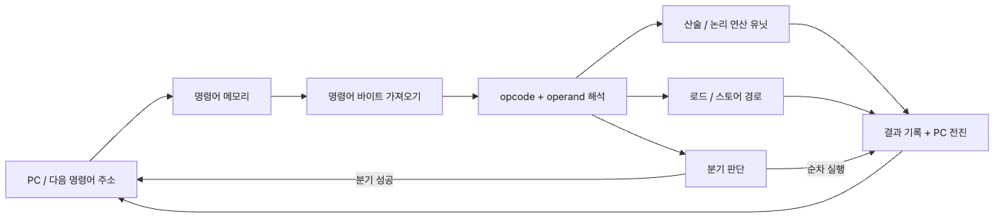

# CPU와 명령어

프로파일러에서 작은 루프 하나가 계속 뜨기 시작하면, 그다음 질문은 더 이상 "내가 무슨 문법을 썼지?"가 아닙니다. 컴파일러가 어떤 명령어를 만들었는지, CPU가 그 명령어를 어떤 순서로 가져오고 해석하고 실행하는지가 진짜 설명이 됩니다.

이 글은 Computer Architecture 101 시리즈의 세 번째 글입니다. 여기서는 x86-64, ARM64, RISC-V를 ISA라는 공통 계약의 예로 놓고, 작은 함수 하나가 실제 명령어 흐름으로 어떻게 내려오는지 살펴보겠습니다.

성능 최적화는 결국 "이 코드는 몇 개의 명령어가 되었고, CPU는 그것을 얼마나 빨리 처리하는가"로 수렴합니다. 이 사이클을 머릿속에 넣어 두면 프로파일러 출력과 어셈블리 리스트가 비로소 읽히기 시작합니다.

## 이 글에서 다룰 문제

- CPU는 한 사이클에 정확히 무엇을 할까요?
- ISA는 무엇을 약속하는 계약일까요?
- 명령어는 opcode와 operand로 어떻게 구성될까요?
- 분기 명령어는 프로그램 흐름을 어떻게 바꿀까요?

> 모든 고수준 코드는 결국 명령어의 연속이며, CPU는 그 명령어를 가져오고 해석하고 실행하는 일을 반복합니다.

## 왜 중요한가

성능 작업은 결국 명령어 수준으로 내려갑니다. 코드가 몇 개의 명령어로 변했는지, 그 명령어가 메모리 접근을 얼마나 포함하는지, 분기가 얼마나 많은지가 실제 실행 시간을 바꿉니다.

따라서 CPU 사이클을 모르면 프로파일러 결과가 흐릿하고, 어셈블리를 한 번도 읽어 보지 않았다면 컴파일러가 무엇을 잘했는지 놓쳤는지 판단하기 어렵습니다.

## 한눈에 보는 개념

CPU는 매 사이클마다 PC가 가리키는 주소의 명령어를 가져오고, 비트 패턴을 해석하고, 실행합니다. 분기가 없다면 PC는 다음 명령어로 이동하고, 분기가 있다면 다른 주소로 점프합니다.

### Fetch-decode-execute 흐름


*CPU는 추상적으로 "코드를 실행"하지 않습니다. PC를 움직이고, 바이트를 가져오고, 해석한 뒤, 계산하거나 메모리를 건드리거나 제어 흐름을 다른 주소로 돌리는 일을 계속 반복합니다.*

## 핵심 용어

| 용어 | 설명 |
| --- | --- |
| ISA | 명령어 형식과 의미를 정의하는 계약 |
| opcode | 무엇을 할지 나타내는 부분 |
| operand | 어디에 적용할지 나타내는 부분 |
| PC | 다음 명령어 주소를 가리키는 프로그램 카운터 |
| Branch | PC를 다른 곳으로 보내는 명령어 |
| Cycle | CPU의 한 박자 |

## Before / After

**Before — "코드가 그냥 실행된다":**

```python
def add(a, b):
    return a + b
```

**After — "이 함수는 몇 개의 명령어인가":**

```text
# x86-64 어셈블리 (단순화)
add:
    mov   rax, rdi      # 첫 번째 인자 a를 rax로 이동
    add   rax, rsi      # 두 번째 인자 b를 더함
    ret                 # 결과 반환

# 대략 3개 명령어, 3사이클 안팎 (캐시 히트 가정)
```

같은 함수라도 어셈블리 계층에서 보면 비용 구조가 더 분명해집니다.

## 단계별로 따라가기

### 1단계: 바이트코드 비교하기

```python
import dis

def add(a, b):
    return a + b

def add_with_check(a, b):
    if a < 0 or b < 0:
        return 0
    return a + b

print("--- add ---")
dis.dis(add)
print("--- add_with_check ---")
dis.dis(add_with_check)
```

작은 `if` 하나도 비교, 분기, 점프를 늘립니다. 조건 검사는 명령어 수를 빠르게 키웁니다.

### 2단계: 작은 루프를 실제 x86-64 어셈블리로 보기

```c
int count_positive(int *arr, int n) {
    int s = 0;
    for (int i = 0; i < n; ++i) {
        if (arr[i] > 0) s += arr[i];
    }
    return s;
}
```

```bash
clang -target x86_64-apple-macos14 -S -O0 -x c count_positive.c -o -
clang -target x86_64-apple-macos14 -S -O2 -fno-vectorize -fno-slp-vectorize -fno-unroll-loops -x c count_positive.c -o -
```

```text
# x86-64, -O0 (발췌)
movl    $0, -16(%rbp)      # s가 스택에 놓임
movl    $0, -20(%rbp)      # i가 스택에 놓임
LBB0_1:
movl    -20(%rbp), %eax
cmpl    -12(%rbp), %eax
jge     LBB0_6
cmpl    $0, (%rax,%rcx,4)
jle     LBB0_4
addl    -16(%rbp), %eax
movl    %eax, -16(%rbp)
```

```text
# x86-64, -O2 (발췌)
testl   %esi, %esi
jle     LBB0_1
LBB0_4:
movl    (%rdi,%rsi,4), %r8d
testl   %r8d, %r8d
cmovlel %edx, %r8d
addl    %r8d, %eax
incq    %rsi
cmpq    %rsi, %rcx
jne     LBB0_4
```

`-O0`에서는 합계 `s`와 루프 인덱스 `i`를 스택에서 계속 읽고 쓰기 때문에 메모리 왕복이 눈에 띕니다. 반대로 `-O2`에서는 값이 주로 레지스터에 머물고, `testl`이 조건 플래그를 세우고, `cmovlel`과 `cmpq`/`jne`가 분기 흐름을 훨씬 간결하게 만듭니다.

### 3단계: 같은 코드를 ARM64로 비교하기

```bash
clang -target arm64-apple-macos14 -S -O2 -fno-vectorize -fno-slp-vectorize -fno-unroll-loops -x c count_positive.c -o -
```

```text
# ARM64, -O2 (발췌)
cmp     w1, #1
b.lt    LBB0_4
LBB0_2:
ldr     w10, [x0], #4
bic     w10, w10, w10, asr #31
add     w8, w10, w8
subs    x9, x9, #1
b.ne    LBB0_2
```

ISA가 달라져도 계약은 비슷합니다. `ldr`가 값을 가져오고, `add`가 누적합을 갱신하고, `subs`가 뺄셈과 FLAGS 갱신을 함께 수행하며, `b.ne`가 그 FLAGS를 읽어 루프를 이어 갑니다. RISC-V도 이름과 인코딩은 다르지만 같은 종류의 fetch-decode-execute 흐름을 따릅니다.

### 4단계: 방금 본 명령어를 종류별로 나누기

| 범주 | x86-64 예시 | ARM64 예시 | 이 코드에서 한 일 |
| --- | --- | --- | --- |
| 산술 / 논리 | `addl`, `testl` | `add`, `subs`, `bic` | 합계 갱신, 부호 검사, FLAGS 설정 |
| 메모리 | `movl (%rdi,%rsi,4), %r8d` | `ldr w10, [x0], #4` | 배열 원소 읽기 |
| 분기 / 제어 흐름 | `jle`, `jne` | `b.lt`, `b.ne` | 조건에 따라 건너뛰거나 루프 반복 |
| 데이터 이동 | `movl`, `cmovlel` | `mov` | 레지스터와 메모리 사이 값 이동 |

ISA마다 세부 명령어 이름은 달라도, 이런 큰 범주는 거의 공통입니다. 차이는 인코딩과 레지스터 구조, 그리고 컴파일러가 얼마나 공격적으로 재배치할 수 있는지에서 드러납니다.

### 5단계: 자신의 코드로 다시 해 보기

```text
1. 분기와 루프가 있는 5-10줄짜리 C, Rust, Zig 함수를 하나 고릅니다.
2. `-O0`와 `-O2`로 각각 컴파일합니다.
3. 루프 카운터가 어디에 있는지, FLAGS를 세우는 명령어가 무엇인지, 그 FLAGS를 읽는 분기가 무엇인지 표시해 봅니다.
4. 빠르게 비교할 때는 Compiler Explorer가 편하지만, 명령어 의미를 확인할 때는 아키텍처 매뉴얼을 기준으로 읽습니다.
```

이 단계가 되면 fetch-decode-execute는 추상 개념이 아니라 실제 로드, 비교, 분기, 레지스터 갱신의 흐름으로 보이기 시작합니다.

## 이 코드에서 먼저 봐야 할 점

- 모든 CPU는 fetch-decode-execute를 반복합니다.
- 명령어는 opcode와 operand의 조합입니다.
- 분기 명령어는 PC를 직접 바꾸거나 다음 명령어 흐름을 갈라놓습니다.
- 최적화된 코드는 핫한 값을 레지스터에 두고 메모리 왕복을 줄이려 합니다.

## 자주 하는 실수 5가지

| 실수 | 문제 | 해결 |
| --- | --- | --- |
| 코드 한 줄 = 명령어 한 개라고 생각 | 비용 추정이 틀어짐 | `dis`나 어셈블리로 확인 |
| 분기를 공짜처럼 취급 | 예측 실패 시 큰 비용 | 핫 루프의 분기 수를 줄임 |
| 컴파일러를 과소평가 | 손최적화가 오히려 손해 | 먼저 `-O2` 출력 읽기 |
| ISA와 CPU를 동일시 | 같은 ISA도 칩마다 속도 차이 | 마이크로아키텍처도 함께 보기 |
| 인터프리터 최적화에 기대기 | 뜨거운 경로가 계속 느림 | 핫 패스는 컴파일된 경로 검토 |

## 실무에서는 이렇게 드러납니다

- 게임 엔진은 핫 루프의 어셈블리와 SIMD를 직접 확인합니다.
- 컴파일러 개발은 ISA에 맞춘 명령어 선택과 스케줄링을 다룹니다.
- 임베디드 시스템은 명령어 수준의 사이클 계산으로 실시간성을 맞춥니다.
- 보안 분석은 디스어셈블리로 악성 코드 흐름을 추적합니다.
- 데이터베이스는 핵심 연산자에 손튜닝 어셈블리를 쓰기도 합니다.

## 시니어 엔지니어는 이렇게 생각합니다

시니어는 핫 함수 하나를 보면 "이게 대략 몇 개의 명령어로 펼쳐질까"를 먼저 떠올립니다. 분기가 얼마나 있는지, 메모리 로드는 얼마나 되는지, 시스템 콜로 빠지는 부분은 어디인지 생각합니다. 매일 어셈블리를 쓰지는 않아도, 어셈블리의 모양은 매일 의식합니다.

또한 "ISA는 계약이고 마이크로아키텍처는 구현"이라는 구분을 놓치지 않습니다. 같은 x86-64 명령어도 Intel, AMD, 세대에 따라 비용이 다를 수 있으므로, 보편적 주장보다 측정을 믿습니다.

## 체크리스트

- [ ] fetch-decode-execute 세 단계를 그릴 수 있는가
- [ ] 명령어가 opcode와 operand로 구성된다는 것을 아는가
- [ ] 분기가 PC를 바꾼다는 점을 설명할 수 있는가
- [ ] x86-64, ARM, RISC-V가 서로 다른 ISA라는 점을 아는가
- [ ] 자신의 코드에 대한 어셈블리 출력을 한 번이라도 읽어 본 적이 있는가

## 연습 문제

1. `dis`로 간단한 함수와 조건문이 있는 함수를 비교해 보세요. `if` 하나가 바이트코드 수를 얼마나 늘리는지 확인해 보세요.

2. 같은 작은 루프를 x86-64와 ARM64로 각각 컴파일해 보고, 두 목록에서 load, arithmetic, branch 역할을 하는 명령어를 찾아 보세요.

3. 짧은 C 함수 하나를 `clang -S`나 godbolt.org로 컴파일한 뒤, `-O0`에서 스택에 있던 값이 `-O2`에서 어떤 레지스터로 옮겨 갔는지 추적해 보세요.

## 정리 및 다음 글

CPU는 메모리에서 명령어를 가져오고, 해석하고, 실행하는 단순한 사이클을 반복하는 기계입니다. 그 단순한 사이클 위에 우리가 아는 모든 추상화가 올라가 있습니다. ISA는 약속이고, 어셈블리는 그 약속이 드러나는 가장 직접적인 표면입니다.

다음 글에서는 명령어가 실제로 값을 다루는 가장 가까운 장소, 즉 레지스터와 ALU를 봅니다. 데이터가 CPU 안에서 잠시 어디에 머무르고 어디서 연산되는지 살펴보겠습니다.

<!-- toc:begin -->
- [컴퓨터 구조란 무엇인가?](./01-what-is-computer-architecture.md)
- [데이터 표현 — bit, byte, integer, floating point](./02-data-representation.md)
- **CPU와 명령어 (현재 글)**
- 레지스터와 ALU (예정)
- 메모리 구조 (예정)
- 캐시와 지역성 (예정)
- 파이프라인 (예정)
- I/O와 장치 (예정)
- 병렬성과 멀티코어 (예정)
- 성능을 이해하는 법 (예정)
<!-- toc:end -->

## 참고 자료

- [Patterson & Hennessy — Computer Organization and Design](https://www.elsevier.com/books/computer-organization-and-design-mips-edition/patterson/978-0-12-820109-1)
- [Intel 64 and IA-32 Architectures Software Developer's Manual](https://www.intel.com/content/www/us/en/developer/articles/technical/intel-sdm.html)
- [ARM Architecture Reference Manual](https://developer.arm.com/documentation)
- [RISC-V Specifications](https://riscv.org/technical/specifications/)

Tags: Computer Science, 컴퓨터 구조, CPU, 명령어, ISA, 어셈블리
