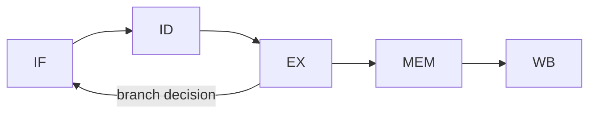

# Computer Architecture 101 (5/10): 메모리 구조

서로 다른 두 프로세스가 같은 주소 `0x400000`를 가지고도 둘 다 정상 실행될 수 있다는 사실은 처음 보면 꽤 이상합니다. 이 글은 Computer Architecture 101 시리즈의 다섯 번째 글입니다. 여기서는 메모리가 실제 RAM 그 자체가 아니라, 프로세스마다 따로 보이는 가상 주소 공간이라는 관점에서 메모리 구조를 다시 보겠습니다.

메모리 모델이 머릿속에 없으면 스택 오버플로, 메모리 누수, 정렬 문제, 페이지 폴트가 전부 제각각의 현상처럼 보입니다. 하지만 주소 공간, 페이지, 스택, 힙이라는 그림을 잡아 두면 이 문제들은 같은 지도 위에서 읽히기 시작합니다.

## 먼저 던지는 질문

- RAM은 어떤 주소 모델로 보일까요?
- 가상 주소와 물리 주소는 어떻게 다를까요?
- 한 프로세스의 text, data, heap, stack은 어떻게 배치될까요?

## 큰 그림


*Computer Architecture 101 5장 흐름 개요*

## 왜 중요한가

메모리 구조를 이해하지 못하면 같은 버그를 반복해서 만납니다. 깊은 재귀 때문에 스택이 터지고, 힙 객체를 정리하지 않아 누수가 나고, 정렬이 맞지 않아 공간을 낭비하고, 페이지 폴트 하나 때문에 코드가 갑자기 매우 느려집니다.

가상 메모리는 성능 관점에서도 거대한 주제입니다. 한 번의 페이지 폴트는 단일 명령어를 수천에서 수만 배 느리게 만들 수 있습니다. 그래서 "이 변수는 어디에 사는가"라는 질문은 메모리 안전과 성능의 공통 출발점입니다.

## 한눈에 보는 개념

각 프로세스는 자신만의 가상 주소 공간을 갖고, MMU가 가상 주소를 물리 RAM 주소로 번역합니다. 그 주소 공간 안에는 코드, 초기화된 데이터, 초기화되지 않은 데이터, 힙, 스택이 정해진 영역을 이룹니다.

```text
   +------------------+  high addresses
   |     STACK        |  <- function calls, locals
   |        |         |
   |        v         |
   |                  |
   |        ^         |
   |        |         |
   |     HEAP         |  <- malloc, new, dynamic allocation
   +------------------+
   |     BSS          |  <- uninitialized globals
   +------------------+
   |     DATA         |  <- initialized globals
   +------------------+
   |     TEXT         |  <- executable code
   +------------------+  low addresses
```

## 핵심 용어

| 용어 | 설명 |
| --- | --- |
| Address space | 프로세스가 볼 수 있는 메모리 범위 |
| Virtual address | 프로세스가 사용하는 주소 |
| Physical address | 실제 RAM 상의 주소 |
| MMU | 가상 주소를 물리 주소로 변환하는 하드웨어 |
| Page | 메모리 매핑의 최소 단위, 보통 4KB |
| Alignment | 타입 크기에 맞는 주소에 데이터를 배치하는 규칙 |

## Before / After

**Before — "메모리는 평평한 바이트 배열이다":**

```python
data = [0] * 1_000_000
data[12345] = 42
# "It just goes into slot 12345"
```

**After — "그 주소는 가상 주소이고 페이지를 거친다":**

```text
Process virtual address: 0x7f8a4c001000 + 12345*8
                         |
                         v  (MMU + page table)
                         |
Physical RAM address:    0x00000000abcd1000
                         |
                         v  (cache -> DRAM cell)
```

인덱스 하나도 실제로는 가상 주소, 페이지 테이블, 캐시, DRAM을 차례로 거칩니다.

## 단계별로 따라가기

### 1단계: 변수의 실제 주소 보기

```python
import ctypes

x = ctypes.c_int(42)
y = ctypes.c_int(99)
print(hex(ctypes.addressof(x)))
print(hex(ctypes.addressof(y)))
print(f"distance: {ctypes.addressof(y) - ctypes.addressof(x)} bytes")
```

주소 차이를 보면 메모리가 실제로 연속된 바이트 공간처럼 배치된다는 감각을 얻을 수 있습니다.

### 2단계: 정렬 보기

```python
import ctypes

class Misaligned(ctypes.Structure):
    _fields_ = [("a", ctypes.c_char), ("b", ctypes.c_int), ("c", ctypes.c_char)]

class Aligned(ctypes.Structure):
    _fields_ = [("b", ctypes.c_int), ("a", ctypes.c_char), ("c", ctypes.c_char)]

print(ctypes.sizeof(Misaligned))   # usually 12 (with padding)
print(ctypes.sizeof(Aligned))       # usually 8
```

필드가 같아도 순서가 다르면 패딩과 총 크기가 달라집니다. 정렬은 보이지 않지만 비용이 큰 규칙입니다.

### 3단계: 스택과 힙 주소 비교하기

```python
import ctypes

def stack_var():
    x = ctypes.c_int(1)
    return ctypes.addressof(x)

heap_var = ctypes.c_int(2)
print("global address:", hex(ctypes.addressof(heap_var)))
print("stack address: ", hex(stack_var()))
```

실행 환경마다 차이는 있지만, 호출마다 달라지는 스택 주소와 비교적 안정적인 전역/동적 영역의 차이를 관찰할 수 있습니다.

### 4단계: 페이지 크기 확인하기

```python
import resource

print("page size:", resource.getpagesize(), "bytes")  # usually 4096
print("RSS (KB):", resource.getrusage(resource.RUSAGE_SELF).ru_maxrss)
```

운영체제는 메모리를 페이지 단위로 다룹니다. 변수 하나를 만져도 실제로는 페이지 전체가 메모리에 올라옵니다.

### 5단계: 스택 깊이 한계 보기

```python
import sys

def recurse(n):
    return n if n == 0 else recurse(n - 1) + 1

print(sys.getrecursionlimit())
try:
    recurse(2000)
except RecursionError as e:
    print("stack limit hit:", e)
```

스택은 고정된 크기로 잡히기 때문에 깊은 재귀는 한계에 부딪힙니다. 힙은 동적으로 늘어나지만 스택은 그렇지 않습니다.

## 이 코드에서 먼저 봐야 할 점

- 모든 변수는 가상 주소를 갖고 MMU가 이를 물리 주소로 번역합니다.
- 필드 순서는 패딩과 총 크기에 직접 영향을 줍니다.
- 스택은 작고 빠르며, 힙은 크고 더 유연합니다.
- 메모리는 페이지 단위로 관리됩니다.

## 자주 하는 실수 5가지

| 실수 | 문제 | 해결 |
| --- | --- | --- |
| 깊은 재귀 사용 | 스택 오버플로 | 반복문 또는 명시적 스택 사용 |
| 큰 객체를 스택에 두려 함 | 스택 한계 초과 | 힙 할당 사용 |
| 필드 정렬 무시 | 메모리 낭비 | 큰 타입부터 배치 검토 |
| 가상 주소를 물리 주소처럼 생각 | 잘못된 비교와 캐싱 판단 | 둘을 명확히 구분 |
| 페이지 폴트를 무시 | 갑작스러운 극단적 지연 | 워킹셋 축소, prefetch 검토 |

## 실무에서는 이렇게 드러납니다

- 데이터베이스는 페이지 단위 I/O와 버퍼 풀로 메모리를 다룹니다.
- 게임 엔진은 SoA와 AoS 같은 레이아웃 차이로 캐시 효율을 바꿉니다.
- 임베디드 시스템은 제한된 RAM 안에서 스택과 힙을 명시적으로 분리합니다.
- 보안은 ASLR, NX bit로 주소 공간을 보호합니다.
- 시스템 프로그래밍은 `mmap`으로 파일을 메모리에 직접 매핑합니다.

## 시니어 엔지니어는 이렇게 생각합니다

시니어는 프로세스 메모리를 추상적인 "많다/적다"가 아니라 워킹셋 관점에서 봅니다. 자주 만지는 페이지 집합이 얼마나 큰지, 그 집합이 캐시와 RAM 안에 잘 머무는지가 성능의 핵심이라고 보기 때문입니다. 이 관점은 페이지 폴트와 캐시 미스를 동시에 줄여 줍니다.

또한 자료구조의 메모리 레이아웃을 실제 비용으로 봅니다. 같은 데이터라도 Array of Structs와 Struct of Arrays는 전혀 다른 캐시 행동을 만듭니다. 따라서 자료구조 선택은 알고리즘 선택 못지않게 메모리 선택이기도 합니다.

## 체크리스트

- [ ] 가상 주소와 물리 주소의 차이를 설명할 수 있는가
- [ ] 페이지 크기가 보통 4KB라는 점을 아는가
- [ ] 스택과 힙 차이를 한 문장으로 말할 수 있는가
- [ ] 필드 순서가 구조체 크기를 바꿀 수 있다는 점을 이해하는가
- [ ] 깊은 재귀가 왜 위험한지 설명할 수 있는가

## 연습 문제

1. `ctypes.Structure`로 같은 필드를 가진 구조체 두 개를 만들되, 하나는 큰 타입부터, 다른 하나는 작은 타입부터 배치해 `sizeof`를 비교해 보세요.

2. 1MB 크기의 배열을 만들고, 그것이 어떤 주소 공간과 메모리 사용량 변화를 만드는지 관찰해 보세요.

3. 현재 시스템의 스택 크기나 재귀 한계를 확인한 뒤, 실제로 어느 깊이에서 한계에 도달하는지 실험해 보세요.

## 정리 및 다음 글

메모리는 평평한 바이트 배열처럼 보이지만, 그 평탄함은 가상 메모리가 만든 환상입니다. 실제로는 페이지 단위 매핑, text/data/heap/stack 영역, 정렬과 패딩이 함께 메모리의 진짜 비용 구조를 만듭니다. 이 모델을 이해하면 다음 주제인 캐시가 훨씬 자연스럽게 이어집니다.

다음 글에서는 CPU와 메모리 사이의 가장 중요한 중간층인 캐시를 봅니다. 왜 캐시가 필요한지, 지역성이 무엇인지, 캐시 친화적 코드는 어떤 모양인지 짚어보겠습니다.

## 심화 실습: 비트 연산 · 캐시 계산 · 파이프라인 관찰

컴퓨터 구조를 실제로 이해하려면 정의를 암기하는 대신 숫자를 직접 계산해 보는 과정이 필요합니다. 같은 명령이라도 비트 표현, 메모리 계층, 파이프라인 충돌 조건을 동시에 보면 성능 병목의 원인이 선명해집니다.

### 2의 보수와 비트 마스크를 수치로 확인하기

```python
def to_u8(n: int) -> int:
    return n & 0xFF

def to_s8(n: int) -> int:
    n &= 0xFF
    return n - 0x100 if n & 0x80 else n

x = to_u8(-5)          # 251 (0b11111011)
y = to_u8(12)          # 12  (0b00001100)
print(bin(x), bin(y))
print(to_s8(x + y))    # 7
print(to_s8(x - y))    # -17
```

핵심은 ALU가 "부호 있는 정수"와 "부호 없는 정수"를 따로 계산하지 않는다는 점입니다. 동일한 비트열을 어떻게 해석하느냐가 결과 의미를 바꿉니다. 그래서 ISA 문서에는 signed/unsigned 비교 명령이 따로 존재합니다.

### 캐시 인덱스 계산을 손으로 풀기

가정:
- L1 D-cache = 32KiB
- line size = 64B
- 8-way set associative

계산:
- 총 line 수 = 32KiB / 64B = 512
- set 수 = 512 / 8 = 64
- set index 비트 수 = log2(64) = 6
- block offset 비트 수 = log2(64) = 6
- tag 비트 수(48-bit VA 가정) = 48 - 6 - 6 = 36

즉 주소 비트 분해는 `[tag:36][index:6][offset:6]`이 됩니다. 두 주소가 같은 set에 매핑되는지 확인하려면 offset을 제거한 뒤 index 6비트를 비교하면 됩니다.

### 캐시 미스 패턴을 추적하는 간단 코드

```python
# stride 접근이 캐시 locality에 미치는 영향 관찰
N = 1024 * 1024
arr = [0] * N

def walk(step: int):
    s = 0
    for i in range(0, N, step):
        s += arr[i]
    return s

for step in [1, 2, 4, 8, 16, 32, 64, 128]:
    walk(step)
```

이 코드는 단순하지만 실험 관점에서는 매우 유용합니다. `step`이 커질수록 한 cache line에서 활용하는 유효 데이터가 줄고 miss 비율이 올라갑니다. 프로파일러에서는 CPI 증가와 함께 메모리 stall 시간이 늘어나는 형태로 관측됩니다.

### 5단계 파이프라인에서 hazard를 그림으로 보기



간단한 명령 시퀀스:
- `I1: LOAD R1, [R2]`
- `I2: ADD R3, R1, R4`

`I2`는 `R1`이 필요하지만 `I1`의 결과는 MEM/WB 이후에 준비됩니다. Forwarding이 없으면 stall이 필요하고, forwarding이 있으면 일부 cycle을 절약할 수 있습니다. 이 차이가 곧 IPC 차이로 이어집니다.

### 파이프라인 타이밍 표를 직접 작성하기

```text
cycle:   1   2   3   4   5   6
I1      IF  ID  EX MEM  WB
I2          IF  ID STALL EX MEM WB
I3              IF STALL ID  EX MEM WB
```

이 표를 직접 그려 보면 왜 분기 예측 실패가 큰 비용인지, 왜 load-use hazard가 민감한지 바로 이해할 수 있습니다. 이론보다 "cycle 단위로 어디가 비는지"를 보는 것이 훨씬 빠릅니다.

### 성능 근사식으로 병목 분해하기

성능은 보통 다음으로 근사합니다.

`Execution Time = Instruction Count × CPI × Clock Cycle Time`

여기서 구조 개선은 보통 세 축으로 나타납니다.
- 명령 수 감소: 컴파일러 최적화/벡터화
- CPI 감소: cache miss 감소, branch mispredict 감소, forwarding 개선
- cycle time 단축: 더 높은 클록, 더 짧은 임계 경로

실무에서는 한 축을 개선하면 다른 축이 악화될 수 있습니다. 예를 들어 파이프라인 단계를 늘려 클록을 높이면 분기 실패 패널티가 커질 수 있습니다. 따라서 "한 지표만" 보고 결론 내리면 위험합니다.

### 점검 체크리스트

- 주소 하나를 보고 `tag/index/offset`으로 즉시 분해할 수 있는가
- load-use, branch hazard를 cycle 표로 그릴 수 있는가
- signed/unsigned 연산 차이를 비트 패턴으로 설명할 수 있는가
- CPI 상승의 원인을 cache/branch/structural hazard로 나눠 추적할 수 있는가

이 체크리스트를 통과하면, 컴퓨터 구조 지식이 암기에서 운영 가능한 문제해결 도구로 바뀝니다.

## 처음 질문으로 돌아가기

- **RAM은 어떤 주소 모델로 보일까요?**
  - 본문의 기준은 메모리 구조를 한 덩어리 개념으로 보지 않고 입력, 처리, 검증, 운영 신호가 만나는 경계로 나누어 확인하는 것입니다.
- **가상 주소와 물리 주소는 어떻게 다를까요?**
  - 예제와 그림에서는 어떤 값이 들어오고, 어느 단계에서 바뀌며, 어떤 기준으로 통과 또는 실패하는지를 먼저 확인해야 합니다.
- **한 프로세스의 text, data, heap, stack은 어떻게 배치될까요?**
  - 운영에서는 이 판단을 체크리스트, 로그, 테스트로 남겨 다음 변경에서도 같은 실패가 반복되지 않게 막아야 합니다.

<!-- toc:begin -->
## 시리즈 목차

- [Computer Architecture 101 (1/10): 컴퓨터 구조란 무엇인가?](./01-what-is-computer-architecture.md)
- [Computer Architecture 101 (2/10): 데이터 표현 — bit, byte, integer, floating point](./02-data-representation.md)
- [Computer Architecture 101 (3/10): CPU와 명령어](./03-cpu-and-instructions.md)
- [Computer Architecture 101 (4/10): 레지스터와 ALU](./04-registers-and-alu.md)
- **메모리 구조 (현재 글)**
- 캐시와 지역성 (예정)
- 파이프라인 (예정)
- I/O와 장치 (예정)
- 병렬성과 멀티코어 (예정)
- 성능을 이해하는 법 (예정)

<!-- toc:end -->

## 참고 자료

- [Wikipedia — Virtual memory](https://en.wikipedia.org/wiki/Virtual_memory)
- [What Every Programmer Should Know About Memory (Ulrich Drepper)](https://www.akkadia.org/drepper/cpumemory.pdf)
- [Wikipedia — Data structure alignment](https://en.wikipedia.org/wiki/Data_structure_alignment)
- [Linux Memory Management Documentation](https://www.kernel.org/doc/html/latest/admin-guide/mm/index.html)

Tags: Computer Science, 컴퓨터 구조, 메모리, 가상 메모리, 주소 공간, 스택과 힙
