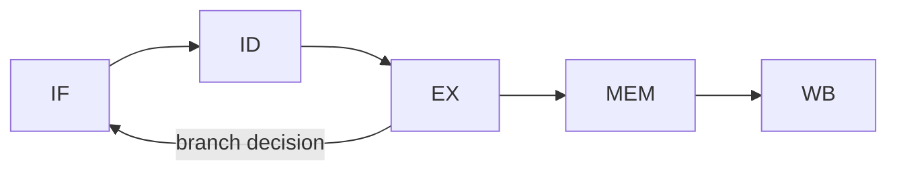

# Computer Architecture 101 (6/10): 캐시와 지역성

같은 데이터를 같은 횟수만큼 읽는데도 한 코드는 1초, 다른 코드는 30초가 걸릴 수 있습니다. 이 글은 Computer Architecture 101 시리즈의 여섯 번째 글입니다. 여기서는 CPU와 메인 메모리 사이의 거대한 속도 차이를 메우는 캐시가 어떻게 동작하는지, 그리고 시간 지역성과 공간 지역성이 왜 성능을 바꾸는지 보겠습니다.

알고리즘이 이미 정해졌다면 그다음 질문은 종종 "이 코드는 캐시 친화적인가"입니다. 현대 CPU에서는 클럭 속도보다 캐시 미스율이 성능을 훨씬 더 크게 좌우하는 경우가 많기 때문입니다.

## 먼저 던지는 질문

- 캐시는 메모리 계층 어디에 놓일까요?
- 시간 지역성과 공간 지역성은 무엇이 다를까요?
- 캐시 라인은 왜 중요한 비용 단위일까요?

## 큰 그림


*Computer Architecture 101 6장 흐름 개요*

## 왜 중요한가

메인 메모리 접근은 보통 수백 사이클이 걸리지만 L1 캐시 적중은 몇 사이클이면 끝납니다. 같은 알고리즘이라도 메모리 접근 순서 하나로 10배 이상 차이 날 수 있다는 뜻입니다.

그래서 캐시를 이해하면 성능 최적화의 ROI가 매우 높아집니다. 복잡한 알고리즘 변경 없이도 접근 순서, 자료구조 배치, stride만 바꿔 큰 차이를 만들 수 있기 때문입니다.

## 한눈에 보는 개념

CPU는 메인 메모리에서 한 바이트만 가져오지 않습니다. 보통 64바이트 단위의 캐시 라인을 가져와 캐시에 올립니다. 다음 접근이 같은 라인 안에 있으면 거의 공짜처럼 읽힙니다.

```text
   CPU
    |  (one cycle)
    v
   L1 cache  (32-64KB, ~4 cycles)
    |
    v
   L2 cache  (256KB-1MB, ~12 cycles)
    |
    v
   L3 cache  (several MB, ~40 cycles)
    |
    v
   Main RAM  (several GB, ~200 cycles)
    |
    v
   SSD/HDD  (several TB, tens of thousands of cycles)
```

## 핵심 용어

| 용어 | 설명 |
| --- | --- |
| Cache line | 캐시의 최소 단위, 보통 64바이트 |
| Temporal locality | 최근 접근한 데이터를 곧 다시 접근하는 성질 |
| Spatial locality | 가까운 주소를 연이어 접근하는 성질 |
| Cache miss | 필요한 데이터가 캐시에 없는 상태 |
| Working set | 현재 자주 접근하는 데이터 집합 |

## Before / After

**Before — 캐시 적대적 코드:**

```python
# Column-major traversal of a 2D array
def col_major(matrix, n):
    total = 0
    for j in range(n):
        for i in range(n):
            total += matrix[i][j]
    return total
```

**After — 캐시 친화적 코드:**

```python
def row_major(matrix, n):
    total = 0
    for i in range(n):
        for j in range(n):
            total += matrix[i][j]
    return total
```

두 함수는 같은 합을 계산하지만, 행 우선 순회는 같은 캐시 라인 안의 이웃 데이터를 활용하므로 훨씬 빠릅니다.

## 단계별로 따라가기

### 1단계: 행 우선 vs 열 우선 측정

```python
import time, numpy as np

N = 4096
m = np.random.randint(0, 100, (N, N), dtype=np.int32)

start = time.perf_counter()
total = 0
for i in range(N):
    for j in range(N):
        total += m[i, j]
print(f"row-major:   {time.perf_counter() - start:.2f} s")

start = time.perf_counter()
total = 0
for j in range(N):
    for i in range(N):
        total += m[i, j]
print(f"col-major:   {time.perf_counter() - start:.2f} s")
```

접근 횟수는 같아도 순서가 다르면 캐시 미스율이 달라집니다. 그 차이가 실행 시간으로 직결됩니다.

### 2단계: 캐시 라인 보기

```python
import time, numpy as np

CACHE_LINE = 64
INT_SIZE = 8     # numpy int64
stride_ints = CACHE_LINE // INT_SIZE   # 8

N = 100_000_000
arr = np.zeros(N, dtype=np.int64)

start = time.perf_counter()
for i in range(0, N, 1):
    arr[i] += 1
print(f"stride 1:  {time.perf_counter() - start:.2f} s")

start = time.perf_counter()
for i in range(0, N, stride_ints):
    arr[i] += 1
print(f"stride 8:  {time.perf_counter() - start:.2f} s")
```

한 라인 안의 8개 원소를 모두 쓰느냐, 한 개만 쓰고 버리느냐가 대역폭 낭비를 좌우합니다.

### 3단계: 시간 지역성 활용하기

```python
from functools import lru_cache

def fib_no_cache(n):
    if n < 2: return n
    return fib_no_cache(n - 1) + fib_no_cache(n - 2)

@lru_cache(maxsize=None)
def fib_cached(n):
    if n < 2: return n
    return fib_cached(n - 1) + fib_cached(n - 2)

import time
start = time.perf_counter(); fib_no_cache(30)
print(f"no cache: {time.perf_counter() - start:.3f} s")

start = time.perf_counter(); fib_cached(30)
print(f"cached:   {time.perf_counter() - start:.6f} s")
```

같은 입력을 곧 다시 쓴다면 결과 캐싱이 시간 지역성을 가장 직접적으로 활용하는 방법입니다.

### 4단계: AoS vs SoA

```python
import numpy as np, time

N = 1_000_000

class Particle:
    __slots__ = ("x", "y", "z", "vx", "vy", "vz")
    def __init__(self):
        self.x = self.y = self.z = 0.0
        self.vx = self.vy = self.vz = 0.0

aos = [Particle() for _ in range(N // 100)]   # smaller for memory
soa_x = np.zeros(N); soa_y = np.zeros(N); soa_z = np.zeros(N)

start = time.perf_counter()
for p in aos:
    p.x += 1.0
print(f"AoS x++: {time.perf_counter() - start:.4f} s")

start = time.perf_counter()
soa_x += 1.0
print(f"SoA x++: {time.perf_counter() - start:.4f} s")
```

`x`만 갱신할 때는 `x`만 모아 둔 SoA가 훨씬 더 캐시 친화적입니다.

### 5단계: 블로킹의 힘 보기

```python
import numpy as np, time

N = 512
a = np.random.rand(N, N); b = np.random.rand(N, N)

start = time.perf_counter()
c = a @ b   # numpy (BLAS) uses cache blocking internally
print(f"numpy matmul: {time.perf_counter() - start:.3f} s")

start = time.perf_counter()
c2 = np.zeros((N, N))
for i in range(N):
    for j in range(N):
        for k in range(N):
            c2[i, j] += a[i, k] * b[k, j]
# only meaningful for smaller N because of speed
```

같은 행렬 곱셈도 캐시에 맞춘 블로킹을 하느냐에 따라 성능 차이가 극단적으로 벌어집니다.

## 이 코드에서 먼저 봐야 할 점

- 같은 알고리즘과 데이터라도 접근 순서가 성능을 바꿉니다.
- 캐시 라인은 한 번 가져오면 가능한 많이 써야 효율적입니다.
- 시간 지역성은 결과 재사용으로, 공간 지역성은 인접 접근으로 살립니다.
- 자료구조 레이아웃은 캐시 행동과 직접 연결됩니다.

## 자주 하는 실수 5가지

| 실수 | 문제 | 해결 |
| --- | --- | --- |
| 열 우선 순회 | 캐시 미스 급증 | 메모리 레이아웃과 순회를 맞춘다 |
| 흩어진 작은 객체 다수 사용 | 포인터 추적 비용 증가 | 연속 배열로 모은다 |
| 큰 stride 접근 | 캐시 라인 낭비 | 인접 인덱스를 선호 |
| 결과 재계산 | 시간 지역성 무시 | 메모이제이션 활용 |
| 큰 구조체 안의 작은 핫 필드 | 캐시 오염 | 핫 필드를 별도 SoA로 분리 |

## 실무에서는 이렇게 드러납니다

- 데이터베이스는 컬럼 스토어 레이아웃으로 분석 쿼리를 가속합니다.
- 머신러닝은 텐서를 연속 메모리로 유지하려고 애씁니다.
- 게임 엔진은 ECS로 SoA 레이아웃을 강제합니다.
- 컴파일러는 loop tiling, interchange로 자동 블로킹을 수행합니다.
- 운영체제는 페이지 캐시로 디스크 I/O를 메모리 접근처럼 숨깁니다.

## 시니어 엔지니어는 이렇게 생각합니다

시니어는 "이 알고리즘이 맞는가" 다음에 "이 접근 순서가 맞는가"를 봅니다. 알고리즘이 동일한데도 접근 패턴 하나가 10배 차이를 만들 수 있다는 사실을 알기 때문입니다. 그래서 자료구조와 순회 순서를 함께 설계합니다.

또한 성능 병목을 볼 때 캐시 라인을 실제 비용 단위로 상상합니다. 한 라인을 가져왔는데 그 안의 값 한 개만 쓰고 버리면 이미 메모리 대역폭을 크게 낭비한 것입니다. 이 감각은 핫 루프와 데이터 레이아웃 설계에서 매우 강력합니다.

## 체크리스트

- [ ] 캐시 라인이 보통 64바이트라는 점을 아는가
- [ ] L1, L2, L3, RAM의 비용 차이를 대략 설명할 수 있는가
- [ ] 시간 지역성과 공간 지역성을 구분할 수 있는가
- [ ] AoS와 SoA의 차이를 설명할 수 있는가
- [ ] 행 우선과 열 우선 순회의 차이를 측정해 본 적이 있는가

## 연습 문제

1. 행 우선 순회와 열 우선 순회를 직접 측정해 보세요. 배열 크기를 바꾸며 어느 지점에서 차이가 더 커지는지도 확인해 보세요.

2. stride를 1, 2, 4, 8, 16으로 바꿔 가며 캐시 라인 활용도가 어떻게 달라지는지 측정해 보세요.

3. 하나의 필드만 자주 읽는 데이터 구조를 만들어 AoS와 SoA 중 어떤 쪽이 더 유리한지 실험해 보세요.

## 정리 및 다음 글

캐시는 CPU와 메모리 사이의 속도 격차를 메우는 핵심 장치이고, 그 효과는 코드가 지역성을 따르는지에 달려 있습니다. 같은 알고리즘이라도 데이터 접근 순서와 레이아웃만으로 10배 차이가 날 수 있습니다. 이 차이는 운이 아니라 설계와 측정의 결과입니다.

다음 글에서는 CPU가 명령어 처리량을 높이는 또 다른 장치인 파이프라인을 봅니다. 한 사이클에 한 명령어가 끝나는 것처럼 보이게 만드는 구조와, 분기 예측이 왜 필요한지 짚어보겠습니다.

## 심화 실습: 비트 연산 · 캐시 계산 · 파이프라인 관찰

컴퓨터 구조를 실제로 이해하려면 정의를 암기하는 대신 숫자를 직접 계산해 보는 과정이 필요합니다. 같은 명령이라도 비트 표현, 메모리 계층, 파이프라인 충돌 조건을 동시에 보면 성능 병목의 원인이 선명해집니다.

### 2의 보수와 비트 마스크를 수치로 확인하기

```python
def to_u8(n: int) -> int:
    return n & 0xFF

def to_s8(n: int) -> int:
    n &= 0xFF
    return n - 0x100 if n & 0x80 else n

x = to_u8(-5)          # 251 (0b11111011)
y = to_u8(12)          # 12  (0b00001100)
print(bin(x), bin(y))
print(to_s8(x + y))    # 7
print(to_s8(x - y))    # -17
```

핵심은 ALU가 "부호 있는 정수"와 "부호 없는 정수"를 따로 계산하지 않는다는 점입니다. 동일한 비트열을 어떻게 해석하느냐가 결과 의미를 바꿉니다. 그래서 ISA 문서에는 signed/unsigned 비교 명령이 따로 존재합니다.

### 캐시 인덱스 계산을 손으로 풀기

가정:
- L1 D-cache = 32KiB
- line size = 64B
- 8-way set associative

계산:
- 총 line 수 = 32KiB / 64B = 512
- set 수 = 512 / 8 = 64
- set index 비트 수 = log2(64) = 6
- block offset 비트 수 = log2(64) = 6
- tag 비트 수(48-bit VA 가정) = 48 - 6 - 6 = 36

즉 주소 비트 분해는 `[tag:36][index:6][offset:6]`이 됩니다. 두 주소가 같은 set에 매핑되는지 확인하려면 offset을 제거한 뒤 index 6비트를 비교하면 됩니다.

### 캐시 미스 패턴을 추적하는 간단 코드

```python
# stride 접근이 캐시 locality에 미치는 영향 관찰
N = 1024 * 1024
arr = [0] * N

def walk(step: int):
    s = 0
    for i in range(0, N, step):
        s += arr[i]
    return s

for step in [1, 2, 4, 8, 16, 32, 64, 128]:
    walk(step)
```

이 코드는 단순하지만 실험 관점에서는 매우 유용합니다. `step`이 커질수록 한 cache line에서 활용하는 유효 데이터가 줄고 miss 비율이 올라갑니다. 프로파일러에서는 CPI 증가와 함께 메모리 stall 시간이 늘어나는 형태로 관측됩니다.

### 5단계 파이프라인에서 hazard를 그림으로 보기



간단한 명령 시퀀스:
- `I1: LOAD R1, [R2]`
- `I2: ADD R3, R1, R4`

`I2`는 `R1`이 필요하지만 `I1`의 결과는 MEM/WB 이후에 준비됩니다. Forwarding이 없으면 stall이 필요하고, forwarding이 있으면 일부 cycle을 절약할 수 있습니다. 이 차이가 곧 IPC 차이로 이어집니다.

### 파이프라인 타이밍 표를 직접 작성하기

```text
cycle:   1   2   3   4   5   6
I1      IF  ID  EX MEM  WB
I2          IF  ID STALL EX MEM WB
I3              IF STALL ID  EX MEM WB
```

이 표를 직접 그려 보면 왜 분기 예측 실패가 큰 비용인지, 왜 load-use hazard가 민감한지 바로 이해할 수 있습니다. 이론보다 "cycle 단위로 어디가 비는지"를 보는 것이 훨씬 빠릅니다.

### 성능 근사식으로 병목 분해하기

성능은 보통 다음으로 근사합니다.

`Execution Time = Instruction Count × CPI × Clock Cycle Time`

여기서 구조 개선은 보통 세 축으로 나타납니다.
- 명령 수 감소: 컴파일러 최적화/벡터화
- CPI 감소: cache miss 감소, branch mispredict 감소, forwarding 개선
- cycle time 단축: 더 높은 클록, 더 짧은 임계 경로

실무에서는 한 축을 개선하면 다른 축이 악화될 수 있습니다. 예를 들어 파이프라인 단계를 늘려 클록을 높이면 분기 실패 패널티가 커질 수 있습니다. 따라서 "한 지표만" 보고 결론 내리면 위험합니다.

### 점검 체크리스트

- 주소 하나를 보고 `tag/index/offset`으로 즉시 분해할 수 있는가
- load-use, branch hazard를 cycle 표로 그릴 수 있는가
- signed/unsigned 연산 차이를 비트 패턴으로 설명할 수 있는가
- CPI 상승의 원인을 cache/branch/structural hazard로 나눠 추적할 수 있는가

이 체크리스트를 통과하면, 컴퓨터 구조 지식이 암기에서 운영 가능한 문제해결 도구로 바뀝니다.

## 처음 질문으로 돌아가기

- **캐시는 메모리 계층 어디에 놓일까요?**
  - 본문의 기준은 캐시와 지역성를 한 덩어리 개념으로 보지 않고 입력, 처리, 검증, 운영 신호가 만나는 경계로 나누어 확인하는 것입니다.
- **시간 지역성과 공간 지역성은 무엇이 다를까요?**
  - 예제와 그림에서는 어떤 값이 들어오고, 어느 단계에서 바뀌며, 어떤 기준으로 통과 또는 실패하는지를 먼저 확인해야 합니다.
- **캐시 라인은 왜 중요한 비용 단위일까요?**
  - 운영에서는 이 판단을 체크리스트, 로그, 테스트로 남겨 다음 변경에서도 같은 실패가 반복되지 않게 막아야 합니다.

<!-- toc:begin -->
## 시리즈 목차

- [Computer Architecture 101 (1/10): 컴퓨터 구조란 무엇인가?](./01-what-is-computer-architecture.md)
- [Computer Architecture 101 (2/10): 데이터 표현 — bit, byte, integer, floating point](./02-data-representation.md)
- [Computer Architecture 101 (3/10): CPU와 명령어](./03-cpu-and-instructions.md)
- [Computer Architecture 101 (4/10): 레지스터와 ALU](./04-registers-and-alu.md)
- [Computer Architecture 101 (5/10): 메모리 구조](./05-memory-organization.md)
- **캐시와 지역성 (현재 글)**
- 파이프라인 (예정)
- I/O와 장치 (예정)
- 병렬성과 멀티코어 (예정)
- 성능을 이해하는 법 (예정)

<!-- toc:end -->

## 참고 자료

- [What Every Programmer Should Know About Memory (Ulrich Drepper)](https://www.akkadia.org/drepper/cpumemory.pdf)
- [Wikipedia — CPU cache](https://en.wikipedia.org/wiki/CPU_cache)
- [Wikipedia — Locality of reference](https://en.wikipedia.org/wiki/Locality_of_reference)
- [Mike Acton — Data-Oriented Design and C++ (CppCon 2014)](https://www.youtube.com/watch?v=rX0ItVEVjHc)

Tags: Computer Science, 컴퓨터 구조, 캐시, 지역성, 성능, 메모리 계층
