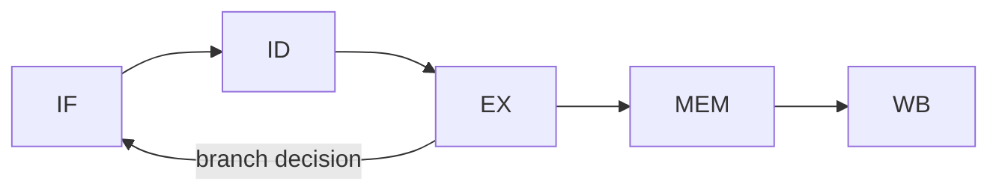

# Computer Architecture 101 (7/10): 파이프라인

명령어 하나를 처리하는 데 다섯 단계가 필요하다면, 왜 CPU는 평균적으로 한 사이클에 한 명령어를 끝내는 것처럼 보일까요? 이 글은 Computer Architecture 101 시리즈의 일곱 번째 글입니다. 여기서는 파이프라인이라는 겹쳐 처리하기 기법과, 그 흐름을 자주 깨뜨리는 분기·의존성·메모리 지연을 보겠습니다.

파이프라인은 평균을 빠르게 만듭니다. 하지만 그 평균은 분기 예측 한 번이 틀리는 순간 무너질 수 있습니다. 그래서 핫 루프의 분기 패턴을 이해하는 습관이 생각보다 큰 성능 차이를 만듭니다.

## 먼저 던지는 질문

- 파이프라인은 어떻게 처리량을 높일까요?
- 데이터 해저드와 제어 해저드는 무엇이 다를까요?
- 분기 예측은 어떤 가정을 바탕으로 동작할까요?

## 큰 그림


*Computer Architecture 101 7장 흐름 개요*

## 왜 중요한가

현대 CPU는 깊은 파이프라인과 슈퍼스칼라 설계를 사용합니다. 그러나 분기 예측이 한 번 틀리면 이미 가져온 명령어를 버리고 다시 채워야 해서 10~20사이클 비용이 날 수 있습니다.

그래서 파이프라인 친화적인 코드, 예측 가능한 분기, 적절한 데이터 배치는 작은 차이처럼 보여도 누적되면 크게 작동합니다.

## 한눈에 보는 개념

5단계 파이프라인에서는 서로 다른 명령어가 동시에 Fetch, Decode, Execute, Memory, Writeback 단계를 점유합니다. 한 명령어는 끝까지 5사이클이 걸리지만, 처리량은 사이클당 1개에 가까워집니다.

```text
cycle:        1    2    3    4    5    6    7
instr 1:      F    D    E    M    W
instr 2:           F    D    E    M    W
instr 3:                F    D    E    M    W
instr 4:                     F    D    E    M
instr 5:                          F    D    E
```

## 핵심 용어

| 용어 | 설명 |
| --- | --- |
| Pipeline | 명령어 단계를 겹쳐 처리하는 구조 |
| Hazard | 파이프라인을 멈추거나 깨뜨리는 조건 |
| Data hazard | 앞선 결과를 다음 명령어가 기다리는 상황 |
| Control hazard | 분기 때문에 다음 명령어를 확신할 수 없는 상황 |
| Branch prediction | 분기 방향을 미리 추측하는 기법 |
| Stall | 유효한 작업 없이 파이프라인이 쉬는 사이클 |

## Before / After

**Before — 분기가 많은 코드:**

```python
def count_positive(arr):
    count = 0
    for x in arr:
        if x > 0:           # ~50% mispredict on random data
            count += 1
    return count
```

**After — 분기를 산술로 대체:**

```python
def count_positive_branchless(arr):
    return sum((x > 0) for x in arr)   # bool->int, no branch
```

CPU 입장에서는 가장 좋은 분기는 없는 분기이고, 그다음은 예측하기 쉬운 분기입니다.

## 단계별로 따라가기

### 1단계: 정렬된 데이터와 무작위 데이터 비교

```python
import time, numpy as np

N = 10_000_000
sorted_data = np.sort(np.random.randint(-100, 100, N))
random_data = np.random.randint(-100, 100, N)

def count_positive(arr):
    c = 0
    for x in arr:
        if x > 0:
            c += 1
    return c

start = time.perf_counter(); count_positive(sorted_data)
print(f"sorted:   {time.perf_counter() - start:.2f} s")

start = time.perf_counter(); count_positive(random_data)
print(f"random:   {time.perf_counter() - start:.2f} s")
```

같은 코드라도 정렬된 데이터는 예측기가 잘 맞히고, 무작위 데이터는 자주 틀립니다.

### 2단계: 파이프라인 시뮬레이터

```python
def pipeline(instructions, stages=("F", "D", "E", "M", "W")):
    """Each instruction advances one stage per cycle."""
    n_inst = len(instructions)
    total_cycles = n_inst + len(stages) - 1
    grid = [[" " for _ in range(total_cycles)] for _ in range(n_inst)]
    for i in range(n_inst):
        for s, name in enumerate(stages):
            grid[i][i + s] = name
    return grid

for row in pipeline(["I1", "I2", "I3", "I4"]):
    print("".join(row))
```

출력은 명령어가 한 단계씩 어긋나며 동시에 흐르는 구조를 보여 줍니다.

### 3단계: 데이터 해저드 모델링

```python
class HazardCheck:
    """ADD R3, R1, R2 followed by ADD R4, R3, R5 must wait for R3."""
    @staticmethod
    def has_data_hazard(prev, curr):
        return prev["dst"] in curr["src"]

a = {"dst": "R3", "src": ("R1", "R2")}
b = {"dst": "R4", "src": ("R3", "R5")}   # depends on R3
c = {"dst": "R6", "src": ("R7", "R8")}

print(HazardCheck.has_data_hazard(a, b))   # True
print(HazardCheck.has_data_hazard(a, c))   # False
```

forwarding이 많은 의존성을 완화하지만, 메모리 로드 직후 의존은 여전히 stall을 만들 수 있습니다.

### 4단계: 분기 예측기 시뮬레이션

```python
class BranchPredictor:
    """Simple 2-bit saturating counter."""
    def __init__(self):
        self.state = 2   # 0:strong NT, 1:weak NT, 2:weak T, 3:strong T

    def predict(self):
        return self.state >= 2

    def update(self, taken):
        if taken and self.state < 3: self.state += 1
        if not taken and self.state > 0: self.state -= 1

bp = BranchPredictor()
sequence = [True, True, True, False, True, True, False, True]
hits = 0
for actual in sequence:
    pred = bp.predict()
    hits += (pred == actual)
    bp.update(actual)
print(f"hit rate: {hits}/{len(sequence)}")
```

단순한 2비트 예측기조차 패턴이 있는 분기에는 매우 강합니다.

### 5단계: branchless 패턴 보기

```python
def abs_with_branch(x):
    if x < 0:
        return -x
    return x

def abs_branchless(x):
    mask = x >> 31    # -1 if negative, 0 if positive
    return (x ^ mask) - mask

print(abs_with_branch(-7), abs_branchless(-7))
print(abs_with_branch(5), abs_branchless(5))
```

같은 결과를 분기 없이 만들면 예측 실패 비용은 사라지지만, 가독성은 나빠질 수 있습니다.

## 이 코드에서 먼저 봐야 할 점

- 파이프라인이 깊을수록 처리량은 좋아지지만 예측 실패 비용도 커집니다.
- 분기 예측은 패턴이 있는 분기에 강하고 무작위 분기에 약합니다.
- forwarding이 많은 데이터 의존을 가려 주지만 load-use stall은 남습니다.
- branchless 코드는 빠를 수 있지만 항상 좋은 선택은 아닙니다.

## 자주 하는 실수 5가지

| 실수 | 문제 | 해결 |
| --- | --- | --- |
| 핫 루프에 무작위 분기 두기 | 예측 실패 폭증 | 산술/마스크 대체 검토 |
| 데이터 정렬 무시 | 분기 패턴이 불규칙해짐 | 미리 정렬하거나 묶기 |
| 깊은 호출과 간접 분기 남발 | 파이프라인 흐름 악화 | 평탄화나 인라인 검토 |
| `if x`와 `if x > 0` 혼동 | 의도와 다른 조건 | 명시적 비교 사용 |
| 측정 없이 branchless 도입 | 가독성만 손상 | 반드시 전후 측정 |

## 실무에서는 이렇게 드러납니다

- 정렬 알고리즘은 branchless compare를 활용합니다.
- 그래픽스와 SIMD 코드는 마스크 기반 처리로 분기를 줄입니다.
- JIT는 드문 분기를 deopt guard로 빼기도 합니다.
- 데이터베이스는 predicate를 배치 처리해 분기 비용을 줄입니다.
- 보안 코드는 일정 시간 비교로 타이밍 공격을 막습니다.

## 시니어 엔지니어는 이렇게 생각합니다

시니어는 핫 루프를 볼 때 분기를 하나씩 셉니다. 거의 늘 같은 방향으로 가는 분기는 거의 공짜에 가깝지만, 랜덤한 분기는 10~20사이클씩 새어 나갈 수 있다는 것을 압니다. 그래서 데이터를 패턴 있게 정렬하거나, 때로는 산술 연산으로 바꾸는 선택을 합니다.

동시에 branchless가 만능이 아니라는 점도 압니다. 예측기가 잘 맞는 경우라면 오히려 일반 분기가 더 나을 수 있고, 컴파일러가 `cmov` 같은 형태로 자동 변환해 줄 수도 있습니다. 그래서 측정 없는 미세 최적화는 경계합니다.

## 체크리스트

- [ ] 파이프라인 5단계를 그릴 수 있는가
- [ ] 데이터 해저드와 제어 해저드를 구분할 수 있는가
- [ ] 분기 예측 적중률이 코드 패턴에 달린다는 점을 아는가
- [ ] 정렬된 데이터가 예측기에 유리한 이유를 설명할 수 있는가
- [ ] branchless의 장단점을 요약할 수 있는가

## 연습 문제

1. `count_positive`를 정렬 데이터와 무작위 데이터에 각각 실행해 차이를 측정해 보세요.

2. `BranchPredictor`에 50/50 분기와 80/20 분기를 넣어 적중률 차이를 확인해 보세요.

3. `abs`, `min`, `max`의 분기 버전과 branchless 버전을 만들어 각각 더 빠른 경우를 비교해 보세요.

## 정리 및 다음 글

파이프라인은 명령어 단계들을 겹쳐 CPU 처리량을 끌어올리는 핵심 장치입니다. 분기 예측은 그 이득을 분기 위에서도 유지하려는 장치이고, 의존성과 메모리 지연은 그 흐름을 자주 방해합니다. 결국 파이프라인 친화적 사고는 핫 코드의 분기와 데이터 흐름을 읽는 감각으로 이어집니다.

다음 글에서는 CPU 바깥의 느린 세계, 즉 I/O와 장치를 봅니다. 디스크, 네트워크, 키보드 같은 장치가 어떻게 CPU와 연결되고, 왜 비동기 모델이 필요한지 짚어보겠습니다.

## 심화 실습: 비트 연산 · 캐시 계산 · 파이프라인 관찰

컴퓨터 구조를 실제로 이해하려면 정의를 암기하는 대신 숫자를 직접 계산해 보는 과정이 필요합니다. 같은 명령이라도 비트 표현, 메모리 계층, 파이프라인 충돌 조건을 동시에 보면 성능 병목의 원인이 선명해집니다.

### 2의 보수와 비트 마스크를 수치로 확인하기

```python
def to_u8(n: int) -> int:
    return n & 0xFF

def to_s8(n: int) -> int:
    n &= 0xFF
    return n - 0x100 if n & 0x80 else n

x = to_u8(-5)          # 251 (0b11111011)
y = to_u8(12)          # 12  (0b00001100)
print(bin(x), bin(y))
print(to_s8(x + y))    # 7
print(to_s8(x - y))    # -17
```

핵심은 ALU가 "부호 있는 정수"와 "부호 없는 정수"를 따로 계산하지 않는다는 점입니다. 동일한 비트열을 어떻게 해석하느냐가 결과 의미를 바꿉니다. 그래서 ISA 문서에는 signed/unsigned 비교 명령이 따로 존재합니다.

### 캐시 인덱스 계산을 손으로 풀기

가정:
- L1 D-cache = 32KiB
- line size = 64B
- 8-way set associative

계산:
- 총 line 수 = 32KiB / 64B = 512
- set 수 = 512 / 8 = 64
- set index 비트 수 = log2(64) = 6
- block offset 비트 수 = log2(64) = 6
- tag 비트 수(48-bit VA 가정) = 48 - 6 - 6 = 36

즉 주소 비트 분해는 `[tag:36][index:6][offset:6]`이 됩니다. 두 주소가 같은 set에 매핑되는지 확인하려면 offset을 제거한 뒤 index 6비트를 비교하면 됩니다.

### 캐시 미스 패턴을 추적하는 간단 코드

```python
# stride 접근이 캐시 locality에 미치는 영향 관찰
N = 1024 * 1024
arr = [0] * N

def walk(step: int):
    s = 0
    for i in range(0, N, step):
        s += arr[i]
    return s

for step in [1, 2, 4, 8, 16, 32, 64, 128]:
    walk(step)
```

이 코드는 단순하지만 실험 관점에서는 매우 유용합니다. `step`이 커질수록 한 cache line에서 활용하는 유효 데이터가 줄고 miss 비율이 올라갑니다. 프로파일러에서는 CPI 증가와 함께 메모리 stall 시간이 늘어나는 형태로 관측됩니다.

### 5단계 파이프라인에서 hazard를 그림으로 보기



간단한 명령 시퀀스:
- `I1: LOAD R1, [R2]`
- `I2: ADD R3, R1, R4`

`I2`는 `R1`이 필요하지만 `I1`의 결과는 MEM/WB 이후에 준비됩니다. Forwarding이 없으면 stall이 필요하고, forwarding이 있으면 일부 cycle을 절약할 수 있습니다. 이 차이가 곧 IPC 차이로 이어집니다.

### 파이프라인 타이밍 표를 직접 작성하기

```text
cycle:   1   2   3   4   5   6
I1      IF  ID  EX MEM  WB
I2          IF  ID STALL EX MEM WB
I3              IF STALL ID  EX MEM WB
```

이 표를 직접 그려 보면 왜 분기 예측 실패가 큰 비용인지, 왜 load-use hazard가 민감한지 바로 이해할 수 있습니다. 이론보다 "cycle 단위로 어디가 비는지"를 보는 것이 훨씬 빠릅니다.

### 성능 근사식으로 병목 분해하기

성능은 보통 다음으로 근사합니다.

`Execution Time = Instruction Count × CPI × Clock Cycle Time`

여기서 구조 개선은 보통 세 축으로 나타납니다.
- 명령 수 감소: 컴파일러 최적화/벡터화
- CPI 감소: cache miss 감소, branch mispredict 감소, forwarding 개선
- cycle time 단축: 더 높은 클록, 더 짧은 임계 경로

실무에서는 한 축을 개선하면 다른 축이 악화될 수 있습니다. 예를 들어 파이프라인 단계를 늘려 클록을 높이면 분기 실패 패널티가 커질 수 있습니다. 따라서 "한 지표만" 보고 결론 내리면 위험합니다.

### 점검 체크리스트

- 주소 하나를 보고 `tag/index/offset`으로 즉시 분해할 수 있는가
- load-use, branch hazard를 cycle 표로 그릴 수 있는가
- signed/unsigned 연산 차이를 비트 패턴으로 설명할 수 있는가
- CPI 상승의 원인을 cache/branch/structural hazard로 나눠 추적할 수 있는가

이 체크리스트를 통과하면, 컴퓨터 구조 지식이 암기에서 운영 가능한 문제해결 도구로 바뀝니다.

## 처음 질문으로 돌아가기

- **파이프라인은 어떻게 처리량을 높일까요?**
  - 본문의 기준은 파이프라인를 한 덩어리 개념으로 보지 않고 입력, 처리, 검증, 운영 신호가 만나는 경계로 나누어 확인하는 것입니다.
- **데이터 해저드와 제어 해저드는 무엇이 다를까요?**
  - 예제와 그림에서는 어떤 값이 들어오고, 어느 단계에서 바뀌며, 어떤 기준으로 통과 또는 실패하는지를 먼저 확인해야 합니다.
- **분기 예측은 어떤 가정을 바탕으로 동작할까요?**
  - 운영에서는 이 판단을 체크리스트, 로그, 테스트로 남겨 다음 변경에서도 같은 실패가 반복되지 않게 막아야 합니다.

<!-- toc:begin -->
## 시리즈 목차

- [Computer Architecture 101 (1/10): 컴퓨터 구조란 무엇인가?](./01-what-is-computer-architecture.md)
- [Computer Architecture 101 (2/10): 데이터 표현 — bit, byte, integer, floating point](./02-data-representation.md)
- [Computer Architecture 101 (3/10): CPU와 명령어](./03-cpu-and-instructions.md)
- [Computer Architecture 101 (4/10): 레지스터와 ALU](./04-registers-and-alu.md)
- [Computer Architecture 101 (5/10): 메모리 구조](./05-memory-organization.md)
- [Computer Architecture 101 (6/10): 캐시와 지역성](./06-cache-and-locality.md)
- **파이프라인 (현재 글)**
- I/O와 장치 (예정)
- 병렬성과 멀티코어 (예정)
- 성능을 이해하는 법 (예정)

<!-- toc:end -->

## 참고 자료

- [Wikipedia — Instruction pipelining](https://en.wikipedia.org/wiki/Instruction_pipelining)
- [Wikipedia — Branch predictor](https://en.wikipedia.org/wiki/Branch_predictor)
- [Stack Overflow — Why is processing a sorted array faster?](https://stackoverflow.com/questions/11227809/why-is-processing-a-sorted-array-faster-than-processing-an-unsorted-array)
- [Agner Fog — Software optimization resources](https://www.agner.org/optimize/)

Tags: Computer Science, 컴퓨터 구조, 파이프라인, 분기 예측, 성능, CPU
