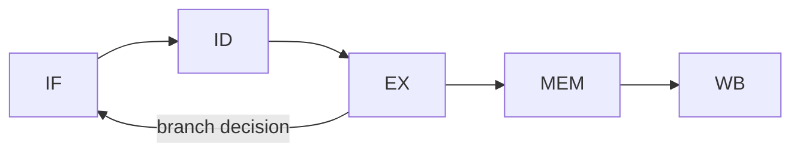

# Computer Architecture 101 (8/10): I/O와 장치

디스크 한 번 읽는 시간은 메모리 접근보다 수만에서 수십만 배 길 수 있습니다. 그렇다면 CPU는 그동안 무엇을 하고 있을까요? 이 글은 Computer Architecture 101 시리즈의 여덟 번째 글입니다. 여기서는 CPU와 느린 장치 사이의 속도 차이를 폴링, 인터럽트, DMA가 어떻게 메우는지 짚어보겠습니다.

이 주제는 단순히 하드웨어 교양에 머물지 않습니다. `select`, `epoll`, `async/await`, 이벤트 루프, 시스템 콜 같은 운영체제와 애플리케이션 설계의 핵심이 모두 여기서 출발하기 때문입니다.

## 먼저 던지는 질문

- CPU와 장치의 속도 차이는 얼마나 클까요?
- 폴링과 인터럽트는 어떻게 다를까요?
- DMA는 왜 CPU를 더 자유롭게 만들까요?

## 큰 그림


*Computer Architecture 101 8장 흐름 개요*

## 왜 중요한가

모든 비동기 프로그램은 결국 느린 장치를 효율적으로 다루는 문제를 추상화한 것입니다. 인터럽트와 DMA가 없다면 키 입력 하나, 디스크 읽기 하나가 CPU 전체를 묶어 버릴 것입니다.

따라서 I/O 모델을 이해하면 `epoll`이나 `async/await`가 임의의 API가 아니라, 하드웨어 현실에 대한 운영체제의 응답이라는 점이 보입니다.

## 한눈에 보는 개념

CPU와 장치는 버스로 연결되고, 폴링은 CPU가 계속 묻는 방식, 인터럽트는 장치가 준비되었음을 알리는 방식, DMA는 장치가 RAM에 직접 쓰는 방식입니다.

```text
   +-----+        +-----+
   | CPU |<------>| RAM |
   +--+--+        +--+--+
      |              ^
      |              |  DMA (device writes RAM directly)
      |              |
   +--+----- BUS ----+--+
      |                |
   +--+--+         +--+--+
   | NIC |         | SSD |
   +-----+         +-----+
```

## 핵심 용어

| 용어 | 설명 |
| --- | --- |
| Polling | CPU가 반복해서 장치 상태를 확인하는 방식 |
| Interrupt | 장치가 CPU에 신호를 보내는 방식 |
| ISR | 인터럽트 서비스 루틴 |
| DMA | CPU를 거치지 않고 장치가 메모리로 전송 |
| MMIO | 메모리 매핑 I/O, 장치를 주소처럼 노출 |
| System call | 사용자 모드에서 커널 I/O 서비스로 들어가는 경로 |

## Before / After

**Before — 폴링으로 장치 대기:**

```python
# Synthetic polling loop
def wait_for_data(device):
    while not device.is_ready():
        pass   # CPU pegged at 100%, no other work
    return device.read()
```

**After — 인터럽트 + 콜백:**

```python
# Synthetic interrupt model
def on_data_ready(device):
    data = device.read()
    process(data)

device.register_interrupt(on_data_ready)
do_other_work()   # CPU continues working
# When the device is ready, on_data_ready is called automatically
```

같은 결과를 얻더라도 CPU 활용 방식은 완전히 달라집니다.

## 단계별로 따라가기

### 1단계: 장치 속도 표 만들기

```python
# Approximate costs (Latency Numbers Every Programmer Should Know, in ns)
LATENCY = {
    "L1 cache":          1,
    "Branch misprediction": 5,
    "L2 cache":          7,
    "Main memory":       100,
    "SSD random read":   100_000,
    "Round trip in DC":  500_000,
    "HDD seek":          10_000_000,
    "Internet (KR<->US)": 150_000_000,
}

base = LATENCY["L1 cache"]
for name, ns in LATENCY.items():
    print(f"{name:20s} {ns:>15,d} ns   (x{ns / base:>11,.0f} L1)")
```

이 표만 봐도 왜 CPU가 기다리지 않고 다른 일을 해야 하는지 감이 옵니다.

### 2단계: 폴링 시뮬레이션

```python
import time

class Device:
    def __init__(self, ready_after):
        self.start = time.time()
        self.ready_after = ready_after

    def is_ready(self):
        return time.time() - self.start >= self.ready_after

def busy_poll(dev):
    iterations = 0
    while not dev.is_ready():
        iterations += 1
    return iterations

dev = Device(ready_after=0.1)
print("polling iterations:", busy_poll(dev))   # hundreds of thousands
```

단순하지만 CPU는 그 시간 동안 다른 유용한 일을 하지 못합니다.

### 3단계: 인터럽트 모델 시뮬레이션

```python
import threading, time, queue

interrupts = queue.Queue()

def device_thread():
    time.sleep(0.1)              # device gets ready
    interrupts.put("DATA_READY")  # raise an interrupt

threading.Thread(target=device_thread, daemon=True).start()

# CPU does other work and occasionally checks the queue
work_done = 0
while interrupts.empty():
    work_done += 1
    if work_done % 1_000_000 == 0:
        pass

print(f"interrupt arrived; finished {work_done:,} units of work in the meantime")
```

정확한 OS 인터럽트는 아니지만, 이벤트가 비동기로 도착하고 CPU는 그동안 다른 일을 할 수 있다는 모델을 잘 보여 줍니다.

### 4단계: DMA 흉내내기

```python
import threading, time

shared_buffer = []

def dma_transfer(source_size):
    """Device writes RAM directly. CPU is not involved."""
    time.sleep(0.05)
    shared_buffer.extend(range(source_size))

threading.Thread(target=dma_transfer, args=(1_000_000,)).start()

# CPU does its own work meanwhile
total = sum(i * i for i in range(100_000))
print(f"CPU result: {total}")
print(f"buffer after DMA: {len(shared_buffer)}")
```

실제 DMA는 더 정교하지만, 본질은 데이터 이동에서조차 CPU 사이클을 거의 쓰지 않는다는 점입니다.

### 5단계: `select`로 실제 패턴 보기

```python
import select, sys

print("Type something within 2 seconds...")
ready, _, _ = select.select([sys.stdin], [], [], 2.0)
if ready:
    line = sys.stdin.readline()
    print(f"input: {line.strip()}")
else:
    print("timeout: the CPU was free to do other work")
```

`select`는 사용자 코드가 운영체제의 인터럽트 기반 I/O 모델을 접하는 가장 오래된 창구 중 하나입니다.

## 이 코드에서 먼저 봐야 할 점

- 장치는 CPU보다 1만 배에서 1억 배까지 느릴 수 있습니다.
- 폴링은 단순하지만 CPU를 태웁니다.
- 인터럽트는 CPU가 다른 일을 하게 만듭니다.
- DMA는 데이터 이동 자체에서도 CPU를 해방합니다.

## 자주 하는 실수 5가지

| 실수 | 문제 | 해결 |
| --- | --- | --- |
| 핫 패스에서 동기 I/O 사용 | 하나의 대기가 전체를 막음 | async/await, epoll 검토 |
| busy loop 대기 | CPU 100%, 발열 증가 | sleep 또는 이벤트 대기 |
| 인터럽트 핸들러에서 무거운 작업 | 다른 인터럽트 지연 | 핸들러는 짧게 유지 |
| DMA 후 캐시 동기화 무시 | 오래된 데이터 읽기 | 메모리 배리어와 flush 사용 |
| 장치 레지스터 정렬 무시 | 잘못된 비트 접근 | 데이터시트 준수 |

## 실무에서는 이렇게 드러납니다

- 웹 서버는 epoll/kqueue 이벤트 루프로 수만 연결을 처리합니다.
- 데이터베이스는 비동기 I/O와 DMA로 디스크 대역폭을 최대화합니다.
- 임베디드는 GPIO 인터럽트로 센서 입력을 즉시 처리합니다.
- GPU 컴퓨팅은 PCIe DMA로 호스트-디바이스 메모리를 옮깁니다.
- 운영체제는 인터럽트 컨트롤러로 장치 우선순위를 관리합니다.

## 시니어 엔지니어는 이렇게 생각합니다

시니어는 시스템을 볼 때 먼저 I/O 모델을 봅니다. CPU 바운드인지, I/O 바운드인지, 블로킹 호출이 핫 패스에 있는지 먼저 확인합니다. 같은 알고리즘이라도 병목이 장치 대기라면 스레드 모델, 큐 구조, async 모델 선택이 전부 달라지기 때문입니다.

또한 I/O 비용은 반드시 측정해야 한다고 생각합니다. SSD 한 번이 100μs인지 10ms인지, 네트워크 RTT가 1ms인지 100ms인지에 따라 같은 코드의 의미가 완전히 달라집니다. 대략적인 상식은 출발점일 뿐이고, 실제 시스템 수치가 진실입니다.

## 체크리스트

- [ ] 메인 메모리와 SSD 비용 차이를 대략 설명할 수 있는가
- [ ] 폴링과 인터럽트 차이를 설명할 수 있는가
- [ ] DMA가 CPU에 돌려주는 이득을 말할 수 있는가
- [ ] `select`/`epoll`이 어떤 메커니즘을 노출하는지 아는가
- [ ] 동기 I/O와 비동기 I/O의 트레이드오프를 설명할 수 있는가

## 연습 문제

1. `LATENCY` 표로 메모리 접근 1000번과 SSD 랜덤 읽기 1000번의 차이를 계산해 보세요.

2. `select.select`를 표준 입력과 파이프 둘 이상에 동시에 걸어 어느 이벤트가 먼저 오는지 비교해 보세요.

3. 동기 HTTP 클라이언트와 비동기 클라이언트를 같은 수의 동시 요청으로 비교해 시간과 CPU 사용량 차이를 측정해 보세요.

## 정리 및 다음 글

CPU와 장치 사이의 속도 차이는 너무 크기 때문에, 기다리는 방식 자체를 바꾸지 않으면 시스템 전체가 느려집니다. 폴링, 인터럽트, DMA는 이 간극을 메우는 세 가지 핵심 메커니즘이고, 운영체제는 이를 `select`, `epoll`, `async/await` 같은 인터페이스로 노출합니다.

다음 글에서는 단일 코어의 한계를 넘어 멀티코어 시대로 갑니다. 병렬성과 동시성의 차이, 동기화 비용, 그리고 여러 코어를 잘 쓰는 사고법을 짚어보겠습니다.

## 심화 실습: 비트 연산 · 캐시 계산 · 파이프라인 관찰

컴퓨터 구조를 실제로 이해하려면 정의를 암기하는 대신 숫자를 직접 계산해 보는 과정이 필요합니다. 같은 명령이라도 비트 표현, 메모리 계층, 파이프라인 충돌 조건을 동시에 보면 성능 병목의 원인이 선명해집니다.

### 2의 보수와 비트 마스크를 수치로 확인하기

```python
def to_u8(n: int) -> int:
    return n & 0xFF

def to_s8(n: int) -> int:
    n &= 0xFF
    return n - 0x100 if n & 0x80 else n

x = to_u8(-5)          # 251 (0b11111011)
y = to_u8(12)          # 12  (0b00001100)
print(bin(x), bin(y))
print(to_s8(x + y))    # 7
print(to_s8(x - y))    # -17
```

핵심은 ALU가 "부호 있는 정수"와 "부호 없는 정수"를 따로 계산하지 않는다는 점입니다. 동일한 비트열을 어떻게 해석하느냐가 결과 의미를 바꿉니다. 그래서 ISA 문서에는 signed/unsigned 비교 명령이 따로 존재합니다.

### 캐시 인덱스 계산을 손으로 풀기

가정:
- L1 D-cache = 32KiB
- line size = 64B
- 8-way set associative

계산:
- 총 line 수 = 32KiB / 64B = 512
- set 수 = 512 / 8 = 64
- set index 비트 수 = log2(64) = 6
- block offset 비트 수 = log2(64) = 6
- tag 비트 수(48-bit VA 가정) = 48 - 6 - 6 = 36

즉 주소 비트 분해는 `[tag:36][index:6][offset:6]`이 됩니다. 두 주소가 같은 set에 매핑되는지 확인하려면 offset을 제거한 뒤 index 6비트를 비교하면 됩니다.

### 캐시 미스 패턴을 추적하는 간단 코드

```python
# stride 접근이 캐시 locality에 미치는 영향 관찰
N = 1024 * 1024
arr = [0] * N

def walk(step: int):
    s = 0
    for i in range(0, N, step):
        s += arr[i]
    return s

for step in [1, 2, 4, 8, 16, 32, 64, 128]:
    walk(step)
```

이 코드는 단순하지만 실험 관점에서는 매우 유용합니다. `step`이 커질수록 한 cache line에서 활용하는 유효 데이터가 줄고 miss 비율이 올라갑니다. 프로파일러에서는 CPI 증가와 함께 메모리 stall 시간이 늘어나는 형태로 관측됩니다.

### 5단계 파이프라인에서 hazard를 그림으로 보기



간단한 명령 시퀀스:
- `I1: LOAD R1, [R2]`
- `I2: ADD R3, R1, R4`

`I2`는 `R1`이 필요하지만 `I1`의 결과는 MEM/WB 이후에 준비됩니다. Forwarding이 없으면 stall이 필요하고, forwarding이 있으면 일부 cycle을 절약할 수 있습니다. 이 차이가 곧 IPC 차이로 이어집니다.

### 파이프라인 타이밍 표를 직접 작성하기

```text
cycle:   1   2   3   4   5   6
I1      IF  ID  EX MEM  WB
I2          IF  ID STALL EX MEM WB
I3              IF STALL ID  EX MEM WB
```

이 표를 직접 그려 보면 왜 분기 예측 실패가 큰 비용인지, 왜 load-use hazard가 민감한지 바로 이해할 수 있습니다. 이론보다 "cycle 단위로 어디가 비는지"를 보는 것이 훨씬 빠릅니다.

### 성능 근사식으로 병목 분해하기

성능은 보통 다음으로 근사합니다.

`Execution Time = Instruction Count × CPI × Clock Cycle Time`

여기서 구조 개선은 보통 세 축으로 나타납니다.
- 명령 수 감소: 컴파일러 최적화/벡터화
- CPI 감소: cache miss 감소, branch mispredict 감소, forwarding 개선
- cycle time 단축: 더 높은 클록, 더 짧은 임계 경로

실무에서는 한 축을 개선하면 다른 축이 악화될 수 있습니다. 예를 들어 파이프라인 단계를 늘려 클록을 높이면 분기 실패 패널티가 커질 수 있습니다. 따라서 "한 지표만" 보고 결론 내리면 위험합니다.

### 점검 체크리스트

- 주소 하나를 보고 `tag/index/offset`으로 즉시 분해할 수 있는가
- load-use, branch hazard를 cycle 표로 그릴 수 있는가
- signed/unsigned 연산 차이를 비트 패턴으로 설명할 수 있는가
- CPI 상승의 원인을 cache/branch/structural hazard로 나눠 추적할 수 있는가

이 체크리스트를 통과하면, 컴퓨터 구조 지식이 암기에서 운영 가능한 문제해결 도구로 바뀝니다.

## 처음 질문으로 돌아가기

- **CPU와 장치의 속도 차이는 얼마나 클까요?**
  - 본문의 기준은 I/O와 장치를 한 덩어리 개념으로 보지 않고 입력, 처리, 검증, 운영 신호가 만나는 경계로 나누어 확인하는 것입니다.
- **폴링과 인터럽트는 어떻게 다를까요?**
  - 예제와 그림에서는 어떤 값이 들어오고, 어느 단계에서 바뀌며, 어떤 기준으로 통과 또는 실패하는지를 먼저 확인해야 합니다.
- **DMA는 왜 CPU를 더 자유롭게 만들까요?**
  - 운영에서는 이 판단을 체크리스트, 로그, 테스트로 남겨 다음 변경에서도 같은 실패가 반복되지 않게 막아야 합니다.

<!-- toc:begin -->
## 시리즈 목차

- [Computer Architecture 101 (1/10): 컴퓨터 구조란 무엇인가?](./01-what-is-computer-architecture.md)
- [Computer Architecture 101 (2/10): 데이터 표현 — bit, byte, integer, floating point](./02-data-representation.md)
- [Computer Architecture 101 (3/10): CPU와 명령어](./03-cpu-and-instructions.md)
- [Computer Architecture 101 (4/10): 레지스터와 ALU](./04-registers-and-alu.md)
- [Computer Architecture 101 (5/10): 메모리 구조](./05-memory-organization.md)
- [Computer Architecture 101 (6/10): 캐시와 지역성](./06-cache-and-locality.md)
- [Computer Architecture 101 (7/10): 파이프라인](./07-pipelining.md)
- **I/O와 장치 (현재 글)**
- 병렬성과 멀티코어 (예정)
- 성능을 이해하는 법 (예정)

<!-- toc:end -->

## 참고 자료

- [Wikipedia — Direct memory access](https://en.wikipedia.org/wiki/Direct_memory_access)
- [Wikipedia — Interrupt](https://en.wikipedia.org/wiki/Interrupt)
- [Latency Numbers Every Programmer Should Know](https://gist.github.com/jboner/2841832)
- [The C10K problem (Dan Kegel)](http://www.kegel.com/c10k.html)

Tags: Computer Science, 컴퓨터 구조, I/O, 인터럽트, DMA, 장치
