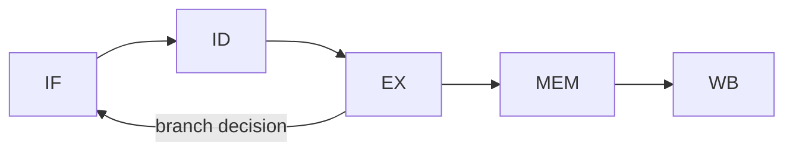

# Computer Architecture 101 (9/10): 병렬성과 멀티코어

코어가 8개라면 프로그램도 정확히 8배 빨라질까요? 대부분은 그렇지 않습니다. 이 글은 Computer Architecture 101 시리즈의 아홉 번째 글입니다. 여기서는 멀티코어 시대의 기본 사고법인 동시성과 병렬성의 차이, 동기화 비용, 캐시 일관성, 그리고 Amdahl의 법칙을 정리하겠습니다.

클럭 속도 상승이 멈춘 뒤 성능 향상의 대부분은 코어를 더하는 방향으로 왔습니다. 하지만 코어를 더하는 것과 코드를 빠르게 만드는 것은 전혀 같은 일이 아닙니다.

## 먼저 던지는 질문

- 동시성과 병렬성은 무엇이 다를까요?
- 멀티코어에서는 어떤 비용이 새로 생길까요?
- 락 경합과 false sharing은 왜 위험할까요?

## 큰 그림


*Computer Architecture 101 9장 흐름 개요*

## 왜 중요한가

오늘날의 서버, 노트북, 휴대폰은 모두 멀티코어입니다. 한 코어만 더 빠르게 돌아가던 시대는 끝났고, 성능을 끌어내려면 일을 여러 코어에 나누는 감각이 필요합니다.

하지만 병렬성은 공짜가 아닙니다. 락 경합, 캐시 핑퐁, false sharing, 작업 분배 오버헤드는 코어를 추가해도 속도가 기대만큼 오르지 않는 이유가 됩니다.

## 한눈에 보는 개념

동시성은 여러 작업을 다루는 구조이고, 병렬성은 여러 작업을 물리적으로 동시에 실행하는 능력입니다. 멀티코어는 병렬성을 가능하게 하지만 순차 구간과 동기화 비용은 남아 있습니다.

```text
   concurrency                          parallelism
   --------------------                 ---------------------
   structural ability to                physical ability to
   deal with many tasks                 run them simultaneously
                                        (multicore required)

   single-core OK                       multicore required
   async/await, generators              threads, processes, SIMD
```

## 핵심 용어

| 용어 | 설명 |
| --- | --- |
| Concurrency | 여러 작업을 교차 진행하도록 구조화하는 능력 |
| Parallelism | 여러 작업을 실제로 동시에 실행하는 능력 |
| SMP | 대칭형 멀티프로세싱, 코어가 거의 동등한 구조 |
| NUMA | 코어 위치에 따라 메모리 접근 비용이 달라지는 구조 |
| Cache coherence | 코어별 캐시 내용을 일관되게 유지하는 메커니즘 |
| Amdahl's law | 순차 비율이 속도 향상 상한을 정한다는 법칙 |

## Before / After

**Before — 모든 코어를 아무 생각 없이 사용:**

```python
# "8 cores so it must be 8x faster"
from multiprocessing import Pool

def task(x):
    return x * 2

with Pool(8) as p:
    result = p.map(task, range(100))   # tasks too small, overhead dominates
```

**After — 작업 크기와 통신 비용 먼저 보기:**

```python
from multiprocessing import Pool

def heavy_task(n):
    return sum(i * i for i in range(n))

with Pool(8) as p:
    result = p.map(heavy_task, [10_000_000] * 8)   # enough work per core
```

같은 도구도 작업 크기에 따라 정반대 결과를 냅니다.

## 단계별로 따라가기

### 1단계: 코어 수와 단순 병렬화 확인

```python
import os, time
from multiprocessing import Pool

def work(n):
    return sum(i * i for i in range(n))

if __name__ == "__main__":
    print(f"logical cores: {os.cpu_count()}")

    N = 5_000_000
    tasks = [N] * 8

    start = time.time()
    [work(n) for n in tasks]
    print(f"sequential: {time.time() - start:.2f}s")

    with Pool(processes=os.cpu_count()) as p:
        start = time.time()
        p.map(work, tasks)
        print(f"parallel:   {time.time() - start:.2f}s")
```

8코어여도 보통 8배에 도달하지는 않습니다. 그 이유를 다음 단계에서 공식으로 봅니다.

### 2단계: Amdahl의 법칙 계산

```python
def amdahl_speedup(p, n):
    """p: parallelizable fraction, n: cores"""
    return 1 / ((1 - p) + p / n)

for serial in [0.05, 0.10, 0.20, 0.50]:
    p = 1 - serial
    print(f"serial {serial*100:.0f}%: cores 8 -> {amdahl_speedup(p, 8):.2f}x,"
          f"  cores inf -> {1/serial:.1f}x")
```

순차 구간이 5%만 남아도 무한 코어에서 상한은 20배입니다.

### 3단계: 락 경합 보기

```python
import threading, time

counter = 0
lock = threading.Lock()

def with_lock(iters):
    global counter
    for _ in range(iters):
        with lock:
            counter += 1

ITERS = 1_000_000
counter = 0
threads = [threading.Thread(target=with_lock, args=(ITERS,)) for _ in range(4)]
start = time.time()
for t in threads: t.start()
for t in threads: t.join()
print(f"with lock: {time.time()-start:.2f}s, counter={counter}")
```

스레드를 늘려도 락 범위가 넓으면 실제로는 직렬화가 다시 생깁니다.

### 4단계: false sharing 보기

```python
import threading, time

# Adjacent indices updated by different threads share a cache line
shared = [0] * 4

def bump(idx, iters):
    for _ in range(iters):
        shared[idx] += 1

# Adjacent (false sharing)
threads = [threading.Thread(target=bump, args=(i, 5_000_000)) for i in range(4)]
start = time.time()
for t in threads: t.start()
for t in threads: t.join()
print(f"adjacent: {time.time()-start:.2f}s")

# Spaced apart (false sharing reduced)
shared = [0] * 256
threads = [threading.Thread(target=bump, args=(i*64, 5_000_000)) for i in range(4)]
start = time.time()
for t in threads: t.start()
for t in threads: t.join()
print(f"spaced:   {time.time()-start:.2f}s")
```

같은 양의 일도 캐시 라인을 공유하느냐에 따라 성능이 크게 달라질 수 있습니다.

### 5단계: I/O에서는 동시성이 더 중요할 때

```python
import asyncio, time

async def io_task(i):
    await asyncio.sleep(0.1)
    return i

async def main():
    start = time.time()
    await asyncio.gather(*(io_task(i) for i in range(100)))
    print(f"asyncio (concurrency, 1 core): {time.time()-start:.2f}s")

asyncio.run(main())
```

I/O 바운드 작업은 한 코어에서도 동시성으로 크게 개선될 수 있습니다. 병렬성은 CPU 바운드일 때 더 직접적입니다.

## 이 코드에서 먼저 봐야 할 점

- 코어를 추가하는 것만으로는 속도 향상이 보장되지 않습니다.
- Amdahl의 법칙은 순차 비율이 상한을 정한다는 점을 보여 줍니다.
- 락 경합과 false sharing은 흔한 병렬성 함정입니다.
- I/O 바운드 작업에는 병렬성보다 동시성이 더 맞을 수 있습니다.

## 자주 하는 실수 5가지

| 실수 | 문제 | 해결 |
| --- | --- | --- |
| 너무 작은 작업 병렬화 | 통신 오버헤드가 계산보다 큼 | 작업 단위를 키운다 |
| Python에서 CPU 바운드에 threading 사용 | GIL 때문에 단일 코어에 묶임 | multiprocessing 사용 |
| 락 범위를 넓게 둠 | 사실상 직렬화 복귀 | 락 범위 최소화 |
| false sharing 무시 | 캐시 핑퐁으로 성능 급락 | 패딩과 정렬 사용 |
| 모든 작업을 병렬화하려 함 | 본질적으로 순차인 부분 존재 | 먼저 상한을 추정 |

## 실무에서는 이렇게 드러납니다

- 데이터 처리는 SIMD와 분산 병렬을 함께 사용합니다.
- 웹 서버는 멀티프로세스와 비동기 I/O를 결합합니다.
- 게임 엔진은 렌더링, 물리, 오디오를 다른 코어에 배치합니다.
- ML 학습은 GPU 안의 막대한 병렬 레인을 활용합니다.
- 데이터베이스는 병렬 쿼리와 파티셔닝으로 확장합니다.

## 시니어 엔지니어는 이렇게 생각합니다

시니어는 "병렬화하자"는 말이 나오면 먼저 두 가지를 묻습니다. 이 작업은 정말 CPU 바운드인가, 그리고 병렬화 가능한 비율은 얼마인가입니다. 많은 백엔드 작업은 I/O 바운드이므로, 거기서는 병렬성보다 동시성이 먼저 답이 됩니다.

또한 병렬화 자체의 비용을 측정합니다. 작업 분배, 결과 수집, 동기화, 캐시 일관성 트래픽이 얻는 이익보다 크면 코어를 늘릴수록 더 느려질 수 있습니다. 그래서 작은 규모에서 먼저 측정하고 점진적으로 확장합니다.

## 체크리스트

- [ ] 동시성과 병렬성 차이를 설명할 수 있는가
- [ ] Amdahl의 법칙으로 상한을 계산할 수 있는가
- [ ] 락 경합과 false sharing을 식별할 수 있는가
- [ ] CPU 바운드와 I/O 바운드를 구분할 수 있는가
- [ ] 병렬화할 만큼 작업이 충분히 큰지 판단할 수 있는가

## 연습 문제

1. 순차 비율 1%, 5%, 10%에 대해 16, 64, 256코어에서 Amdahl 속도 향상을 계산해 보세요.

2. `multiprocessing.Pool`에서 작업 크기를 바꿔 가며 언제부터 병렬화가 이득인지 찾아보세요.

3. `threading`과 `asyncio`를 I/O 작업에 각각 적용해 CPU 사용량과 시간을 비교해 보세요.

## 정리 및 다음 글

병렬성은 멀티코어 시대의 핵심이지만 자동으로 따라오지 않습니다. 동시성과 구분해 이해해야 하고, 순차 구간과 동기화 비용이 만드는 상한을 항상 함께 봐야 합니다. 코어 수보다 먼저 병렬화 가능한 비율을 보는 습관이 중요합니다.

다음 글은 이 시리즈의 마지막 글입니다. 지금까지 본 CPU, 메모리, 캐시, I/O, 병렬성을 모두 묶어 성능을 어떻게 측정하고 설명할지 정리하겠습니다.

## 심화 실습: 비트 연산 · 캐시 계산 · 파이프라인 관찰

컴퓨터 구조를 실제로 이해하려면 정의를 암기하는 대신 숫자를 직접 계산해 보는 과정이 필요합니다. 같은 명령이라도 비트 표현, 메모리 계층, 파이프라인 충돌 조건을 동시에 보면 성능 병목의 원인이 선명해집니다.

### 2의 보수와 비트 마스크를 수치로 확인하기

```python
def to_u8(n: int) -> int:
    return n & 0xFF

def to_s8(n: int) -> int:
    n &= 0xFF
    return n - 0x100 if n & 0x80 else n

x = to_u8(-5)          # 251 (0b11111011)
y = to_u8(12)          # 12  (0b00001100)
print(bin(x), bin(y))
print(to_s8(x + y))    # 7
print(to_s8(x - y))    # -17
```

핵심은 ALU가 "부호 있는 정수"와 "부호 없는 정수"를 따로 계산하지 않는다는 점입니다. 동일한 비트열을 어떻게 해석하느냐가 결과 의미를 바꿉니다. 그래서 ISA 문서에는 signed/unsigned 비교 명령이 따로 존재합니다.

### 캐시 인덱스 계산을 손으로 풀기

가정:
- L1 D-cache = 32KiB
- line size = 64B
- 8-way set associative

계산:
- 총 line 수 = 32KiB / 64B = 512
- set 수 = 512 / 8 = 64
- set index 비트 수 = log2(64) = 6
- block offset 비트 수 = log2(64) = 6
- tag 비트 수(48-bit VA 가정) = 48 - 6 - 6 = 36

즉 주소 비트 분해는 `[tag:36][index:6][offset:6]`이 됩니다. 두 주소가 같은 set에 매핑되는지 확인하려면 offset을 제거한 뒤 index 6비트를 비교하면 됩니다.

### 캐시 미스 패턴을 추적하는 간단 코드

```python
# stride 접근이 캐시 locality에 미치는 영향 관찰
N = 1024 * 1024
arr = [0] * N

def walk(step: int):
    s = 0
    for i in range(0, N, step):
        s += arr[i]
    return s

for step in [1, 2, 4, 8, 16, 32, 64, 128]:
    walk(step)
```

이 코드는 단순하지만 실험 관점에서는 매우 유용합니다. `step`이 커질수록 한 cache line에서 활용하는 유효 데이터가 줄고 miss 비율이 올라갑니다. 프로파일러에서는 CPI 증가와 함께 메모리 stall 시간이 늘어나는 형태로 관측됩니다.

### 5단계 파이프라인에서 hazard를 그림으로 보기



간단한 명령 시퀀스:
- `I1: LOAD R1, [R2]`
- `I2: ADD R3, R1, R4`

`I2`는 `R1`이 필요하지만 `I1`의 결과는 MEM/WB 이후에 준비됩니다. Forwarding이 없으면 stall이 필요하고, forwarding이 있으면 일부 cycle을 절약할 수 있습니다. 이 차이가 곧 IPC 차이로 이어집니다.

### 파이프라인 타이밍 표를 직접 작성하기

```text
cycle:   1   2   3   4   5   6
I1      IF  ID  EX MEM  WB
I2          IF  ID STALL EX MEM WB
I3              IF STALL ID  EX MEM WB
```

이 표를 직접 그려 보면 왜 분기 예측 실패가 큰 비용인지, 왜 load-use hazard가 민감한지 바로 이해할 수 있습니다. 이론보다 "cycle 단위로 어디가 비는지"를 보는 것이 훨씬 빠릅니다.

### 성능 근사식으로 병목 분해하기

성능은 보통 다음으로 근사합니다.

`Execution Time = Instruction Count × CPI × Clock Cycle Time`

여기서 구조 개선은 보통 세 축으로 나타납니다.
- 명령 수 감소: 컴파일러 최적화/벡터화
- CPI 감소: cache miss 감소, branch mispredict 감소, forwarding 개선
- cycle time 단축: 더 높은 클록, 더 짧은 임계 경로

실무에서는 한 축을 개선하면 다른 축이 악화될 수 있습니다. 예를 들어 파이프라인 단계를 늘려 클록을 높이면 분기 실패 패널티가 커질 수 있습니다. 따라서 "한 지표만" 보고 결론 내리면 위험합니다.

### 점검 체크리스트

- 주소 하나를 보고 `tag/index/offset`으로 즉시 분해할 수 있는가
- load-use, branch hazard를 cycle 표로 그릴 수 있는가
- signed/unsigned 연산 차이를 비트 패턴으로 설명할 수 있는가
- CPI 상승의 원인을 cache/branch/structural hazard로 나눠 추적할 수 있는가

이 체크리스트를 통과하면, 컴퓨터 구조 지식이 암기에서 운영 가능한 문제해결 도구로 바뀝니다.

## 처음 질문으로 돌아가기

- **동시성과 병렬성은 무엇이 다를까요?**
  - 본문의 기준은 병렬성과 멀티코어를 한 덩어리 개념으로 보지 않고 입력, 처리, 검증, 운영 신호가 만나는 경계로 나누어 확인하는 것입니다.
- **멀티코어에서는 어떤 비용이 새로 생길까요?**
  - 예제와 그림에서는 어떤 값이 들어오고, 어느 단계에서 바뀌며, 어떤 기준으로 통과 또는 실패하는지를 먼저 확인해야 합니다.
- **락 경합과 false sharing은 왜 위험할까요?**
  - 운영에서는 이 판단을 체크리스트, 로그, 테스트로 남겨 다음 변경에서도 같은 실패가 반복되지 않게 막아야 합니다.

<!-- toc:begin -->
## 시리즈 목차

- [Computer Architecture 101 (1/10): 컴퓨터 구조란 무엇인가?](./01-what-is-computer-architecture.md)
- [Computer Architecture 101 (2/10): 데이터 표현 — bit, byte, integer, floating point](./02-data-representation.md)
- [Computer Architecture 101 (3/10): CPU와 명령어](./03-cpu-and-instructions.md)
- [Computer Architecture 101 (4/10): 레지스터와 ALU](./04-registers-and-alu.md)
- [Computer Architecture 101 (5/10): 메모리 구조](./05-memory-organization.md)
- [Computer Architecture 101 (6/10): 캐시와 지역성](./06-cache-and-locality.md)
- [Computer Architecture 101 (7/10): 파이프라인](./07-pipelining.md)
- [Computer Architecture 101 (8/10): I/O와 장치](./08-io-and-devices.md)
- **병렬성과 멀티코어 (현재 글)**
- 성능을 이해하는 법 (예정)

<!-- toc:end -->

## 참고 자료

- [Wikipedia — Amdahl's law](https://en.wikipedia.org/wiki/Amdahl%27s_law)
- [Wikipedia — Cache coherence](https://en.wikipedia.org/wiki/Cache_coherence)
- [Wikipedia — False sharing](https://en.wikipedia.org/wiki/False_sharing)
- [The Free Lunch Is Over (Herb Sutter, 2005)](http://www.gotw.ca/publications/concurrency-ddj.htm)

Tags: Computer Science, 컴퓨터 구조, 병렬성, 멀티코어, 동시성, 동기화
