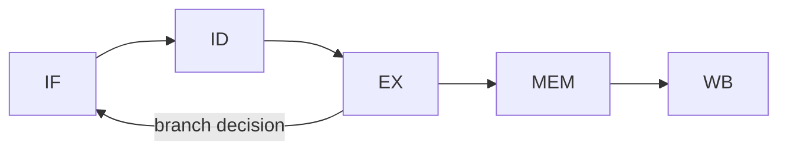

# Computer Architecture 101 (10/10): 성능을 이해하는 법

"느리다"는 말은 너무 자주 나오지만, 무엇이 얼마나 느린지 말하지 않으면 아무것도 해결되지 않습니다. 이 글은 Computer Architecture 101 시리즈의 마지막 글입니다. 여기서는 CPU, 메모리, 캐시, I/O, 병렬성까지 앞선 모든 내용을 모아 성능을 어떻게 측정하고 설명할지 하나의 사고 도구로 정리하겠습니다.

성능 문제는 거의 항상 추측에서 시작됩니다. 하지만 시니어 엔지니어는 측정 없이 코드를 바꾸지 않습니다. 최적화는 신념이 아니라 증거 위에서만 성립하기 때문입니다.

## 먼저 던지는 질문

- 지연시간과 처리량은 어떻게 다를까요?
- USE 방법론은 병목을 어떻게 찾을까요?
- 샘플링 프로파일링과 계측은 무엇이 다를까요?

## 큰 그림


*Computer Architecture 101 10장 흐름 개요*

## 왜 중요한가

성능은 모든 시스템의 기능입니다. 더 빠른 페이지는 더 많은 사용자를 붙잡고, 더 효율적인 배치는 더 적은 서버 비용으로 돌아가며, 더 낮은 지연은 더 좋은 사용자 경험을 만듭니다.

문제는 "최적화"라는 말이 종종 잘못된 직관과 결합한다는 점입니다. 진짜 병목이 SQL인데 Python을 의심하고, 진짜 병목이 I/O인데 CPU 튜닝부터 시작하는 식입니다. 그래서 측정이 먼저입니다.

## 한눈에 보는 개념

성능에는 지연시간과 처리량이라는 두 축이 있습니다. 병목을 찾을 때는 CPU, 메모리, 디스크, 네트워크 같은 자원의 Utilization, Saturation, Errors를 봅니다. 프로파일링은 대략적으로 자주 샘플링하는 방식과, 함수 경계에 직접 측정 코드를 넣는 방식으로 나뉩니다.

```text
   latency                       throughput
   --------------------          --------------------
   time per single request       requests per unit time
   ms, us                        req/s, MB/s
   user experience               server cost

   v find bottlenecks
   USE method
   +----------+----------+----------+
   | CPU      | Memory   | Disk/Net |
   | Util %   | Used %   | Util %   |
   | Sat: queue| Sat: swap| Sat: queue|
   | Errors   | OOM      | I/O err  |
   +----------+----------+----------+
```

## 핵심 용어

| 용어 | 설명 |
| --- | --- |
| Latency | 한 작업이 끝날 때까지 걸리는 시간 |
| Throughput | 단위 시간당 완료한 작업 수 |
| p99 | 100개 중 가장 느린 1개에 가까운 꼬리 지연 |
| USE | Utilization / Saturation / Errors |
| Sampling profiler | 주기적으로 호출 스택을 수집하는 프로파일러 |
| Instrumentation | 함수 경계에 직접 측정 코드를 넣는 방식 |

## Before / After

**Before — 추측으로 최적화:**

```python
# "Python must be slow" so it gets ported to Cython
# The real bottleneck was an N+1 SQL query
def slow_endpoint(user_ids):
    users = []
    for uid in user_ids:
        users.append(db.query("SELECT * FROM users WHERE id = ?", uid))
    return users
```

**After — 측정 후 실제 병목 수정:**

```python
# Profiler shows SQL spending 95% of the time
def fast_endpoint(user_ids):
    return db.query(
        "SELECT * FROM users WHERE id IN (?)",
        user_ids,
    )   # one query, 100x faster
```

병목을 정확히 봤을 때만 최적화는 실제 체감으로 이어집니다.

## 단계별로 따라가기

### 1단계: 지연시간과 처리량 측정

```python
import time

def task():
    return sum(i * i for i in range(10_000))

# Latency: time per call
start = time.time()
task()
print(f"latency: {(time.time()-start)*1000:.2f}ms")

# Throughput: how many in 1 second
end = time.time() + 1.0
count = 0
while time.time() < end:
    task()
    count += 1
print(f"throughput: {count} req/s")
```

어떤 시스템은 지연시간이 중요하고, 어떤 시스템은 처리량이 더 중요합니다. 먼저 무엇을 개선할지 정해야 합니다.

### 2단계: p50/p95/p99 보기

```python
import time, random

def variable_task():
    time.sleep(random.uniform(0.001, 0.020))   # 1-20ms

samples = []
for _ in range(1000):
    start = time.time()
    variable_task()
    samples.append((time.time() - start) * 1000)

samples.sort()
def pct(p): return samples[int(len(samples) * p / 100)]
print(f"p50={pct(50):.2f}ms  p95={pct(95):.2f}ms  p99={pct(99):.2f}ms")
print(f"max={samples[-1]:.2f}ms")
```

평균은 자주 현실을 숨깁니다. 사용자는 꼬리 지연을 체감합니다.

### 3단계: `cProfile`로 병목 찾기

```python
import cProfile, pstats

def heavy():
    total = 0
    for i in range(100_000):
        total += sum(j for j in range(100))
    return total

profiler = cProfile.Profile()
profiler.enable()
heavy()
profiler.disable()

stats = pstats.Stats(profiler).sort_stats("cumulative")
stats.print_stats(10)
```

처음 보는 결과가 직관과 다를 때가 많습니다. 그럴수록 프로파일러를 더 신뢰해야 합니다.

### 4단계: USE 방식 흉내내기

```python
import psutil

def use_snapshot(label):
    cpu = psutil.cpu_percent(interval=0.5)
    mem = psutil.virtual_memory().percent
    print(f"[{label}] CPU util: {cpu:.1f}%   Mem used: {mem:.1f}%")

use_snapshot("idle")
data = [i * i for i in range(10_000_000)]
use_snapshot("after work")
```

실제 운영에서는 `vmstat`, `iostat`, `top`, APM 도구가 같은 질문을 더 넓게 던집니다. 핵심은 어느 자원이 먼저 한계에 닿았는지 찾는 것입니다.

### 5단계: 단일 변수 통제 벤치마크

```python
import time

def benchmark(name, fn, runs=5):
    times = []
    for _ in range(runs):
        start = time.time()
        fn()
        times.append(time.time() - start)
    times.sort()
    print(f"{name:20s} median={times[len(times)//2]*1000:.2f}ms")

def loop_method():
    out = []
    for i in range(100_000):
        out.append(i * i)
    return out

def comprehension_method():
    return [i * i for i in range(100_000)]

benchmark("for-append", loop_method)
benchmark("comprehension", comprehension_method)
```

한 번에 한 변수만 바꿔야 무엇이 실제로 도움 됐는지 말할 수 있습니다. 여러 번 반복하고 중앙값을 보는 이유도 여기에 있습니다.

## 이 코드에서 먼저 봐야 할 점

- 지연시간과 처리량은 별개이며 전략도 다를 수 있습니다.
- 평균보다 p95, p99 같은 꼬리 지연이 중요합니다.
- 직관보다 프로파일러를 믿어야 합니다.
- USE는 자원별 병목을 체계적으로 찾게 도와줍니다.

## 자주 하는 실수 5가지

| 실수 | 문제 | 해결 |
| --- | --- | --- |
| 측정 없이 최적화 | 엉뚱한 곳을 빠르게 만듦 | 먼저 프로파일링 |
| 평균만 보기 | 꼬리 지연을 놓침 | 분포 전체 확인 |
| 한 번 측정으로 결론 | 노이즈 무시 | 반복 후 중앙값 사용 |
| 여러 변수 동시에 변경 | 원인 분리 불가 | 한 번에 하나씩 바꾸기 |
| 회귀 벤치마크 없음 | 다음 변경에서 다시 느려짐 | 벤치마크 자동화 |

## 실무에서는 이렇게 드러납니다

- APM 도구는 USE 지표를 자동으로 수집합니다.
- 데이터베이스 튜닝은 쿼리 플랜과 캐시 적중률을 함께 봅니다.
- 게임 개발은 프레임 타임 분포로 끊김을 찾습니다.
- 분산 시스템은 평균보다 꼬리 지연이 SLA를 좌우합니다.
- 컴파일러와 런타임은 회귀 벤치마크로 성능을 지킵니다.

## 시니어 엔지니어는 이렇게 생각합니다

시니어는 먼저 "측정 데이터가 있는가"를 묻습니다. 데이터가 없으면 논의는 쉽게 이론 싸움이 되고, 끝없는 추측으로 흐르기 때문입니다. 작은 벤치마크 하나라도 들고 오는 팀이 좋은 팀인 이유가 여기에 있습니다.

또한 "어디가 느린가"보다 먼저 "왜 느린가"를 묻습니다. 같은 함수가 느려도 CPU 바운드인지, 메모리 바운드인지, I/O 바운드인지, 락 경합인지에 따라 처방이 완전히 달라집니다. 이 시리즈에서 다룬 모든 내용이 결국 그 진단 도구가 됩니다.

## 체크리스트

- [ ] 지연시간과 처리량 차이를 설명할 수 있는가
- [ ] 평균이 아니라 꼬리 지연을 봐야 하는 이유를 아는가
- [ ] `cProfile`, `perf`, `py-spy` 같은 도구를 써 본 적이 있는가
- [ ] USE로 자원 병목을 찾는 흐름을 설명할 수 있는가
- [ ] 단일 변수 통제 벤치마크를 작성할 수 있는가

## 연습 문제

1. 자주 쓰는 함수 하나를 `cProfile`로 분석하고, 가장 비싼 함수가 예상과 일치하는지 확인해 보세요.

2. 임의의 웹 API에 여러 요청을 보내 p50, p95, p99, max를 구해 평균과 얼마나 다른지 확인해 보세요.

3. 같은 알고리즘의 구현 두 개를 만들어 단일 변수 통제 벤치마크로 비교하고 중앙값을 기록해 보세요.

## 정리 및 다음 단계

성능은 측정에서 시작합니다. 지연시간과 처리량을 구분하고, 꼬리 지연을 보고, USE로 병목을 찾고, 단일 변수 통제로 검증해야 합니다. 그래야 최적화가 신앙이 아니라 설명 가능한 엔지니어링이 됩니다.

이것으로 Computer Architecture 101 시리즈를 마칩니다. 데이터 표현부터 멀티코어까지 살펴본 모든 주제는 결국 "왜 이 시스템은 이만큼 빠른가, 혹은 왜 이만큼 느린가"를 설명하는 도구였습니다.

## 심화 실습: 비트 연산 · 캐시 계산 · 파이프라인 관찰

컴퓨터 구조를 실제로 이해하려면 정의를 암기하는 대신 숫자를 직접 계산해 보는 과정이 필요합니다. 같은 명령이라도 비트 표현, 메모리 계층, 파이프라인 충돌 조건을 동시에 보면 성능 병목의 원인이 선명해집니다.

### 2의 보수와 비트 마스크를 수치로 확인하기

```python
def to_u8(n: int) -> int:
    return n & 0xFF

def to_s8(n: int) -> int:
    n &= 0xFF
    return n - 0x100 if n & 0x80 else n

x = to_u8(-5)          # 251 (0b11111011)
y = to_u8(12)          # 12  (0b00001100)
print(bin(x), bin(y))
print(to_s8(x + y))    # 7
print(to_s8(x - y))    # -17
```

핵심은 ALU가 "부호 있는 정수"와 "부호 없는 정수"를 따로 계산하지 않는다는 점입니다. 동일한 비트열을 어떻게 해석하느냐가 결과 의미를 바꿉니다. 그래서 ISA 문서에는 signed/unsigned 비교 명령이 따로 존재합니다.

### 캐시 인덱스 계산을 손으로 풀기

가정:
- L1 D-cache = 32KiB
- line size = 64B
- 8-way set associative

계산:
- 총 line 수 = 32KiB / 64B = 512
- set 수 = 512 / 8 = 64
- set index 비트 수 = log2(64) = 6
- block offset 비트 수 = log2(64) = 6
- tag 비트 수(48-bit VA 가정) = 48 - 6 - 6 = 36

즉 주소 비트 분해는 `[tag:36][index:6][offset:6]`이 됩니다. 두 주소가 같은 set에 매핑되는지 확인하려면 offset을 제거한 뒤 index 6비트를 비교하면 됩니다.

### 캐시 미스 패턴을 추적하는 간단 코드

```python
# stride 접근이 캐시 locality에 미치는 영향 관찰
N = 1024 * 1024
arr = [0] * N

def walk(step: int):
    s = 0
    for i in range(0, N, step):
        s += arr[i]
    return s

for step in [1, 2, 4, 8, 16, 32, 64, 128]:
    walk(step)
```

이 코드는 단순하지만 실험 관점에서는 매우 유용합니다. `step`이 커질수록 한 cache line에서 활용하는 유효 데이터가 줄고 miss 비율이 올라갑니다. 프로파일러에서는 CPI 증가와 함께 메모리 stall 시간이 늘어나는 형태로 관측됩니다.

### 5단계 파이프라인에서 hazard를 그림으로 보기



간단한 명령 시퀀스:
- `I1: LOAD R1, [R2]`
- `I2: ADD R3, R1, R4`

`I2`는 `R1`이 필요하지만 `I1`의 결과는 MEM/WB 이후에 준비됩니다. Forwarding이 없으면 stall이 필요하고, forwarding이 있으면 일부 cycle을 절약할 수 있습니다. 이 차이가 곧 IPC 차이로 이어집니다.

### 파이프라인 타이밍 표를 직접 작성하기

```text
cycle:   1   2   3   4   5   6
I1      IF  ID  EX MEM  WB
I2          IF  ID STALL EX MEM WB
I3              IF STALL ID  EX MEM WB
```

이 표를 직접 그려 보면 왜 분기 예측 실패가 큰 비용인지, 왜 load-use hazard가 민감한지 바로 이해할 수 있습니다. 이론보다 "cycle 단위로 어디가 비는지"를 보는 것이 훨씬 빠릅니다.

### 성능 근사식으로 병목 분해하기

성능은 보통 다음으로 근사합니다.

`Execution Time = Instruction Count × CPI × Clock Cycle Time`

여기서 구조 개선은 보통 세 축으로 나타납니다.
- 명령 수 감소: 컴파일러 최적화/벡터화
- CPI 감소: cache miss 감소, branch mispredict 감소, forwarding 개선
- cycle time 단축: 더 높은 클록, 더 짧은 임계 경로

실무에서는 한 축을 개선하면 다른 축이 악화될 수 있습니다. 예를 들어 파이프라인 단계를 늘려 클록을 높이면 분기 실패 패널티가 커질 수 있습니다. 따라서 "한 지표만" 보고 결론 내리면 위험합니다.

### 점검 체크리스트

- 주소 하나를 보고 `tag/index/offset`으로 즉시 분해할 수 있는가
- load-use, branch hazard를 cycle 표로 그릴 수 있는가
- signed/unsigned 연산 차이를 비트 패턴으로 설명할 수 있는가
- CPI 상승의 원인을 cache/branch/structural hazard로 나눠 추적할 수 있는가

이 체크리스트를 통과하면, 컴퓨터 구조 지식이 암기에서 운영 가능한 문제해결 도구로 바뀝니다.

## 처음 질문으로 돌아가기

- **지연시간과 처리량은 어떻게 다를까요?**
  - 본문의 기준은 성능을 이해하는 법를 한 덩어리 개념으로 보지 않고 입력, 처리, 검증, 운영 신호가 만나는 경계로 나누어 확인하는 것입니다.
- **USE 방법론은 병목을 어떻게 찾을까요?**
  - 예제와 그림에서는 어떤 값이 들어오고, 어느 단계에서 바뀌며, 어떤 기준으로 통과 또는 실패하는지를 먼저 확인해야 합니다.
- **샘플링 프로파일링과 계측은 무엇이 다를까요?**
  - 운영에서는 이 판단을 체크리스트, 로그, 테스트로 남겨 다음 변경에서도 같은 실패가 반복되지 않게 막아야 합니다.

<!-- toc:begin -->
## 시리즈 목차

- [Computer Architecture 101 (1/10): 컴퓨터 구조란 무엇인가?](./01-what-is-computer-architecture.md)
- [Computer Architecture 101 (2/10): 데이터 표현 — bit, byte, integer, floating point](./02-data-representation.md)
- [Computer Architecture 101 (3/10): CPU와 명령어](./03-cpu-and-instructions.md)
- [Computer Architecture 101 (4/10): 레지스터와 ALU](./04-registers-and-alu.md)
- [Computer Architecture 101 (5/10): 메모리 구조](./05-memory-organization.md)
- [Computer Architecture 101 (6/10): 캐시와 지역성](./06-cache-and-locality.md)
- [Computer Architecture 101 (7/10): 파이프라인](./07-pipelining.md)
- [Computer Architecture 101 (8/10): I/O와 장치](./08-io-and-devices.md)
- [Computer Architecture 101 (9/10): 병렬성과 멀티코어](./09-parallelism-and-multicore.md)
- **성능을 이해하는 법 (현재 글)**

<!-- toc:end -->

## 참고 자료

- [Wikipedia — Profiling (computer programming)](https://en.wikipedia.org/wiki/Profiling_(computer_programming))
- [Brendan Gregg — The USE Method](https://www.brendangregg.com/usemethod.html)
- [Latency Numbers Every Programmer Should Know](https://gist.github.com/jboner/2841832)
- [Donald Knuth — Structured Programming with go to Statements (1974)](https://dl.acm.org/doi/10.1145/356635.356640)

Tags: Computer Science, 컴퓨터 구조, 성능, 프로파일링, 최적화, 측정
