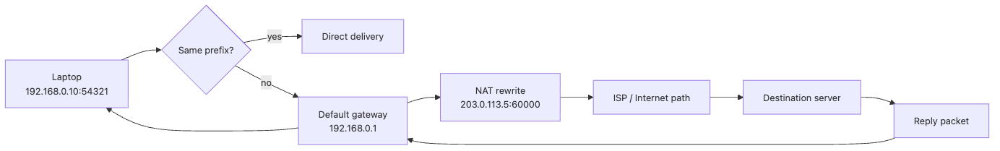

# Routing and NAT

> Computer Networks 101 series (7/10)

<!-- a-grade-intro:begin -->

**Core question**: How does my laptop, sitting on a private IP, talk to a server out on the public Internet?

> A router decides only the "next hop" for each packet. The routing table is the rule book for that decision. To reach the public Internet from a private IP, NAT rewrites the source IP and port into the router's public address. Half of the Internet is routing; the other half is NAT.

<!-- a-grade-intro:end -->

This is post 7 in the Computer Networks 101 series.

## What You Will Learn

- How to read a routing table
- Default gateway and longest-prefix match
- How NAT works and what source NAT and port mapping do
- A high-level view of AS and BGP

## Why It Matters

Without routing, you cannot answer "why does it only fail on our corporate network?". Without NAT, "why can't I reach our server from outside?" or "why does it work at the office but not at home?" stay mysteries. VPNs, container networks, and cloud VPCs are also routing + NAT variations.

> A router sees only one hop at a time. The Internet is the sum of those small decisions.

## Concept at a Glance


*Routing chooses the next hop, while NAT rewrites private source addresses and ports so replies can find their way back to the original host.*

## Key Terms

| Term | Meaning |
| --- | --- |
| Routing table | A mapping of "this prefix → this interface / next hop" |
| Default gateway | The next hop used when nothing else matches |
| Longest-prefix match | The longer prefix wins |
| NAT | Translates private IP and port to public IP and port |
| AS, BGP | The unit and protocol that negotiate routes across the global Internet |

## Before / After

**Before — "the Internet is a magic cable":**

```text
no idea how the packet gets there
```

**After — "routers cooperate + NAT bridges":**

```text
hop 1 → hop 2 → ... → hop N
NAT is automatic for outbound, but inbound needs explicit port forwarding
```

## Hands-on: Step by Step

### Step 1: read your routing table

```bash
ip route
# default via 192.168.0.1 dev wlan0
# 10.0.0.0/8 via 10.0.1.1 dev tun0
# 192.168.0.0/24 dev wlan0 proto kernel scope link src 192.168.0.10
```

The longest prefix wins — `192.168.0.0/24` takes priority over the default route.

### Step 2: see the routers with traceroute

```bash
traceroute 1.1.1.1
# 1  192.168.0.1   1 ms
# 2  isp-gw        5 ms
# 3  ...
# N  one.one.one.one  12 ms
```

Each line is the next-hop router.

### Step 3: check your public IP

```bash
curl -s ifconfig.me
# 203.0.113.5
```

Your private IP is `192.168.0.10`, but the world sees a different IP. The translation is NAT.

### Step 4: inspect NAT (Linux iptables)

```bash
sudo iptables -t nat -L -n -v
# Chain POSTROUTING (policy ACCEPT)
# MASQUERADE  all  --  192.168.0.0/24  0.0.0.0/0
```

`MASQUERADE` is the source NAT rule.

### Step 5: add and remove a static route (experiment)

```bash
# Send 192.168.50.0/24 through a specific gateway
sudo ip route add 192.168.50.0/24 via 192.168.0.254
ip route show
sudo ip route del 192.168.50.0/24
```

You see the routing table change in real time and packet destinations follow.

## Step 6: Read longest-prefix and NAT state together

Routing and NAT failures often look similar from the outside, but their fingerprints are different.

| Symptom you observe | Suspect first | Why it looks like that |
| --- | --- | --- |
| `ip route get 1.1.1.1` picks an unexpected interface | Longest-prefix conflict | A narrower route beat the default route |
| Outbound connects, then long-idle replies disappear | NAT session timeout | The translation state vanished before the return traffic arrived |
| A remote corporate range should cross VPN but still goes to local Wi-Fi | Missing static route | The specific corporate prefix is absent from the routing table |

```bash
ip route get 1.1.1.1
# 1.1.1.1 via 192.168.0.1 dev wlan0 src 192.168.0.10
```

This is the fastest way to ask the OS, "If I send a packet there right now, which interface and source address will you choose?" It is often more actionable than `traceroute` at the start of a routing incident.

## What to Notice in This Code

- Routing decisions are independent at every hop
- Longest-prefix match wins — narrower rules override the default
- NAT tracks outbound connections so replies return to the right private IP
- Inbound new connections need explicit port forwarding (DNAT)

## Five Common Mistakes

| Mistake | Problem | Fix |
| --- | --- | --- |
| Assuming inbound from outside works behind NAT | Connections fail | Use port forwarding, reverse tunnel, or a public LB |
| Same private range at office and home | VPN routing collisions | Separate prefixes |
| Empty traceroute hops mean "path is broken" | Wrong diagnosis | Try mtr or TCP traceroute |
| Forgetting longest-prefix match | "But it should hit default!" | A narrower rule wins |
| Ignoring NAT session timeout | Long-idle connections drop | Configure keepalive |

## How This Shows Up in Production

- Cloud VPC: per-subnet routing tables + NAT gateways
- Containers: docker0 / CNI uses host NAT rules to reach the outside
- VPN: extra routes inserted into the routing table
- BGP: the Internet backbone negotiates paths between ASes
- IoT and mobile: typically behind carrier-grade NAT

## How a Senior Engineer Thinks

When a senior engineer hears about a new network incident, they unfold both endpoints' routing tables, NAT policies, and firewall rules at the same time. The classic "packets go out but no replies come back" usually traces to asymmetric routing or NAT expiry.

A senior also keeps the IPv6/NAT relationship in mind. IPv6 has so much address space that NAT is technically unnecessary. They map out how operational habits born from NAT (e.g. "we are always short on public IPs", "all external access goes through an LB") shift in an IPv6 world.

## Checklist

- [ ] I can read a routing table
- [ ] I know longest-prefix match
- [ ] I know how NAT rewrites source IP and port
- [ ] I can use traceroute to diagnose paths
- [ ] I know why inbound connections need extra setup

## Practice Problems

1. Capture your routing table and explain the default route and the narrowest rule.

2. Ping two hosts on the same LAN, then run traceroute on each, and decide whether the packets cross a router.

3. Answer in one paragraph: "Why does SSH work at the office but not at home?" from a NAT and firewall perspective.

## Wrap-up and Next Steps

Routers decide one hop at a time; NAT is the bridge that lets private IPs talk to the public Internet. Know just these two and half of the Internet is visible.

Next we look at the device often sitting at the end of that route — the load balancer.

<!-- toc:begin -->
- [What Is a Network?](./01-what-is-a-network.md)
- [IP and Subnet](./02-ip-and-subnet.md)
- [TCP and UDP](./03-tcp-and-udp.md)
- [DNS](./04-dns.md)
- [HTTP and HTTPS](./05-http-and-https.md)
- [TLS Basics](./06-tls-basics.md)
- **Routing and NAT (current)**
- Load Balancer (upcoming)
- WebSocket and real-time (upcoming)
- Debugging network problems (upcoming)
<!-- toc:end -->

## References

- [RFC 1631 — Network Address Translator](https://www.rfc-editor.org/rfc/rfc1631)
- [Cloudflare Learning — What is BGP?](https://www.cloudflare.com/learning/security/glossary/what-is-bgp/)
- [Linux ip-route(8) man page](https://man7.org/linux/man-pages/man8/ip-route.8.html)
- [Tanenbaum & Wetherall — Computer Networks](https://www.pearson.com/store/p/computer-networks/P100000875375)
- [RFC 4271 — Border Gateway Protocol 4 (BGP-4)](https://www.rfc-editor.org/rfc/rfc4271)

Tags: Computer Science, Networking, Routing, NAT, Default Gateway, Private IP
