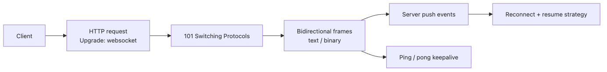

# WebSocket and Real-Time Communication

> Computer Networks 101 series (9/10)

<!-- a-grade-intro:begin -->

**Core question**: In an HTTP world where the server cannot speak first, how do chat messages and stock prices arrive in "real time"?

> WebSocket starts as an HTTP request and then turns the same TCP connection into a bidirectional frame stream. The server can push at any time, and you no longer pay the header cost on every message. The trade-off is that long-lived connections create new pressure on load balancers, deploys, and resource accounting.

<!-- a-grade-intro:end -->

This is post 9 in the Computer Networks 101 series.

## What You Will Learn

- How a WebSocket connection is upgraded from HTTP
- Picking between WebSocket, SSE, and long-polling
- Operational concerns: ping/pong, reconnection, backpressure
- How real-time systems scale horizontally with a message bus

## Why It Matters

Dashboards, chat, games, market feeds, collaborative editing — all of them depend on the server speaking first. Faking this with plain HTTP forces you into polling and long-polling, both of which waste resources. Once you understand WebSocket, you also know when **not** to use it: many "real-time" UIs are perfectly happy with a 5-second refresh.

> "Real time" usually means "shorter than a human's patience." If 200 ms is fine, WebSocket only adds cost.

## Concept at a Glance


*After the HTTP upgrade succeeds, the same TCP connection becomes a long-lived bidirectional frame channel.*

The pivot is **101 Switching Protocols**. The connection starts as HTTP and, after the response, behaves as a stream of WebSocket frames instead.

## Key Terms

- **Upgrade handshake**: An HTTP request carrying `Upgrade: websocket` that asks the server to switch protocols.
- **Frame**: The unit of WebSocket transport — text, binary, ping, pong, close.
- **SSE (Server-Sent Events)**: A standard for streaming server → client messages over a long-lived HTTP response.
- **Long-polling**: The server intentionally delays a response until a new event arrives.
- **Backpressure**: Flow control that prevents the send queue from growing without bound when the receiver is slow.

## Before/After

**Before — poll every 5 seconds**

```python
# client.py — naive polling for new messages
import time, requests

last_id = 0
while True:
    resp = requests.get(f"https://api.example.com/messages?since={last_id}")
    for msg in resp.json():
        print(msg["text"])
        last_id = max(last_id, msg["id"])
    time.sleep(5)
```

A request fires every 5 seconds even when nothing happened, and new messages can be up to 5 seconds late.

**After — receive instantly with WebSocket**

```python
# client.py — uses the websockets library
import asyncio
import websockets

async def listen():
    async with websockets.connect("wss://api.example.com/messages") as ws:
        async for raw in ws:  # arrives the moment the server sends it
            print(raw)

asyncio.run(listen())
```

The client no longer asks. The server pushes the moment something happens.

## Hands-on: Build a WebSocket Echo Server Step by Step

### Step 1 — Install dependencies

```bash
python3 -m venv .venv
source .venv/bin/activate
pip install websockets
```

`websockets` is a well-known Python library built on `asyncio`.

### Step 2 — The simplest echo server

```python
# server.py
import asyncio
import websockets

async def echo(ws):
    async for message in ws:
        await ws.send(f"echo: {message}")

async def main():
    async with websockets.serve(echo, "127.0.0.1", 8765):
        print("listening on ws://127.0.0.1:8765")
        await asyncio.Future()  # run forever

asyncio.run(main())
```

The key line is `async for message in ws`. The coroutine wakes up once per incoming frame.

### Step 3 — Send a message yourself

In another terminal, use `websocat` or a short Python client.

```python
# client.py
import asyncio, websockets

async def main():
    async with websockets.connect("ws://127.0.0.1:8765") as ws:
        await ws.send("hello")
        print(await ws.recv())  # → echo: hello
        await ws.send("world")
        print(await ws.recv())  # → echo: world

asyncio.run(main())
```

Both exchanges share the same connection. There is no new TCP handshake per message.

### Step 4 — Detect dead connections with ping/pong

```python
# server.py — add keepalive options
async with websockets.serve(
    echo, "127.0.0.1", 8765,
    ping_interval=20,   # send a ping every 20 s
    ping_timeout=20,    # close if no pong within 20 s
):
    await asyncio.Future()
```

This stops NAT or load balancers from quietly dropping idle connections, and lets the server notice broken peers quickly.

### Step 5 — Broadcast for a tiny chat

```python
# server.py
import asyncio, websockets

CLIENTS = set()

async def chat(ws):
    CLIENTS.add(ws)
    try:
        async for message in ws:
            await asyncio.gather(*[c.send(message) for c in CLIENTS])
    finally:
        CLIENTS.discard(ws)

async def main():
    async with websockets.serve(chat, "127.0.0.1", 8765):
        await asyncio.Future()

asyncio.run(main())
```

Open two clients, send from one, and the message appears in the other. Notice that `CLIENTS` lives in **this process's memory** — that limitation drives the production discussion below.

## What to Notice in This Code

- The handshake is plain HTTP, but after the response the same socket is no longer HTTP.
- Frames are cheap. You do not re-send headers on every message, which is great for many small messages.
- The `CLIENTS` set is process-local. With two server instances, half of your chat messages stay on the wrong instance.
- Ping and pong are not user messages. They are invisible keepalive frames.

## Five Common Mistakes

1. **Reaching for WebSocket when polling is enough.** If the screen can refresh every 30 s, plain HTTP is cheaper to build and easier to debug.
2. **Keeping shared state in one instance's memory.** The day you scale to two servers, broadcast silently breaks. Plan for a message bus (Redis pub/sub, NATS, Kafka) from the start.
3. **Leaving reconnection to the client without a plan.** Mobile networks drop connections constantly. Use exponential backoff and resume from the last seen event id to fill in any gap.
4. **Ignoring backpressure.** If you append to an unbounded send queue, memory grows until the process dies. Watch how long `await ws.send(...)` takes and disconnect slow consumers.
5. **Forgetting the L7 proxy.** NGINX and similar proxies have short default idle timeouts. WebSocket locations need long `proxy_read_timeout` plus `Upgrade` and `Connection` header forwarding.

## How This Shows Up in Production

Large real-time systems usually split a **WebSocket gateway tier** from a **message bus**. The gateway just maintains connections and publishes inbound events to the bus, which fans events out to other gateways that hold the relevant clients. This separation is what lets you autoscale gateway instances safely.

Deploys are different too. A normal HTTP service can rotate quickly behind a load balancer. WebSocket has to **introduce a new version without dropping live connections**, or users will see flicker and reconnect storms. The standard pattern is graceful drain: route new connections to the new version while old connections finish naturally.

The decision tree stays simple. If the server needs to push **frequently and bidirectionally**, choose WebSocket. If push is one-way, SSE is simpler and pairs well with HTTP/2. If updates are infrequent, polling is fine.

## How a Senior Engineer Thinks

- They ask "does this really need to be real-time?" first. The hard cost of WebSocket is operational, not coding.
- They distinguish "the connection is dead" from "the connection blinked." Reconnection plus resume-from-last-id is half the design.
- They never trust per-instance memory. They assume a message bus from day one.
- They tell the system about backpressure before users notice. Long send queues become disconnects.
- They draw the security boundary explicitly. A WebSocket lives long after authentication; you must handle token expiry and permission revocation separately.

## Checklist

- [ ] Do you really need real time, or is short polling enough?
- [ ] Among WebSocket, SSE, and long-polling, did you pick the simplest viable option?
- [ ] Are ping interval and idle timeout intentionally chosen, not default?
- [ ] Is there a reconnection plus message-resume strategy?
- [ ] Will messages still reach all relevant clients after you scale to N instances?
- [ ] Did the proxy (NGINX or similar) get Upgrade headers and a long enough timeout?

## Practice Problems

1. Give two cases where SSE and WebSocket are interchangeable, and two cases where only WebSocket fits.
2. Run two copies of the chat server from Step 5, each with its own client. Explain why only half of the messages arrive and describe in one or two sentences how to fix it.
3. You are putting a WebSocket service behind NGINX. List at least three configuration items you must add or change.

## Wrap-up and Next Steps

WebSocket is a connection that "starts as HTTP and then stops being HTTP." You buy bidirectional, low-overhead messaging at the cost of operating long-lived connections. The most common traps are using it where you do not need it and keeping shared state in one instance's memory.

In the final episode we close the series by looking at what to do when the network does not behave — where to look, in what order, and which tools to trust.

<!-- toc:begin -->
- [What is a network?](./01-what-is-a-network.md)
- [IP and subnets](./02-ip-and-subnet.md)
- [TCP and UDP](./03-tcp-and-udp.md)
- [DNS](./04-dns.md)
- [HTTP and HTTPS](./05-http-and-https.md)
- [TLS basics](./06-tls-basics.md)
- [Routing and NAT](./07-routing-and-nat.md)
- [Load Balancer](./08-load-balancer.md)
- **WebSocket and Real-Time Communication (current)**
- Debugging network problems (upcoming)
<!-- toc:end -->

## References

- [RFC 6455 — The WebSocket Protocol](https://datatracker.ietf.org/doc/html/rfc6455)
- [MDN — Writing WebSocket servers](https://developer.mozilla.org/en-US/docs/Web/API/WebSockets_API/Writing_WebSocket_servers)
- [websockets (Python) Documentation](https://websockets.readthedocs.io/)
- [NGINX — WebSocket Proxying](https://nginx.org/en/docs/http/websocket.html)

Tags: Computer Science, Networking, WebSocket, Real-Time, SSE, Streaming
