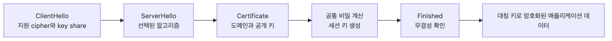

# TLS 기초

이 글은 Computer Networks 101 시리즈의 6번째 글입니다.

## 이 글에서 다룰 문제

- TLS가 보장하는 세 가지는 무엇일까요?
- 핸드셰이크는 어떤 순서로 진행될까요?
- 인증서, CA, 체인, trust store는 어떤 관계일까요?
- TLS 1.2와 TLS 1.3은 무엇이 달라졌을까요?

> TLS는 한 번에 세 가지 기술을 엮습니다. 비대칭 암호는 신원 확인과 키 합의를 맡고, 대칭 암호는 빠른 데이터 암호화를 맡고, AEAD는 무결성을 보장합니다. 여기에 인증서와 PKI가 붙어 "이 공개 키가 정말 이 도메인의 것"임을 증명합니다.

## 왜 중요한가

TLS를 머릿속에 그리지 못하면 인증서 만료 사고가 생겼을 때 손을 대기 어렵고, self-signed 인증서를 그냥 무시하는 위험한 코드도 쉽게 들어갑니다. mTLS, 서비스 메시, zero-trust 같은 현대 인프라는 TLS를 기본 전제로 삼습니다. "왜 안전한가"를 자기 언어로 설명하지 못하면 보안 설계는 금세 관성에 휩쓸립니다.

> TLS는 "이 채널이 안전하다"는 막연한 말이 아니라, "이 키가 정말 이 도메인 것이고 그 키로만 풀 수 있다"는 조합입니다.

## 핵심 그림


*TLS는 인증서로 신원을 확인하고, 그 결과로 만든 대칭 세션 키로 이후 데이터를 빠르게 보호합니다.*

비대칭 합의로 대칭 세션 키를 만들고, 그 뒤부터는 그 키로 빠르게 데이터를 암호화합니다.

## 핵심 용어

| 용어 | 의미 |
| --- | --- |
| 대칭 암호 | 같은 키로 암호화와 복호화를 하는 방식 |
| 비대칭 암호 | 공개 키와 개인 키 쌍을 쓰는 방식 |
| AEAD | 암호화와 무결성 검증을 함께 제공하는 방식 |
| 인증서 | 공개 키와 도메인을 묶고 서명을 붙인 문서 |
| CA | 인증서에 서명하는 신뢰 기관 |
| 체인 | 서버 인증서에서 중간 CA, 루트 CA로 이어지는 검증 경로 |

## Before / After

**Before — "https면 그냥 안전하다"**

```text
브라우저 자물쇠가 보이면 끝.
```

**After — "TLS는 키, 신원, 무결성을 함께 묶는다"**

```text
- 누구의 키인가?            → certificate signed by a CA
- 누가 복호화할 수 있는가? → symmetric session key
- 중간에 변조되지 않았는가? → AEAD / MAC
```

## 단계별로 따라하기

### 1단계: 인증서 들여다보기

```bash
echo | openssl s_client -connect example.com:443 -servername example.com 2>/dev/null \
  | openssl x509 -noout -subject -issuer -dates
# subject= /CN=*.example.com
# issuer = /CN=DigiCert Global G2
# notBefore=...  notAfter=...
```

### 2단계: 인증서 체인 확인하기

```bash
openssl s_client -showcerts -connect example.com:443 -servername example.com </dev/null
# every certificate in the chain is printed
```

브라우저는 이 체인을 루트 CA까지 따라 올라가며 서명을 검증합니다.

### 3단계: Python에서 안전하게 호출하기

```python
import ssl, socket

ctx = ssl.create_default_context()   # uses the OS trust store
with socket.create_connection(('example.com', 443)) as s:
    with ctx.wrap_socket(s, server_hostname='example.com') as ts:
        print(ts.version())          # TLSv1.3
        print(ts.getpeercert()['subject'])
```

### 4단계: self-signed 인증서 만들기

```bash
openssl req -x509 -newkey rsa:2048 -nodes -days 1 \
  -subj "/CN=localhost" -keyout key.pem -out cert.pem
```

```python
# Flask + TLS
from flask import Flask
app = Flask(__name__)

@app.get('/')
def home(): return 'hello'

if __name__ == '__main__':
    app.run(ssl_context=('cert.pem', 'key.pem'), port=8443)
```

```bash
curl -k https://localhost:8443/    # -k allows self-signed (learning only)
```

### 5단계: 만료와 위장 사례 보기

```bash
curl -v https://expired.badssl.com/        # expired
curl -v https://wrong.host.badssl.com/     # name mismatch
curl -v https://untrusted-root.badssl.com/ # untrusted root
```

어느 검증 단계가 실패했는지 메시지로 바로 확인할 수 있습니다.

## 이 코드에서 먼저 볼 점

- trust store는 운영 체제나 브라우저가 신뢰하는 루트 CA 목록입니다.
- 인증서는 키, 도메인, 만료일, 서명을 함께 담는 문서입니다.
- self-signed 인증서는 학습용일 뿐이고, 운영에서는 공인 CA를 사용합니다.
- TLS 버전과 cipher 선택은 보안 수준에 직접 영향을 줍니다.

## 자주 하는 실수 5가지

| 실수 | 문제 | 해결 |
| --- | --- | --- |
| `verify=False`나 `-k`를 운영에서 사용 | MITM 공격에 노출 | 신뢰할 수 있는 CA 인증서를 사용한다 |
| 인증서 만료 모니터링이 없음 | 갑작스러운 장애 | 만료 30일 전 알림을 자동화한다 |
| 중간 인증서 누락 | 일부 클라이언트 검증 실패 | full chain을 배포한다 |
| 약한 cipher나 오래된 TLS 허용 | 알려진 공격에 노출 | TLS 1.2+와 안전한 cipher만 사용한다 |
| SAN에 필요한 도메인이 없음 | 일부 브라우저가 차단 | 필요한 도메인을 SAN에 모두 넣는다 |

## 실무에서는 이렇게 보입니다

- 웹과 모바일은 Let's Encrypt와 자동 갱신을 널리 사용합니다.
- 마이크로서비스는 mTLS로 서비스 간 신원을 검증합니다.
- 메시지 큐와 DB 클라이언트도 TLS 옵션을 켜는 것이 기본입니다.
- VPN과 QUIC에서도 TLS는 핵심 구성 요소입니다.
- IoT는 제조 단계에서 클라이언트 인증서를 발급하기도 합니다.

## 시니어 엔지니어는 이렇게 생각합니다

시니어 엔지니어는 TLS를 단순한 암호화 스위치가 아니라 키 관리 시스템으로 봅니다. 인증서 갱신 주기, 개인 키 보호, 어떤 루트 CA를 신뢰할지, mTLS 정책을 어떻게 배포할지 같은 운영 문제가 알고리즘 선택만큼 중요하다는 것을 잘 압니다.

또한 "암호화했으니 안전하다"는 단순한 결론을 경계합니다. 어떤 키가 유출되면 누가 무엇을 볼 수 있는지, 메타데이터는 어디까지 노출되는지까지 함께 그려 봅니다.

## 체크리스트

- [ ] TLS의 세 가지 보장을 설명할 수 있다
- [ ] 인증서, CA, 체인, trust store의 관계를 안다
- [ ] 핸드셰이크의 큰 흐름을 그릴 수 있다
- [ ] 운영에서 `verify=False`를 쓰지 않는다
- [ ] 인증서 만료를 자동 모니터링한다

## 연습 문제

1. 좋아하는 사이트의 인증서를 `openssl`로 확인하고 issuer, 만료일, SAN 목록을 적어 보세요.
2. self-signed 인증서로 로컬 HTTPS 서버를 띄운 뒤, Python `ssl` 모듈로 성공하는 호출과 실패하는 호출을 각각 만들어 보세요.
3. "zero-trust 인프라에서 mTLS가 왜 중요한가"를 한 단락으로 설명해 보세요.

## 정리와 다음 글

TLS는 비대칭 암호로 신원 확인과 키 합의를 하고, 대칭 암호로 빠른 데이터 암호화를 하며, AEAD로 무결성을 보장합니다. 인증서와 PKI는 그 키가 정말 해당 도메인의 것임을 증명합니다. 이 그림이 잡히면 HTTPS 관련 사고가 한 자리에서 정리되기 시작합니다.

다음 글에서는 이 TLS로 보호된 패킷이 인터넷에서 어떻게 이동하는지, 라우팅과 NAT를 다룹니다.

<!-- toc:begin -->
- [네트워크란 무엇인가?](./01-what-is-a-network.md)
- [IP와 subnet](./02-ip-and-subnet.md)
- [TCP와 UDP](./03-tcp-and-udp.md)
- [DNS](./04-dns.md)
- [HTTP와 HTTPS](./05-http-and-https.md)
- **TLS 기초 (현재 글)**
- 라우팅과 NAT (예정)
- Load Balancer (예정)
- WebSocket과 실시간 통신 (예정)
- 네트워크 문제 디버깅 (예정)
<!-- toc:end -->

## 참고 자료

- [RFC 8446 — TLS 1.3](https://www.rfc-editor.org/rfc/rfc8446)
- [Mozilla SSL Configuration Generator](https://ssl-config.mozilla.org/)
- [Let's Encrypt](https://letsencrypt.org/)
- [Bulletproof TLS — Ivan Ristic](https://www.feistyduck.com/books/bulletproof-tls-and-pki/)
- [RFC 5280 — PKIX Certificate and CRL Profile](https://www.rfc-editor.org/rfc/rfc5280)

Tags: Computer Science, 네트워크, TLS, 인증서, 암호화, PKI
