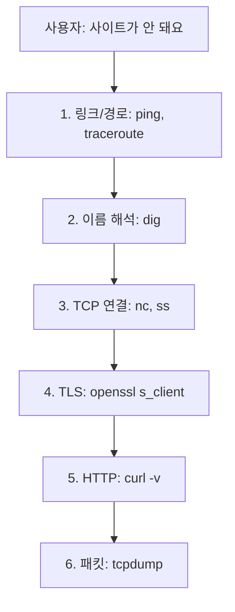

# 네트워크 문제 디버깅

> Computer Networks 101 시리즈 (10/10)


## 이 글에서 다룰 문제

장애 시간에 사람의 첫 본능은 "최근에 무엇을 바꿨지?"이지만, 그것만으로는 부족합니다. 어디서 끊기는지를 모른 채 코드를 뒤지면 시간만 흐릅니다. 계층을 따라가며 "여기까지는 멀쩡하다"를 한 칸씩 확정하는 습관이 있으면, 새벽 호출에서도 침착하게 범인을 좁힐 수 있습니다.

> 디버깅은 "어디가 잘못됐는지" 찾는 일이라기보다 "어디까지는 멀쩡한지"를 확정해 가는 일입니다.

## 전체 흐름


위에서 아래로 내려가면서, 각 층에서 **"여기는 정상"**임을 확정하면 가설 공간이 절반씩 줄어듭니다.

## Before/After

**Before — 추측 기반 디버깅**

```text
서비스가 안 된다
→ 코드 변경 사항을 확인한다
→ 의심되는 라이브러리를 다시 설치한다
→ 서버를 재시작한다
→ 여전히 안 된다
→ 1시간 경과
```

어디가 끊겼는지를 모른 채 손이 가는 곳부터 만지면, 운이 좋아야 고쳐집니다.

**After — 계층을 따라 좁히기**

```bash
# 1) 호스트가 살아 있나? (링크/경로)
ping -c 3 api.example.com

# 2) 이름이 풀리나? (DNS)
dig +short api.example.com

# 3) 포트가 열려 있나? (TCP)
nc -vz api.example.com 443

# 4) TLS 핸드셰이크가 되나? (TLS)
openssl s_client -connect api.example.com:443 -servername api.example.com </dev/null

# 5) HTTP 응답은 어떤가? (HTTP)
curl -v https://api.example.com/health
```

각 줄이 다음 가설을 죽이거나 살립니다. 이 다섯 줄로 보통 80%가 결정납니다.

## 5단계로 한 요청을 끝까지 따라가기

### 1단계 — 링크와 경로 확인

```bash
ping -c 3 api.example.com
traceroute api.example.com   # 또는 mtr api.example.com
```

`ping`이 100% loss면 호스트가 죽었거나 ICMP가 차단된 것입니다. 일부만 loss면 경로 어디인가가 혼잡할 수 있고, `traceroute`로 어느 hop에서 끊기는지 봅니다. ICMP가 막혀 있어도 다음 단계로 넘어갈 수 있다는 점은 기억해 두세요.

### 2단계 — DNS가 정상인지

```bash
dig +short api.example.com
# 1.2.3.4

dig +trace api.example.com   # 전체 위임 체인을 따라가며 어디서 막히는지 확인
```

여기서 빈 결과가 나오면 더 내려갈 필요가 없습니다. 응용 코드의 문제가 아니라 DNS의 문제입니다. `/etc/resolv.conf`와 사내 DNS 서버를 의심합니다.

### 3단계 — TCP 연결이 되는지

```bash
nc -vz api.example.com 443
# Connection to api.example.com port 443 [tcp/https] succeeded!
```

세 가지 결과를 구분하세요.

- **succeeded**: 포트가 열려 있고 SYN/SYN-ACK가 오갑니다. 다음 층으로.
- **Connection refused**: 호스트는 살아 있지만 듣는 프로세스가 없습니다. 서비스가 죽었거나 잘못된 포트입니다.
- **timeout**: SYN에 응답이 없습니다. 보통 방화벽이 조용히 패킷을 버리는 경우입니다.

서버 쪽이라면 `ss -tlnp`로 실제로 무엇이 듣고 있는지 확인합니다.

```bash
ss -tlnp | grep :443
# LISTEN 0 511 0.0.0.0:443  users:(("nginx",pid=1234,fd=6))
```

### 4단계 — TLS 핸드셰이크 확인

```bash
openssl s_client -connect api.example.com:443 \
                 -servername api.example.com </dev/null
```

핵심은 `-servername`(SNI)입니다. SNI 없이 시도하면 가상 호스트가 잘못된 인증서를 줄 수 있어 진짜 문제를 가립니다. `Verify return code: 0 (ok)`가 보이면 TLS는 정상이고, 그 외엔 인증서 만료/체인 누락/이름 불일치를 의심합니다.

### 5단계 — HTTP 응답을 사람의 눈으로

```bash
curl -v https://api.example.com/health
```

`-v`가 핵심입니다. DNS 결과, TCP 연결, TLS 협상, 요청 헤더, 응답 헤더를 한 번에 보여 줍니다. 응답이 4xx/5xx면 더 이상 네트워크 문제가 아니라 응용 문제입니다. 여기까지 와서 정상이면 보통 클라이언트 쪽 환경에 의심이 옮겨갑니다.

## 이 코드에서 주목할 점

- 도구마다 잘라 내는 가설이 다릅니다. `ping`은 링크, `dig`는 이름, `nc`는 포트, `openssl`은 인증서, `curl`은 응용 동작입니다.
- "어디까지 정상"을 출력으로 확정하는 것이 핵심입니다. 마음속 추측은 도구의 출력보다 약합니다.
- ICMP 차단된 환경(많은 클라우드 보안 그룹)에서는 `ping` 실패가 호스트 사망을 의미하지 않습니다. `nc`와 `curl`로 보조합니다.
- `curl -v` 한 줄로 1~5단계 정보를 거의 다 얻을 수 있다는 점은 자주 잊혀집니다.

## 자주 하는 실수 5가지

1. **DNS를 건너뛴다.** "코드는 그대로인데 갑자기 안 된다"의 큰 원인은 보통 DNS(만료, 캐시, 변경)입니다. 가장 먼저 의심하세요.
2. **timeout과 refused를 같은 문제로 본다.** refused는 호스트가 살아 있다는 강한 증거이고, timeout은 보통 방화벽 문제입니다. 다음 행동이 완전히 다릅니다.
3. **`openssl s_client`에서 `-servername`을 빼먹는다.** SNI 없는 연결은 잘못된 인증서를 가져와 가짜 오류를 만듭니다.
4. **tcpdump를 가장 먼저 켠다.** 좋은 도구지만 가설이 없는 캡처는 그저 큰 파일입니다. 위 5단계로 좁힌 다음에 마지막 무기로 씁니다.
5. **재시작이 고친 것을 "고쳤다"고 적는다.** 재시작이 증상을 가렸다면, 다음 새벽에 또 일어납니다. 무엇이 풀렸는지 가설을 적어 둬야 합니다.

## 실무에서는 이렇게 쓰입니다

장애 대응실에서는 보통 두 사람이 동시에 움직입니다. 한 명은 외부에서 사용자 시점으로 위 5단계를 돌리고, 다른 한 명은 서버 쪽에서 `ss`, 로그, `tcpdump`로 안에서 봅니다. 양쪽이 본 것을 5분 단위로 합쳐 가설을 좁힙니다.

`tcpdump`는 마지막 무기입니다. 정말로 "패킷이 들어오긴 하는가"를 확인해야 할 때 씁니다. capture filter로 좁히지 않으면 디스크가 빠르게 찹니다.

```bash
sudo tcpdump -i eth0 -n -s 0 'host api.example.com and tcp port 443' -w cap.pcap
```

수집한 pcap은 Wireshark에서 열어, retransmit이 보이면 경로 손실, RST가 보이면 방화벽이나 서버 거절, FIN만 보이면 정상 종료로 해석합니다. 이 시리즈에서 배운 TCP 상태와 TLS 핸드셰이크 지식이 그대로 도움이 됩니다.

## 체크리스트

- [ ] 호스트가 살아 있는지 확인했는가? (`ping`, 또는 `nc`로 대체)
- [ ] DNS가 정상인지 확인했는가? (`dig +short`)
- [ ] TCP 연결이 되는지 확인했는가? (`nc -vz`)
- [ ] TLS 핸드셰이크가 정상인지 확인했는가? (`openssl s_client -servername`)
- [ ] HTTP 응답을 직접 확인했는가? (`curl -v`)
- [ ] 가설이 막힐 때만 `tcpdump`를 켰는가?

## 정리 및 다음 단계

네트워크 디버깅은 결국 **계층을 따라 가설을 죽이는 일**입니다. ping → dig → nc → openssl → curl, 이 다섯 줄이면 대부분 어디가 문제인지 1분 안에 결정됩니다. 여기서 막혀야 비로소 tcpdump를 꺼냅니다.

이로써 Computer Networks 101 시리즈를 마칩니다. 1편의 "네트워크란 무엇인가"부터 IP, TCP, DNS, HTTP, TLS, 라우팅, 로드밸런서, WebSocket, 그리고 디버깅까지 — 한 사이트에 접속할 때 안에서 일어나는 일을 한 바퀴 살펴봤습니다. 다음에 새벽에 호출이 와도 침착하게 첫 다섯 줄을 칠 수 있기를 바랍니다.

<!-- toc:begin -->
- [네트워크란 무엇인가?](./01-what-is-a-network.md)
- [IP와 subnet](./02-ip-and-subnet.md)
- [TCP와 UDP](./03-tcp-and-udp.md)
- [DNS](./04-dns.md)
- [HTTP와 HTTPS](./05-http-and-https.md)
- [TLS 기초](./06-tls-basics.md)
- [라우팅과 NAT](./07-routing-and-nat.md)
- [Load Balancer](./08-load-balancer.md)
- [WebSocket과 실시간 통신](./09-websocket-and-realtime.md)
- **네트워크 문제 디버깅 (현재 글)**
<!-- toc:end -->

## 참고 자료

- [tcpdump Manual](https://www.tcpdump.org/manpages/tcpdump.1.html)
- [Wireshark User's Guide](https://www.wireshark.org/docs/wsug_html_chunked/)
- [`ss(8)` Linux Manual](https://man7.org/linux/man-pages/man8/ss.8.html)
- [Julia Evans — Networking debugging zines](https://wizardzines.com/zines/networking/)

Tags: Computer Science, 네트워크, 디버깅, tcpdump, 트러블슈팅, 진단
