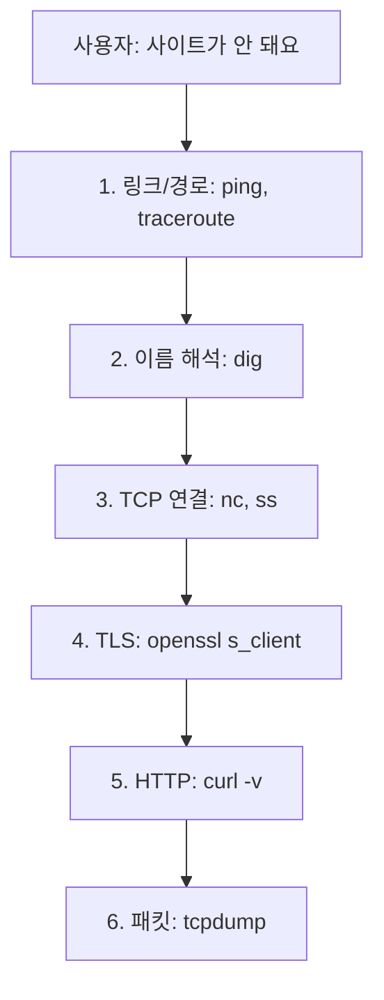

# 네트워크 문제 디버깅

이 글은 Computer Networks 101 시리즈의 마지막 글입니다.

## 이 글에서 다룰 문제

- 네트워크 문제를 계층별로 어떻게 좁혀 가야 할까요?
- `ping`, `dig`, `curl`, `ss`, `tcpdump`는 각각 무엇을 말해 줄까요?
- timeout, reset, DNS 실패는 어떤 모양으로 구분할 수 있을까요?
- 시리즈 전체에서 배운 내용은 장애 상황에서 어떻게 합쳐질까요?

> 네트워크 디버깅은 감으로 찍는 작업이 아닙니다. 링크 → 라우팅 → DNS → TCP → TLS → HTTP 순서로 내려가며 가설을 하나씩 지우는 과정입니다. 짧은 명령 다섯 줄만으로도 1분 안에 어느 층이 문제인지 대개 판별할 수 있습니다.

## 왜 중요한가

장애가 나면 사람은 먼저 "방금 뭘 바꿨지"를 떠올립니다. 그 질문은 필요하지만 충분하지 않습니다. 경로가 어디서 끊겼는지 모르면 코드 변경도 결국 추측이 됩니다. "여기까지는 정상"을 한 층씩 확정하는 습관이 있어야 새벽 장애에서도 침착하게 원인을 좁힐 수 있습니다.

> 디버깅의 핵심은 고장 난 곳을 바로 찾는 것이 아니라, 멀쩡한 층을 하나씩 확정해 가는 일입니다.

## 핵심 그림



한 단계씩 정상으로 판정할 때마다 가능한 원인 후보가 크게 줄어듭니다.

## 핵심 용어

- **ICMP**: `ping`, `traceroute`가 사용하는 진단용 IP 프로토콜
- **RTT**: 패킷이 목적지까지 갔다가 돌아오는 데 걸리는 시간
- **Connection refused**: 호스트는 살아 있으나 해당 포트에서 듣는 프로세스가 없는 상태
- **RST**: TCP가 즉시 연결을 끊겠다고 알리는 신호
- **Capture filter**: `tcpdump`가 필요한 패킷만 잡도록 주는 BPF 표현식

## Before/After

**Before — 추측 기반 디버깅**

```text
service is down
→ 최근 커밋 확인
→ 의심 라이브러리 재설치
→ 서버 재시작
→ 여전히 안 됨
→ 한 시간 경과
```

어디서 끊겼는지 모른 채 손 가는 대로 만지면, 운 좋을 때만 해결됩니다.

**After — 계층별로 좁혀 가기**

```bash
# 1) Is the host alive? (link / path)
ping -c 3 api.example.com

# 2) Does the name resolve? (DNS)
dig +short api.example.com

# 3) Is the port open? (TCP)
nc -vz api.example.com 443

# 4) Does the TLS handshake complete? (TLS)
openssl s_client -connect api.example.com:443 -servername api.example.com </dev/null

# 5) What does HTTP return? (HTTP)
curl -v https://api.example.com/health
```

각 줄은 다음 가설을 지우거나 남깁니다. 대부분의 경우 다섯 줄이면 층이 갈립니다.

## 5단계로 한 요청을 끝까지 따라가기

### 1단계 — 링크와 경로 확인

```bash
ping -c 3 api.example.com
traceroute api.example.com   # or mtr api.example.com
```

손실이 100%면 호스트가 죽었거나 ICMP가 차단됐을 가능성이 큽니다. 일부 손실이면 경로 어딘가가 혼잡할 수 있습니다. 다만 ICMP는 차단돼도 서비스는 정상일 수 있으니 `ping` 실패만으로 단정하면 안 됩니다.

### 2단계 — DNS 확인

```bash
dig +short api.example.com
# 1.2.3.4

dig +trace api.example.com   # walks the delegation chain
```

여기서 결과가 없으면 더 아래 층으로 내려갈 필요가 없습니다. 애플리케이션이 아니라 resolver 설정이나 authoritative 레코드를 먼저 봐야 합니다.

### 3단계 — TCP 연결 확인

```bash
nc -vz api.example.com 443
# Connection to api.example.com port 443 [tcp/https] succeeded!
```

세 가지 결과를 구분해야 합니다.

- **succeeded**: 포트가 열려 있고 SYN/SYN-ACK 교환이 끝났습니다. 다음 단계로 갑니다.
- **Connection refused**: 호스트는 살아 있지만 듣는 프로세스가 없습니다. 서비스가 죽었거나 포트가 틀렸을 수 있습니다.
- **timeout**: SYN에 응답이 없습니다. 대개 방화벽이 조용히 버리는 경우입니다.

서버 쪽에서는 실제로 어떤 포트가 열려 있는지도 함께 확인합니다.

```bash
ss -tlnp | grep :443
# LISTEN 0 511 0.0.0.0:443  users:(("nginx",pid=1234,fd=6))
```

### 4단계 — TLS 핸드셰이크 확인

```bash
openssl s_client -connect api.example.com:443 \
                 -servername api.example.com </dev/null
```

핵심은 `-servername`입니다. SNI 없이 연결하면 잘못된 인증서를 받고 엉뚱한 오류를 추적할 수 있습니다. `Verify return code: 0 (ok)`가 나오면 TLS 층은 정상입니다.

### 5단계 — HTTP 응답을 직접 보기

```bash
curl -v https://api.example.com/health
```

`-v`는 DNS, TCP 연결, TLS 협상, 요청 헤더, 응답 헤더를 한 번에 보여 줍니다. 여기서 4xx나 5xx가 나오면 더 이상 네트워크 문제가 아니라 애플리케이션 문제일 가능성이 큽니다.

## 이 코드에서 먼저 볼 점

- 각 도구는 서로 다른 가설을 제거합니다. `ping`은 링크, `dig`는 이름, `nc`는 포트, `openssl`은 인증서, `curl`은 애플리케이션 동작을 확인합니다.
- 중요한 일은 출력으로 "여기까지는 정상"을 확정하는 것입니다.
- 많은 클라우드 환경에서 ICMP는 차단됩니다. `ping` 실패가 곧 호스트 다운은 아닙니다.
- `curl -v` 한 줄이 1~5단계의 상당 부분을 같이 보여 준다는 점을 종종 놓칩니다.

## 자주 하는 실수 5가지

1. **DNS를 건너뜁니다.** 코드 변경이 없는데 갑자기 안 되는 문제는 생각보다 자주 DNS입니다.
2. **timeout과 refused를 같은 문제로 봅니다.** refused는 호스트가 살아 있다는 뜻이고, timeout은 보통 방화벽 문제입니다. 다음 조치가 완전히 달라집니다.
3. **`openssl s_client`에서 `-servername`을 빼먹습니다.** SNI가 없으면 잘못된 가상 호스트 인증서를 받아 가짜 오류를 추적하게 됩니다.
4. **가설 없이 `tcpdump`부터 켭니다.** 캡처는 강력하지만, 방향 없는 큰 파일이 되기 쉽습니다.
5. **재시작을 해결이라고 기록합니다.** 재시작은 증상을 숨겼을 뿐일 수 있습니다. 무엇이 검증됐는지 남겨야 다음 사고에서 이깁니다.

## 실무에서는 이렇게 보입니다

장애 대응에서는 보통 두 사람이 병렬로 움직입니다. 한 사람은 외부에서 사용자 시점으로 다섯 단계를 실행하고, 다른 사람은 서버 안쪽에서 `ss`, 로그, `tcpdump`를 봅니다. 몇 분 간격으로 결과를 맞춰 보면 가설 공간이 빠르게 줄어듭니다.

`tcpdump`는 마지막 무기입니다. 정말로 "패킷이 서버까지 오기는 하는가"가 필요할 때만 꺼내는 편이 좋습니다.

```bash
sudo tcpdump -i eth0 -n -s 0 'host api.example.com and tcp port 443' -w cap.pcap
```

생성된 `cap.pcap`은 Wireshark에서 열 수 있습니다. retransmit은 경로 손실을, RST는 방화벽 또는 강한 서버 거절을, clean FIN은 정상 종료를 시사합니다.

## 시니어 엔지니어는 이렇게 생각합니다

- 도구보다 먼저 가설을 적고, 도구로 그 가설을 지웁니다.
- 클라이언트와 서버 두 관점에서 동시에 디버깅합니다.
- "재시작하니 됐다"는 말을 믿지 않습니다. 다음 주 같은 증상이 반복될 것을 전제로 기록합니다.
- 새벽에 검색하지 않아도 되도록 다섯 개 명령 세트를 외워 둡니다.
- 사고가 끝나면 짧은 포스트모템이라도 남겨 다음 사람의 시간을 줄입니다.

## 체크리스트

- [ ] 호스트 생존 여부를 확인했는가? (`ping` 또는 `nc`)
- [ ] DNS가 정상인지 확인했는가? (`dig +short`)
- [ ] TCP 연결이 되는지 확인했는가? (`nc -vz`)
- [ ] TLS 핸드셰이크가 정상인지 확인했는가? (`openssl s_client -servername`)
- [ ] HTTP 응답을 직접 봤는가? (`curl -v`)
- [ ] 더 단순한 도구가 다 소진된 뒤에만 `tcpdump`를 켰는가?

## 연습 문제

1. `nc -vz host port`가 `Connection refused`를 반환할 때와 `timeout`을 반환할 때, 다음 행동을 한 줄씩 적어 보세요.
2. 사용자가 "사이트가 갑자기 안 된다"고 했을 때 실행할 다섯 명령과, 각각 어떤 출력이 나와야 다음 단계로 갈지 적어 보세요.
3. `api.example.com`의 443 포트 트래픽만 `cap.pcap`으로 저장하는 `tcpdump` 명령을 직접 써 보세요.

## 정리와 다음 글

네트워크 디버깅의 본질은 계층을 따라 내려가며 가설을 하나씩 지우는 일입니다. `ping`, `dig`, `nc`, `openssl s_client`, `curl -v` 다섯 줄이면 대부분 1분 안에 문제 층이 갈립니다. 그 뒤에야 `tcpdump`를 꺼내면 됩니다.

이로써 Computer Networks 101 시리즈를 마칩니다. 네트워크의 개념에서 시작해 IP, TCP, DNS, HTTP, TLS, 라우팅, 로드밸런서, WebSocket, 그리고 디버깅까지 한 바퀴를 돌았습니다. 다음에 새벽 호출이 오더라도, 첫 다섯 줄은 머뭇거리지 않고 떠올릴 수 있기를 바랍니다.

<!-- toc:begin -->
- [네트워크란 무엇인가?](./01-what-is-a-network.md)
- [IP와 subnet](./02-ip-and-subnet.md)
- [TCP와 UDP](./03-tcp-and-udp.md)
- [DNS](./04-dns.md)
- [HTTP와 HTTPS](./05-http-and-https.md)
- [TLS 기초](./06-tls-basics.md)
- [라우팅과 NAT](./07-routing-and-nat.md)
- [Load Balancer](./08-load-balancer.md)
- [WebSocket과 실시간 통신](./09-websocket-and-realtime.md)
- **네트워크 문제 디버깅 (현재 글)**
<!-- toc:end -->

## 참고 자료

- [tcpdump Manual](https://www.tcpdump.org/manpages/tcpdump.1.html)
- [Wireshark User's Guide](https://www.wireshark.org/docs/wsug_html_chunked/)
- [`ss(8)` Linux Manual](https://man7.org/linux/man-pages/man8/ss.8.html)
- [Julia Evans — Networking debugging zines](https://wizardzines.com/zines/networking/)

Tags: Computer Science, 네트워크, 디버깅, tcpdump, 트러블슈팅, 진단
