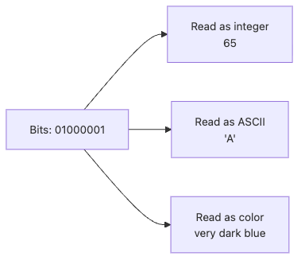

# Data Representation

People often say that computers only understand 0 and 1, but that sentence does not become useful until you can connect it to real bugs. Garbled text, wrong money totals, and surprising overflows all start to make sense once you understand how raw bits get meaning.

This is post 3 in the Computer Science 101 series.

In this article, we'll walk through bits and bytes, character encoding, signed integers, and floating-point limits so you can reason from representation to behavior.

## Questions This Article Answers

- How does a computer store numbers, text, and images using only 0 and 1?
- Why do ASCII and UTF-8 use different byte counts?
- Why are negative integers usually represented with two's complement?
- Why does `0.1 + 0.2 != 0.3` happen in real programs?
- What kinds of bugs appear when you confuse character length with byte length?

## What You Will Learn

- How to convert between binary and decimal
- ASCII and UTF-8 character encodings
- How signed integers are represented (two's complement)
- How floating point works and why precision is limited

## Why It Matters

Garbled characters, floating-point error, and integer overflow are all problems you cannot fix without understanding data representation. You need to know why `0.1 + 0.2 != 0.3` before you can design a financial system correctly.

> Data representation = the physics of the digital world.

Bit-level understanding is the foundation of debugging and performance work.

## Concept at a Glance

> Every piece of data is a sequence of bits (0/1). Encoding rules give meaning to the bits.


*The same bit sequence changes meaning depending on the decoding rule*

## Key Terms

| Term | Description |
| --- | --- |
| Bit | The smallest unit, storing 0 or 1 |
| Byte | A group of 8 bits |
| ASCII | A 7-bit standard for encoding English characters |
| UTF-8 | A variable-length encoding for the world's characters using 1-4 bytes |
| Floating point | An approximate representation of decimals defined by IEEE 754 |

## Before / After

**Before — without representation knowledge:**

```python
# Why isn't 0.1 + 0.2 equal to 0.3?
result = 0.1 + 0.2
print(result)          # 0.30000000000000004
print(result == 0.3)   # False — and you do not know why
```

**After — with representation knowledge:**

```python
from decimal import Decimal

# Floating point is a binary approximation; use Decimal for exact arithmetic.
result = Decimal("0.1") + Decimal("0.2")
print(result)              # 0.3
print(result == Decimal("0.3"))  # True
```

**Expected output:** the `float` version should show `0.30000000000000004`, while the `Decimal` version should print an exact `0.3`.

## Hands-On: Step by Step

### Step 1: Binary and decimal conversion

```python
# Decimal -> binary
print(bin(42))      # 0b101010
print(bin(255))     # 0b11111111

# Binary -> decimal
print(int("101010", 2))   # 42
print(int("11111111", 2)) # 255


# Verify the conversion principle in code
def to_binary(n: int) -> str:
    """Convert a decimal integer to a binary string."""
    if n == 0:
        return "0"
    bits = []
    while n > 0:
        bits.append(str(n % 2))
        n //= 2
    return "".join(reversed(bits))


print(to_binary(42))  # 101010
```

### Step 2: ASCII and UTF-8

```python
# ASCII: one byte per English character
print(ord("A"))        # 65
print(chr(65))         # A
print(ord("a"))        # 97

# UTF-8: a Korean character takes three bytes
korean = "가"
print(ord(korean))                  # 44032
print(korean.encode("utf-8"))       # b'\xea\xb0\x80' (3 bytes)
print(len(korean))                  # 1 (character count)
print(len(korean.encode("utf-8")))  # 3 (byte count)

# Emoji: four bytes
emoji = "🐍"
print(len(emoji))                   # 1 (character count)
print(len(emoji.encode("utf-8")))   # 4 (byte count)
```

### Step 3: Integer size and two's complement

```python
# Python integers have no size limit (arbitrary precision)
big_number = 2 ** 100
print(big_number)  # 1267650600228229401496703205376

# But C, Java, and others use fixed sizes
# 8-bit signed: -128 to 127
# 32-bit signed: -2,147,483,648 to 2,147,483,647

# Two's complement represents negatives
def twos_complement(n: int, bits: int = 8) -> str:
    """Return the two's-complement representation of n."""
    if n >= 0:
        return format(n, f"0{bits}b")
    return format((1 << bits) + n, f"0{bits}b")


print(twos_complement(5))    # 00000101
print(twos_complement(-5))   # 11111011
print(twos_complement(-1))   # 11111111
```

### Step 4: The limits of floating point

```python
import struct

# Inspect the actual stored value of 0.1
print(f"{0.1:.20f}")  # 0.10000000000000000555

# IEEE 754 double-precision bit pattern
bits = struct.pack("d", 0.1)
print(" ".join(f"{b:08b}" for b in bits))

# Compare with a tolerance
import math
print(math.isclose(0.1 + 0.2, 0.3))  # True

# For money, use Decimal or integer cents
price_cents = 1099  # $10.99 stored as cents
tax_cents = int(price_cents * 0.1)
total_cents = price_cents + tax_cents
print(f"${total_cents / 100:.2f}")  # $12.09
```

### Step 5: Build intuition for data sizes

```python
data_sizes = {
    "1 bit": 1,
    "1 byte": 8,
    "1 ASCII character": 8,
    "1 UTF-8 Korean char": 24,
    "32-bit int": 32,
    "64-bit double": 64,
    "1 KB": 8 * 1024,
    "1 MB": 8 * 1024 ** 2,
    "1 GB": 8 * 1024 ** 3,
}

for name, bits in data_sizes.items():
    print(f"{name:22s} = {bits:>15,} bits")
```

## Notable Points in This Code

- The same bit sequence can mean a number, a character, or a color depending on interpretation.
- UTF-8 uses a different number of bytes per character, so `len(string) != len(bytes)`.
- Floating point is approximate — never compare directly with `==`.
- Python integers never overflow, but other languages do.

## Five Common Mistakes

| Mistake | Problem | Fix |
| --- | --- | --- |
| Confusing string length with byte length | Wrong slicing of Korean text or emoji | `len()` gives characters; `len(s.encode())` gives bytes |
| Comparing floats with `==` | `0.1 + 0.2 != 0.3` | Use `math.isclose()` |
| Using floats for money | Cent-level errors accumulate | Use `Decimal` or integer cents |
| Reading files without specifying encoding | Garbled characters | Pass `encoding="utf-8"` explicitly |
| Assuming Python-style unbounded integers in other languages | Overflow bugs | Check the integer range per language |

## How This Is Used in Practice

- Setting `charset=utf-8` on the `Content-Type` header in a web API.
- Handling money with `Decimal` or integer cents in financial systems.
- Choosing INT vs BIGINT when picking database column types.
- Detecting BOM (Byte Order Mark) and encoding when processing files.
- Handling byte order (endianness) in network protocols.

## How a Senior Engineer Thinks

Senior engineers pick data types by *meaning and constraints*, not by storage size. Prices live as integer cents, identifiers as UUIDs, timestamps as ISO 8601 in UTC.

Encoding bugs come from not setting a standard early. A simple project-wide rule like "every string is UTF-8" prevents an enormous class of bugs.

## Checklist

- [ ] I can convert between binary and decimal
- [ ] I can explain the difference between ASCII and UTF-8
- [ ] I understand the cause of floating-point error
- [ ] I distinguish character length from byte length
- [ ] I know why floats are unsafe for financial data

## Practice Problems

1. Write a function that converts integers 0 to 255 into binary and hexadecimal. Print the result as a table.

2. Write a program that compares the UTF-8 byte counts of various characters (English, Korean, Japanese, emoji).

3. Add `0.1` together 100 times using both `float` and `Decimal`, and observe the difference.

## Wrap-Up and Next Steps

Every piece of data in a computer is a bit sequence. Encoding rules give bits their meaning. Integers use two's complement, characters use UTF-8, and decimals use IEEE 754 floating point. Knowing each representation's limits is the basis of correct design.

The next article covers algorithms — how to process data efficiently — and complexity, the way we measure their performance.

<!-- toc:begin -->
- [What Is Computer Science?](./01-what-is-computer-science.md)
- [Computation and Programs](./02-computation-and-programs.md)
- **Data Representation (current)**
- [Algorithms and Complexity](./04-algorithms-and-complexity.md)
- [Computer Architecture](./05-computer-architecture.md)
- [Operating Systems](./06-operating-systems.md)
- [Networks](./07-networks.md)
- [Databases](./08-databases.md)
- [Software Engineering](./09-software-engineering.md)
- [From CS to AI and Data Science](./10-ai-and-data-science.md)
<!-- toc:end -->

## References

- [Unicode official site](https://home.unicode.org/)
- [Python docs — Floating Point Arithmetic: Issues and Limitations](https://docs.python.org/3/tutorial/floatingpoint.html)
- [What Every Programmer Should Know About Floating-Point](https://floating-point-gui.de/)
- [Joel Spolsky — The Absolute Minimum About Unicode](https://www.joelonsoftware.com/2003/10/08/the-absolute-minimum-every-software-developer-absolutely-positively-must-know-about-unicode-and-character-sets-no-excuses/)

Tags: Computer Science, Binary, Character Encoding, UTF-8, Floating Point, Data Types
