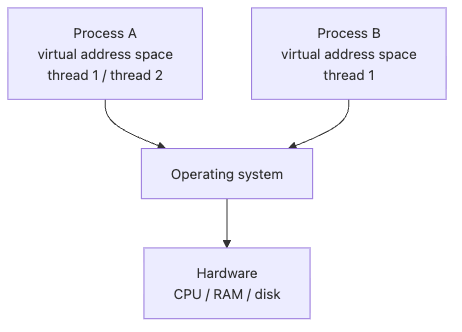

# 운영체제

한 대의 컴퓨터에서 수십 개 프로그램이 동시에 도는 것처럼 보이는 순간, 우리는 이미 운영체제의 추상화 위에서 일하고 있습니다. 웹 서버가 멈추는 이유도, 메모리 누수가 보이는 방식도, 스레드가 기대만큼 빨라지지 않는 이유도 결국 OS 관점으로 돌아옵니다.

이 글은 Computer Science 101 시리즈의 6번째 글입니다.

여기서는 프로세스와 스레드, 가상 메모리, 시스템 콜, 동시성과 병렬성의 차이를 실전 감각으로 정리하겠습니다.

## 이 글에서 다룰 문제

- 하나의 머신에서 많은 프로그램이 동시에 실행되는 것처럼 보이는 이유는 무엇일까요?
- 프로세스와 스레드는 메모리와 격리 측면에서 어떻게 다를까요?
- 가상 메모리는 왜 필요한 추상화일까요?
- 시스템 콜은 사용자 코드와 커널 사이에서 어떤 비용을 만들까요?
- CPU 바운드 작업과 I/O 바운드 작업에서 동시성 전략은 왜 달라질까요?

> 운영체제는 자원 관리자이자 추상화 계층입니다. 프로세스, 메모리, 파일, 네트워크를 균일한 인터페이스로 보이게 만들지만, 병목과 버그는 그 추상화의 경계에서 드러납니다.

## 이 글에서 배울 것

- 프로세스와 스레드의 차이
- 가상 메모리와 주소 공간의 기본 개념
- 시스템 콜과 user/kernel mode 경계
- 동시성·병렬성·GIL의 실무적 의미

## 왜 중요한가

웹 서버가 멈추는 이유, 메모리 누수가 OS에 어떻게 보이는지, 멀티스레딩이 항상 빠르지 않은 이유는 모두 운영체제를 이해해야 답할 수 있습니다.

> 운영체제 = 자원 관리자 + 추상화 계층

OS의 추상화를 모르면 디버깅은 마법이 됩니다.

## 한눈에 보는 개념

> 프로세스는 격리된 실행 단위, 스레드는 같은 프로세스 안에서 메모리를 공유하는 실행 흐름입니다.


*프로세스는 서로 격리되고, 운영체제가 하드웨어 자원을 나눠 배분합니다*

## 핵심 용어

| 용어 | 설명 |
| --- | --- |
| Process | 자기만의 메모리 공간을 가진 실행 단위 |
| Thread | 같은 프로세스 안에서 메모리를 공유하는 실행 흐름 |
| Context switch | OS가 CPU에서 실행할 프로세스나 스레드를 바꾸는 일 |
| Virtual memory | 각 프로세스에 독립적인 연속 주소 공간을 주는 추상화 |
| System call | 사용자 프로그램이 커널 서비스에 요청을 보내는 인터페이스 |
| Scheduler | 누가 CPU를 받을지 결정하는 OS 구성 요소 |

## Before / After

**Before — OS를 의식하지 않은 코드:**

```python
# Fetch 100 URLs sequentially — most of the time is spent waiting
import urllib.request

urls = [f"https://httpbin.org/delay/1?n={i}" for i in range(100)]
results = [urllib.request.urlopen(u).read() for u in urls]
# About 100 seconds — the CPU is idle, just waiting on I/O
```

**After — OS의 비동기 I/O를 활용:**

```python
# Same work, done concurrently — overlap the I/O wait
from concurrent.futures import ThreadPoolExecutor
import urllib.request

def fetch(url: str) -> bytes:
    return urllib.request.urlopen(url).read()

with ThreadPoolExecutor(max_workers=20) as pool:
    results = list(pool.map(fetch, urls))
# About 5-10 seconds — other requests progress while one waits
```

## 단계별로 따라하기

### 1단계: 프로세스와 스레드 만들어 보기

```python
import os
import threading
import multiprocessing

def show_id(label: str) -> None:
    print(f"{label}: pid={os.getpid()}, tid={threading.get_ident()}")

print("[main]")
show_id("main")

print("\n[thread]")
t = threading.Thread(target=show_id, args=("thread",))
t.start()
t.join()

print("\n[process]")
p = multiprocessing.Process(target=show_id, args=("process",))
p.start()
p.join()
```

### 2단계: GIL과 멀티스레딩의 한계

```python
# CPU-bound work does not get faster with threads (CPython GIL)
import time
from concurrent.futures import ThreadPoolExecutor, ProcessPoolExecutor

def cpu_heavy(n: int) -> int:
    total = 0
    for i in range(n):
        total += i * i
    return total

N = 10_000_000
work = [N] * 4

start = time.perf_counter()
[cpu_heavy(n) for n in work]
print(f"sequential : {time.perf_counter() - start:.2f}s")

start = time.perf_counter()
with ThreadPoolExecutor(max_workers=4) as pool:
    list(pool.map(cpu_heavy, work))
print(f"threads x4 : {time.perf_counter() - start:.2f}s")  # roughly the same

start = time.perf_counter()
with ProcessPoolExecutor(max_workers=4) as pool:
    list(pool.map(cpu_heavy, work))
print(f"processes x4: {time.perf_counter() - start:.2f}s")  # about 4x faster
```

**Expected output:** CPU 바운드 작업에서는 `threads x4`가 `sequential`과 비슷하고, `processes x4`가 더 빨라 GIL의 한계가 드러나야 합니다.

### 3단계: 시스템 콜 들여다보기

```python
# Python's open() ultimately calls the OS open(2) system call
import os

fd = os.open("/tmp/oscourse_demo.txt", os.O_CREAT | os.O_WRONLY, 0o644)
os.write(fd, b"Hello from a system call\n")
os.close(fd)

print(open("/tmp/oscourse_demo.txt").read())
os.remove("/tmp/oscourse_demo.txt")
```

### 4단계: 가상 메모리 관찰하기

```python
# Inspect process memory usage (Linux/macOS)
import os
import resource

print(f"PID            : {os.getpid()}")
usage = resource.getrusage(resource.RUSAGE_SELF)
print(f"max RSS (KB)   : {usage.ru_maxrss}")    # peak resident set size
print(f"page faults    : {usage.ru_minflt}")    # page-fault count
```

### 5단계: 동시성 vs 병렬성

```python
# Concurrency = multiple tasks in progress (time-sliced)
# Parallelism = multiple tasks running at the same instant (multi-core)

import asyncio
import time

async def task(name: str, sec: float) -> None:
    print(f"{name} starting")
    await asyncio.sleep(sec)        # simulate I/O wait
    print(f"{name} done")

async def main() -> None:
    start = time.perf_counter()
    await asyncio.gather(task("A", 1), task("B", 1), task("C", 1))
    print(f"total elapsed: {time.perf_counter() - start:.2f}s")  # about 1s

asyncio.run(main())
```

## 이 코드에서 먼저 봐야 할 점

- 프로세스는 메모리를 공유하지 않고, 스레드는 공유합니다
- CPython의 GIL 때문에 CPU 바운드 작업은 스레드보다 프로세스가 유리합니다
- I/O 바운드 작업은 스레드 또는 비동기로 충분히 빨라집니다
- 시스템 콜은 사용자 모드에서 커널 모드로 전환되며 비용이 있습니다

## 자주 하는 실수 5가지

| 실수 | 문제 | 해결 |
| --- | --- | --- |
| CPU 바운드 작업에 스레드 사용 | GIL로 효과 없음 | `multiprocessing` 또는 `ProcessPoolExecutor` |
| 시스템 콜을 한 줄씩 호출 | 컨텍스트 스위치 오버헤드 | 버퍼링·일괄 처리 |
| 자식 프로세스를 `join` 없이 종료 | 좀비 프로세스, 자원 누수 | `with` 문 또는 명시적 `join`/`wait` |
| 스레드 간 공유 변수 무방어 | 경쟁 조건(race condition) | `threading.Lock`, 큐 기반 패턴 |
| 메모리 사용량을 RSS만 보고 판단 | 가상 메모리·공유 메모리 무시 | `pmap`, `smem` 등 도구로 분해 |

## 실무에서는 이렇게 쓰입니다

- 웹 서버에서 워커 프로세스 + 비동기 이벤트 루프 (Gunicorn + Uvicorn)
- 컨테이너(cgroup) 기반 자원 격리와 OOM Killer 동작 이해
- 데이터 파이프라인의 멀티프로세싱 vs 분산 처리 선택
- 디버깅 도구(`strace`, `dtruss`, `perf`)로 시스템 콜·스케줄링 분석
- 서비스 메모리 누수 분석에서 RSS, swap, page fault 추세 모니터링

## 시니어 엔지니어는 이렇게 생각합니다

시니어 엔지니어는 먼저 병목이 CPU인지 I/O인지부터 묻습니다. CPU 바운드라면 알고리즘과 병렬성을, I/O 바운드라면 async·스레드·큐잉을 먼저 생각합니다.

또한 운영체제 추상화가 완전하지 않다는 사실을 압니다. 가상 메모리는 무한해 보이지만 실제 RAM과 swap에는 한계가 있고, 파일 시스템은 단순한 폴더 트리처럼 보여도 inode와 mount 경계가 있습니다. 운영 버그는 늘 그 가장자리에서 커집니다.

## 체크리스트

- [ ] 프로세스와 스레드의 차이를 메모리 관점에서 설명할 수 있는가
- [ ] CPython GIL이 무엇이고 어떤 작업에 영향을 주는지 아는가
- [ ] 가상 메모리, 페이지, 스왑의 의미를 이해했는가
- [ ] 시스템 콜이 비용이 있다는 점을 의식하는가
- [ ] 동시성과 병렬성을 구분해서 사용할 수 있는가

## 연습 문제

1. CPU 바운드 함수와 I/O 바운드 함수를 각각 스레드 4개, 프로세스 4개로 실행해 시간을 비교해 보세요.
2. `multiprocessing.Process`로 부모와 자식 프로세스가 같은 변수를 어떻게 다르게 보게 되는지 확인해 보세요.
3. `threading.Lock` 유무에 따라 여러 스레드가 카운터를 증가시킬 때 결과가 어떻게 달라지는지 관찰해 보세요.

## 정리 및 다음 단계

운영체제는 하드웨어를 추상화해 여러 프로그램이 안전하게 공존하도록 만듭니다. 프로세스·스레드·가상 메모리·시스템 콜은 우리가 작성하는 모든 코드의 무대입니다. 동시성 모델은 작업의 성격(CPU/I/O)에 맞게 골라야 합니다.

다음 글에서는 한 컴퓨터를 넘어 여러 컴퓨터가 데이터를 주고받는 방식 — 네트워크 — 를 다룹니다.

<!-- toc:begin -->
- [Computer Science란 무엇인가?](./01-what-is-computer-science.md)
- [계산과 프로그램](./02-computation-and-programs.md)
- [데이터 표현](./03-data-representation.md)
- [알고리즘과 복잡도](./04-algorithms-and-complexity.md)
- [컴퓨터 구조](./05-computer-architecture.md)
- **운영체제 (현재 글)**
- [네트워크](./07-networks.md)
- [데이터베이스](./08-databases.md)
- [소프트웨어 엔지니어링](./09-software-engineering.md)
- [AI와 데이터사이언스까지의 연결](./10-ai-and-data-science.md)
<!-- toc:end -->

## 참고 자료

- [Operating Systems: Three Easy Pieces (무료)](https://pages.cs.wisc.edu/~remzi/OSTEP/)
- [Python — concurrent.futures 문서](https://docs.python.org/3/library/concurrent.futures.html)
- [Linux man-pages — system calls](https://man7.org/linux/man-pages/dir_section_2.html)
- [Andrew Tanenbaum — Modern Operating Systems](https://www.pearson.com/en-us/subject-catalog/p/modern-operating-systems/P200000003311)

Tags: Computer Science, 운영체제, 프로세스, 스레드, 가상 메모리, 동시성
