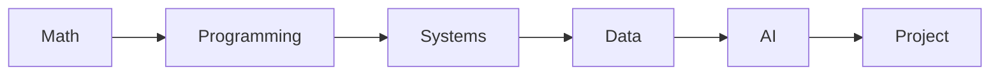

# What Computer Science Majors Learn

> Computer Science Major 101 series (1/10)

<!-- a-grade-intro:begin -->

**Core question**: What will you *actually* learn across four years of a CS major?

> Five axes — *math*, *systems*, *data*, *AI*, *projects* — form the *big picture* of the major.

<!-- a-grade-intro:end -->

## What You Will Learn

- The *big picture* of the major
- Weight of *math* and *programming*
- Balance of *systems* and *theory*
- Role of *projects*
- Connection to *career*

## Why It Matters

A clear *map* keeps your *four years* from drifting.

## Concept at a Glance



## Key Terms

- **major**: your *primary* field.
- **core course**: *required* class.
- **elective**: *optional* class.
- **track**: *sub-specialty*.
- **capstone**: *graduation* project.

## Before/After

**Before**: You memorize course names.

**After**: You understand each course's *role* and *links*.

## Hands-on: Draw Your Major Map

### Step 1 — Define areas

```python
areas = ["math", "programming", "systems", "data", "ai", "project"]
```

### Step 2 — Place by year

```python
plan = {1: ["math", "programming"], 2: ["systems"], 3: ["data", "ai"], 4: ["project"]}
```

### Step 3 — Distribute credits

```python
credits = {a: 6 for a in areas}
```

### Step 4 — Check balance

```python
total = sum(credits.values())  # 36
```

### Step 5 — Find weak areas

```python
weak = [a for a, c in credits.items() if c < 6]
```

## What to Notice in This Code

- Courses cluster into *areas*.
- *Year order* matters.
- Credit *sums* reveal *balance*.

## Five Common Mistakes

1. **Pushing *required* courses to the *last semester*.**
2. **Picking *only theory or only practice*.**
3. **Underweighting *math* in early years.**
4. **Treating *projects* as just credits.**
5. **Not linking *courses* to a *career path*.**

## How This Shows Up in Production

Job listings are essentially a *combination* of *major courses*.

## How a Senior Engineer Thinks

- *Math* lasts longest.
- *Languages* change.
- *Systems* are foundation.
- *Data* is universal.
- *Projects* are evidence.

## Checklist

- [ ] List your *areas*.
- [ ] Place by *year*.
- [ ] Balance *credits*.
- [ ] Reinforce *weak* areas.

## Practice Problems

1. Define *required course* in one line.
2. Define *track* in one line.
3. State the meaning of a *capstone* in one line.

## Wrap-up and Next Steps

Next post: *Understanding First Year Subjects*.

<!-- toc:begin -->
- **What Computer Science Majors Learn (current)**
- Understanding First Year Subjects (upcoming)
- Data Structures and Algorithms (upcoming)
- Understanding Systems Subjects (upcoming)
- Database and Network (upcoming)
- AI and Data Science (upcoming)
- Project Subjects (upcoming)
- How to Study Computer Science (upcoming)
- Build Your Portfolio (upcoming)
- Skills to Have Before Graduation (upcoming)
<!-- toc:end -->

## References

- [ACM Computing Curricula 2020](https://www.acm.org/binaries/content/assets/education/curricula-recommendations/cc2020.pdf)
- [MIT EECS Undergraduate Curriculum](https://www.eecs.mit.edu/academics/undergraduate-programs/)
- [Stanford CS Major Requirements](https://cs.stanford.edu/degrees/undergrad/)
- [Open Source Society University](https://github.com/ossu/computer-science)

Tags: CS, Major, Curriculum, Career, Beginner
