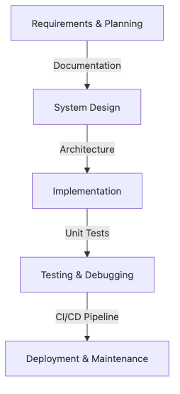

# Project Subjects

Many students reach the later years of the major and realize that knowing individual subjects is not the same thing as turning them into one working result. Project subjects are where scattered knowledge finally has to survive deadlines, teammates, testing, and a live demo.

This is post 7 in the Computer Science Major 101 series.

## Questions This Post Answers

- Why are project subjects treated as the core of the later years of the major?
- How is a team project different from an ordinary assignment?
- Why do problem definition, scope control, scheduling, and demo readiness all matter together?
- Why do project subjects often become the first serious evidence in a student's portfolio?

## What You Will Learn

- *Purpose* of projects
- *Team* setup
- *Planning* and *scope*
- Organizing *deliverables*
- Meaning of the *demo*

## Why It Matters

The *start* of your *portfolio* is often a *major project*.

## Concept at a Glance



*How a project moves from planning to demo*

> A project subject is not mainly about writing more code. It is about proving that a small team can turn a bounded problem into a demo, documentation, and a result another person can evaluate.

## Key Terms

- **scope**: project *range*.
- **MVP**: *minimum* product.
- **demo**: *live show*.
- **stakeholder**: *interested party*.
- **retrospective**: *post review*.

## Before/After

**Before**: You see it as *homework*.

**After**: You see it as a *small product*.

## Hands-on: Build a Project Brief You Can Submit

Student projects usually fail for a boring reason: the team has an idea, but not a concrete planning artifact. The example below turns a short project spec into a brief you can paste into a README, proposal, or checkpoint document.

```python
from textwrap import dedent

spec = {
    "project": "Campus Schedule Checker",
    "users": ["students", "academic advisors"],
    "pain_point": "Students discover timetable conflicts too late during course registration.",
    "mvp_features": [
        "Upload timetable CSV",
        "Detect overlapping classes",
        "Show conflict summary by day",
    ],
    "out_of_scope": [
        "Mobile app",
        "Automatic enrollment",
        "Professor recommendation engine",
    ],
    "weeks": [
        (1, "problem validation and sample data collection"),
        (2, "CSV parser and conflict rules"),
        (3, "result screen and test fixtures"),
        (4, "demo script, bug fixes, and README polish"),
    ],
    "risks": [
        ("scope creep", "Freeze feature list after the week 1 review"),
        ("messy input data", "Prepare three validated sample CSV files early"),
        ("team sync gaps", "Run a 15-minute checkpoint twice a week"),
    ],
}


def build_brief(spec):
    problem_statement = (
        f"{spec['project']} helps {', '.join(spec['users'])} "
        f"by solving this problem: {spec['pain_point']}"
    )
    feature_lines = "\n".join(f"- {feature}" for feature in spec["mvp_features"])
    scope_lines = "\n".join(f"- {item}" for item in spec["out_of_scope"])
    week_lines = "\n".join(
        f"- Week {week}: {goal}" for week, goal in spec["weeks"]
    )
    risk_lines = "\n".join(
        f"- {risk}: {mitigation}" for risk, mitigation in spec["risks"]
    )

    return dedent(
        f"""
        ## Project Brief
        Problem statement: {problem_statement}

        ### MVP features
        {feature_lines}

        ### Out of scope
        {scope_lines}

        ### Week-by-week schedule
        {week_lines}

        ### Risk register
        {risk_lines}
        """
    ).strip()


print(build_brief(spec))
```

If you run the sample input as-is, you should get output like this.

```text
## Project Brief
Problem statement: Campus Schedule Checker helps students, academic advisors by solving this problem: Students discover timetable conflicts too late during course registration.

### MVP features
- Upload timetable CSV
- Detect overlapping classes
- Show conflict summary by day

### Out of scope
- Mobile app
- Automatic enrollment
- Professor recommendation engine

### Week-by-week schedule
- Week 1: problem validation and sample data collection
- Week 2: CSV parser and conflict rules
- Week 3: result screen and test fixtures
- Week 4: demo script, bug fixes, and README polish

### Risk register
- scope creep: Freeze feature list after the week 1 review
- messy input data: Prepare three validated sample CSV files early
- team sync gaps: Run a 15-minute checkpoint twice a week
```

This is more useful than a loose idea list because it creates something the team can actually review. In particular, the **out of scope** block and **risk register** force the team to agree on what they will not build and what can realistically go wrong.

## What to Notice in This Code

- A one-sentence problem statement gives the team a stable decision rule.
- Writing MVP and out-of-scope items together is what prevents scope creep.
- Pairing the schedule with explicit mitigation steps makes the final demo more predictable.

## Five Common Mistakes

1. **Jumping to *code* without a *spec*.**
2. **Vague *team roles*.**
3. **No *weekly meeting*.**
4. **No agreed *Git convention*.**
5. **Ending with the *demo*, no *retro*.**

## How This Shows Up in Production

A startup *MVP* looks *almost the same* as a major project.

## How a Senior Engineer Thinks

- Start *small*.
- *Show* often.
- Collect *feedback*.
- Leave *docs*.
- Write a *retro*.

## Checklist

- [ ] *Problem* in one line.
- [ ] *Feature* list and *out-of-scope* list.
- [ ] *Schedule* with weekly deliverables.
- [ ] *Risk* table with mitigation.

## Practice Problems

1. Define *MVP* in one line.
2. Define *demo* in one line.
3. State the meaning of *retrospective* in one line.

## Wrap-up and Next Steps

Next post: *How to Study Computer Science*.

<!-- toc:begin -->
- [What Computer Science Majors Learn](./01-what-cs-majors-learn.md)
- [Understanding First Year Subjects](./02-first-year-subjects.md)
- [Data Structures and Algorithms](./03-data-structures-and-algorithms.md)
- [Understanding Systems Subjects](./04-systems-subjects.md)
- [Database and Network](./05-database-and-network.md)
- [AI and Data Science](./06-ai-and-data-science.md)
- **Project Subjects (current)**
- How to Study Computer Science (upcoming)
- Build Your Portfolio (upcoming)
- Skills to Have Before Graduation (upcoming)
<!-- toc:end -->

## References

- [ACM/IEEE-CS/AAAI Computer Science Curricula 2023](https://csed.acm.org/cs2023/)
- [ABET Criteria for Accrediting Computing Programs](https://www.abet.org/accreditation/accreditation-criteria/criteria-for-accrediting-computing-programs-2025-2026/)
- [SWEBOK Guide](https://www.computer.org/education/bodies-of-knowledge/software-engineering)
- [GitHub Docs - About Projects](https://docs.github.com/en/issues/planning-and-tracking-with-projects/learning-about-projects/about-projects)

Tags: CS, Project, Capstone, Teamwork, Beginner
