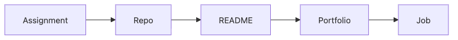

# Build Your Portfolio

Assignments and projects disappear faster than most students expect if they are left inside local folders with no explanation. A year later, even the person who built them may struggle to remember what they did and why it mattered.

This is post 9 in the Computer Science Major 101 series.

## Questions This Post Answers

- How can assignments and major projects become portfolio pieces?
- Why do a GitHub repository, README, run instructions, and demo link all matter?
- What is the difference between dumping code online and publishing a result that another person can actually read?
- Why does a portfolio often become the thing that starts the conversation during applications?

## What You Will Learn

- What a portfolio really is
- How to use GitHub well
- How to write a README
- Useful documentation patterns
- Why publishing your work matters

## Why It Matters

Applications need visible evidence to start a real conversation. A repository, README, and demo link say far more than a single line on a resume because they reveal not only what you built, but how you explain and present your work.

## Concept at a Glance



*How coursework becomes a portfolio through repositories and documentation*

> An assignment ends at submission, but a portfolio starts only when the work is organized into a repository and explained through documentation.

An assignment does not automatically become a portfolio piece. You need to organize it into a repository, add context through a README, and attach a demo when possible. That is when the work becomes readable to someone other than you.

## Key Terms

- **repository**: a place that holds code and supporting documents together.
- **README**: the first document most people read when they open a repository.
- **license**: a document that defines usage rights.
- **commit**: the basic unit of change history.
- **release**: a packaged version you can point to and share.

## Before/After

**Before**: Your assignment folders live only on your local machine.

**After**: You leave behind a public repository, README, and demo that other people can verify.

## Hands-on: Mini Portfolio Setup

### Step 1 — Repo name

```python
name = "schedule-checker"
```

Names shape searchability and first impression. A short name that clearly reveals the function is much easier for other people to remember.

### Step 2 — README sections

```python
sections = ["overview", "demo", "stack", "run", "license"]
```

These five sections already make a repository much easier to read. In many student projects, overview, demo, stack, run instructions, and license are enough to establish trust.

### Step 3 — One-line overview

```python
overview = "Conflict checker for course schedules"
```

This line compresses the problem definition into a single sentence. A short, sharp description usually works better than a long abstract introduction.

### Step 4 — Run commands

```python
run = ["pip install -r requirements.txt", "python app.py"]
```

If there are no run instructions, other people cannot verify the project. This is where README quality often separates one repository from another.

### Step 5 — Demo link

```python
demo = "https://example.com/demo"
```

A demo is one of the strongest forms of proof. A live deployment or even a short video often persuades faster than paragraphs of explanation.

## What to Notice in This Code

- The repository name affects searchability and memory.
- README sections help the reader set expectations quickly.
- A demo is stronger evidence than explanation alone.

## Five Common Mistakes

1. **Leaving the README empty.**
2. **Using vague commit messages such as `update` everywhere.**
3. **Forgetting to add a license.**
4. **Leaving only explanation with no screenshots or demo.**
5. **Writing run instructions so vaguely that the project is hard to reproduce.**

## How This Shows Up in Production

Interviewers and reviewers often read the README before they open the code. How you introduce the project, explain run steps, and care for documentation tells them a great deal about your collaboration habits.

## README Draft Example

Many students try to write an overly long README and end up burying the essentials. In the beginning, it is often better to fill in the four lines below and then add only what the project truly needs.

```markdown
# Schedule Checker

A web tool that finds conflicts in a student's class schedule.

## Demo
- https://example.com/demo

## Run
- pip install -r requirements.txt
- python app.py
```

Even this small draft already answers three questions for the reader: what the project is, where they can see it, and how they can run it locally. The first gate of a portfolio is not flashiness. It is reproducibility.

## How a Senior Engineer Thinks

- Publishing your work is part of learning.
- Documentation matters as much as code.
- Small improvement records can still be strong evidence.
- A license is a basic expectation.
- A demo link is one of the strongest persuasive signals.

## Checklist

- [ ] I added the five core README sections.
- [ ] I included a license.
- [ ] I prepared a screenshot or demo.
- [ ] I wrote run commands where they are easy to find.

## Practice Problems

1. Define a README in one line.
2. State the meaning of a license in one line.
3. Explain why a demo is strong evidence in one line.

## Wrap-up and Next Steps

A portfolio is not a decorative extra for exceptional students. It is the work of turning assignments and projects you already built into a form that another person can read. Once repository name, README, run steps, demo, and documentation are in place, even a small class project can become credible evidence. In the next post, we will close the series by looking at the skills worth checking before graduation.

<!-- toc:begin -->
- [What Computer Science Majors Learn](./01-what-cs-majors-learn.md)
- [Understanding First Year Subjects](./02-first-year-subjects.md)
- [Data Structures and Algorithms](./03-data-structures-and-algorithms.md)
- [Understanding Systems Subjects](./04-systems-subjects.md)
- [Database and Network](./05-database-and-network.md)
- [AI and Data Science](./06-ai-and-data-science.md)
- [Project Subjects](./07-project-subjects.md)
- [How to Study Computer Science](./08-how-to-study-cs.md)
- **Build Your Portfolio (current)**
- Skills to Have Before Graduation (upcoming)
<!-- toc:end -->

## References

- [Make a README](https://www.makeareadme.com/)
- [Choose a License](https://choosealicense.com/)
- [GitHub Profile README Guide](https://docs.github.com/en/account-and-profile/setting-up-and-managing-your-github-profile/customizing-your-profile/managing-your-profile-readme)
- [Awesome README](https://github.com/matiassingers/awesome-readme)

Tags: CS, Portfolio, GitHub, Career, Beginner
