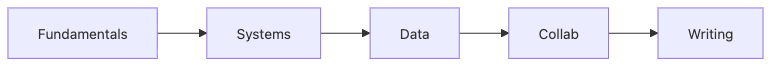

# Skills to Have Before Graduation

As graduation gets closer, many students feel the same anxiety. They have almost finished the coursework, but they are still not sure whether they are actually ready for work.

This is the final post in the Computer Science Major 101 series.

## Questions This Post Answers

- Which abilities matter beyond the diploma itself?
- Why should you evaluate fundamentals, systems, data, collaboration, and writing together?
- Why are GPA and certificates alone not enough to explain readiness?
- What standard can you use to check yourself right before graduation?

## What You Will Learn

- Fundamental skills
- Systems sense
- Data sense
- Collaboration tools
- Writing ability

## Why It Matters

The first few months of your first job matter more than many students expect. That period often sets the baseline for how the rest of your early career unfolds, so a graduation self-check is less about self-esteem and more about strengthening your starting point.

## Concept at a Glance



*How fundamentals, systems, data, collaboration, and writing form graduation readiness*

> A graduation self-check is not about counting completed courses. It is about making sure the five practical axes you will use at work are not empty.

These five axes do not stand alone. Fundamentals support systems thinking, systems and data support service building, and collaboration plus writing are what let your results scale inside a real team.

## Key Terms

- **fundamentals**: the base strength you keep using for years.
- **systems sense**: the ability to reason about runtime behavior.
- **data sense**: the ability to store, query, and interpret data.
- **collaboration**: how you work effectively with other people.
- **writing**: the ability to leave behind decisions and reasoning in documents.

## Before/After

**Before**: You treat GPA as the same thing as skill.

**After**: You judge yourself by evidence rather than by scores alone.

## Hands-on: Graduation Self Check

### Step 1 — Data structures

```python
fund = ["array", "list", "tree", "graph", "hash"]
```

Fundamentals can often be checked through a list of explainable concepts. The point is not whether you have seen the term before, but whether you can explain the trade-offs in your own words.

### Step 2 — Systems

```python
sys_topics = ["process", "memory", "io", "network"]
```

Systems sense connects directly to debugging ability. It is the axis that helps you explain where code spends time and resources.

### Step 3 — Data

```python
data_topics = ["sql", "stats", "ml_basic"]
```

Data storage and interpretation keep resurfacing across modern software teams. SQL and statistics show up far more often than many students expect.

### Step 4 — Collab

```python
collab = ["git", "review", "issues", "ci"]
```

Experience with collaboration tools strongly affects how fast you adapt after joining a team. Code written alone and code handled by a team live under different constraints.

### Step 5 — Docs

```python
docs = ["readme", "design_doc", "post_mortem"]
```

This document list is really an evidence list. Code alone cannot explain every decision, so writing is not a decorative skill. It is part of the core skill set.

## What to Notice in This Code

- This list is a self-check sheet.
- Three to five items per area is usually enough.
- Evidence should exist in both code and documentation.

## Five Common Mistakes

1. **Listing certificates only.**
2. **Overemphasizing GPA only.**
3. **Leaving GitHub empty.**
4. **Finishing school without a single usable document.**
5. **Letting experience pass by with no retrospective or written learning.**

## How This Shows Up in Production

Hiring and onboarding both care about balance across the five axes. If one axis is nearly empty, the rest of your strengths become harder to trust. Code alone, communication alone, or project count alone rarely carries someone for long.

## Evidence Mapping Example

The most important graduation question is not "Can I say I know this?" but "What can I show for it?" When you map each axis to concrete evidence, your preparation level becomes much easier to judge.

| Axis | Minimum evidence example | Self-check question |
| --- | --- | --- |
| Fundamentals | algorithm notes, data structure practice repository | Can I explain time complexity and trade-offs in my own words? |
| Systems | debugging notes, OS or networking measurement exercise | Can I explain why a slow program is slow one layer below the code? |
| Data | SQL coursework, a small analysis report | Can I explain storage shape and query cost together? |
| Collaboration | GitHub PRs, issues, review history | Can I explain how I changed code through team process rather than alone? |
| Writing | README, design note, retrospective | Can I leave behind reasoning and lessons in a way others can read? |

The point of this table is not size. It is linkage. You do not need a huge project, but you do need at least one result per axis that you can actually show.

## How a Senior Engineer Thinks

- Fundamentals last the longest.
- Systems sense becomes debugging skill.
- Data is the common language of many teams.
- Collaboration records show attitude as much as output.
- Documents become assets over time.

## Checklist

- [ ] I checked myself across all five axes.
- [ ] I mapped evidence to each axis.
- [ ] I marked the weakest area.
- [ ] I wrote at least a one-line next study plan.

## Practice Problems

1. Define fundamentals in one line.
2. State the meaning of systems sense in one line.
3. Explain why writing ability matters in one line.

## Wrap-up and Next Steps

Before graduation, it is more useful to check which abilities you can actually demonstrate than to count how many courses you completed. If you revisit yourself through the five axes of fundamentals, systems, data, collaboration, and writing, the empty spots become much easier to see. This series ends here, but the next stage of study usually starts with the weakest axis you still need to strengthen.

<!-- toc:begin -->
- [What Computer Science Majors Learn](./01-what-cs-majors-learn.md)
- [Understanding First Year Subjects](./02-first-year-subjects.md)
- [Data Structures and Algorithms](./03-data-structures-and-algorithms.md)
- [Understanding Systems Subjects](./04-systems-subjects.md)
- [Database and Network](./05-database-and-network.md)
- [AI and Data Science](./06-ai-and-data-science.md)
- [Project Subjects](./07-project-subjects.md)
- [How to Study Computer Science](./08-how-to-study-cs.md)
- [Build Your Portfolio](./09-build-your-portfolio.md)
- **Skills to Have Before Graduation (current)**
<!-- toc:end -->

## References

- [Teach Yourself Computer Science](https://teachyourselfcs.com/)
- [Google Engineering Practices](https://google.github.io/eng-practices/)
- [The Missing Semester of Your CS Education](https://missing.csail.mit.edu/)
- [Patterns of Software - Richard Gabriel](https://www.dreamsongs.com/Files/PatternsOfSoftware.pdf)

Tags: CS, Graduation, Skills, Career, Capstone
