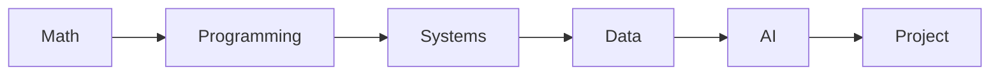

# 컴퓨터학과에서는 무엇을 배우는가

처음 전공 과목표를 펼치면 이름부터 서로 너무 다르게 보입니다. 수학, 프로그래밍, 시스템, 데이터, AI, 프로젝트가 한 학과 안에 왜 함께 들어 있는지 감이 잘 오지 않습니다.

이 글은 Computer Science Major 101 시리즈의 첫 번째 글입니다.

## 이 글에서 다룰 문제

- 컴퓨터학과 4년 과정은 어떤 큰 축으로 이해하면 좋을까요?
- 수학, 프로그래밍, 시스템, 데이터, AI, 프로젝트는 왜 따로 떨어진 과목이 아니라 이어진 흐름일까요?
- 과목 이름만 외우는 것과 전공 지도를 이해하는 것은 무엇이 다를까요?
- 지금 듣는 과목이 나중에 어떤 진로와 연결되는지 어떻게 판단할 수 있을까요?

## 이 글에서 배울 것

- 전공의 큰 그림
- 수학과 프로그래밍의 무게
- 시스템과 이론의 균형
- 프로젝트의 역할
- 진로와의 연결

## 왜 중요한가

전공의 큰 그림이 없으면 4년이 생각보다 쉽게 흩어집니다. 반대로 지도가 있으면 지금 듣는 과목이 왜 필요한지, 다음 과목과 어떻게 이어지는지, 어디를 더 보강해야 하는지가 분명해집니다.

## 한눈에 보는 개념



> 전공은 과목 이름의 모음이 아니라, 기초에서 응용과 프로젝트로 이동하는 학습 지도입니다.

전공은 과목 목록이 아니라 흐름입니다. 수학과 프로그래밍이 출발점이 되고, 그 위에 시스템 이해가 올라가고, 데이터와 AI가 응용 축을 만들며, 마지막에는 프로젝트가 앞선 지식을 실제 결과물로 묶습니다.

## 핵심 용어

- **전공(major)**: 대학에서 가장 깊게 배우는 주된 분야입니다.
- **전공 필수 과목(core course)**: 반드시 이수해야 하는 핵심 과목입니다.
- **전공 선택 과목(elective)**: 관심에 따라 고를 수 있는 과목입니다.
- **트랙(track)**: 전공 안의 세부 전문화 방향입니다.
- **캡스톤(capstone)**: 졸업 전후에 수행하는 종합 프로젝트입니다.

## Before/After

**Before**: 과목 이름만 외우고 있습니다.

**After**: 각 과목이 어떤 역할을 맡고 무엇과 연결되는지 설명할 수 있습니다.

## 실습: 나만의 전공 지도 그리기

### 1단계 — 영역 정의

```python
areas = ["math", "programming", "systems", "data", "ai", "project"]
```

먼저 과목을 세부 이름보다 큰 영역으로 나눕니다. 처음부터 모든 과목을 외우기보다 어떤 축이 있는지부터 잡는 편이 훨씬 실용적입니다.

### 2단계 — 학년별 배치

```python
plan = {1: ["math", "programming"], 2: ["systems"], 3: ["data", "ai"], 4: ["project"]}
```

학교마다 세부 순서는 다르지만, 대체로 1학년은 기초, 2학년은 시스템과 핵심 전공, 3학년은 데이터와 응용, 4학년은 프로젝트와 심화로 무게가 이동합니다.

### 3단계 — 학점 배분

```python
credits = {a: 6 for a in areas}
```

이 코드는 실제 학점표가 아니라 균형 감각을 보기 위한 장난감 모델입니다. 특정 축이 지나치게 비어 있지는 않은지 확인하는 데 도움이 됩니다.

### 4단계 — 균형 점검

```python
total = sum(credits.values())  # 36
```

합계를 보면 내가 전공을 한 방향으로만 보고 있지 않은지 확인할 수 있습니다. 실전에서는 특정 분야를 좋아하더라도 바탕이 되는 축을 비워 두면 후반부에 반드시 비용을 치르게 됩니다.

### 5단계 — 약한 영역 찾기

```python
weak = [a for a, c in credits.items() if c < 6]
```

약한 영역을 눈에 보이게 만들어 두면 보강 계획을 세우기 쉽습니다. 예를 들어 프로그래밍은 좋아하지만 수학을 계속 미루면 알고리즘이나 AI에서 갑자기 벽을 만나기 쉽습니다.

## 이 코드에서 먼저 볼 점

- 과목은 개별 이름보다 영역으로 묶을 때 구조가 보입니다.
- 학년 순서가 있다는 점이 중요합니다.
- 총합을 계산해 보면 전공의 균형이 드러납니다.

## 자주 하는 실수 5가지

1. **전공 필수 과목을 마지막 학기까지 미루는 일입니다.**
2. **이론만 보거나 실습만 보는 식으로 한쪽만 고르는 일입니다.**
3. **초반 수학의 중요성을 과소평가하는 일입니다.**
4. **프로젝트를 단순한 학점 채우기로 보는 일입니다.**
5. **과목과 진로를 따로 생각해서 연결하지 않는 일입니다.**

## 실무에서는 이렇게 드러납니다

채용 공고를 차분히 읽어 보면 전공 과목의 조합과 크게 다르지 않습니다. 백엔드는 자료구조, 시스템, 데이터베이스, 네트워크를 요구하고, 데이터 직무는 수학, 통계, 프로그래밍, 모델링을 함께 봅니다. 전공의 큰 그림이 잡혀 있으면 진로 탐색도 훨씬 덜 막막해집니다.

## 선배 엔지니어는 이렇게 봅니다

- 수학은 가장 오래 남는 기초입니다.
- 언어 문법보다 문제를 코드로 바꾸는 힘이 더 중요합니다.
- 시스템 과목은 디버깅 실력을 크게 바꿉니다.
- 데이터 감각은 거의 모든 현대 소프트웨어 직무에 연결됩니다.
- 프로젝트는 내가 무엇을 했는지 보여 주는 증거입니다.

## 체크리스트

- [ ] 전공을 큰 영역으로 나눠 보았습니다.
- [ ] 각 영역이 어느 학년에 많이 나오는지 적어 보았습니다.
- [ ] 강한 축과 약한 축을 구분해 보았습니다.
- [ ] 약한 축을 보강할 계획을 하나 적어 보았습니다.

## 연습 문제

1. 전공 필수 과목을 한 줄로 설명해 보세요.
2. 트랙이 무엇인지 한 줄로 설명해 보세요.
3. 캡스톤 프로젝트의 의미를 한 줄로 적어 보세요.

## 정리

컴퓨터학과는 과목 이름이 많은 학과가 아니라, 수학과 프로그래밍에서 출발해 시스템, 데이터, AI, 프로젝트로 이어지는 구조를 가진 학과입니다. 이 지도를 먼저 잡아 두면 이후 과목이 훨씬 덜 단절되어 보입니다. 다음 글에서는 1학년 과목이 왜 그렇게 배치되는지 더 구체적으로 살펴보겠습니다.

<!-- toc:begin -->
- **컴퓨터학과에서는 무엇을 배우는가 (현재 글)**
- 1학년 과목 이해하기 (예정)
- 자료구조와 알고리즘 (예정)
- 시스템 과목 이해하기 (예정)
- 데이터베이스와 네트워크 (예정)
- AI와 데이터사이언스 (예정)
- 프로젝트 과목 (예정)
- 전공 공부 방법 (예정)
- 포트폴리오로 연결하기 (예정)
- 졸업 전 갖춰야 할 역량 (예정)
<!-- toc:end -->

## 참고 자료

- [ACM Computing Curricula 2020](https://www.acm.org/binaries/content/assets/education/curricula-recommendations/cc2020.pdf)
- [MIT EECS Undergraduate Curriculum](https://www.eecs.mit.edu/academics/undergraduate-programs/)
- [Stanford CS Major Requirements](https://cs.stanford.edu/degrees/undergrad/)
- [Open Source Society University](https://github.com/ossu/computer-science)

Tags: CS, Major, Curriculum, Career, Beginner
