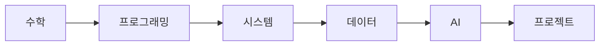

# 컴퓨터학과에서는 무엇을 배우는가

> 컴퓨터학과 전공 학습 가이드 101 시리즈 (1/10)

## 이 글에서 다룰 문제

- 컴퓨터학과 4년 과정은 어떤 큰 축으로 나뉠까요?
- 수학, 프로그래밍, 시스템, 데이터, AI, 프로젝트는 왜 따로 배우지 않고 서로 이어질까요?
- 과목 이름만 외우는 것과 전공 지도를 머릿속에 그리는 것은 무엇이 다를까요?
- 지금 듣는 과목이 나중에 어떤 진로와 연결되는지 어떻게 판단할 수 있을까요?

컴퓨터학과에 들어오면 가장 먼저 부딪히는 문제는 정보가 너무 많다는 점입니다. 과목표를 펼쳐 보면 미적분, 선형대수, 자료구조, 운영체제, 데이터베이스, 인공지능, 프로젝트처럼 성격이 전혀 달라 보이는 이름이 한꺼번에 나옵니다. 처음에는 무엇이 핵심인지, 무엇이 뒤로 갈수록 힘을 발휘하는지 구분하기 어렵습니다.

그래서 전공 초반에는 개별 과목 설명보다 **전체 지도를 먼저 잡는 일**이 더 중요합니다. 전공 지도만 선명하면 과목 하나를 들을 때도 위치가 보입니다. 왜 1학년 때 수학을 붙잡아야 하는지, 왜 시스템 과목이 어렵지만 건너뛰면 안 되는지, 왜 프로젝트가 마지막에 나오는지 같은 흐름이 자연스럽게 이어집니다.

이 글은 컴퓨터학과 4년 과정을 한 장의 학습 지도처럼 정리합니다. 세부 과목을 모두 소개하기보다, 어떤 축이 있고 어떤 순서로 쌓이며 결국 어떤 역량으로 이어지는지를 설명하겠습니다.

## 이 글에서 배울 것

- 컴퓨터학과를 이루는 다섯 축의 의미
- 수학과 프로그래밍이 초반에 큰 비중을 차지하는 이유
- 시스템, 데이터, AI, 프로젝트가 뒤에서 어떻게 연결되는지
- 전공 과목을 진로와 연결해서 보는 기본 관점

## 왜 중요한가

전공을 오래 버티는 학생은 대개 머리가 특별히 좋은 학생이 아니라, **지도를 잃지 않은 학생**입니다. 수강 신청 시즌마다 남들이 듣는 과목을 따라 고르기만 하면 학년이 올라갈수록 방향감이 흐려집니다. 반대로 지금 내가 어디에 서 있는지 아는 학생은 같은 과제를 해도 훨씬 덜 흔들립니다.

취업 준비에서도 마찬가지입니다. 채용 공고는 새로운 세계처럼 보이지만, 실제로는 전공 과목을 다른 이름으로 묶어 놓은 경우가 많습니다. 백엔드 직무는 자료구조, 운영체제, 데이터베이스, 네트워크를 묻고, 머신러닝 직무는 선형대수, 확률·통계, 프로그래밍, 데이터 처리를 함께 봅니다. 전공의 큰 그림을 이해하면 진로 탐색도 훨씬 현실적으로 바뀝니다.

## 한눈에 보는 전공 지도

전공을 아주 거칠게 그리면 아래 흐름으로 이해할 수 있습니다.



수학과 프로그래밍은 시작점입니다. 그 위에 시스템 이해가 쌓이고, 시스템 위에서 데이터와 네트워크를 다루는 힘이 붙습니다. 그다음 AI나 데이터사이언스처럼 응용 영역이 열리고, 마지막에는 프로젝트로 지식을 묶어 실제 결과물을 만듭니다. 학교마다 순서와 세부 과목은 조금씩 다르지만 큰 구조는 대체로 비슷합니다.

## 핵심 용어

- **전공**: 대학에서 가장 깊게 파고드는 주된 학문 분야입니다.
- **전공 필수 과목**: 졸업 전 반드시 이수해야 하는 핵심 과목입니다.
- **전공 선택 과목**: 관심 분야에 따라 고를 수 있는 과목입니다.
- **트랙**: 데이터, 시스템, AI처럼 전공 안에서 더 세분화한 방향입니다.
- **캡스톤 프로젝트**: 졸업 전후에 수행하는 종합 프로젝트입니다.

## Before/After

**Before**: 과목 이름만 외우고, 왜 배우는지는 흐릿합니다.

**After**: 각 과목이 어느 축에 놓이고, 무엇과 연결되는지 보입니다.

## 다섯 축으로 나눠 보면 이해가 쉬워집니다

첫 번째 축은 **수학**입니다. 많은 신입생이 코딩을 배우러 왔는데 왜 수학을 이렇게 많이 하느냐고 묻습니다. 하지만 수학은 계산 연습이 아니라 사고 훈련에 가깝습니다. 미적분은 변화량을 다루는 감각을 주고, 선형대수는 벡터와 행렬을 이해하게 하며, 이산수학은 논리와 집합, 그래프처럼 컴퓨터과학의 문법을 익히게 합니다.

두 번째 축은 **프로그래밍**입니다. 처음에는 문법과 문장 구조를 배우지만, 곧 함수 분리, 상태 관리, 입력과 출력, 오류 처리처럼 프로그램을 만드는 기본기를 익히게 됩니다. 여기서 중요한 것은 특정 언어 자체보다 문제를 코드로 바꾸는 습관입니다. 언어는 바뀌어도 사고 과정은 오래 남습니다.

세 번째 축은 **시스템**입니다. 운영체제, 컴퓨터구조, 시스템 프로그래밍, 컴파일러 같은 과목이 여기에 들어갑니다. 이 과목들은 코드가 실제로 어디에서 어떻게 실행되는지를 보여 줍니다. CPU, 메모리, 프로세스, 스레드, 파일, 입출력 같은 개념을 이해해야 성능 문제나 장애를 더 깊게 읽을 수 있습니다.

네 번째 축은 **데이터와 AI**입니다. 데이터베이스와 네트워크는 거의 모든 서비스의 바닥에 깔려 있고, 확률·통계와 머신러닝은 데이터를 해석하고 예측하는 쪽으로 이어집니다. 최근에는 이 영역이 빠르게 커지고 있지만 기초 없이 들어가면 도구만 따라 하게 되기 쉽습니다.

다섯 번째 축은 **프로젝트**입니다. 프로젝트 과목은 앞선 네 축을 실제 문제에 묶는 자리입니다. 기능을 나누고, 일정과 역할을 정하고, 구현하고, 테스트하고, 시연하는 경험이 들어갑니다. 이 단계에서 비로소 전공이 지식 묶음이 아니라 결과를 만드는 체계라는 점이 분명해집니다.

## 직접 그려 보는 전공 지도

영어 원문처럼 간단한 코드로 전공 지도를 그려 보면 구조가 더 또렷해집니다.

### 1단계 — 영역 정의

```python
areas = ["math", "programming", "systems", "data", "ai", "project"]
```

전공을 큰 영역으로 먼저 나눕니다. 모든 과목을 한 번에 외우려 하지 말고 어느 영역에 속하는지부터 정리하면 기억이 쉬워집니다.

### 2단계 — 학년별 배치

```python
plan = {1: ["math", "programming"], 2: ["systems"], 3: ["data", "ai"], 4: ["project"]}
```

보통 1학년은 기초 수학과 프로그래밍, 2학년은 시스템, 3학년은 데이터와 AI 응용, 4학년은 프로젝트와 심화 과목 비중이 커집니다. 학교마다 세부 차이는 있어도 흐름은 크게 다르지 않습니다.

### 3단계 — 학점 배분

```python
credits = {a: 6 for a in areas}
```

각 영역에 어느 정도 시간을 써야 하는지 감을 잡기 위한 예시입니다. 실제 학점은 학교마다 다르지만 한 축에만 몰리지 않도록 보는 데 도움이 됩니다.

### 4단계 — 비중 점검

```python
total = sum(credits.values())  # 36
```

합계를 보면 내가 특정 영역을 지나치게 비워 두고 있지는 않은지 점검할 수 있습니다. 전공 공부는 한 과목을 잘하는 문제보다 장기적으로 균형을 유지하는 문제가 더 큽니다.

### 5단계 — 부족 영역 확인

```python
weak = [a for a, c in credits.items() if c < 6]
```

약한 영역을 눈으로 보이게 만드는 단계입니다. 예를 들어 코딩은 좋아하지만 수학이 계속 비어 있다면 3학년 이후 AI나 알고리즘 과목에서 갑자기 버거워질 수 있습니다.

## 이 코드에서 주목할 점

- 과목은 개별 이름보다 **영역**으로 묶어 볼 때 구조가 보입니다.
- 학년별 **순서**가 있습니다. 기초 없이 심화가 잘 붙지 않습니다.
- 학점과 시간의 **합계**를 보면 어느 축이 비어 있는지 드러납니다.

## 자주 하는 실수 5가지

1. 필수 과목을 마지막 학기까지 미루는 일입니다.
2. 이론 아니면 실습 한쪽만 잡고 다른 한쪽을 버리는 일입니다.
3. 초반 수학의 중요성을 가볍게 보는 일입니다.
4. 프로젝트 과목을 단순한 학점 채우기로만 보는 일입니다.
5. 과목과 진로를 따로 생각해서 연결 고리를 만들지 않는 일입니다.

## 실무에서는 이렇게 쓰입니다

현업에서 요구하는 역량은 대부분 전공 과목의 조합으로 설명할 수 있습니다. 서비스 백엔드를 만든다면 자료구조, 운영체제, 데이터베이스, 네트워크가 함께 필요하고, 데이터 직무를 본다면 수학, 통계, 프로그래밍, 모델링이 엮입니다. 학교에서 배우는 내용이 곧바로 직무 설명서가 되지는 않지만 토대는 거의 그대로 이어집니다.

## 선배 엔지니어는 이렇게 봅니다

- 수학은 늦게 다시 채우기 어렵기 때문에 초반에 붙잡습니다.
- 언어 문법보다 문제를 푸는 사고방식이 더 오래 갑니다.
- 시스템 이해는 디버깅 실력을 크게 바꿉니다.
- 데이터 감각은 거의 모든 현대 소프트웨어 직무에 닿아 있습니다.
- 프로젝트는 내가 무엇을 했는지 보여 주는 가장 좋은 증거입니다.

## 체크리스트

- [ ] 전공을 큰 영역 목록으로 나눠 보았습니다.
- [ ] 각 영역이 어느 학년에 많이 나오는지 적어 보았습니다.
- [ ] 내가 강한 축과 약한 축을 구분해 보았습니다.
- [ ] 약한 축을 보완할 계획을 하나라도 세웠습니다.

## 연습 문제

1. 전공 필수 과목을 한 줄로 설명해 보세요.
2. 트랙이 무엇인지 한 줄로 정리해 보세요.
3. 캡스톤 프로젝트가 왜 중요한지 한 줄로 써 보세요.

## 정리 및 다음 단계

컴퓨터학과는 무작정 많은 과목을 듣는 과정이 아니라 수학과 프로그래밍에서 출발해 시스템과 데이터, AI, 프로젝트로 이어지는 구조를 갖고 있습니다. 이 구조를 먼저 이해하면 과목 하나하나를 더 잘 연결할 수 있습니다. 다음 글에서는 이 지도의 출발점인 1학년 과목을 조금 더 자세히 보겠습니다.

<!-- toc:begin -->
- **컴퓨터학과에서는 무엇을 배우는가 (현재 글)**
- 1학년 과목 이해하기 (예정)
- 자료구조와 알고리즘 (예정)
- 시스템 과목 이해하기 (예정)
- 데이터베이스와 네트워크 (예정)
- AI와 데이터사이언스 (예정)
- 프로젝트 과목 (예정)
- 전공 공부 방법 (예정)
- 포트폴리오로 연결하기 (예정)
- 졸업 전 갖춰야 할 역량 (예정)
<!-- toc:end -->

## 참고 자료

- [ACM Computing Curricula 2020](https://www.acm.org/binaries/content/assets/education/curricula-recommendations/cc2020.pdf)
- [MIT EECS Undergraduate Curriculum](https://www.eecs.mit.edu/academics/undergraduate-programs/)
- [Stanford CS Major Requirements](https://cs.stanford.edu/degrees/undergrad/)
- [Open Source Society University](https://github.com/ossu/computer-science)

Tags: CS, Major, Curriculum, Career, Beginner
