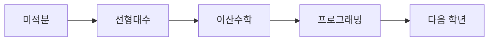

# 1학년 과목 이해하기

> 컴퓨터학과 전공 학습 가이드 101 시리즈 (2/10)

## 이 글에서 다룰 문제

- 1학년 과목은 왜 수학과 프로그래밍 비중이 유난히 클까요?
- 미적분, 선형대수, 이산수학, 프로그래밍 입문은 각각 무엇을 길러 줄까요?
- 당장 진로와 멀어 보이는 과목이 왜 2학년 이후 성과를 가를까요?
- 1학년 때 어떤 공부 습관을 만들면 이후 과목이 덜 버거워질까요?

1학년 시간표는 생각보다 단순합니다. 대부분의 학교에서 미적분, 선형대수, 이산수학, 프로그래밍 입문 같은 기초 과목이 앞줄에 놓입니다. 그런데 막상 듣는 학생 입장에서는 이 과목들이 서로 따로 노는 것처럼 보일 때가 많습니다. 수학은 수학이고 코딩은 코딩이고, 아직 전공다운 느낌은 잘 들지 않기 때문입니다.

하지만 1학년 과목은 단순한 입문이 아니라 **전공의 기초 체력을 만드는 단계**입니다. 이때 만든 기초가 약하면 자료구조, 알고리즘, 운영체제, AI 같은 상위 과목에서 계속 흔들립니다. 반대로 1학년을 제대로 통과하면 이후 과목이 갑자기 쉬워지지는 않아도 어디에서 막히는지는 분명히 보이기 시작합니다.

이 글에서는 1학년 과목이 왜 중요한지, 각 과목이 어떤 역할을 맡는지, 그리고 공부 습관을 어떻게 붙이면 좋은지 설명하겠습니다.

## 이 글에서 배울 것

- 미적분, 선형대수, 이산수학이 각각 담당하는 사고 방식
- 프로그래밍 입문 과목이 문법 수업을 넘어서는 이유
- 1학년 과목이 상위 과목과 연결되는 방식
- 학기 초반부터 붙여야 하는 기본 학습 습관

## 왜 중요한가

전공에서 뒤로 갈수록 어렵다고 느끼는 이유는 보통 새 개념이 많아서가 아니라 **초반 기초가 비어 있기 때문**입니다. 예를 들어 알고리즘에서 점화식과 증명이 버거운 학생은 이산수학의 논리 훈련이 약한 경우가 많고, 머신러닝에서 행렬 계산이 막히는 학생은 선형대수의 감각이 부족한 경우가 많습니다.

1학년 과목은 당장 취업 준비와 직접 연결되지 않아 보여도 실제로는 그 이후 모든 과목의 발판입니다. 이 시기를 대충 넘기면 상위 과목에서 계속 복습 비용을 치르게 됩니다.

## 한눈에 보는 1학년 흐름



실제로는 과목이 병렬로 진행되지만 이해의 흐름은 위 그림처럼 볼 수 있습니다. 변화량과 수식을 다루는 힘, 벡터와 행렬 감각, 논리와 집합 사고, 프로그래밍 기본기가 함께 쌓여야 2학년 이후 전공 과목을 버틸 수 있습니다.

## 핵심 용어

- **미적분**: 연속적으로 변하는 값을 다루는 수학입니다.
- **선형대수**: 벡터와 행렬을 중심으로 구조를 보는 수학입니다.
- **이산수학**: 논리, 집합, 그래프처럼 컴퓨터과학의 문법에 가까운 수학입니다.
- **프로그래밍 입문**: 언어 문법과 프로그램 구성의 기본을 배우는 과목입니다.
- **실습**: 손으로 직접 구현하며 개념을 확인하는 시간입니다.

## Before/After

**Before**: 1학년 과목이 진로와 동떨어진 교양처럼 보입니다.

**After**: 모든 상위 과목의 뿌리라는 점이 보입니다.

## 과목별 역할을 짚어 보겠습니다

미적분은 단순히 공식을 풀어내는 과목이 아닙니다. 함수가 어떻게 바뀌는지, 변화가 누적되면 어떤 값을 가지는지 이해하게 합니다. 최적화, 신호 처리, 머신러닝처럼 변화량을 다루는 분야에서 자주 다시 만납니다.

선형대수는 처음에는 계산이 기계적으로 느껴질 수 있습니다. 하지만 벡터, 행렬, 선형변환을 익히면 데이터를 구조적으로 보는 힘이 생깁니다. 컴퓨터 그래픽스, 추천 시스템, 딥러닝에서 자주 쓰이는 기본 언어도 여기에 가깝습니다.

이산수학은 컴퓨터과학과 가장 가까운 수학이라고 봐도 좋습니다. 명제, 논리, 집합, 경우의 수, 그래프, 귀납법은 알고리즘과 자료구조 과목에서 반복해서 등장합니다. 증명 문제를 어려워하는 학생은 대부분 이 과목에서 처음 훈련을 받습니다.

프로그래밍 입문은 많은 학생이 가장 재미를 느끼는 과목이지만 동시에 가장 오해하기 쉬운 과목이기도 합니다. 문법 몇 개를 외우는 것이 목적이 아닙니다. 입력을 받아 처리하고, 함수를 나누고, 오류를 고치고, 작은 프로그램을 완성하는 습관을 만드는 것이 핵심입니다.

## 1학년 과목 매트릭스

### 1단계 — 과목 목록

```python
courses = ["calculus", "linalg", "discrete", "intro_prog"]
```

먼저 핵심 과목을 나열합니다. 학교에 따라 과목명이 조금 달라도 큰 축은 거의 같습니다.

### 2단계 — 상위 과목 매핑

```python
maps = {"calculus": "ml", "linalg": "ml", "discrete": "algorithms", "intro_prog": "all"}
```

각 과목이 어디로 이어지는지 적어 보면 목적이 분명해집니다. 예를 들어 프로그래밍 입문은 사실상 모든 후속 과목의 공통 기반입니다.

### 3단계 — 주당 학습 시간

```python
hours = {c: 6 for c in courses}
```

1학년은 감으로 공부하면 시간 관리가 가장 쉽게 무너집니다. 주당 시간을 미리 잡아 두면 과목별 체감 난이도에 끌려다니지 않게 됩니다.

### 4단계 — 실습 비중

```python
labs = {"intro_prog": 4, "discrete": 1}
```

수학 과목도 복습이 필요하지만 프로그래밍은 실제 손을 움직이는 시간이 따로 있어야 합니다. 실습 시간은 시험 직전 암기로 대신할 수 없습니다.

### 5단계 — 약점 표시

```python
weak = [c for c, h in hours.items() if h < 5]
```

약한 과목을 빨리 찾는 것이 중요합니다. 초반 약점은 시간이 지날수록 눈덩이처럼 커지기 쉽습니다.

## 이 코드에서 주목할 점

- 모든 과목은 상위 과목과 연결됩니다.
- 학습 시간은 곧 기초 체력입니다.
- 실습 시간은 강의 시간과 별도로 확보해야 합니다.

## 자주 하는 실수 5가지

1. 출석만 하고 복습을 미루는 일입니다.
2. 수학 과목을 이해보다 암기로 버티려는 일입니다.
3. 언어를 계속 바꾸면서 프로그래밍 기초를 미루는 일입니다.
4. 실습 과제를 늘 마감 직전에 시작하는 일입니다.
5. 막힌 부분을 질문하지 않고 혼자 끌고 가는 일입니다.

## 실무에서는 이렇게 쓰입니다

실무에서 바로 미적분 문제를 풀 일은 많지 않아도 논리와 구조가 흔들리면 코드 품질도 흔들립니다. 코드 리뷰에서 조건 분기가 약하고, 데이터 구조를 설명하지 못하고, 문제를 단계로 나누지 못하는 경우는 대개 기초 훈련이 부족한 신호입니다.

## 선배 엔지니어는 이렇게 봅니다

- 기초는 빨리 쌓을수록 이자가 붙습니다.
- 수학은 짧게 외우기보다 천천히 이해하는 편이 오래 갑니다.
- 코드는 매일 조금씩 보는 습관이 중요합니다.
- 틀린 문제는 실패가 아니라 학습 기록입니다.
- 질문하는 습관은 초반에 만들수록 좋습니다.

## 체크리스트

- [ ] 각 과목이 어떤 상위 과목으로 이어지는지 적어 보았습니다.
- [ ] 과목별 주당 학습 시간을 확보했습니다.
- [ ] 프로그래밍 실습 시간을 따로 잡았습니다.
- [ ] 가장 약한 과목 한 개를 골라 보강 계획을 세웠습니다.

## 연습 문제

1. 선형대수가 무엇인지 한 줄로 설명해 보세요.
2. 이산수학이 왜 중요한지 한 줄로 적어 보세요.
3. 프로그래밍 입문 과목의 핵심 목표를 한 줄로 써 보세요.

## 정리 및 다음 단계

1학년 과목은 전공의 속도를 늦추는 장애물이 아니라 앞으로 더 어려운 내용을 버티게 만드는 기반입니다. 미적분, 선형대수, 이산수학, 프로그래밍 입문을 각각 따로 보지 말고 하나의 준비 운동으로 보면 학습 방향이 훨씬 분명해집니다. 다음 글에서는 많은 학생이 전공의 중심 과목으로 느끼는 자료구조와 알고리즘을 보겠습니다.

<!-- toc:begin -->
- [컴퓨터학과에서는 무엇을 배우는가](./01-what-cs-majors-learn.md)
- **1학년 과목 이해하기 (현재 글)**
- 자료구조와 알고리즘 (예정)
- 시스템 과목 이해하기 (예정)
- 데이터베이스와 네트워크 (예정)
- AI와 데이터사이언스 (예정)
- 프로젝트 과목 (예정)
- 전공 공부 방법 (예정)
- 포트폴리오로 연결하기 (예정)
- 졸업 전 갖춰야 할 역량 (예정)
<!-- toc:end -->

## 참고 자료

- [MIT 6.0001 Introduction to Computer Science](https://ocw.mit.edu/courses/6-0001-introduction-to-computer-science-and-programming-in-python-fall-2016/)
- [3Blue1Brown - Essence of Linear Algebra](https://www.3blue1brown.com/topics/linear-algebra)
- [Discrete Math - Trevor Cohn](https://www.cs.cmu.edu/~rwh/discrete-math/)
- [Khan Academy Calculus](https://www.khanacademy.org/math/calculus-1)

Tags: CS, Freshman, Math, Programming, Beginner
