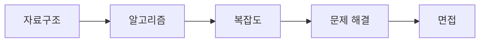

# 자료구조와 알고리즘

> 컴퓨터학과 전공 학습 가이드 101 시리즈 (3/10)

## 이 글에서 다룰 문제

- 왜 많은 학교가 자료구조와 알고리즘을 전공 핵심 과목으로 둘까요?
- 자료구조를 배우는 일과 알고리즘을 배우는 일은 어떻게 다르고, 왜 함께 가야 할까요?
- 시간 복잡도와 공간 복잡도는 실제 코드를 볼 때 무엇을 판단하게 해 줄까요?
- 코딩 테스트나 기술 면접과 이 과목이 연결되는 이유는 무엇일까요?

자료구조와 알고리즘은 컴퓨터학과 학생이 한 번쯤 전공다운 과목이 시작됐다고 느끼는 지점입니다. 이전까지는 수학과 프로그래밍 기초를 다졌다면 여기서는 이제 **문제를 더 좋은 방식으로 푸는 법**을 본격적으로 배웁니다. 같은 기능을 구현해도 왜 어떤 코드는 빠르고 어떤 코드는 입력이 커질수록 급격히 느려지는지 이해하기 시작합니다.

이 과목이 중요한 이유는 단순히 시험에 자주 나오기 때문이 아닙니다. 자료구조와 알고리즘은 문제 해결의 공통 언어입니다. 백엔드를 하든, 게임을 만들든, AI 시스템을 구현하든 결국 데이터가 어떤 모양인지 파악하고 거기에 맞는 처리 방법을 선택해야 합니다.

이 글에서는 자료구조와 알고리즘이 무엇을 가르치는지, 복잡도 사고가 왜 중요한지, 그리고 작은 코드 조각으로 무엇을 읽어야 하는지 설명하겠습니다.

## 이 글에서 배울 것

- 자료구조와 알고리즘의 역할 차이
- 시간 복잡도와 공간 복잡도를 보는 기본 관점
- 배열, 스택, 그래프 탐색 같은 대표 예시의 의미
- 이 과목이 실무와 면접에서 자주 다시 나오는 이유

## 왜 중요한가

전공 공부를 하다 보면 코드는 돌아가는데도 어딘가 불안한 순간이 많습니다. 입력이 10개일 때는 괜찮았는데 10만 개가 되면 갑자기 느려지고, 기능은 맞는데 메모리를 지나치게 많이 쓰기도 합니다. 이때 감에 의존하지 않고 설명할 수 있게 해 주는 기준이 바로 **복잡도 사고**입니다.

자료구조와 알고리즘을 이해하면 왜 느린가를 코드 수준에서 말할 수 있습니다. 반복문이 몇 번 도는지, 어떤 자료구조를 선택했는지, 정렬이 필요한지, 탐색 범위를 줄일 수 있는지 같은 질문이 자연스럽게 따라옵니다.

## 한눈에 보는 흐름



자료구조는 데이터를 담는 방식이고 알고리즘은 그 데이터를 처리하는 방법입니다. 이 둘이 만나야 복잡도를 따질 수 있고, 복잡도를 따질 수 있어야 문제 해결의 질이 올라갑니다. 그래서 면접에서도 이 과목이 자주 등장합니다.

## 핵심 용어

- **배열**: 연속된 메모리 공간에 값을 저장하는 구조입니다.
- **리스트**: 연결 구조를 통해 값을 이어 두는 자료구조입니다.
- **트리**: 계층 구조를 표현하기 좋은 자료구조입니다.
- **그래프**: 관계를 표현하는 데 쓰는 구조입니다.
- **복잡도**: 입력 크기가 커질 때 비용이 얼마나 늘어나는지 보여 주는 기준입니다.

## Before/After

**Before**: 반복문만 돌리면 된다고 생각합니다.

**After**: 어떤 방식이 더 적은 비용으로 문제를 푸는지 따집니다.

## 자료구조와 알고리즘은 함께 봐야 합니다

자료구조만 외우면 소용이 없습니다. 배열, 스택, 큐, 해시, 트리, 그래프 이름을 알아도 어떤 상황에서 써야 하는지 모르면 금방 잊힙니다. 반대로 알고리즘만 외우는 것도 오래 가지 않습니다. 탐색과 정렬, 최단 경로, 완전 탐색을 배워도 데이터 모양을 이해하지 못하면 적용이 어긋납니다.

예를 들어 검색 기능을 만든다고 가정해 보겠습니다. 데이터가 정렬되어 있는지, 중복이 있는지, 삽입이 자주 일어나는지, 순서가 중요한지에 따라 선택이 달라집니다. 이 판단이 바로 자료구조와 알고리즘을 함께 배워야 하는 이유입니다.

## 미니 자료구조 키트

### 1단계 — 배열 합

```python
def total(xs):
    return sum(xs)
```

가장 단순한 순회 예시입니다. 배열 전체를 한 번 훑기 때문에 입력이 커질수록 비용도 함께 늘어납니다.

### 2단계 — 선형 탐색

```python
def find(xs, t):
    return any(x == t for x in xs)
```

원하는 값을 앞에서부터 찾는 방식입니다. 데이터가 정렬되어 있지 않다면 가장 자연스러운 방법이지만 최악의 경우 끝까지 가야 합니다.

### 3단계 — 이진 탐색

```python
def bsearch(xs, t):
    lo, hi = 0, len(xs) - 1
    while lo <= hi:
        m = (lo + hi) // 2
        if xs[m] == t:
            return m
        if xs[m] < t:
            lo = m + 1
        else:
            hi = m - 1
    return -1
```

정렬된 배열에서 범위를 절반씩 줄여 가며 찾습니다. 선형 탐색과 비교하면 왜 로그 시간이라는 표현이 나오는지 감을 잡기 좋습니다.

### 4단계 — 스택

```python
stack = []
stack.append(1)
stack.pop()
```

스택은 단순하지만 매우 자주 쓰입니다. 함수 호출, 괄호 검사, 되돌리기 같은 문제에서 기본 도구가 됩니다.

### 5단계 — 그래프 BFS

```python
from collections import deque
def bfs(g, s):
    seen, q = {s}, deque([s])
    while q:
        u = q.popleft()
        for v in g[u]:
            if v not in seen:
                seen.add(v); q.append(v)
    return seen
```

너비 우선 탐색은 그래프에서 가까운 정점부터 확장해 나가는 전형적인 방법입니다. 최단 거리 문제의 출발점으로 자주 등장합니다.

## 이 코드에서 주목할 점

- 선형 탐색과 이진 탐색은 입력이 커질수록 차이가 크게 벌어집니다.
- 스택과 큐는 단순하지만 많은 알고리즘의 기본 재료입니다.
- BFS는 그래프에서 가까운 순서로 확장한다는 점이 핵심입니다.

## 자주 하는 실수 5가지

1. 복잡도를 전혀 적어 보지 않는 일입니다.
2. 재귀 호출의 스택 비용을 잊는 일입니다.
3. 해시를 만능 해법처럼 쓰는 일입니다.
4. 그래프 표현 방식을 섞어 놓고 혼동하는 일입니다.
5. 입력 크기를 가볍게 보고 테스트를 너무 작게만 하는 일입니다.

## 실무에서는 이렇게 쓰입니다

실무에서 API가 느려지는 원인을 따라가 보면 생각보다 자주 자료구조 선택과 탐색 방식에서 출발합니다. 데이터가 커졌는데도 리스트 전체를 반복해서 훑거나, 인덱싱할 수 있는 구조를 쓰지 않거나, 중복 계산을 그대로 두는 경우가 많습니다. 결국 성능 문제의 상당수는 서버 규모보다 먼저 코드 구조에서 시작합니다.

## 선배 엔지니어는 이렇게 봅니다

- 복잡도는 암기 항목이 아니라 감각입니다.
- 데이터의 모양이 알고리즘 선택을 결정합니다.
- 최악의 경우와 평균적인 경우를 함께 봅니다.
- 불변식을 적을 수 있어야 구현이 흔들리지 않습니다.
- 테스트는 정답 여부를 보여 주는 가장 확실한 증거입니다.

## 체크리스트

- [ ] 풀이에 시간 복잡도를 적어 보았습니다.
- [ ] 입력 크기 제한을 먼저 확인했습니다.
- [ ] 코드가 유지해야 할 불변식을 한 줄로 적었습니다.
- [ ] 대표 케이스와 경계 케이스를 테스트했습니다.

## 연습 문제

1. 해시 테이블이 무엇인지 한 줄로 설명해 보세요.
2. 그래프를 한 줄로 정의해 보세요.
3. Big O가 무엇을 뜻하는지 한 줄로 적어 보세요.

## 정리 및 다음 단계

자료구조와 알고리즘은 특정 시험을 위한 과목이 아니라 문제를 더 나은 방식으로 푸는 기준을 세워 주는 과목입니다. 데이터를 어떤 모양으로 둘지, 어떤 순서로 처리할지, 비용이 얼마나 늘어날지를 설명할 수 있어야 코드 품질도 함께 올라갑니다. 다음 글에서는 코드가 실제로 실행되는 바닥을 보여 주는 시스템 과목으로 넘어가겠습니다.

<!-- toc:begin -->
- [컴퓨터학과에서는 무엇을 배우는가](./01-what-cs-majors-learn.md)
- [1학년 과목 이해하기](./02-first-year-subjects.md)
- **자료구조와 알고리즘 (현재 글)**
- 시스템 과목 이해하기 (예정)
- 데이터베이스와 네트워크 (예정)
- AI와 데이터사이언스 (예정)
- 프로젝트 과목 (예정)
- 전공 공부 방법 (예정)
- 포트폴리오로 연결하기 (예정)
- 졸업 전 갖춰야 할 역량 (예정)
<!-- toc:end -->

## 참고 자료

- [CLRS Introduction to Algorithms](https://mitpress.mit.edu/9780262046305/introduction-to-algorithms/)
- [Open Data Structures](https://opendatastructures.org/)
- [Visualgo - Algorithm Visualization](https://visualgo.net/en)
- [LeetCode Patterns](https://seanprashad.com/leetcode-patterns/)

Tags: CS, DataStructures, Algorithms, Complexity, Beginner
